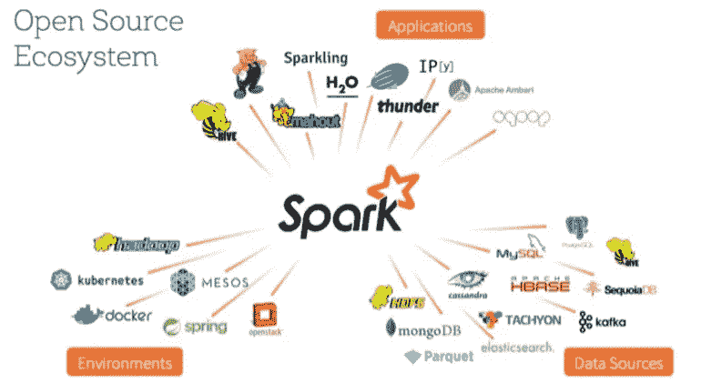
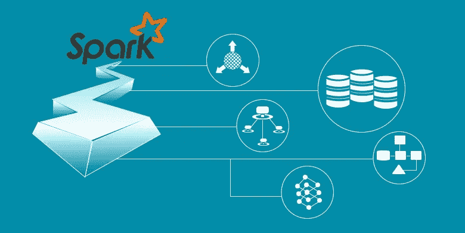
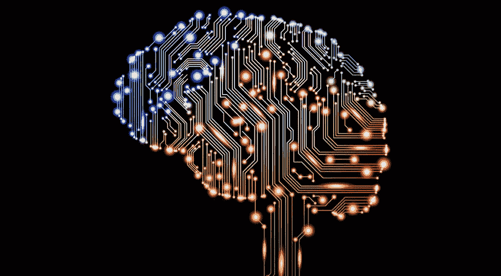
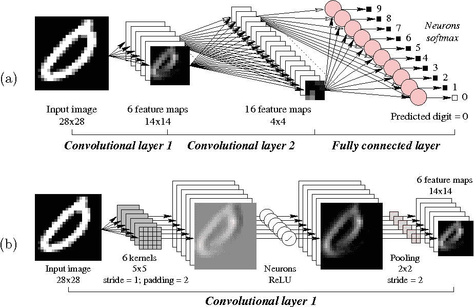
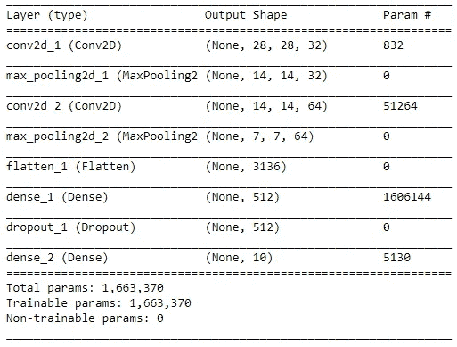
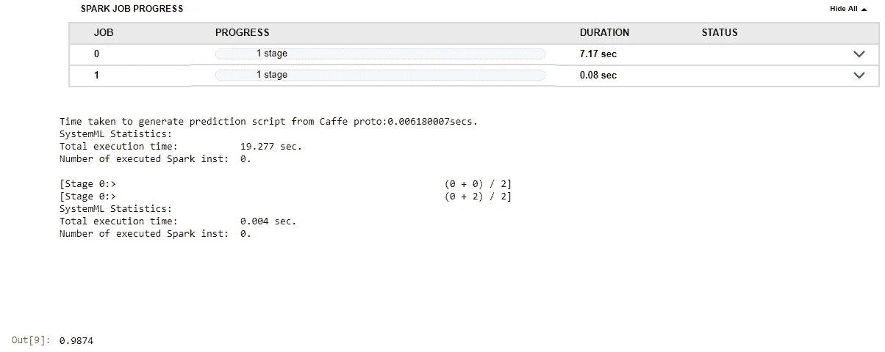

# 如何用 Keras 和 Apache Spark 并行训练你的神经网络

> 原文：<https://towardsdatascience.com/how-to-train-your-neural-networks-in-parallel-with-keras-and-apache-spark-ea8a3f48cae6?source=collection_archive---------5----------------------->

[Github 链接到项目](https://gist.github.com/NiloyPurkait/1c6c44f329f2255f5de2b0d498c3f238)


“Time-lapse photography of spark (not the kind we address) from a firecracker” Photo by [Ethan Hoover](https://unsplash.com/@ethanchoover?utm_source=medium&utm_medium=referral) on [Unsplash](https://unsplash.com?utm_source=medium&utm_medium=referral)

作为一名数据科学家，你肯定遇到过“Apache Spark”一词被抛出的冷场讨论，通常后面是“computational clusters”、“JVM”等其他词，有时还有“你有没有再次尝试重启内核？”。你知道，只是标准的行业术语。理想情况下，您可能至少知道 Spark 与扩展您的数据科学项目有关。或者，通过管理海量数据并从中产生任何可操作的见解的第一手经验，您可能特别了解 SystemML 的强大威力。所以让我们开始吧！

# **Apache Spark 上的集群计算**

在大多数真实世界的机器学习候选场景中，数据本身是从物联网传感器或多媒体平台实时生成的，并使用从 HDFS、ObjectStore、NoSQL 或 SQL 数据库等云解决方案以适当的格式存储。对于许多用例来说，在本地节点(Java 虚拟机在本地节点上运行 iPython 笔记本)提供的有限资源上运行您的分析工作流可能无法满足要求。快速、健壮和可靠的机器学习工作流可以利用大型计算集群，而无需费力地编辑代码并使其适应并行处理。你怎么问？这就是著名的 [Hadoop 分布式文件系统](https://hadoop.apache.org/docs/r1.2.1/hdfs_design.html)的秘方，它可以让你将所有磁盘的存储容量合并为一个大型虚拟文件系统。

HDFS 主要做的是将数据分成大小相等的块，并将它们分布在物理磁盘上，同时在这些块上创建一个虚拟视图，以便它可以被视为跨整个集群的单个大文件。该技术的一个主要优势来自于[数据局部性](https://www.quora.com/What-does-the-term-data-locality-mean-in-Hadoop)的概念。由于 HDFS 跟踪文件各个块的位置，因此可以使用驻留在同一物理工作节点上的 CPU 或 GPU 并行执行计算。在这一点上，你们中的一些人可能会问，为什么要这样做？嗯，这个问题的简单答案可以通过一个小测验来证明:

**您有一个很好的计算集群，拥有 *256 个节点，每个节点 8 个 CPU*，每个 CPU 有 *16 个 CPU 内核*，每个内核有 *4 个超线程*。并发运行的并行线程的最大可能数量是多少？**


Image retrieved from : [https://systemml.apache.org/](https://systemml.apache.org/)

这个问题的答案当然是， *<在这里打鼓>* : **131 072** 同时运行**并行线程**，各自做自己的一部分工作！(= 256 个节点*每个节点 8 个 CPU *每个 CPU 16 个 CPU 核心*每个核心 4 个超线程)。因此，通过这种方式，Apache spark 提供了一个开源的分布式通用[集群计算](https://en.wikipedia.org/wiki/Cluster_computing)框架，它允许你操作数据并并行执行计算。

# 永远有弹性

ApacheSpark 中的主要数据抽象是古老的**弹性** [**分布式数据集** ( **RDD)**](https://spark.apache.org/docs/latest/rdd-programming-guide.html#overview) 。这是一个分布式不可变的集合或列表数据，可以用字符串或双精度值编写，可以使用各种数据存储解决方案伪造，从开源的 MongoDB 数据库到更具排他性的 SQL 和 NoSQL 解决方案。您甚至可以从本地文件系统创建 rdd。创建后，RDD 分布在不同工作节点的主内存中。最后，你会发现 rdd 相当懒。这意味着，只有在执行特定计算确实需要数据时，才会从底层存储系统中读取数据。默认情况下，应用于数据框的任何变换(如删除变量或归一化要素)都不会立即执行。相反，你的选择会被记住，只有当一个动作*要求*一个结果返回给驱动程序时才会被计算。事实证明，这根本不是一个坏主意，并为即将到来的真正的大规模行动节省了相当多的计算资源。

# **Apache Spark 的三个杀手级特性使其成为强大的数据科学和机器学习工具:**

# 1.结构化数据检索:Spark SQL

无数的数据科学家、分析师和普通商业智能用户依靠 interactive SQL 查询来探索数据。令人欣慰的是，Spark 很好地意识到了这一点，并附带了用于结构化数据处理的 Spark 模块，称为 Spark SQL。它提供了我们都非常珍视的编程抽象，即数据框架。Spark SQL 还可以充当分布式 SQL 查询引擎，并使未修改的 Hadoop Hive 查询在现有部署和数据上的运行速度提高 100 倍。它还提供了与 Spark 生态系统其余部分的强大集成(例如，将 SQL 查询处理与机器学习集成)。



Spark Open source ecosystem

# 2.机器学习:MLlib

机器学习已经迅速成为挖掘大数据以获得可操作见解的关键部分。建立在 Spark 之上的 [MLlib](https://spark.apache.org/mllib/) 是一个可扩展的机器学习库，它提供了高质量的算法和“闪电般”的速度，如果他们说自己做的话(比 MapReduce 快 100 倍)。该库可作为 Spark 应用程序的一部分在 Java、Scala 和 Python 中使用，因此您可以将其包含在完整的工作流中。

它的伟大之处在于，Apache SystemML 为使用大量数据的机器学习提供了一个最佳的工作场所，因为它不仅提供了使用大量定制算法的方法，还允许您使用一些伟大的预实现算法(如梯度提升树、K-最近邻，仅举几例)。更好的是，它与各种著名的深度学习框架(如 Keras 和 Caffe)相接口，我们将在后面看到。

# 3.流分析:火花流

最后，如今许多应用程序不仅需要处理和分析批量数据，还需要实时处理和分析新数据流。Spark Streaming 运行在 Spark 之上，支持跨流和历史数据的强大交互和分析应用，同时继承了 Spark 的易用性和容错特性。它很容易与各种流行的数据源集成，包括 HDFS、Flume、Kafka 和 Twitter。



有些人可能会说，在这里只命名 3 个特性并不能体现 Apache Spark 的公正。钨加速器和语法执行树等操作特性也非常出色，同样有利于当今忙碌的数据科学家。当然，我可以详细介绍 Apache Spark、Hadoop 分布式文件系统和 mllib 库。可以说是“引擎盖下”的旅行。但是也许下一篇文章。对于本文的目的，我们理解 Apache Spark 的 SystemML 可以在可嵌入、独立和集群模式下运行，支持 Scala、Python 和 Java 中的各种 API，并且是扩展深度学习模型的理想选择就足够了。你怎么问？

# 用 SystemML 扩展机器学习

进入大数据世界七大奇迹之一的 SystemML。这个灵活的机器学习系统能够自动扩展到 [Spark](https://en.wikipedia.org/wiki/Apache_Spark) 和 [Hadoop](https://en.wikipedia.org/wiki/Apache_Hadoop) 集群。事实上，根据数据大小、稀疏性、计算集群大小以及本地机器的内存配置，SystemML 将决定是编译单节点计划，还是 Hadoop 或 Spark 计划。它附带了一种类似 R 的函数式编程语言，称为声明式机器学习，可以让您实现您喜欢的机器学习算法，或者更好的是，从头设计一个自定义算法。据说 SystemML 有一个低成本的编译器，可以自动生成混合运行时执行计划，这些计划由单个节点和分布式操作组成。它可以在 Apache Spark 上运行，在 Apache Spark 上，它可以自动逐行缩放您的数据，确定您的代码应该在驱动程序上运行还是在 Apache Spark 集群上运行。

# 在 SystemML 上实现深度学习模型



在 SystemML 中实现深度学习模型有三种不同的方式:

1.  使用[DML-体神经网络库](https://github.com/apache/systemml/tree/master/scripts/nn):这个库允许用户充分利用 [DML 语言](http://apache.github.io/systemml/dml-language-reference)的灵活性来实现你的神经网络。
2.  使用实验性的 [Caffe2DML API](http://apache.github.io/systemml/beginners-guide-caffe2dml.html) :这个 API 允许用 Caffe 的 proto 格式表示的模型被导入到 SystemML 中。这个 API **不要求 Caffe 安装在你的 SystemML 上。**
3.  * *使用实验性的 [**Keras2DML API**](http://apache.github.io/systemml/beginners-guide-keras2dml.html) :这个 API 允许用 Keras 的 API 表示的模型导入到 SystemML 中。但是，这个 API 要求 Keras 安装在您的驱动程序上。**

SystemML 的开发包括额外的具有 GPU 功能的深度学习，例如导入和运行神经网络架构和用于训练的预训练模型。本文的下一部分将展示如何使用 MLContext API 序列化和训练 Keras 模型。我也鼓励你查看一些由 Apache Spark 发布的关于如何开始使用 [DML](https://github.com/apache/systemml/blob/master/samples/jupyter-notebooks/DML%20Tips%20and%20Tricks%20(aka%20Fun%20With%20DML).ipynb) 的详细[教程](http://systemml.apache.org/get-started.html#sample-notebook)，并行化诸如[自动编码器](https://github.com/apache/systemml/blob/master/samples/jupyter-notebooks/Autoencoder.ipynb)的算法，并尝试一些不错的旧[图像分类](https://github.com/apache/systemml/blob/master/samples/jupyter-notebooks/Image_Classify_Using_VGG_19.ipynb)。

# IBM Watson Studio 上的 Apache Spark

现在，我们将最终使用实验性的 Keras2DML API 来训练我们的 Keras 模型。为了能够执行以下代码，您需要在 IBM cloud 帐户上创建一个**免费** **tier** 帐户，并登录以激活 [Watson](https://dataplatform.cloud.ibm.com/registration/stepone?apps=all&context=analytics) studio。

*(IBM cloud 上的分步 Spark 设置* [*教程此处*](https://youtu.be/84xSyabZsRE) *，IBM cloud 上的* [*spark 更多信息此处*](https://www.ibm.com/cloud/spark) *)。*

一旦你有了一个激活星火计划的 Watson studio 账号，你就可以[在平台上创建一个 Jupyter 笔记本](https://dataplatform.cloud.ibm.com/docs/content/analyze-data/creating-notebooks.html)，选择一个云机配置(CPU 和 RAM 的数量)和一个星火计划，就可以开始了！

沃森工作室附带一个免费的星火计划，包括 2 个星火工作者。虽然这对于现在这样的演示目的来说已经足够了，但是对于真实世界的场景来说，强烈建议购买付费的 Spark 计划。更多的 Spark workers 基本上意味着更多的线程可以并行处理计算，因此更少像僵尸一样在屏幕前等待结果。最后，在我们开始之前，我还将注意到其他替代方案，如[深度认知](http://deepcognition.ai/register/)，具有同样有趣的功能和说明性的[媒体文章](/deep-learning-with-apache-spark-part-1-6d397c16abd)，它们是存在的，并且同样值得探索。

# SystemML 上的手写数字识别

啊，MNIST。如此标志性，它可以被认为是机器学习数据集的“hello world”。事实上，它甚至是 Keras 安装自带的[六个标准数据集](https://keras.io/datasets/)之一。请放心，无论您想到什么算法，从线性分类器到卷积神经网络，都已经在这个数据集上进行了尝试和测试，在过去 20 年的某个时间。都是为了手写数字识别的任务。一些我们人类自己毫不费力就能做到的事情(如此之多，以至于不得不把它作为一项工作来做肯定是非常令人沮丧的)。

事实上，这项任务是相当多的机器学习起源项目的理想候选，因为缺乏当时存在的全面的大型数据集……嗯，任何真正的东西。尽管现在情况已经不同了，互联网上充斥着从鳄梨价格到金星火山的数据集。今天，我们通过扩大我们的手写数字识别项目来纪念 MNIST 的传统。我们通过在计算集群上训练我们的机器学习算法来做到这一点，并有可能大大减少我们的训练时间。



Convolutional neural network on MNIST dataset

## **1。我们从导入一些库开始:**

```
import keras
from keras.models import Sequential
from keras.layers import Input, Dense, Conv2D
from keras.layers import MaxPooling2D, Dropout,Flatten
from keras import backend as K
from keras.models import Model
import numpy as np
import matplotlib.pyplot as plt
```

## 2.加载数据

我们现在可以从 Keras 加载 MNIST 数据集，使用下面的简单代码行。

```
from keras.datasets import mnist(X_train, y_train), (X_test, y_test) = mnist.load_data()# Expect to see a numpy n-dimentional array of (60000, 28, 28)type(X_train), X_train.shape, type(X_train)
```

## 3.塑造您的数据

在这里，我们做一些最适合我们的神经网络重塑。我们将每个 28×28 的图像重新排列成一个 784 像素值的向量。

```
#Flatten each of our 28 X 28 images to a vector of 1, 784X_train = X_train.reshape(-1, 784)
X_test = X_test.reshape(-1, 784)#Check shape
X_train.shape, X_test.shape
```

## 4.标准化您的数据

然后，我们使用 Scikit-Learn 的 MinMaxScaler 来归一化我们的像素数据，其范围通常为 0–255。归一化后，值的范围将从 0 到 1，这大大改善了结果。

```
from sklearn.preprocessing import MinMaxScalerdef scaleData(data):       
    scaler = MinMaxScaler(feature_range=(0, 1))
    return scaler.fit_transform(data) X_train = scaleData(X_train)
X_test = scaleData(X_test)
```

## 5.建立网络

接下来，我们用 Keras 构建我们的网络，定义一个适当的输入形状，然后堆叠一些[卷积](https://keras.io/layers/convolutional/)、[最大汇集](https://keras.io/layers/pooling/)、[密集和丢弃](https://keras.io/layers/core/)层，如下所示。(一些神经网络基础:确保你的最后一层和你的输出类有相同数量的神经元。因为我们预测的是手写数字，范围从 0 到 9，所以我们有一个由 10 个神经元组成的密集层作为最后一层。)

```
input_shape = (1,28,28) if K.image_data_format() == 'channels_first' else (28,28, 1)keras_model = Sequential()
keras_model.add(Conv2D(32, kernel_size=(5, 5), activation='relu', input_shape=input_shape, padding='same'))
keras_model.add(MaxPooling2D(pool_size=(2, 2)))
keras_model.add(Conv2D(64, (5, 5), activation='relu', padding='same'))
keras_model.add(MaxPooling2D(pool_size=(2, 2)))
keras_model.add(Flatten())
keras_model.add(Dense(512, activation='relu'))
keras_model.add(Dropout(0.5))
keras_model.add(Dense(10, activation='softmax'))
keras_model.summary()
```

如果你看到下面这个 Keras 模型的总结，那么到目前为止你都是好的。



## 5.创建一个 SystemML 模型

使用 Keras2DML 包装器，并将其输入我们新构建的 Keras 网络。这是通过调用 Keras2DML 方法并向其提供您的 spark 会话、Keras 模型、其输入形状和预定义变量来完成的。变量' *epoch* 表示您的算法在数据上迭代的次数。接下来，我们有' *batch_size* '，它表示我们的网络将在每个学习批次中看到的训练示例的数量。最后，*‘samples*’只是对我们训练集中的样本数量进行编码。我们还要求每 10 次迭代显示一次训练结果。

然后，我们在新定义的 SystemML 模型上使用**fit**参数，并向其传递训练数组和标签来启动我们的训练会话。**

```
**from systemml.mllearn import Keras2DMLepochs = 5
batch_size = 100
samples = 60000
max_iter = int(epochs*math.ceil(samples/batch_size))sysml_model = Keras2DML(spark, keras_model, input_shape=(1,28,28), weights='weights_dir', batch_size=batch_size, max_iter=max_iter, test_interval=0, display=10) sysml_model.fit(X_train, y_train)**
```

**现在，您应该会在屏幕上看到类似这样的内容:**

****

**6.得分时间到了！我们只需在我们训练好的 SystemML 模型上调用 score 参数，就可以做到这一点，就像这样:**

```
**sysml_model.score(X_test, y_test)**
```

**等待 spark 作业执行，然后，瞧！您应该看到您在测试集上的准确性出现。你可以在下面看到，我们取得了 98.76 的成绩，不算太差。**

****

**请注意，我们能够通过 SystemML 的 Keras2DML 包装器部署 Keras 模型，该包装器实际上将您的模型序列化为 Caffe 模型，然后将该模型转换为声明性的机器学习脚本。如果您选择用 Keras 来训练相同的 Keras 模型，那么该模型将会受到单个 JVM 的资源的限制，而不会为了并行处理而对代码进行重大调整。整洁，不是吗？你现在可以在本地 GPU 上训练你的神经网络，或者像我们在 Watson studio 上做的那样使用云机器。**

**虽然在处理方面配备一些本地火力总感觉不错，但没有什么能打败云。你真的可以扩大你的项目，选择合适的机器配置和 spark 计划，而成本只是硬件替代品的一小部分。这是处理不同环境和高度多样化需求的用例的理想选择，从小规模数据可视化到需要实时分析 Pb 级数据的大数据项目。也许你只是试图分析来自你的分布式仓库网络(如沃尔玛)的大量物联网数据。或者也许你到达了亚原子深度，试图确定我们宇宙的结构，就像欧洲粒子物理研究所一样。在这些大不相同的用例中，任何一个都可以从将计算迁移到云中受益，而且很可能已经这样做了。**

## **谢谢你的时间**

**我希望你觉得这篇文章内容丰富，令人愉快。我真的很喜欢研究这篇文章的内容和编写相关的代码。这里有一个到我的库的链接，里面有[的完整代码](https://gist.github.com/NiloyPurkait/1c6c44f329f2255f5de2b0d498c3f238)，以及一个不使用 SystemML 的脚本版本。如果您对所涉及的内容或所提供的源代码有任何问题或反馈，请在评论中告诉我。下次见！**

## **参考**

> ****1。星火入门:**[https://databricks.com/product/getting-started-guide-2](https://databricks.com/product/getting-started-guide-2)**
> 
> ****2。SystemML 网页:**[http://systemml.apache.org/](http://systemml.apache.org/)**
> 
> ****3。Spark ML 上下文编程指南:**[https://system ML . Apache . org/docs/0 . 15 . 0/spark-ML context-Programming-guide](https://systemml.apache.org/docs/0.15.0/spark-mlcontext-programming-guide)**
> 
> **4. **Keras2DML 指南:**[https://system ml . Apache . org/docs/1 . 0 . 0/初学者-指南-keras2dml](https://systemml.apache.org/docs/1.0.0/beginners-guide-keras2dml)**
> 
> ****5。喀拉斯**:[https://keras.io/](https://keras.io/)**

*****6。Github 资源库代码:***[*https://gist . github . com/NiloyPurkait/1c 6 c 44 f 329 f 2255 f 5 de 2 b 0d 498 C3 f 238*](https://gist.github.com/NiloyPurkait/1c6c44f329f2255f5de2b0d498c3f238)**