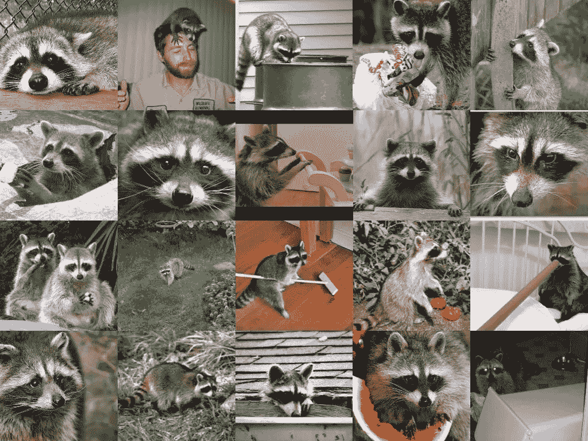
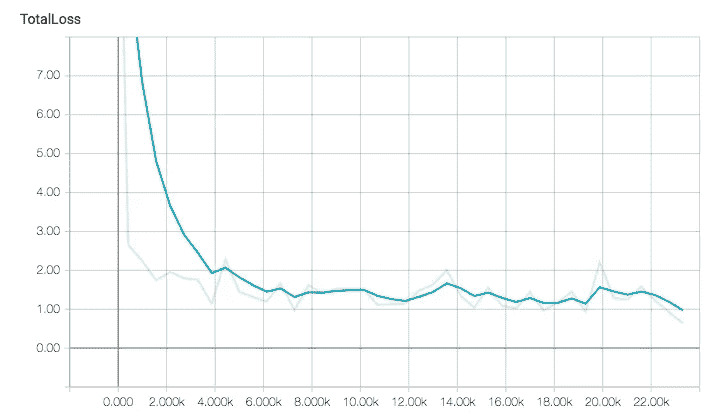
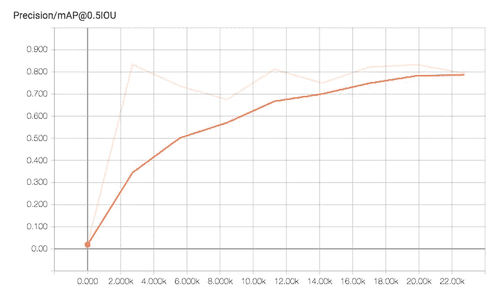
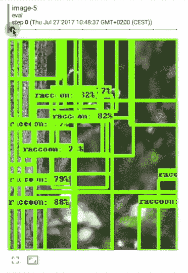

# 如何用 TensorFlow 的物体检测器 API 训练自己的物体检测器

> 原文：<https://towardsdatascience.com/how-to-train-your-own-object-detector-with-tensorflows-object-detector-api-bec72ecfe1d9?source=collection_archive---------0----------------------->

这是关于[“用 Tensorflow 和 OpenCV 构建实时物体识别应用”](https://medium.com/towards-data-science/building-a-real-time-object-recognition-app-with-tensorflow-and-opencv-b7a2b4ebdc32)的后续帖子，在这里我重点训练自己的类。具体来说，我在自己收集和标记的数据集上训练了自己的浣熊检测器。完整的数据集可在[我的 Github repo](https://github.com/datitran/raccoon-dataset) 上获得。

顺便说一下，这是浣熊探测器在工作:


**The Raccoon detector.**

想了解详情，还是继续看下去吧！

# **动机**

在我的上一篇帖子之后，许多人要求我写一份指南，介绍他们如何使用 [TensorFlow 的新对象检测器 API](https://research.googleblog.com/2017/06/supercharge-your-computer-vision-models.html) 用他们自己的数据集训练对象检测器。我找到时间做这件事。在这篇文章中，我将解释训练你自己的探测器的所有必要步骤。特别是，我创建了一个对象检测器，能够识别浣熊，结果相对较好。

> **搞什么鬼？为什么说浣熊** *🐼* **？？？？**

没有什么特别😄它们是我最喜欢的动物之一，不知何故它们也是我的邻居！我发誓，浣熊探测器有很多潜在的用途。例如，现在你可以检测到当你不在家时，是否有浣熊在敲你的门。该系统可以向您的手机发送一条推送消息，让您知道有访客。


**Full video:** [**https://youtu.be/Bl-QY84hojs**](https://youtu.be/Bl-QY84hojs)

# **创建数据集**

所以我们认真点！我需要做的第一件事是创建自己的数据集:

*   Tensorflow 对象检测 API 使用 [TFRecord 文件格式](https://www.tensorflow.org/api_guides/python/python_io#tfrecords_format_details)，所以最后我们需要将数据集转换成这种文件格式
*   有几个选项可以生成 TFRecord 文件。要么你有一个与 [PASCAL VOC 数据集](http://host.robots.ox.ac.uk/pascal/VOC/)或 [Oxford Pet 数据集](http://www.robots.ox.ac.uk/~vgg/data/pets/)结构相似的数据集，然后他们有现成的脚本用于这种情况(参见`[create_pascal_tf_record.py](https://github.com/tensorflow/models/blob/master/research/object_detection/create_pascal_tf_record.py)`和`[create_pet_tf_record.py](https://github.com/tensorflow/models/blob/master/research/object_detection/create_pet_tf_record.py)`)。如果您没有这些结构中的一个，您需要编写自己的脚本来生成 TFRecords(它们也为这个提供了[解释)。这就是我做的！](https://github.com/tensorflow/models/blob/master/research/object_detection/g3doc/using_your_own_dataset.md)
*   要为 API 准备输入文件，您需要考虑两件事。首先，您需要一个编码为 jpeg 或 png 的 RGB 图像，其次，您需要一个图像的边界框列表(`xmin, ymin, xmax, ymax`)和边界框中的对象类别。对我来说，这很简单，因为我只有一门课。
*   我从 [Google Images](https://images.google.com/) 和 [Pixabay](https://pixabay.com/) 中搜集了 200 张浣熊图片(主要是 jpegs 和一些 png ),确保这些图片在比例、姿势和光照方面有很大的变化。这是我收集的浣熊图像数据集的一个子集:



**Subset of the Raccoon image dataset.**

*   之后，我用[标签手工给它们贴上标签](https://github.com/tzutalin/labelImg)。LabelImg 是一个用 Python 编写的图形图像注释工具，使用 Qt 作为图形界面。它支持 Python 2 和 3，但我用 Python 2 和 Qt4 从源代码中构建了它，因为我用 Python 3 和 Qt5 时遇到了问题。它非常容易使用，注释以 PASCAL VOC 格式保存为 XML 文件，这意味着我也可以使用`[create_pascal_tf_record.py](https://github.com/tensorflow/models/blob/master/research/object_detection/create_pascal_tf_record.py)`脚本，但我没有这样做，因为我想创建自己的脚本。
*   不知何故，LabelImg 在 MAC OSX 上打开 JPEG 有问题，所以我不得不把它们转换成 png，然后再转换回 JPEG。实际上，我可以将它们保存在 png 中，API 也应该支持这一点。我发现的时候已经太晚了。这是我下次要做的。
*   最后，在标记图像之后，我编写了一个脚本，将 XML 文件转换为 csv 文件，然后创建 TFRecords。我用了 160 张图片进行训练(`train.records`)，40 张图片进行测试(`test.records`)。该脚本也可以在我的回购上获得[。](https://github.com/datitran/raccoon-dataset)

**备注:**

*   我发现了另一个叫做 [FIAT(快速图像数据注释工具)](https://github.com/christopher5106/FastAnnotationTool)的注释工具，看起来也不错。将来，我可能会尝试这样做。
*   对于命令行上的图像处理，如将多个图像转换成不同的文件格式， [ImageMagick](http://imagemagick.org/#) 是一个非常好的工具。万一，你没用过，值得一试。
*   通常，创建数据集是最痛苦的部分。我花了 2 个小时来整理这些图片并给它们贴上标签。这只是一堂课。
*   确保图像大小为中等(参见 Google images，了解中等是什么意思)。如果图像太大，您可能会在训练过程中遇到内存不足的错误，尤其是在您没有更改默认批处理大小设置的情况下。

# **训练模型**

在我为 API 创建了所需的输入文件之后，我现在可以训练我的模型了。

对于培训，您需要以下内容:

*   一个[物体检测训练管道](https://github.com/tensorflow/models/blob/master/research/object_detection/g3doc/configuring_jobs.md)。他们还在回购上提供了[样本配置文件](https://github.com/tensorflow/models/tree/master/research/object_detection/samples/configs)。对于我的训练，我使用`ssd_mobilenet_v1_pets.config`作为基础。我需要将`num_classes`调整为 1，并为模型检查点、训练和测试数据文件以及标签地图设置路径(`PATH_TO_BE_CONFIGURED`)。至于其他配置，比如学习率、批量大小等等，我使用了它们的默认设置。

**注意:**`data_augmentation_option`非常有趣，如果你的数据集没有太多的可变性，比如不同的比例、姿势等..完整的选项列表可以在[这里](https://github.com/tensorflow/models/blob/a4944a57ad2811e1f6a7a87589a9fc8a776e8d3c/object_detection/builders/preprocessor_builder.py)找到(见`PREPROCESSING_FUNCTION_MAP`)。

*   数据集(TFRecord 文件)及其相应的标签映射。如何创建标签地图的例子可以在[这里](https://github.com/tensorflow/models/tree/master/research/object_detection/data)找到。这也是我的标注图，非常简单，因为我只有一个类:

```
item {
  id: 1
  name: 'raccoon'
}
```

**注意:**你的标签映射应该总是从 id 1 开始，这一点很重要。索引 0 是一个占位符索引(关于这个主题的更多信息，也参见这个[讨论](https://github.com/tensorflow/models/issues/1696))。

*   ***(可选)*** 预先训练好的模型检查点。建议使用检查点，因为从预先训练的模型开始总是更好，因为从头开始训练可能需要几天才能得到好结果。他们在回购协议上提供了几个模型检查点。在我的例子中，我使用了 [ssd_mobilenet_v1_coco](http://download.tensorflow.org/models/object_detection/ssd_mobilenet_v1_coco_11_06_2017.tar.gz) 模型，因为模型速度对我来说比准确性更重要。

现在你可以开始训练了:

*   培训可以在本地[进行，也可以在](https://github.com/tensorflow/models/blob/master/research/object_detection/g3doc/running_locally.md)[云](https://github.com/tensorflow/models/blob/master/research/object_detection/g3doc/running_on_cloud.md) (AWS、谷歌云等)上进行。).如果你家里有 GPU(至少 2 GB 以上),那么你可以在本地完成，否则我会建议你使用云。就我而言，这次我使用了谷歌云，基本上遵循了他们文档中描述的所有步骤。
*   对于谷歌云，你需要定义一个 YAML 配置文件。还提供了一个[样本文件](https://github.com/tensorflow/models/blob/master/research/object_detection/samples/cloud/cloud.yml)，我基本上只是采用了默认值。
*   还建议在培训期间开始评估工作。然后，您可以通过在本地机器上运行 [Tensorboard](https://www.tensorflow.org/get_started/summaries_and_tensorboard) 来监控培训和评估工作的进程。

```
tensorboard — logdir=gs://${YOUR_CLOUD_BUCKET}
```

以下是我的培训和评估工作的结果。总的来说，我用 24 个批量运行了大约一个小时/22k 步，但是我已经在大约 40 分钟内取得了很好的结果。

总损失是这样演变的:



**Total loss decreased pretty fast due to the pre-trained model.**

因为我只有一个类，所以只看总地图(平均精度)就足够了:



**The mAP hit 0.8 at around 20k steps which is quite good.**

下面是一个在训练模型时评估一幅图像的示例:



**The detected box around the Raccoon got much better over time.**

# **输出模型**

*   完成训练后，我将训练好的模型导出到一个文件中(Tensorflow graph proto ),这样我就可以用它进行推理。
*   在我的例子中，我必须将模型检查点从 Google Cloud bucket 复制到我的本地机器上，然后使用[提供的脚本](https://github.com/tensorflow/models/blob/master/research/object_detection/g3doc/exporting_models.md)来导出模型。型号可以在我的回购上找到[，以防万一如果真的要用在生产上；)](https://github.com/datitran/raccoon-dataset/tree/master/training)

**奖金:**

**I applied the trained model on a video that I found on YouTube.**

*   如果你看过视频，你会发现并不是每只浣熊都被检测到，或者有一些错误的分类。这是合乎逻辑的，因为我们只在一个小数据集上训练模型。要创建一个更通用、更强大的浣熊检测器，例如，它还能够检测地球上最著名的浣熊，即来自银河护卫队的火箭浣熊，我们只需要更多的数据。这只是目前人工智能的局限性之一！


**Most famous raccoon on earth.**

# **结论**

我希望你喜欢这篇文章。如果你有，给我一个❤️。希望你现在可以训练你自己的物体探测器。在本文中，我只使用了一个类，因为我懒得标记更多的数据。有一些服务，如[crowd Lowe](https://www.crowdflower.com/)r、 [CrowdAI](https://crowdai.com/) 或[亚马逊的 Mechanical Turk](https://www.mturk.com/mturk/welcome) 提供数据标签服务，但这对于本文来说太多了。

我在如此短的训练时间内获得了相当不错的结果，但这是因为检测器只在一个班中训练过。对于更多的职业，总地图不会像我得到的那样好，而且肯定需要更长的训练时间才能得到好的结果。事实上，我还在 Udacity 提供的带注释的驾驶数据集(数据集 1)上训练了一个对象检测器。我花了很长时间来训练一个模型，它能够很好地识别汽车、卡车和行人。在许多其他情况下，即使我使用的模型也过于简单，无法捕捉多个类之间的所有可变性，因此必须使用更复杂的模型。还必须考虑模型速度和模型精度之间的权衡。然而，这是一个不同的故事，实际上可以是另一个独立的文章。

在 Medium [Dat Tran](https://medium.com/u/4ff6d2f67626?source=post_page-----bec72ecfe1d9--------------------------------) 或 twitter [@datitran](https://twitter.com/datitran) 上关注我，了解我的最新作品。