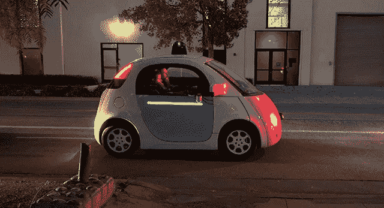
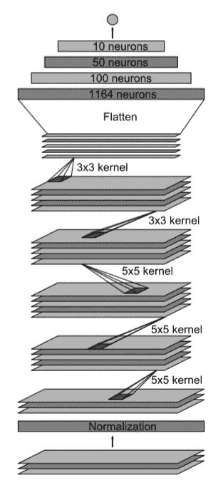
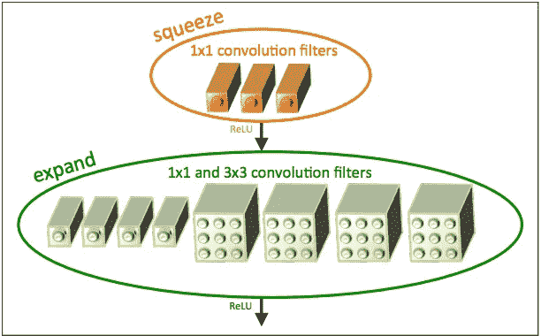
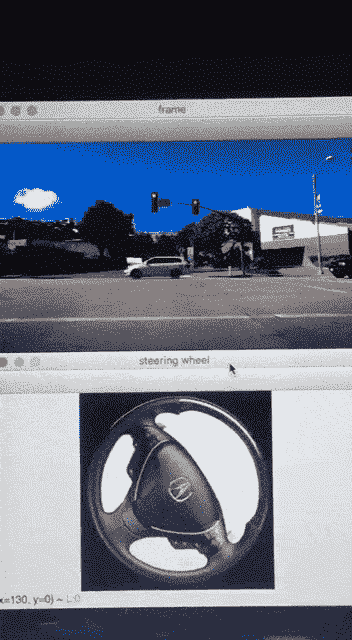

# 如何训练你的自动驾驶汽车转向

> 原文：<https://towardsdatascience.com/how-to-train-your-self-driving-car-to-steer-68c3d24bbcb7?source=collection_archive---------1----------------------->

## 一步一步的指导使用小而有效的神经网络和一点魔法。

神经网络，特别是深度学习研究，最近在计算机视觉领域和计算机科学的其他重要领域取得了许多突破。在许多不同的应用中，目前正在兴起的一项技术是自动驾驶汽车。每个人都听说过他们，所有的大公司似乎都在这个新千年的淘金热中投入巨资。人工智能驱动的汽车可以带你去任何地方，而你的时间，嗯，不开车。在这篇文章中，我将向你展示如何训练一个**神经网络，仅使用前方道路的图像来自主驾驶**。你可以在这个 [Jupyter 笔记本](https://github.com/normandipalo/self-driving-car-beta/blob/master/self-drivng-car-beta-clean.ipynb)中找到所有的代码，一步一步地解释。你也可以在这里找到更详细的论文。

深度神经网络，尤其是在计算机视觉、物体识别等领域，往往参数很多，有几百万个。这意味着它们的计算量和运行它们的设备的内存都很大。如果你是一个学术实验室或一家大公司，你有你的数据中心和大量的 GPU，这不是一个问题。但是，如果你只有一辆应该实时驾驶的汽车上的嵌入式系统，这可能是一个问题。这就是为什么我将重点放在非常纤薄、快速和高效的特定**架构上。**我使用的主要模型是**[**SqueezeNet**](https://arxiv.org/pdf/1602.07360.pdf)**架构。**这是一个相当新的模型，它用很少的参数，仅几兆字节的重量，就在对象识别任务上取得了显著的性能。我建议阅读这个故事和代码，它已经非常详细，以进一步理解概念。**

**我们首先需要的是一个**数据集**，这是大多数深度学习项目的核心。幸运的是，有几个数据集对我们有用。我们最需要的是在不同环境下(高速公路、城市)驾驶数小时所拍摄的图像。你可以在笔记本里找到一本。有了数据集之后，我们需要对数据进行预处理，以使我们的算法更好地工作。例如，我们当然不能将整个数据集加载到 RAM 中，因此我们需要设计一个**生成器，**，这是 Python 中一种特别有用的函数，它允许动态加载一小批数据，对其进行预处理，然后将其直接输出到我们的神经网络中。为了帮助网络更好地概括每一种可能的天气和光线条件，我们可以随机修改图像的亮度。此外，我们可以裁剪图像的顶部，因为它主要包含天空和其他对驾驶无用的信息。这有助于使整个计算更快。**

****

**NVIDIA model.**

**在预处理之后，我们可以开始设计我们的网络。为此，我使用了 Keras，使其可读性更好。第一款是 **NVIDIA 型号**，相当经典的 CNN。在一些卷积层之后，从我们的图像中提取视觉特征，我们有一个展平层，然后是完全连接的层，它输出一个单一的实数值:我们的转向角。你可以在代码中看到网络的细节。**

**如果你在笔记本电脑上训练这个网络，特别是在没有 GPU 加速的情况下，你可能需要一整天来训练它。(但是努力是值得的。大概吧。)在这个相对较小的训练之后，你可以看到验证损失是如何显著减少的，因此网络确实在学习如何驾驶。**

**这种架构可以在笔记本电脑上实时工作，大约有 500，000 个参数。但是我们可以做得更好，建立一个更小的网络。这就是 **SqueezeNet** 出现的原因。这种特殊的架构已经很小了，我通过减少卷积特性的数量进一步缩小了它。这个架构的核心是 Fire 模块，这是一个非常巧妙的过滤器块，可以使用很少的参数提取语义上重要的特征，并且输出很少。您可以在代码中看到网络实现的细节。最终的层也被修改，因为我们的任务是图像空间中的**回归，而网络最初是为对象识别而设计的。****

****

**The Fire Module.**

**使用与之前相同的训练设置，我们可以看到训练是如何更快的，并且在大约 10 个时期之后，网络达到甚至更好的性能。**

**你可能会说，我们在这里预测的转向角仅仅基于当前帧，而驾驶是一项动态任务，也依赖于先前的帧。这就是为什么我在这里展示的最后一个模型是一个**循环**模型。我在 SqueezeNet 的第一个密集连接层的输出中添加了一个递归层:网络现在将 5 个连续帧作为输入**，然后递归层输出一个单一的实数值，即转向角。令人惊讶的是，这种新架构的性能，即使它更接近人类决定如何驾驶的方式，也不比以前看到的架构更好。因此，无记忆和无状态架构可以很好地驱动，从单个帧计算转向角度，独立于其他帧。****

**现在，最后，我们网络运行的一个小视频。剧本是从这个[非常酷的资料库](https://github.com/SullyChen/Autopilot-TensorFlow)中截取的。它显示汽车的实时驾驶，转向完全由网络根据它看到的街道来控制。很好，对吧？**

****

**Our self-driving car in action.**

**我们已经用非常简单的架构和技术训练我们的自动驾驶汽车转向，取得了显著的效果。我希望你已经从这篇文章、代码和论文中学到了一两个技巧。欢迎评论或联系！**