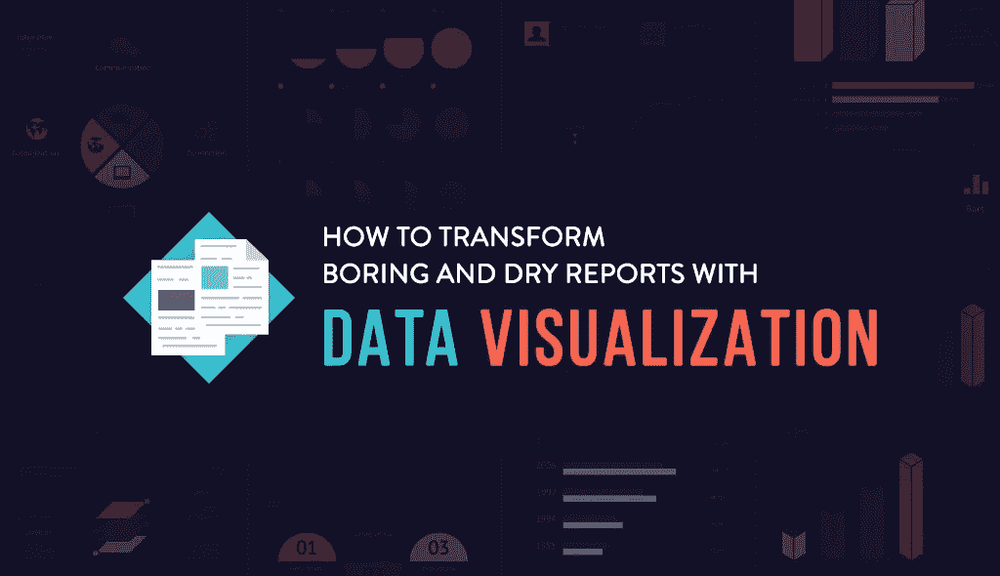
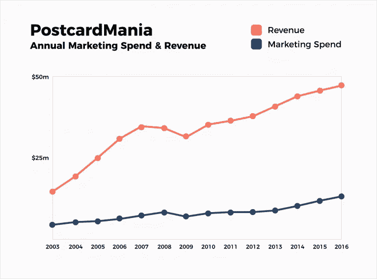
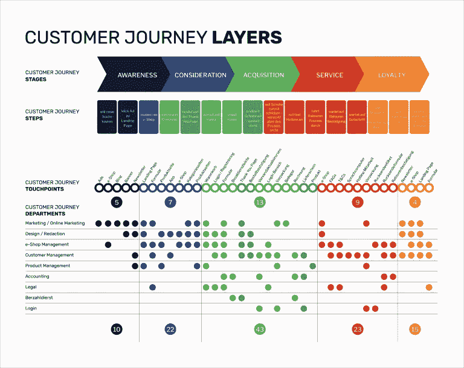
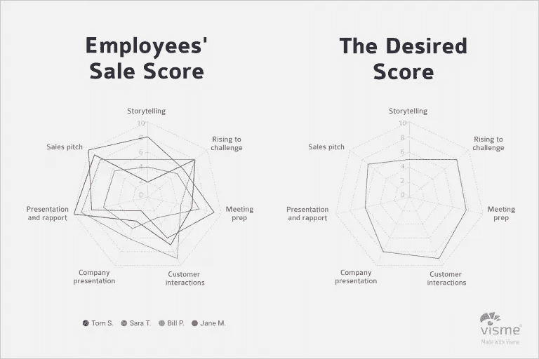
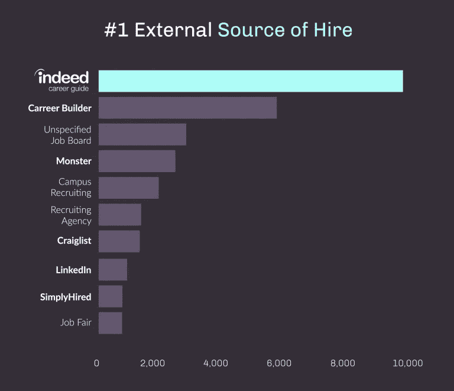
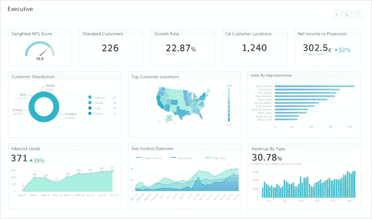

# 如何用数据可视化改造枯燥乏味的报表

> 原文：<https://towardsdatascience.com/how-to-transform-boring-and-dry-reports-with-data-visualization-81fd908bcc62?source=collection_archive---------6----------------------->

研究表明，帮助当今人们应对信息过载的最基本方法之一是将其可视化。通俗地说，这意味着将其绘制成图表，在地图上绘制，甚至使用数据创建交互式图表。

通过可视化地绘制出[数据](http://blog.visme.co/business-intelligence-visualization/)，不仅可以更容易地消化和理解重要信息，还可以更容易地发现关键模式、重要趋势和令人信服的相关性，否则这些可能很难揭示。一句话:你不仅要明白 ***发生了什么*** 发生了什么，还要明白 ***为什么*** *。*

# 你想讲什么故事？

在创建图表之前，首先理解 ***为什么*** 你需要一个图表是至关重要的。请记住，您正在创建一个可视化工具来帮助人们理解复杂的数据，发现模式，识别趋势，并最终实现目标。

您还必须遵循图表最佳实践。首先，这些数字需要相加，你需要相应地调整你的图表。此外，考虑你想要说明多少变量，你想要显示多少数据点，以及你想要如何缩放你的轴。

以下是可以从最新的数据可视化工具中受益的传统商务智能报告/实践类型:

# 对于会计部门

# 费用报告

假设您想要生成一份每月支出报告，比较不同类别的支出数据，如差旅、办公用品等。—甚至跨部门。如何快速、轻松地判断某个特定领域何时会增加支出，从而发现节约的机会？

虽然这种趋势在电子表格中很容易被忽略，但条形图可以将数据可视化。这是一种比较信息的简单方法，因为它一眼就能发现高点和低点。会计部门可以向领导或部门主管提供信息，并立即了解面临的挑战。(当他们的打印费用明显高于另一个部门的技术成本时，谁会对他们过度使用复印机犹豫不决呢？)

# 财务仪表板

随着越来越多的组织将透明度作为员工参与和保留的一种战略，每月一次的“市政厅”变得越来越普遍，在那里共享关键数据。

虽然这是一项勇敢的努力，但简单地向那些可能不会经常与如此大数量的数据打交道的人展示枯燥的收入/利润/支出数据，只会导致每个人都对此视而不见。更糟糕的是，缺乏理解可能会导致员工在没有问题的地方假设有问题。

[Image Source](https://databear.com/xero-financial-dashboard/)

数据可视化使任何人都可以理解这样的报告，而不管分析的舒适度如何。你可以清楚地展示成功的领域和改进的机会。此外，你可以提出多种观点，让员工明白，虽然利润比上个月有所下降，但实际上比去年同月有所上升。

使用数据可视化软件，您还可以使图表和图形具有交互性和可访问性。您可以创建一个仪表板，供员工随时登录，而不是在每月 30 分钟的会议中显示一组数字。这样，他们可以更好地了解公司的日常表现，以及他们的工作对整体的影响。

# 对于营销和销售团队来说

# 参与趋势

又到了一年中的这个时候:你那位对营销持怀疑态度的首席执行官希望你写一份报告，反映你的网站在三个月内的页面浏览量。他希望它与收入相对应，以证明你的参与努力的价值。

在折线图中尝试一下。这是一种连接单个数字数据点的简单方法，可以简单直观地显示趋势，以及它们在一段时间内的对应关系。与收入增长相比，您的网站浏览量、电子邮件参与率或广告点击率之间的关系如何？正相关可能表明这种努力是成功的，可以很快让你买入进一步的投资。

# CRM 快照

销售线索挖掘可能是一个支离破碎的过程。你观察漏斗的每一步，衡量参与度和转化率，但很难看到全貌。

数据可视化会有所帮助。映射图表可以显示销售线索的每一步，以便轻松发现和解决潜在的障碍。与此同时，您可以注意到加速领域，即销售线索可能转化的领域，并从这些案例中学习最佳实践。

此外，你可以创建买家旅程。随着您将数据可视化工具与您的 CRM 集成，最常见的购买途径将会出现。利用这些趋势来创建旅程和人物角色，为你的未来战略提供信息。

# 对于人力资源

# 学习管理报告

学习管理系统 (LMS)正越来越多地被企业用于从合规培训到入职培训、拓展机会和绩效评估的方方面面。一个使用良好的 LMS 可以是关于您最重要的资产——您的员工——的大量数据。然而，如果你不了解这些数据，或者如果个别经理对他们的直接下属有看法，但领导层缺乏全局观念，这些数据可能会被浪费掉。

使用数据可视化，您可以获得员工进展快照，这将有助于您确定表现最佳的员工(可能准备好升职)以及那些发展停滞或落后的员工。

# 招聘来源报告

许多组织都有分散的招聘流程，由各个经理负责职位发布和候选人招聘。这种支离破碎的过程可能会导致重新创建车轮，关注那些要么不起作用要么导致候选人不合格的招聘策略。

您可以使用数据可视化创建图表，集中了解招聘流程。例如，创建一个饼图，显示您可能使用的各种媒体(社交媒体、电子邮件、招聘信息板等)的招聘来源。您可以为组织创建一个总体图表，还可以为每个部门创建单独的版本。

利用这些信息，你会很快注意到招聘信息板最适合招聘 IT 人员，而你的营销团队中的大多数人都是直接推荐来的。有了这些数据，你就可以了解哪些领域有助于改善你的候选人库，缩短每个职位的招聘时间。

# 对于技术团队来说

无论您的组织规模如何，您都有机会使用故障单系统向您的 IT 团队报告问题，确定问题的重要性，并跟踪问题直到解决。这些票务工具通常提供易于理解的门票数量和每张门票花费时间的指标，但这并不能说明太多问题。

讲述故事的是事件级别。这些票都是从哪里来的？哪些设备、产品或用户是最大的罪魁祸首？你的组织越大，就越难注意到这种趋势。当 IT 团队可以制定防火计划时，他们却以救火告终。

使用数据可视化，您可以轻松地注意到事件的最大原因，并主动解决它们，以减少整体票证数量。

# 争夺领导权

[Image Source](https://www.betterbuys.com/bi/reviews/grow/)

投资者和顾问委员会希望不断了解他们所支持的企业。对于业务领导来说，定期向他们传达指标可能是一个挑战，他们已经很忙，很难创建可消化的数据，然后有时间回答问题。

数据可视化工具带来了变化。正如您可以创建仅供员工访问的自定义仪表板一样，您也可以为投资者创建仪表板。使用它以视觉上引人注目的方式展示他们最关心的数据，无需指导即可理解。这样，投资者可以在自己的时间登录来检查进展，而你的季度会议可以用来根据这些数据制定战略，而不是在数字中摸索。

# 眼见为实

由于我们这个社会的注意力持续下降——8 秒钟——并且因为我们不断暴露在海量信息中，所以快速、直观地传达我们的数据至关重要。

数据可视化使我们能够快速理解信息，并调整不同的变量来观察它们的效果。

一张图片真的抵得上一千个字。作为企业所有者或团队经理，你不能只使用原始数据来教育你的利益相关者。

当您将数据可视化时，人们就更容易消化引人注目的见解，因此您可以全面提高关注度、保留率和参与度。

*本帖* [*原版*](http://blog.visme.co/business-intelligence-visualization/) *最早出现在 Visme 的* [*视觉学习中心*](http://blog.visme.co/) *。*