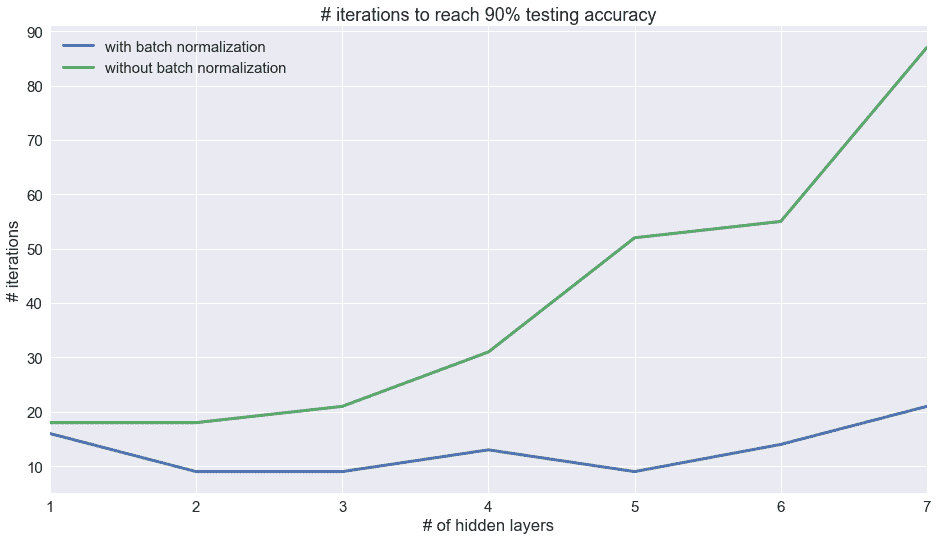
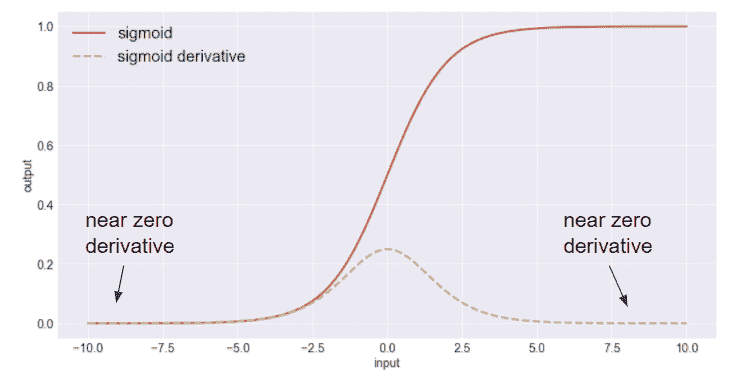
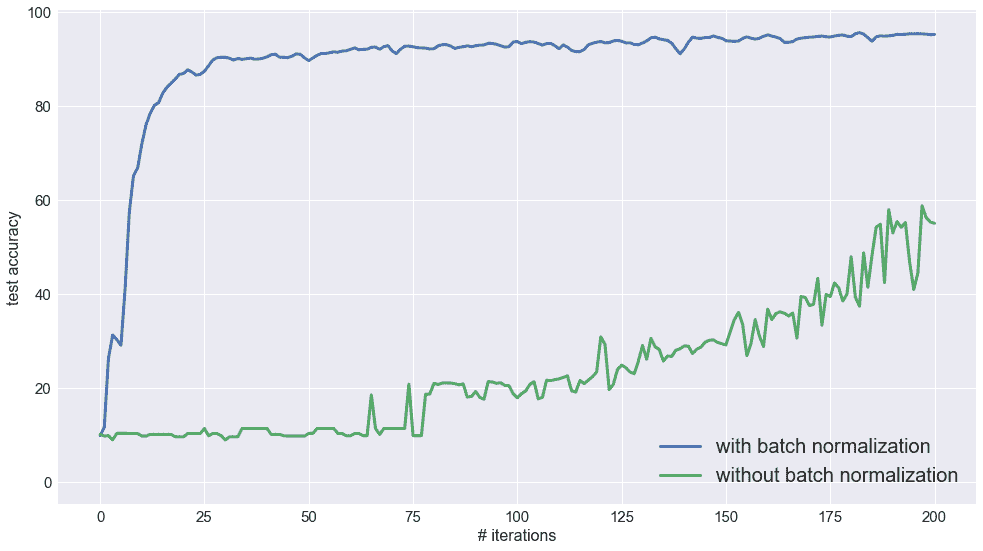

# tf.keras 和 TensorFlow:批量规范化以更快地训练深度神经网络

> 原文：<https://towardsdatascience.com/how-to-use-batch-normalization-with-tensorflow-and-tf-keras-to-train-deep-neural-networks-faster-60ba4d054b73?source=collection_archive---------5----------------------->


训练深度神经网络可能很耗时。特别是，当网络由于梯度(尤其是早期图层中的梯度)已接近零值而停止更新时，梯度消失会严重阻碍训练。合并 Xavier 权重初始化和 ReLu 激活函数有助于解决消失梯度问题。这些技术也有助于解决相反但密切相关的爆炸梯度问题，即梯度变得非常大，从而阻止模型更新。

也许对付渐变消失和爆炸问题的最有力的工具是批量标准化。批量标准化的工作方式如下:对于给定图层中的每个单元，首先计算 z 得分，然后使用两个经过训练的变量𝛾和𝛽.应用线性变换批量标准化通常在非线性激活函数之前完成(见下图)，但是在激活函数之后应用也是有益的。查看[这堂课](http://cs231n.stanford.edu/slides/2017/cs231n_2017_lecture6.pdf)了解更多关于这项技术如何工作的细节。


*During backpropagation gradients tend to get smaller at lower layers, slowing down weight updates and thus training. Batch Normalization helps combat the so-called vanishing gradients.*

在 TensorFlow 中可以通过三种方式实现批量规范化。使用:

1.  `tf.keras.layers.BatchNormalization`
2.  `tf.layers.batch_normalization`
3.  `tf.nn.batch_normalization`

*08/18/2018 更新:*[*dnn classifier*](https://www.tensorflow.org/api_docs/python/tf/estimator/DNNClassifier)*和*[*dnn regressor*](https://www.tensorflow.org/api_docs/python/tf/estimator/DNNRegressor)*现在有了一个* `*batch_norm*` *参数，这使得用一个固定的估计器进行批量归一化变得可能和容易。*

2019 年 11 月 12 日*更新:使用 tf.keras，这变得更加容易，你可以简单地添加一个* `*BatchNormalization*` *层，而不需要担心 control_dependencies。*

`tf.keras`模块在 1.4 版本中成为核心 TensorFlow API 的一部分。并且提供了用于构建张量流模型的高级 API 所以我会告诉你如何在 Keras 做到这一点。`tf.layers.batch_normalization`函数具有类似的功能，但是 Keras 通常被证明是在 TensorFlow 中编写模型函数的更简单的方法。

Note the training variable in the Batch Normalization function. This is required because Batch Normalization operates differently during training vs. the application stage– during training the z score is computed using the batch mean and variance, while in inference, it’s computed using a mean and variance estimated from the entire training set.


*In TensorFlow, Batch Normalization can be implemented as an additional layer using tf.keras.layers.*

带有`tf.GraphKeys.UPDATE_OPS`的第二个代码块很重要。对于网络中的每个单元，TensorFlow 使用`tf.keras.layers.BatchNormalization`不断估计训练数据集中权重的平均值和方差。这些然后被存储在`tf.GraphKeys.UPDATE_OPS`变量中。训练后，这些存储的值用于在预测时应用批处理规范化。每个单元的训练集平均值和方差可以通过打印`extra_ops`来观察，它包含网络中每个层的列表:

```
print(extra_ops)[<tf.Tensor ‘batch_normalization/AssignMovingAvg:0’ shape=(500,) dtype=float32_ref>, # layer 1 mean values
 <tf.Tensor ‘batch_normalization/AssignMovingAvg_1:0’ shape=(500,) dtype=float32_ref>, # layer 1 variances ...]
```

虽然在`tf.nn`模块中也可以使用批量标准化，但是它需要额外的簿记，因为均值和方差是函数的必需参数。因此，用户必须在批处理级别和训练集级别手动计算均值和方差。因此，它是比`tf.keras.layers`或`tf.layers`更低的抽象层次；避免`tf.nn`实现。

# MNIST 上的批处理规范化

下面，我使用 TensorFlow 对突出的 MNIST 数据集应用批量归一化。点击查看代码[。MNIST 是一个易于分析的数据集，不需要很多图层就可以实现低分类错误。但是，我们仍然可以建立一个深度网络，观察批处理规范化如何影响收敛。](https://github.com/GoogleCloudPlatform/training-data-analyst/tree/master/blogs/batch_normalization)

让我们使用`[tf.estimator](https://www.tensorflow.org/get_started/custom_estimators)` API 构建一个定制的评估器。首先，我们建立模型:

定义模型函数后，让我们构建定制的估计器，并训练和评估我们的模型:

让我们测试一下批量标准化如何影响不同深度的模型。在我们将代码打包成 Python 包之后，我们可以使用 [Cloud ML Engine](https://cloud.google.com/ml-engine/docs/technical-overview) 并行启动多个实验:

下图显示了达到 90%测试准确度(一个简单的目标)所需的训练迭代次数(1 次迭代包含 500 个批量),作为网络深度的函数。很明显，批量标准化大大加快了深层网络的训练速度。如果没有批标准化，训练步骤的数量会随着每个后续层的增加而增加，但有了批标准化，训练步骤的数量几乎保持不变。实际上，在更复杂的数据集上，更多的图层是成功的先决条件。



*Without Batch Normalization the number of training iterations required to hit 90% accuracy increases with the number of layers, likely due to the vanishing gradient effect.*

同样，如下图所示，对于一个有 7 个隐层的全连通网络，没有批量归一化的收敛时间明显变慢。


以上实验利用了常用的 ReLu 激活函数。尽管显然不能避免消失梯度效应，如上所示，ReLu 激活比 sigmoid 或 tanh 激活函数要好得多。sigmoid 激活函数对消失梯度的脆弱性是很容易理解的。在较大幅度(非常正或非常负)值时，sigmoid 函数“饱和”，即 sigmoid 函数的导数接近零。当许多节点饱和时，更新次数减少，网络停止训练。



相同的 7 层网络在使用 sigmoid 激活函数而不使用批量标准化的情况下训练明显较慢。当使用 ReLu 时，通过批处理规范化，网络以相似的迭代次数收敛。



另一方面，其他激活函数，如指数 ReLu 或泄漏 ReLu 函数，可以帮助解决消失梯度问题，因为它们对于正大数和负大数都具有非零导数。

最后，值得注意的是，批量标准化会导致额外的培训时间成本。虽然批量标准化通常减少了达到收敛的训练步骤的数量，但是它带来了额外的时间成本，因为它引入了额外的操作，并且还引入了每个单元两个新的训练参数。


*For the MNIST classification problem (using a 1080 GTX GPU), Batch Normalization converges in (top) fewer iterations, however the time per iteration is slower. Ultimately, the Batch Normalization version still converges faster (bottom), but the improvement is less pronounced when incorporating total training time.*

将 [XLA](https://www.tensorflow.org/performance/xla/) 和融合批处理规范化(`tf.layers.batch_normalization`中的融合参数)合并到一个内核中，可以帮助加速批处理规范化操作。

无论如何，批处理规范化对于加速深度神经网络的训练是一个非常有价值的工具。和训练深度神经网络一样，判断一种方法是否对你的问题有帮助的最好方法就是去尝试！