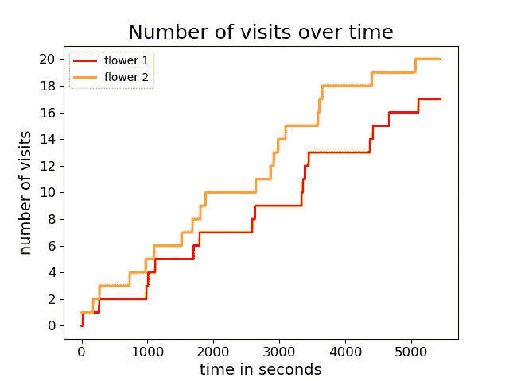
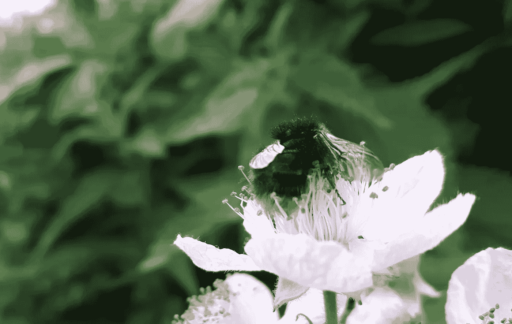

# 如何使用深度学习来量化传粉者的行为

> 原文：<https://towardsdatascience.com/how-to-use-deep-learning-to-quantify-pollinator-behavior-i-5fc8000a9bde?source=collection_archive---------7----------------------->

在过去的几年里，关于两个看似不相关的话题的新闻变得相当模糊:蜜蜂和其他授粉者的减少，同时，人工智能和数据科学的增加。读了一些关于授粉和授粉如何工作的研究，我意识到尽管已经知道了很多，但是像所有科学一样，还有更多未知的东西。这引发了我的好奇心，难道没有可能将 AI 用于传粉者的研究吗？在这篇文章中，我解释了一个简单的方法。我写了一些代码，可以在我的 github 上找到。([https://github.com/jnnkl/bees_on_dahlia](https://github.com/jnnkl/bees_on_dahlia))。但作为一个引子:我想量化这部电影中花的访问量。

获取数据
要做的第一件事是收集数据。我的目标是做一些便宜的东西，所以我买了我能在当地电子商店找到的最便宜的网络摄像机。去年 9 月，我把它带到一个公园，收集了大约 1.5 个小时的一束大丽花的第二组延时照片。这产生了大约 4500 张图片的数据集。我的目标是使用深度学习方法来计算访问每朵花的传粉者的数量。我决定去监督学习，因为这是最容易的。为此，我需要一个带标签的数据集，为此我使用了前 1500 张图像。也就是说，我确实在有昆虫访客和没有昆虫访客的主花中间剪出了正方形。我做了不同大小的方块，并把每只蜜蜂剪了几次。用这种方法，我收集了 635 张有蜜蜂的花的照片，因为花更经常不被访问，而不是被访问，所以有更多没有昆虫的照片。事实证明，花更经常不被参观，而不是参观。为了使数据集平衡，我使用了相似数量的空花图片。

构建网络
我想构建一个包含两类的分类器 1)有昆虫存在，2)没有昆虫存在。我为此使用了卷积神经网络，因为这对图像识别非常有用。由于数据量不多，我选择了迁移学习。因为 VGG16 是安装在我电脑上的 keras 发行版中最小的网络，所以我使用了它。我使用了 keras 的这篇([https://blog . keras . io/building-powerful-image-classification-models-using-very-little-data . html](https://blog.keras.io/building-powerful-image-classification-models-using-very-little-data.html))博文中讨论的技术。在 VGG16 网络之上，我放了一个小的卷积神经网络，训练这个小网络并保存它。接下来，我把整个网络，使前 15 层不可训练，然后用非常小的训练率训练其余部分，以防止过度拟合。我很快得到了超过 92%的准确率。我很幸运能够访问 GPU 集群来进行培训，否则这将需要相当长的时间。

制作电影
现在我可以对有蜜蜂或没有蜜蜂的正方形图像进行分类，是时候用它来检查我的电影中两种主要花卉的昆虫访客数量了。幸运的是，我在一个无风的日子做了延时记录，所以图像相当稳定。所以我简单地确定了两朵花的位置，取了每张照片的这些部分，通过神经网络运行，得到了一个表格，显示了这两朵花的每张照片上是否有昆虫。由于准确性很高，但不太高，我决定只计算那些昆虫的实例，如果至少有两个昆虫的后续实例，类似地，如果它消失的时间短于一秒钟，那么我将其重新分类为。我在我看的地方画了方框，如果没有昆虫就画红色，如果有昆虫就画绿色。这导致了下面的电影:

量化结果和一些讨论
现在我有了一个很好的可视化，这并不是真正的量化让我们来看一些图。在这个图中，花 1 是左上角的花，花 2 是只能看到一半的大花。

它们表明，较大的花得到更多的访问，访问之间的间隔似乎更小。当然，这个简短的测量并不支持任何关于传粉者行为的严肃主张，但这不是我想要的。这个实验的目标是表明深度学习技术可以帮助研究授粉行为，也是以定量的方式。当然，这也可以用经典的图像分析方法来完成。或许，人们可以相对容易地提出一种算法，自动识别昆虫对这些大丽花的访问。然而，他们并不推广到其他花卉。我检查了这个网络是否也适用于其他花的延时。如果是这样的话，我会很幸运，事实上我不得不得出结论，这个网络只为这些花工作。其他花的结构通常比这种特殊的大丽花更多样化，要建立一个网络来检测所有种类的花上的昆虫实际上是相当棘手的。所以如何为其他花和更多背景获得一个好的昆虫检测网络将是后面帖子的一个话题。

A nice picture of a bumblebee on a Rubus flower.