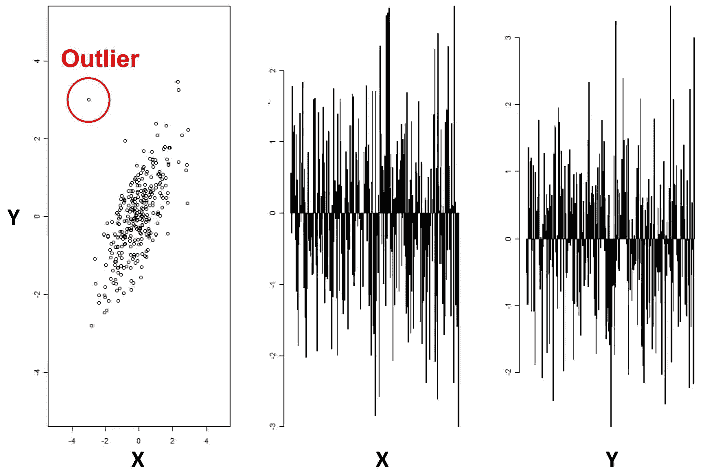
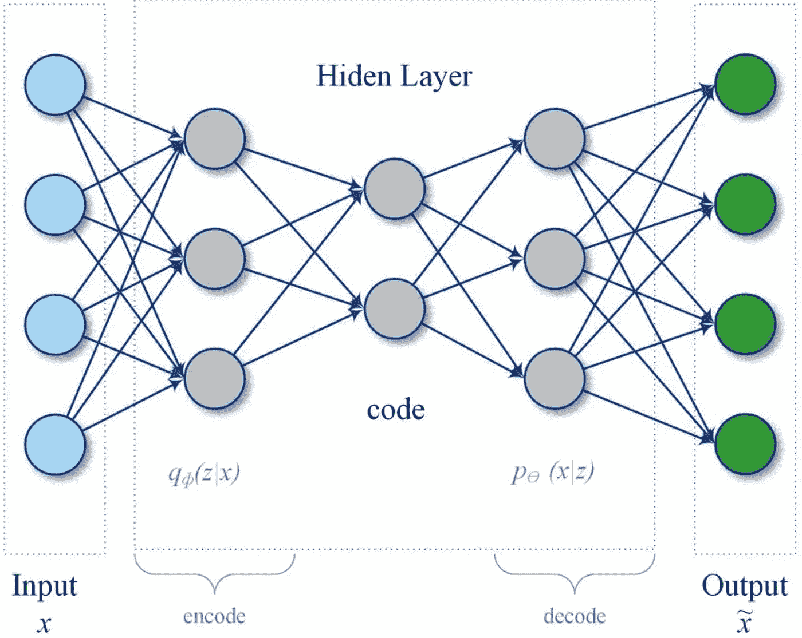
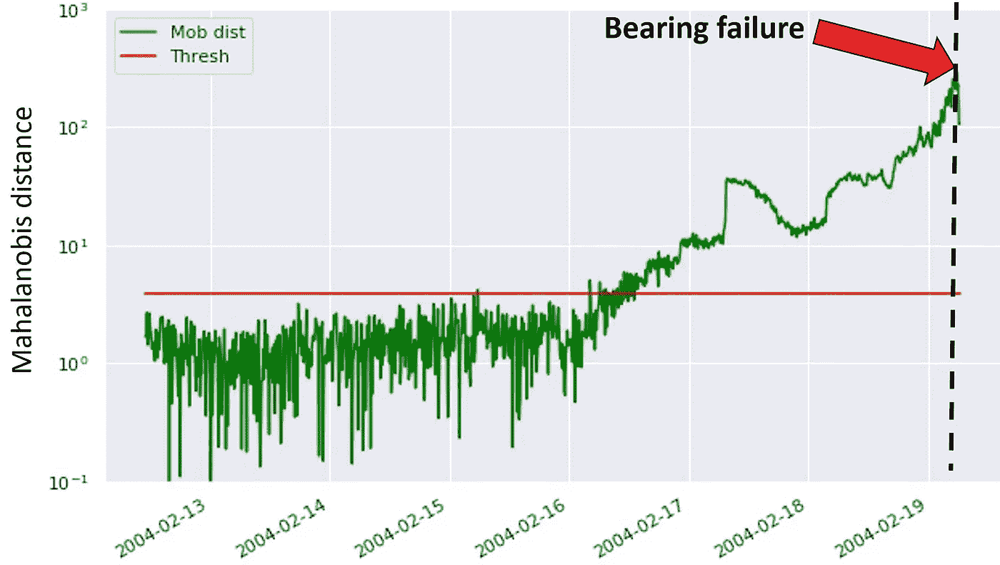
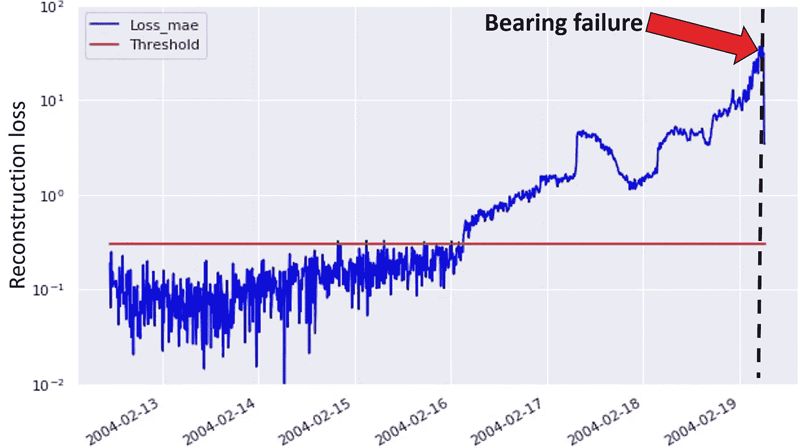

# 如何使用机器学习进行异常检测和状态监控

> 原文：<https://towardsdatascience.com/how-to-use-machine-learning-for-anomaly-detection-and-condition-monitoring-6742f82900d7?source=collection_archive---------0----------------------->

## 机器学习和统计分析的具体用例

在本文中，我将介绍机器学习和统计分析的几种不同技术和应用，然后展示如何应用这些方法来解决异常检测和状态监控的特定用例。

## **数字化转型，数字化，工业 4.0 等。**

这些都是你以前可能听说过或读到过的术语。然而，在所有这些时髦词汇的背后，主要目标是利用技术和数据来提高生产率和效率。设备和传感器之间的信息和数据的连接和流动允许大量的可用数据。关键的促成因素是能够使用这些大量的可用数据并实际提取有用的信息，从而有可能降低成本、优化容量并将停机时间降至最低。这就是最近围绕机器学习和数据分析的讨论发挥作用的地方。

## 异常检测

[异常检测](https://en.wikipedia.org/wiki/Anomaly_detection)(或异常值检测)是对罕见项目、事件或观察结果的识别，这些项目、事件或观察结果因与大多数数据显著不同而引起怀疑。通常，异常数据可能与某种问题或罕见事件有关，例如银行欺诈、医疗问题、结构缺陷、设备故障等。这种联系使得挑选出哪些数据点可以被视为异常变得非常有趣，因为从业务角度来看，识别这些事件通常非常有趣。

这给我们带来了一个关键目标:我们如何识别数据点是正常的还是异常的？在一些简单的情况下，如下图所示，[数据可视化](https://en.wikipedia.org/wiki/Data_visualization)可以给我们重要的信息。

Figure 1 : Anomaly detection for two variables

在二维数据( **X** 和 **Y** )的情况下，通过位于典型[分布](https://en.wikipedia.org/wiki/Probability_distribution)之外的数据点直观地识别异常变得非常容易。然而，看右边的图，不可能通过调查当时的一个变量直接识别异常值:X 和 Y 变量的**组合**使我们能够容易地识别异常值。当我们从两个变量扩大到 10-100 个变量时，事情变得非常复杂，这在异常检测的实际应用中是常见的情况。

## 连接到状态监控

任何机器，无论是旋转机器(泵、压缩机、燃气轮机或蒸汽轮机等。)或非旋转机器(热交换器、蒸馏塔、阀门等)。)最终会达到健康不佳的地步。该点可能不是实际故障或停机的点，而是设备不再以最佳状态运行的点。这表明可能需要一些维护活动来恢复全部运行潜力。简单来说，识别我们设备的“健康状态”是[状态监控](https://en.wikipedia.org/wiki/Condition_monitoring)的领域。

执行状态监控的最常见方法是查看机器的每个传感器测量值，并对其施加最小和最大值限制。如果当前值在界限内，那么机器是健康的。如果当前值超出界限，则机器不健康，并发出警报。

众所周知，这种强加硬编码警报限值的程序会发送大量错误警报，即针对机器实际健康状态的警报。还有漏报警，即有问题但没有报警的情况。第一个问题不仅浪费时间和精力，而且浪费设备的可用性。第二个问题更为关键，因为它会导致真正的损失，以及相关的维修费用和生产损失。

这两个问题都是由同一个原因引起的:一个复杂设备的健康状况无法根据对每个测量值的分析而可靠地判断出来(正如上一节异常检测中的图 1 所示)。我们必须考虑各种测量的组合**来获得情况的真实指示**

# 技术部分:

如果不深入一些更技术性的方面，很难涵盖异常检测的机器学习和统计分析主题。我还是会避免太深入理论背景(但是提供一些链接，可以更详细的描述)。如果您对机器学习和统计分析的实际应用更感兴趣，例如状态监控，请直接跳到“状态监控用例”部分。

# 方法 1:多元统计分析

## **使用主成分分析的维数减少:PCA**

由于处理高维数据通常具有挑战性，有几种技术可以减少变量的数量([维度缩减](https://en.wikipedia.org/wiki/Dimensionality_reduction))。其中一个主要技术是[主成分分析](https://en.wikipedia.org/wiki/Principal_component_analysis) (PCA)，它执行数据到低维空间的线性映射，使得低维表示中数据的[方差](https://en.wikipedia.org/wiki/Variance)最大化。在实践中，构建数据的[协方差矩阵](https://en.wikipedia.org/wiki/Covariance_matrix)，并计算该矩阵的[特征向量](https://en.wikipedia.org/wiki/Eigenvalue,_eigenvector_and_eigenspace)。对应于最大特征值(主成分)的特征向量现在可以用于重构原始数据的方差的大部分。原始的特征空间现在已经减少到由几个特征向量跨越的空间(丢失了一些数据，但是希望保留最重要的方差)。

## 多元异常检测

正如我们上面提到的，为了在处理一两个变量时识别异常，数据可视化通常是一个很好的起点。然而，当将其扩展到高维数据时(实际应用中经常出现这种情况)，这种方法变得越来越困难。幸运的是，多元统计学[在这方面发挥了作用。](https://en.wikipedia.org/wiki/Multivariate_statistics)

当处理一组数据点时，它们通常具有某种分布(例如[高斯分布](https://en.wikipedia.org/wiki/Normal_distribution))。为了以更定量的方式检测异常，我们首先从数据点计算[概率分布](https://en.wikipedia.org/wiki/Probability_distribution) *p* (x)。然后当一个新的例子 *x，*进来时，我们将 *p* (x)与一个阈值 *r* 进行比较。如果 *p* (x) < *r* ，则认为是异常。这是因为正常示例倾向于具有大的 *p* (x ),而异常示例倾向于具有小的 *p* (x)

在状态监控的情况下，这是很有趣的，因为异常可以告诉我们一些关于被监控设备的“健康状态”的信息:当设备接近故障或次优操作时，生成的数据通常与来自“健康”设备的数据具有不同的分布。

## 马哈拉诺比斯距离

如上所述，考虑估计数据点属于分布的概率的问题。我们的第一步是找到样本点的[质心](https://en.wikipedia.org/wiki/Centroid)或质心。直觉上，问题点离这个质心越近，就越有可能属于集合。然而，我们还需要知道这个集合是分布在一个大的范围还是一个小的范围，这样我们就可以决定一个给定的距离中心的距离是否值得注意。最简单的方法是估计样本点到质心距离的[标准偏差](https://en.wikipedia.org/wiki/Standard_deviation)。通过将其代入正态分布，我们可以推导出数据点属于同一分布的概率。

上述方法的缺点是，我们假设样本点以球形方式围绕质心分布。如果分布确实是非球形的，例如椭球形，那么我们可以预期测试点属于该集合的概率不仅取决于离质心的距离，还取决于方向。在椭球具有短轴的方向上，测试点必须更近，而在长轴的方向上，测试点可以离中心更远。在数学基础上，可以通过计算样本的[协方差矩阵](https://en.wikipedia.org/wiki/Covariance_matrix)来估计最能代表集合概率分布的椭球。 [**Mahalanobis 距离**](https://en.wikipedia.org/wiki/Mahalanobis_distance) (MD)是测试点距离质心的距离除以椭球体在测试点方向的宽度。

为了使用 MD 将测试点分类为属于 N 个类别之一，首先估计每个类别的协方差矩阵，通常基于已知属于每个类别的样本。在我们的例子中，由于我们只对“正常”与“异常”的分类感兴趣，我们使用只包含正常操作条件的训练数据来计算协方差矩阵。然后，给定一个测试样本，我们计算“正常”类别的 MD，如果距离高于某个阈值，则将测试点分类为“异常”。

**注意:**MD 的使用意味着可以通过均值和协方差矩阵进行推断——这是正态分布独有的特性。在我们的情况下，这个标准不一定满足，因为输入变量可能不是正态分布的。然而，我们还是试了一下，看看效果如何！

# 方法 2:人工神经网络

## 自动编码器网络

第二种方法是基于使用[自动编码器](https://en.wikipedia.org/wiki/Autoencoder)神经网络。它基于与上述统计分析相似的原理，但略有不同。

自动编码器是一种[人工神经网络](https://en.wikipedia.org/wiki/Artificial_neural_network)，用于以[无监督](https://en.wikipedia.org/wiki/Unsupervised_learning)的方式学习[高效的数据编码](https://en.wikipedia.org/wiki/Feature_learning)。自动编码器的目的是学习一组数据的表示(编码)，通常用于[维度缩减](https://en.wikipedia.org/wiki/Dimensionality_reduction)。随着缩减侧，学习重构侧，其中自动编码器试图从缩减的编码中生成尽可能接近其原始输入的表示。

在架构上，自动编码器的最简单形式是一个[前馈](https://en.wikipedia.org/wiki/Feedforward_neural_network)，非[递归](https://en.wikipedia.org/wiki/Recurrent_neural_network)神经网络，非常类似于许多单层感知器，这使得[多层感知器](https://en.wikipedia.org/wiki/Multilayer_perceptron)(MLP)——具有一个输入层、一个输出层和一个或多个连接它们的隐藏层——但是输出层具有与输入层相同数量的节点，并且目的是*重建*它自己的输入。

Figure 2: Autoencoder network

在异常检测和状态监控的背景下，基本思想是使用自动编码器网络将传感器读数“压缩”到一个较低维度的表示，该表示捕获各种变量之间的[相关性](https://en.wikipedia.org/wiki/Correlation_and_dependence)和相互作用。(基本上与 PCA 模型的原理相同，但是这里我们也允许变量之间的非线性相互作用)。

然后，自动编码器网络根据代表“正常”操作状态的数据进行训练，目标是首先压缩，然后重构输入变量。在降维过程中，网络学习各种变量之间的相互作用，并且应该能够在输出端将它们重构回原始变量。主要思想是，随着被监控设备的退化，这将影响变量之间的相互作用(例如，温度、压力、振动等的变化)。).当这种情况发生时，人们将开始看到输入变量的网络重构中的误差增加。通过监控重建误差，可以得到被监控设备的“健康”的指示，因为该误差将随着设备退化而增加。类似于使用[马氏距离](https://en.wikipedia.org/wiki/Mahalanobis_distance)的第一种方法，我们这里使用重建误差的[概率分布](https://en.wikipedia.org/wiki/Probability_distribution)来识别数据点是正常还是异常。

# 状态监控用例:齿轮轴承故障

在本节中，我将介绍一个使用上述两种不同方法进行状态监控的实际用例。由于我们与客户合作的大部分数据都不是公开可用的，我选择用 NASA 提供的数据来演示这两种方法，这些数据可以在这里下载。

对于此用例，目标是检测发动机上的[齿轮轴承](https://en.wikipedia.org/wiki/Gear_bearing)退化，并发出警告，允许采取预测措施，以避免齿轮故障(例如，可能是设备的计划维护/修理)。

## **实验细节和数据准备:**

三组数据，每组由四个轴承组成，在恒定负载和运行条件下运行至失效。振动测量信号是在轴承的整个寿命期间为数据集提供的，直到发生故障。失败发生在 1 亿次循环后，外环出现裂纹(参见下载页面的自述文件，了解更多关于实验的信息)。由于设备一直运行到发生故障，前两天运行的数据被用作训练数据，以代表正常和“健康”的设备。然后将轴承故障发生前的数据集的剩余部分用作测试数据，以评估不同方法是否能够在故障发生前检测到轴承退化。

# 方法 1 : PCA + Mahalanobis 距离

正如在本文的“技术部分”中更详细解释的，第一种方法包括首先执行[主成分分析](https://en.wikipedia.org/wiki/Principal_component_analysis)，然后计算[马氏距离](https://en.wikipedia.org/wiki/Mahalanobis_distance) (MD)以识别数据点是正常还是异常(设备退化的迹象)。代表“健康”设备的训练数据的 MD 分布如下图所示。

Figure 3: Distribution of Mahalanobis distance for “healthy” equipment

使用“健康”设备的 MD 分布，我们可以定义一个阈值来判断什么是异常。根据上述分布，我们可以将 MD > 3 定义为异常。检测设备退化的这种方法的评估现在包括计算测试集中所有数据点的 MD，并将其与定义的阈值进行比较，以将其标记为异常。

## 测试数据的模型评估:

使用上述方法，我们计算了轴承失效前的测试数据的 MD，如下图所示。

Figure 4: Predicting bearing failure using approach 1

在上图中，绿点对应于计算的 MD，而红线代表用于标记异常的定义阈值。轴承故障发生在数据集的末端，由黑色虚线表示。这说明第一种建模方法能够在实际故障(MD 超过阈值)前大约 3 天检测到即将到来的设备故障。

我们现在可以使用第二种建模方法进行类似的练习，以评估哪种方法比另一种方法性能更好。

# 方法 2:人工神经网络

正如在论文的“技术部分”中更详细解释的，第二种方法包括使用[自动编码器](https://en.wikipedia.org/wiki/Autoencoder)神经网络来寻找异常(通过网络中增加的重建损失来识别)。类似于第一种方法，我们在这里也使用代表“健康”设备的训练数据的模型输出的分布来检测异常。训练数据的重建损失(平均绝对误差)分布如下图所示:

Figure 5 : Distribution of reconstruction loss for “healthy” equipment.

使用“健康”设备的重建损失分布，我们现在可以定义一个阈值来确定什么是异常。根据上述分布，我们可以将大于 0.25 的损失定义为异常。检测设备退化的方法的评估现在包括计算测试集中所有数据点的重建损失，并将该损失与定义的阈值进行比较，以将其标记为异常。

## 测试数据的模型评估:

使用上述方法，我们计算了轴承失效前的测试数据的重建损失，如下图所示。

Figure 6: Predicting bearing failure using approach 2

在上图中，蓝点对应于重建损失，而红线代表用于标记异常的定义阈值。轴承故障发生在数据集的末端，由黑色虚线表示。这说明这种建模方法也能够在实际故障(其中重建损失超过阈值)之前大约 3 天检测到即将到来的设备故障。

# 结果摘要:

如以上关于两种不同异常检测方法的章节所示，两种方法都能够在实际故障发生前几天成功检测到即将发生的设备故障。在现实生活中，这将允许在故障之前采取预测措施(维护/修理)，这意味着节约成本以及设备故障对 [HSE](https://en.wikipedia.org/wiki/Environment,_health_and_safety) 方面的潜在重要性。

# 展望:

随着通过传感器捕获数据的成本降低，以及设备之间的连接性增加，能够从数据中提取有价值的信息变得越来越重要。在大量数据中寻找模式是机器学习和统计学的领域，在我看来，利用隐藏在这些数据中的信息来提高几个不同领域的性能有巨大的可能性。本文中提到的异常检测和状态监控只是许多可能性中的一种。*(此处也可用***)**

*在未来，我相信机器学习将会被用在比我们今天所能想象的更多的地方。你认为它会对各个行业产生什么影响？我很想在下面的评论中听到你的想法。*

*编辑:这篇关于异常检测和状态监控的文章收到了很多反馈。我收到的许多问题涉及技术方面以及如何建立模型等。由于这个原因，我决定写一篇[后续文章，详细介绍所有必要的步骤，从预处理数据到构建模型和可视化结果。](/machine-learning-for-anomaly-detection-and-condition-monitoring-d4614e7de770)*

*如果你有兴趣了解更多与人工智能/机器学习和数据科学相关的主题，你也可以看看我写的其他一些文章。你会发现他们都列在我的中型作者简介，[中，你可以在这里找到。](https://medium.com/@vflovik)*

*而且，如果你想成为一个媒体会员，免费访问平台上的所有资料，你也可以使用下面我的推荐链接。(注意:如果您使用此链接注册，我也会收到一部分会员费)*

* [## 通过我的推荐链接加入媒体- Vegard Flovik

### 作为一个媒体会员，你的会员费的一部分会给你阅读的作家，你可以完全接触到每一个故事…

medium.com](https://medium.com/@vflovik/membership) 

# 更多来自 Vegard Flovik 媒体:

1.  [蒙特卡洛方法简介](/a-gentle-introduction-to-monte-carlo-methods-98451674018d)
2.  [从物理学到数据科学的转变](/q-a-with-a-data-scientist-1f872518315f)
3.  [什么是图论，为什么要关心？](/what-is-graph-theory-and-why-should-you-care-28d6a715a5c2)
4.  [用于图像分类的深度迁移学习](/deep-transfer-learning-for-image-classification-f3c7e0ec1a14)
5.  [建造一个能读懂你思想的人工智能](https://www.linkedin.com/pulse/building-ai-can-read-your-mind-vegard-flovik-phd/)
6.  [机器学习:从炒作到现实应用](/machine-learning-from-hype-to-real-world-applications-69de7afb56b6)
7.  [人工智能和大数据隐藏的风险](/the-hidden-risk-of-ai-and-big-data-3332d77dfa6)
8.  [供应链管理的人工智能:预测分析和需求预测](/artificial-intelligence-in-supply-chain-management-predictive-analytics-for-demand-forecasting-80d2d512f155)
9.  [如何(不)使用机器学习进行时间序列预测:避免陷阱](/how-not-to-use-machine-learning-for-time-series-forecasting-avoiding-the-pitfalls-19f9d7adf424)
10.  [如何利用机器学习进行生产优化:利用数据提高绩效](/machine-learning-for-production-optimization-e460a0b82237)
11.  [如何向 AI 系统教授物理？](/how-do-you-combine-machine-learning-and-physics-based-modeling-3a3545d58ab9)
12.  [我们能否利用纳米级磁铁构建人工大脑网络？](https://medium.com/predict/can-we-build-an-artificial-brain-network-using-nanoscale-magnets-1c0a925973ab)

## 人工智能研讨会——从宣传到现实应用*