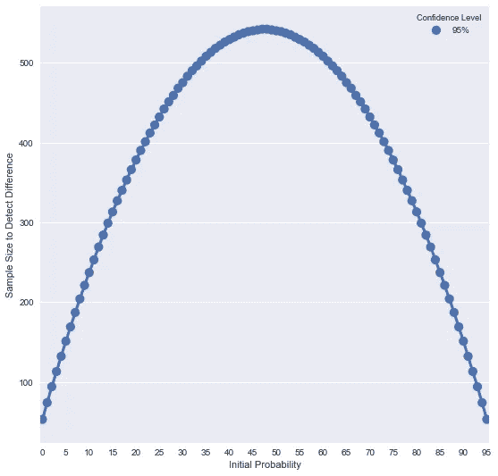
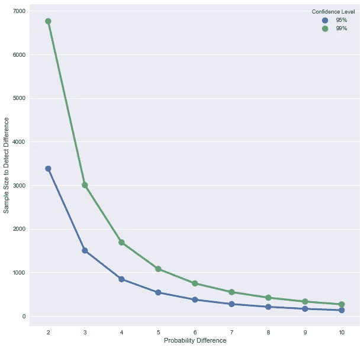

# 如何使用 Python 为您的研究计算样本大小

> 原文：<https://towardsdatascience.com/how-to-use-python-to-figure-out-sample-sizes-for-your-study-871f0a76a19c?source=collection_archive---------4----------------------->

数据科学家普遍认为，你 80%的时间花在清理数据上，而 20%的时间花在实际分析上。

在做实证研究时，也有类似的问题:通常，在你进入有趣的部分(即看到和解释结果)之前，有大量的工作要做。

实证研究中一个重要的前期活动是计算出你需要的样本量。这一点至关重要，因为它会显著影响您的研究成本和结果的可靠性。收集太多样本:你浪费了金钱和时间。收集太少:你的结果可能没用。

了解您需要的样本大小取决于您计划使用的统计测试。如果这是一个简单的测试，那么找到想要的样本量只需要将数字代入一个等式。然而，它可以更复杂，在这种情况下，像 Python 这样的编程语言可以使生活变得更容易。在这篇文章中，我将讲述其中一个更困难的案例。

***场景是这样的*** *:你正在研究一项旨在增加进入你商店的女性比例的营销活动(比如，改变招牌)。假设你想知道这一变化是否真的增加了女性走过的比例。你计划在改变标志之前和之后收集数据，并确定是否有差异。您将使用一个* [*双比例 Z 测试*](https://stattrek.com/hypothesis-test/difference-in-proportions.aspx) *来比较两个比例。您不确定需要多长时间来收集数据以获得可靠的结果——您首先必须计算出需要多少样本！*

# 两比例 Z 检验概述

确定所需样本量的第一步是了解您将使用的静态测试。[比例的双样本 Z 检验](https://onlinecourses.science.psu.edu/stat414/node/268/)确定一个人口比例 p1 是否等于另一个人口比例 p2。在我们的示例中，p1 和 p2 分别是营销变化前后进入商店的女性比例，我们希望了解 p2 是否比 p1 有统计学上的显著增加，即 p2 > p1。

该测试检验零假设:p1 — p2 = 0。我们用来检验这种无效假设的检验统计量是:

其中 p*是两个样本中“成功”(即女性进入商店)的比例。即

Z 近似呈正态分布(即~N(0，1))，因此给定两个比例的 Z 分数，您可以根据正态分布查找其值，以查看该值偶然出现的可能性。

那么如何算出我们需要的样本量呢？这取决于几个因素:

*   ***信心水平:*** 我们需要有多大的信心来确保结果不是偶然发生的？对于给定的结果差异，以更高的置信度检测它需要更多的样本。这里的典型选择包括 95%或 99%的置信度，尽管这些只是惯例。
*   ***我们希望能够检测到的百分比差异*** :您希望能够检测到的差异越小，需要的样本就越多。
*   ***您想要检测差异的概率的绝对值:*** 这有点复杂，对于我们正在进行的特定测试来说有点独特。事实证明，例如，检测 50%和 51%之间的差异与检测 80%和 81%之间的差异需要不同的样本量。换句话说，所需的样本大小是 p1 的函数，而不仅仅是 p1 — p2。
*   ***数据结果的分布:*** 假设您想要比较子组内的比例(在我们的例子中，假设您按年龄组细分女性比例)。这意味着您需要在每个亚组中有足够大的样本*来进行统计显著性比较。您通常不知道样本在这些组中的表现如何(对某些组来说，获取样本可能要困难得多)。这里至少有几个选择:I)你可以假设样本在各个子群中均匀分布；ii)你可以进行初步测试(例如，在商店外面坐半天，以获得每个年龄组进入商店的女性的初步比例)。*

那么，当有这么多因素在起作用时，你如何计算样本量呢？

# 用 Python 计算样本大小的可能性

最终，我们想要确定我们能够计算 p1 和 p2 之间的差，当它存在的时候。所以，让我们假设你知道 p1 和 p2 之间存在的“真实”差异。然后，我们可以查看 p1 的各种置信水平和绝对水平的样本大小要求。

我们需要一种计算 Z 的方法，这样我们就可以确定给定的样本大小是否提供了具有统计意义的结果，所以让我们定义一个函数，在给定 p1、p2、n1 和 n2 的情况下返回 Z 值。

然后，我们可以定义一个函数，在给定 p1(之前概率)、p_diff(即 p2-p1)和 alpha(表示 p 值，或 1 减去置信水平)的情况下，返回所需的样本。为简单起见，我们假设 n1 = n2。如果你预先知道 n1 的大小大约是 n2 的四分之一，那么把它合并到函数中就很简单了。然而，您通常事先不知道这一点，在我们的场景中，等样本假设似乎是合理的。

该函数非常简单:它从 1 开始从 n 开始计数，直到 n 足够大，其中统计值足够大的概率(即 p 值)小于α(在这种情况下，我们将拒绝 p1 = p2 的零假设)。该函数使用 scipy 库中可用的正态分布来计算 p 值，并将其与 alpha 进行比较。

我们定义的这些函数提供了确定所需最小样本水平所需的主要工具。

如前所述，需要处理的一个复杂问题是，确定 p1 和 p2 之间差异所需的样本取决于 p1 的绝对水平。所以，我们想回答的第一个问题是“什么样的 p1 需要最大的样本量来确定与 p2 的给定差异？”弄清楚这一点，你就可以计算出任何一个 p1 的样本的下限。如果您用最高要求的样本计算 p1 的样本，您知道它将足够用于任何其他 p1。

假设我们希望能够以 95%的置信度计算出 5%的差异，我们需要找到一个 p1，它给出了我们所需的最大样本。我们首先在 Python 中生成一个要查看的所有 p1 的列表，从 0%到 95%，然后对每个差异使用 sample_required 函数来计算样本。

然后，我们用下面的代码绘制数据。

产生了这个图:

该图清楚地表明，p1 = 50%产生最高的样本量。

使用此信息，假设我们想要计算计算 p1 和 p2 之间的差异所需的样本大小，其中 p2 - p1 介于 2%和 10%之间，置信水平为 95%或 99%。为了确保我们得到足够大的样本，我们知道设置 p1 = 50%。我们首先编写代码来构建要绘制的数据框。

然后，我们编写以下代码，用 Seaborn 绘制数据。

最后的结果是这样的情节:

这显示了对于 95%和 99%的置信水平，检测 2%和 10%之间的概率差异所需的最小样本。因此，例如，在 95%的置信水平下检测 2%的差异需要约 3，500 个样本，即 n1 = n2 = 1，750。因此，在我们的例子中，在营销干预之前，你需要大约 1750 人走进商店，之后需要 1750 人在 95%的置信度下检测 2%的概率差异。

# 结论

这个例子展示了 Python 是如何成为一个非常有用的工具来执行“封底”计算的，比如对测试所需样本量的估计，在这种情况下，这种确定是不直接的。这些计算可以为你节省大量的时间和金钱，尤其是当你考虑为一个研究项目收集你自己的数据时。

*原载于 2018 年 7 月 22 日*[*【www.marknagelberg.com】*](http://www.marknagelberg.com/using-python-to-figure-out-sample-sizes-for-your-study/)*。要访问我共享的 Anki deck 和 Roam Research notes 知识库，以及关于间隔重复和提高学习效率的技巧和想法的定期更新，* [*加入“下载马克的大脑”。*](http://downloadmarksbrain.marknagelberg.com/auth)