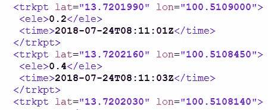
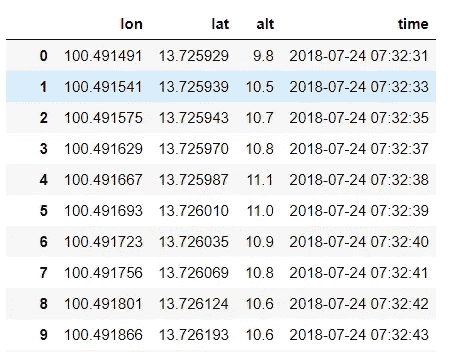
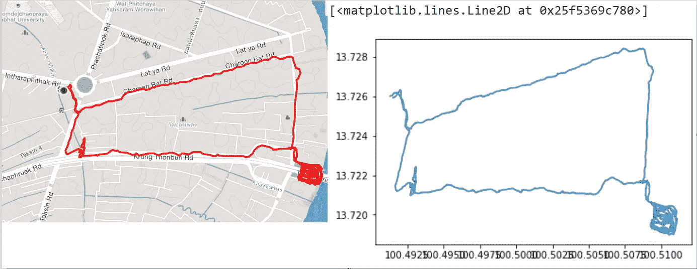
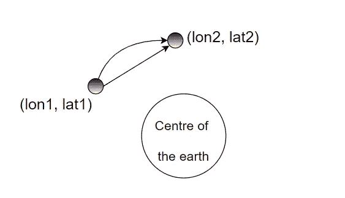
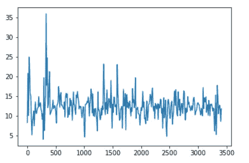

# 追踪应用如何分析你的 GPS 数据:Python 实践教程

> 原文：<https://towardsdatascience.com/how-tracking-apps-analyse-your-gps-data-a-hands-on-tutorial-in-python-756d4db6715d?source=collection_archive---------0----------------------->

如今，运动追踪应用和伴随它们的社交网络无处不在。每个人都想在像 *Nike+ Run* 或 *Strava* 这样的应用上做出最大或最快的努力。但是你有没有想过所有这些花哨的统计数据是从哪里来的，或者它们是如何计算出来的？

我们先来解释一下你的手机是如何知道你在哪里的，或者更准确的说，你手机里的 GPS 接收器是如何知道你在哪里的。全球定位系统(GPS)是美国政府拥有的基于卫星的无线电导航系统。

它是一个全球导航卫星系统，向地球上任何地方的 GPS 接收机提供地理位置和时间信息，在那里可以畅通无阻地看到四颗或更多的 GPS 卫星。你的手机接收器的位置通常被转换成纬度，经度和海拔，伴随着一个时间戳，并存储为一个 gpx 文件(更多关于文件格式如下)。

在本教程中，我们将使用 Python 在 Jupyter 笔记本中提取、管理和分析一条路线的 gpx 数据。我们将从把数据从 gpx 文件提取到一个方便的 pandas 数据框架开始。从那里，我们将探索数据，并尝试复制我们最喜欢的运行应用程序的界面为我们提供的统计数据和图表。

# 获取数据

大多数流行的追踪应用程序允许你下载你的成果作为一个 gpx 文件。在本教程中，我们下载了来自 *Strava* 的 11 公里跑步记录。gpx-file 是 *GPS 交换格式*的简称，通常可以通过点击*导出*获得。下面的截图显示了你可以在哪里下载你的 gpx 文件。你可以在这里下载本文使用的文件[。](https://github.com/stevenvandorpe/testdata/blob/master/gps_coordinates/gpx/my_run_001.gpx)


Export data as gpx-fle

Gpx 是一种 XML 模式，设计为软件应用程序的通用 GPS 数据格式。它可以用来描述路点、轨迹和路线。这也意味着下面的所有代码都可以用于运行任何*GPS 数据，只要你考虑到运动的速度和类型。*

首先，理解我们的 gpx 文件的结构很重要。在任何文本编辑器(这里是 *Notepad ++* )中打开文件后，您应该会得到一个*XML*-文件，其中包含许多条目，如下所示。注意每个*轨迹点*由四个值组成:*纬度*、*经度*、*海拔*或*海拔*和一个*时间戳*。这四个价值将是我们分析的基础。



# 加载数据

现在，我们想将 gpx 数据加载到 pandas 数据框架中。没有直接的方法可以做到这一点，所以我们必须使用 *gpxpy* 库来帮助我们。当我们导入模块时，您可能希望确保您也安装了以下库: *matplotlib* ， *datetime* ， *geopy* ， *math* ， *numpy* ， *pandas* ， *haversine* 和 *plotly* (可选)。下载这些库，并确保下面的代码可以成功运行。

```
import gpxpy
import matplotlib.pyplot as plt
import datetime
from geopy import distance
from math import sqrt, floor
import numpy as np
import pandas as pd
import plotly.plotly as py
import plotly.graph_objs as go
import haversine
```

将 gpx 数据加载到 Python 中就像以读取模式打开文件并将其解析成一个新变量一样简单。

```
gpx_file = open('my_run_001.gpx', 'r')
gpx = gpxpy.parse(gpx_file)
```

看一下这个新对象，注意它是一个由一系列 *GPXTrack* *对象*组成的 *GPX 对象*。GPXTrack 对象依次存在于一系列 *GPXTrackSegment 对象*中，这些对象依次存在于 *GPXTrackPoints* 中。这些点是我们感兴趣的四值数据点。可以通过*经度*、*纬度*、*高程*和*时间*属性访问。

在使用数据之前，检查数据在这些对象之间是如何划分的很重要。您可以通过检查*轨道、段*和*点*列表的长度来完成此操作。

```
len(gpx.tracks)
len(gpx.tracks[0].segments)
len(gpx.tracks[0].segments[0].points)
```

在我们的例子中，*轨道*和*片段*的长度都是 1。这意味着所有数据都集中在第一个*轨迹*的第一个*段*的*点*属性中。创建一个直接指向数据点列表的新变量是有意义的。

```
data = gpx.tracks[0].segments[0].points
```

看看你的起点和终点，确保一切都有意义(即开始时间

```
## Start Position
start = data[0]
## End Position
finish = data[-1]
```

一旦你找到了所有的数据，把所有的东西都放进一个数据框就很容易了。只需创建一个空的数据帧，并在将所有数据点添加到数据帧时遍历所有数据点。

```
df = pd.DataFrame(columns=['lon', 'lat', 'alt', 'time'])for point in data:
    df = df.append({'lon': point.longitude, 'lat' : point.latitude, 'alt' : point.elevation, 'time' : point.time}, ignore_index=True)
```

数据帧的头部应该如下所示:



请注意，数据点之间的时间间隔应该是一秒钟(对于 Strava，您可以在设置中进行更改)。不幸的是，由于连接问题，我的设备无法始终提供 GPS 数据。在这种失败的情况下，数据点被跳过(没有任何种类的错误),应用程序将在下一个时间间隔收集数据。重要的是要记住这一点，以便进一步分析，而不是假设所有点之间的间隔是相同的。

# 绘制数据

现在我们已经加载了数据，我们可以通过绘制一些基本的图表来开始探索它。最简单的两个是 2d 地图(经度对纬度)和我们在活动中的高度增益(高度对时间)。将这些图与我们应用程序中的图进行比较，我们可以看到，到目前为止，我们做得相当不错。

```
plt.plot(df['lon'], df['lat'])
```



```
plt.plot(df['time'], df['alt'])
```


如果我们想变得更有趣，我们可以用 *plotly* 绘制一条数据的交互式 3d 线。虽然这个情节是否给我们的故事增加了任何分析价值还有待商榷，但从另一个角度看你付出的巨大努力总是让人感觉很好。如果你以前没有用过 plotly，别忘了在 [plot.ly](https://plot.ly/#/) 上创建一个账户，并在凭证文件中设置你的用户名和 API-key。

```
_data = [go.Scatter3d(x=df['lon'], 
         y=df['lat'], z=df['alt'], mode='lines')]py.iplot(_data)
```

[如果你想学习如何在谷歌地图上叠加你的地图，看看这个关于 gmplot 的教程。](https://medium.com/@stevenvandorpe/gmplot-in-jupyter-installation-guide-and-package-exploration-338756e8f26)

# 转换数据

虽然到目前为止我们做得很好，但我们仍然缺少一些关键价值，如距离和速度。计算这两个似乎不太难，但是有几个陷阱。第一，我们必须考虑两个 LL 点(经度，纬度)之间的距离不是直线，而是球面。



Spherical distance vs Euclidean distance

有两种主要的方法来计算球面上两点之间的距离:哈弗森距离和文森特距离。这两个公式采用不同的方法计算距离，但这超出了本文的范围。你可以在他们的维基百科页面找到更多信息:[哈弗辛公式维基](https://en.wikipedia.org/wiki/Haversine_formula)和[文森提公式维基](https://en.wikipedia.org/wiki/Vincenty%27s_formulae)。

下一个问题是，我们可能要在计算中考虑海拔的增加或减少。最简单的方法是计算球面 2d 距离，然后使用欧几里德公式添加第三维度。下面的公式显示了这最后一步。

> distance _ 3d = sqrt(distance _ 2d * * 2+(alt 2—alt 1)* * 2)

现在我们有了所有需要的理论背景，我们可以开始在代码中实现这个公式了。为了方便起见，我们让数据框架保持原样，并像以前一样遍历所有数据点。我们为距离公式的每一个可能的实现创建一个列表(Haversine 或 Vincenty 和 2d 或 3d ),并将每个数据点的总距离添加到列表的末尾。

当我们遍历数据点时，我们还为所有连续数据点之间的高度差、时差和距离差创建了一个列表。

```
alt_dif = [0]
time_dif = [0]
dist_vin = [0]
dist_hav = [0]
dist_vin_no_alt = [0]
dist_hav_no_alt = [0]
dist_dif_hav_2d = [0]
dist_dif_vin_2d = [0]for index in range(len(data)):
    if index == 0:
        pass
    else:
        start = data[index-1]

        stop = data[index]

        distance_vin_2d = distance.vincenty((start.latitude, start.longitude), (stop.latitude, stop.longitude)).m dist_dif_vin_2d.append(distance_vin_2d)

        distance_hav_2d = haversine.haversine((start.latitude, start.longitude), (stop.latitude, stop.longitude))*1000dist_dif_hav_2d.append(distance_hav_2d)

        dist_vin_no_alt.append(dist_vin_no_alt[-1] + distance_vin_2d)

        dist_hav_no_alt.append(dist_hav_no_alt[-1] + distance_hav_2d)

        alt_d = start.elevation - stop.elevation

        alt_dif.append(alt_d)

        distance_vin_3d = sqrt(distance_vin_2d**2 + (alt_d)**2)

        distance_hav_3d = sqrt(distance_hav_2d**2 + (alt_d)**2)

        time_delta = (stop.time - start.time).total_seconds()

        time_dif.append(time_delta)

        dist_vin.append(dist_vin[-1] + distance_vin_3d)

        dist_hav.append(dist_hav[-1] + distance_hav_3d)
```

为了进一步方便，我们可以将数据放入之前创建的 dataframe 中。

```
df['dis_vin_2d'] = dist_vin_no_alt 
df['dist_hav_2d'] = dist_hav_no_alt
df['dis_vin_3d'] = dist_vin
df['dis_hav_3d'] = dist_hav
df['alt_dif'] = alt_dif
df['time_dif'] = time_dif
df['dis_dif_hav_2d'] = dist_dif_hav_2d
df['dis_dif_vin_2d'] = dist_dif_vin_2d
```

使用下面的 print 命令检查结果。

```
print('Vincenty 2D : ', dist_vin_no_alt[-1])
print('Haversine 2D : ', dist_hav_no_alt[-1])
print('Vincenty 3D : ', dist_vin[-1])
print('Haversine 3D : ', dist_hav[-1])
print('Total Time : ', floor(sum(time_dif)/60),' min ', int(sum(time_dif)%60),' sec ')
```

输出应该是这样的。让我们将我们的结果与跑步应用程序显示的统计数据进行比较。


有几件事需要注意。首先，我们所有的总距离计算——尤其是 2d 的——似乎是我们的应用程序为我们计算的距离的一个很好的近似值。其次，总活动时间与我们的计算完全一致，但*移动时间*似乎不同。

这可能意味着每当两个数据点之间的距离过小时，应用程序就会停止移动时间，但仍然会考虑距离，例如，当我们必须减速并停下来等红绿灯时，这可能是现实的。

在这种情况下，我们的二维计算是正确的，我们可以得出结论，该应用程序没有考虑海拔。app 公司的一篇博文确实证实了这一点。

> 假设表面平坦，不考虑来自地形的垂直速度。—斯特拉瓦

令人担忧？不完全是。应用程序提出的距离和我们最大的 3d 估计值之间的差异只有 61m (0.55%)。这意味着 100 公里跑(或骑行)的总四舍五入将是大约 600 米。请注意，如果你从事更高强度的活动(山地自行车或徒步旅行)，这种差异会增加。

让我们看看是否可以找出 Strava 使用哪个阈值来停止计时器(从而提高我们的平均速度)。要做到这一点，我们需要创建一个新的变量来计算我们每秒米数的运动(而不仅仅是每个数据点的运动，因此我们创建了时间差变量)。让我们为我们的哈弗辛二维距离这样做，因为这是由应用程序提出的距离的最接近的近似值。

```
df['dist_dif_per_sec'] = df['dis_dif_hav_2d'] / df['time_dif']
```

有了这个新变量，我们可以迭代一系列阈值，比如说 50 厘米和 1 米之间的阈值，并尝试找出哪个阈值的计时器超时最接近 51 秒。

```
for treshold in [0.5, 0.6, 0.7, 0.8, 0.9, 1]:
    print(treshold, 'm', ' : Time:', 
          sum(df[df['dist_dif_per_sec'] < treshold]['time_dif']),
         ' seconds')
```

你的笔记本应该打印出这样的内容。


因此，我们可以得出结论，如果每秒钟的移动小于 80 厘米，应用程序不会将其视为移动，并停止计时器。这似乎很合理，因为每秒 80 厘米大约是每小时 2.9 公里，这个速度远远低于大多数人他们的*步行*的速度。

说到速度，我们不妨计算一下每个数据点的速度。首先，我们在数据框架中创建了一个名为 speed 的新列。这个新变量的计算方法是，用以米为单位的行驶距离除以以秒为单位的时间，然后转换为公里/小时。

```
df['spd'] = (df['dis_dif_hav_2d'] / df['time_dif']) * 3.6
```

接下来，我们过滤掉每秒移动大于 90 厘米的所有数据(原因见上一节)。

```
df_with_timeout = df[df['dist_dif_per_sec'] > 0.9]
```

然后我们计算加权平均速度，并将其转换为每公里分钟秒(跑步者广泛使用的度量标准)。

```
avg_km_h = (sum((df_with_timeout['spd'] * 
                 df_with_timeout['time_dif'])) / 
            sum(df_with_timeout['time_dif']))print(floor(60 / avg_km_h), 'minutes',
      round(((60 / avg_km_h - floor(60 / avg_km_h))*60), 0),
     ' seconds')
```

这导致平均速度为每公里 5 分 3 秒，与我们的应用程序提出的速度完全相同。让我们也画一个我们的速度图。为每秒绘制一个数据点会过于精细，所以我们将为每 10 秒绘制一个平均速度数据点。

因此，创建一个新的变量，将我们的时间差的累积和向下舍入到 10 秒，并根据它绘制聚合速度。

```
df['time10s'] = list(map(lambda x: round(x, -1)
                         , np.cumsum(df['time_dif'])))
plt.plot(df.groupby(['time10s']).mean()['spd'])
```

结果是一个平滑的线图，我们可以看到以千米/小时为单位的速度和以秒为单位的时间。



我们要仔细研究的最后一个指标是仰角增益。根据 apps 文档，累积高度增益是指整个行程中每次高度增益的总和。这意味着我们应该只考虑正的高度增益。

我们可以写一个简单的函数，把它映射到数据帧的高度差栏上。

```
def positive_only(x):
    if x > 0:
        return x
    else:
        return 0pos_only = list(map(positive_only, df['alt_dif']))sum(pos_only)
```

总和约为 237 米，与我们的应用程序告诉我们的高度(150 米)相差甚远。仔细观察海拔高度的差异，我们可以看到它精确到 10 厘米。

在跑步的情况下，这可能是在人行道上跳上跳下，或者用手里的手机挠头。将数字四舍五入到 1 米是有意义的。我们可以通过在之前的结果上映射一个 lambda 函数来做到这一点。

```
sum(list(map(lambda x: round(x,0) , pos_only)))
```

新的结果是 137 米，非常接近应用程序提出的海拔高度。知道了这一点，我们还应该用这些新的高程值重新计算我们的 3d 距离。不用计算，我们知道总距离会下降并接近 2d 距离。这使得不考虑总距离中的高度增益更加合理。

# 值得思考的事情

我将用一个关于海拔增加的启示来总结这篇文章:在实际跑步过程中，我没有增加任何海拔(除了几个小楼梯)。更有甚者，我的手机就像大多数低端市场的手机一样，没有气压计。

气压计是一种测量大气压力的仪器，尤其用于预测天气和确定海拔高度。但是斯特拉发是如何确定我们的高度的呢？答案是 *Strava 的高程底图。*

它是使用来自社区的数据创建的。通过从过去上传到 Strava 的任何活动中收集气压高度计测量值(从带有气压计的设备中)，他们能够建立一个全球海拔数据库。

目前，底图还不够可靠，也没有覆盖足够多的世界。但是，如果他们能够在未来使其更加可靠，他们可能能够结合 3d 计算和更复杂的海拔增益模型，为所有的运动者提供更准确的统计数据。

# 下一步是什么？

在本文的后续文章中，我们将可视化在本教程中与另一个热门人物一起获得的所有数据: **QlikView** 。

—请随时在评论中或私信中向我指出任何不一致或错误。—