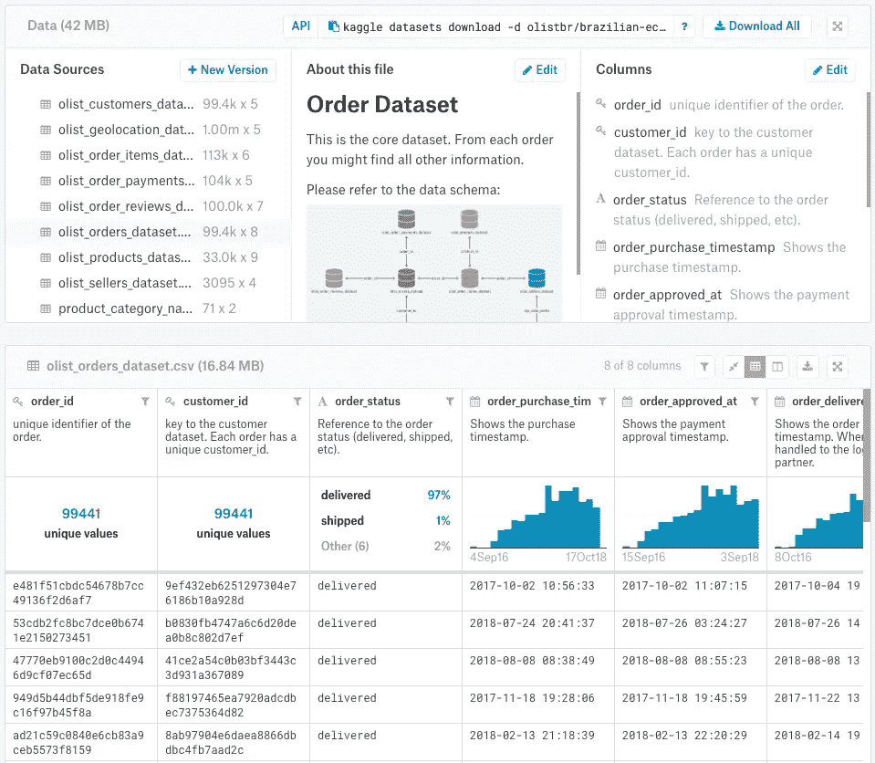
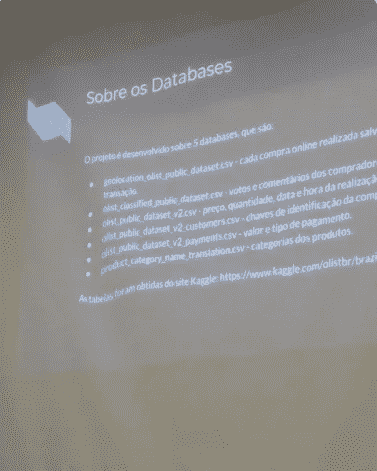
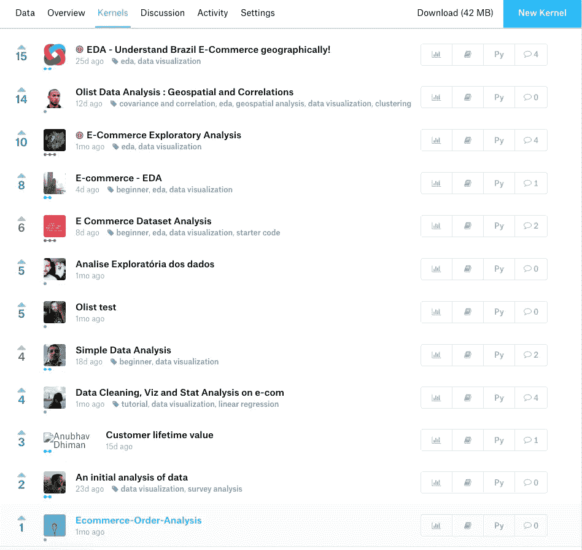
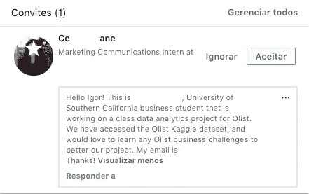

# 我们如何在 Kaggle 上发布一个成功的数据集

> 原文：<https://towardsdatascience.com/how-we-published-a-successful-dataset-on-kaggle-2945de537597?source=collection_archive---------13----------------------->

## 以及它如何帮助传播我们公司的数据成果

大约一年前，我第一次访问了 Kaggle 网站。我被吸引去解决一些基本的机器学习问题(比如[泰坦尼克号:灾难中的机器学习](https://www.kaggle.com/c/titanic))。我发现这也是一个研究其他人的数据集，以及分享你自己的数据的好地方。

那时我在一家大公司工作，公司有非常严格的规章制度。共享任何数据都是不可能的。但这个想法一直萦绕在我的脑海里。过了一段时间，我离开了那家大公司，开始在一家名为 [Olist](https://www.olist.com) 的中型初创公司工作。我们是巴西市场中最大的百货商店。我们的目录中有超过 20 万种产品，超过 4000 个卖家通过我们的平台销售他们的产品。

在那里，我们有足够的官僚作风来打消我发布数据集的想法。大约五个月前，我第一次在公司内部提出这个想法，但当时它还非常不成熟。提出了一些问题，例如:

*   我们应该发表什么？为什么？
*   有人会使用我们的数据吗？怎么会？
*   还有…如果任何竞争对手使用我们的数据怎么办？

在接下来的几个月里，这个想法不断发展，所有的问题都得到了解答。然后，经过一些开发过程，我们终于准备分享一些数据。大约两个月前我们在 Kaggle 上做过。本文的目的是解释我们是如何发布数据的，并在这个过程中为您提供指导。也许我们甚至鼓励你或你的公司也公布一些数据。

# 我们发表了什么？为什么？

我们决定发布一个包含订单及其客户评论的数据集。这将允许解决一些分类问题。我们的数据科学团队已经制作了一些模型来对评论进行分类，所以我们很想看看其他人会如何处理同样的问题。

为此，我们决定发布两个数据集:

*   约 4k 订单和评论的分类数据集(仅在[版本 5](https://www.kaggle.com/olistbr/brazilian-ecommerce/version/5) 或更低版本上)。
*   包含 10 万个订单的未分类数据集。

为什么是 100k？嗯……这是一个神奇的数字:比 Kaggle 上大多数公开的数据集都要大。大到足以提供深入的分析和不同的产品类别。

该数据集包含 2016 年至 2018 年巴西多个市场的订单信息。其功能允许从多个维度查看订单:从订单状态、价格、付款和货运表现到客户位置、产品属性，最后是客户撰写的评论。后来，我们还发布了一个地理定位数据集，将巴西邮政编码与纬度/液化天然气坐标联系起来。

> [点击此处查看数据集最新版本](https://www.kaggle.com/olistbr/brazilian-ecommerce/home)

Our data is publicly available at Kaggle.

## 我们分享了哪些数据？

首先，我们发布了一个真实的数据集。通过使用我们的数据，可以得出一些关于巴西电子商务的结论。我们希望全面了解我们的数据团队所面临的挑战。所以我们发布尽可能多的信息。我们唯一的限制是:

*   不发布我们的产品目录(如标题，描述和照片)
*   不发布任何客户信息
*   不发布任何合作伙伴信息

考虑到这一点，我们创建了一个包含 30 多个要素的数据集。它允许从多个角度探索订单，如订单履行、产品类别、地理位置、客户满意度，等等。下面我们展示数据是如何构成的。

Our data schema. Multiple tables to allow studying an order from multiple perspectives.

您可能会注意到，它反映了真实的情况，数据存储在多个表和源中。这种结构与 Kaggle 上发布的平均数据集截然不同。

数据集被很好地记录，所有的特征都被解释，并且给出了足够的上下文来让每个人理解数据。我们创建了一个讨论主题，鼓励人们提问，然后用一些非常基本的分析编写了一个入门内核。仅此而已。

## 我们为什么要发表它？

有几个原因促使我们最初公布这些数据。但现在我们做到了，我们有更多的理由。它们是:

1.  为数据社区贡献真实、高质量的数据。我们已经看到它被用于大学课堂。
2.  将 Olist 定位为巴西数据科学界的参考。发布数据集后，我们注意到其他公司向我们寻求指导。
3.  吸引优秀的候选人加入我们的团队。通过分享数据，更容易产生共鸣并解释我们所做的事情。我们已经联系了一些用公共内核分析我们数据的人。
4.  从别人的角度看一些问题。许多人贡献了公共内核，通过阅读它们，我们发现了解决我们正在处理的问题的不同方法。
5.  应试者。我们选择过程的第一步是数据集的[公开挑战。](https://github.com/olist/work-at-olist-data)
6.  用葡萄牙语文本填补公共数据库的不足。帮助巴西的 NLP 社区。
7.  它还帮助我们将公司定位为领域专家。公开这个数据集就像是一种证明:相信我们，我们知道自己在做什么。

# 它如何重新定义我们的成功指标？

我们用 Kaggle 上的其他公共数据集作为基准来定义什么是成功的。我们非常谦虚，起初，我们认为有了以下内容，我们就可以说该计划是成功的:

*   两个月内超过 50 次投票(我们有 200 次)
*   超过 500 次下载(我们有 3.4k)
*   超过 5000 次浏览(我们有 24k 次)
*   超过 5 个公共内核(我们有 21 个)

**Left:** our data being used at a college data science class in Natal/RN (photo by Tyrone Damasceno). **Right:** [Public kernels on Kaggle.](https://www.kaggle.com/olistbr/brazilian-ecommerce/kernels)

Our data being used at a UCS business class

这也回答了我们的第二个问题:我们的数据被利用了！

# 如果任何竞争对手使用我们的数据怎么办？

这是一个风险。但是如果他们真的想使用它，即使我们不公开数据，他们也会找到方法。我们的数据集合可能已经在我们出售的商店上公开了。一些例子是:

*   过去四个月的总销售额
*   过去 30 天的平均审核分数

除此之外，我们的整个目录在商店公开出售。只需要构建一个网络爬虫来获取这些数据。产品描述、价格、照片、运费和预计交货时间都可以在我们销售产品的市场上找到。

即使有人通过搜索商店获得了我们的目录数据库，我们也不会让任何人发现销售了哪种产品，您只需要一个匿名的 product_id。不可能将我们的数据集链接到任何产品目录。这些数据已经被匿名化，评论中提到的公司和合作伙伴已经被《权力的游戏》的大公司所取代。我们还以不允许他人对我们当前的业务规模做出任何结论的方式进行了抽样调查。已经采取了这些措施，没有其他理由保留这些数据。

# 我们做错了什么？

在第一个版本中，我们认为消除数据的复杂性会很好。所以我们试图在一个表中加入尽可能多的信息。随着时间的推移，用户开始要求新的功能，如客户、产品和卖家 id。我们还决定添加更多我们认为重要的功能。

我们保留了原始的数据结构(一个主表),并添加了带有附加信息的其他表。很快我们就增加了许多新功能。整个数据集越来越难看:组合键，没有任何约定的名字和其他乱七八糟的东西。

我们决定在版本 6 中解决这个问题。我们将整个数据集拆分到不同的表中，每个表包含订单的一个方面。现在数据集看起来比以前更复杂，但数据之间的关系更清晰。

如果我们可以在这个问题上给出任何建议，那就是从支持增长和添加更多功能的数据结构开始考虑。因为你的数据用户肯定会要求的。

# 一句鼓励的话

我们希望看到更多像我们这样的数据集公开发布。到目前为止，我们只有分享数据的好处，似乎不会有任何缺点。

现在我们已经在考虑 ta 将要公开的下一个数据。你呢？有没有你想分享的数据？

如果您有任何问题或疑虑，请联系我们。