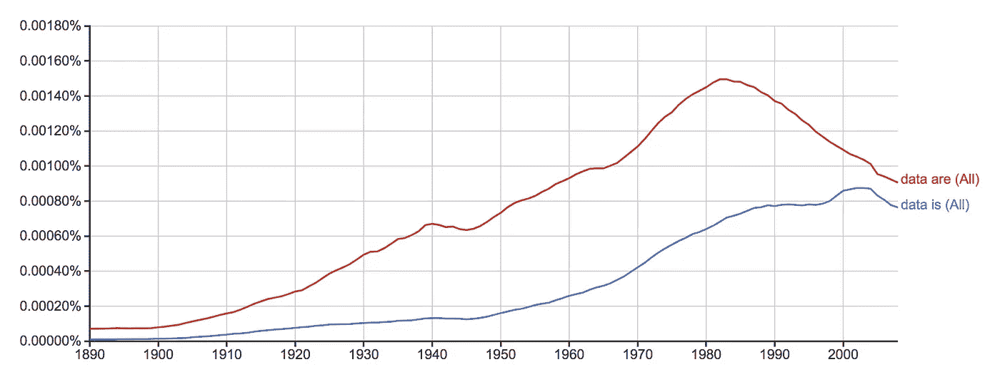

# 我们使用“数据”这个词的方式已经变了，这很危险。

> 原文：<https://towardsdatascience.com/how-we-use-the-word-data-has-changed-and-it-s-dangerous-b7b6278a8e09?source=collection_archive---------5----------------------->

几年前，我正在为即将召开的石油和天然气会议撰写一篇技术论文。经过几周的写作会议，我将论文提交给了内部同行评审。评论通常是相当正面的，一位令人愉快的英国人指出，这篇论文“写得非常好”。就像大多数好事情一样，在自我表扬之后，现在，几年过去了，我已经忘记了这篇论文的大部分细节。然而，有一件神器一直牢牢地盘踞在我的脑海里；奇怪的是，这与论文本身无关，而是同一位先生在同行评议过程中提供的评论。我清楚地记得他在草稿手稿上手写的潦草字迹:

*“错了！应该是这些数据是——不是这个数据是！”。*

如果你已经到了一定的年龄，或者在科学领域工作过，你可能会很容易发现我的同行评审员在我错误地使用复数单词“*数据”时发现的错误。*但是，一个小小的语法错误可能会被原谅，实际上可能是一个现代文化现象的微观例子:我们似乎不再知道数据和信息之间的区别，这是危险的。

什么是“数据”，这个词从何而来？无需深究晦涩的词源细节，单词“data”是拉丁语单词“datum”的复数形式，意思是“给定的事物”。它进一步来源于拉丁语动词“dare”，意思是“给予”。*本质上，数据是多个观察值；数据是给定的东西。*快进到今天，“数据”这个词已经发生了变化，通常被认为是一个复数名词，类似于“雨”或“沙”。由于单独提及雷雨时的每一滴雨水或海滩上的每一粒沙子会很尴尬，所以我们一起提及它们，即“我的鞋子里有很多沙子”，而不是“我的鞋子里有非常多但数量有限的单个沙粒”。尴尬。

在语言学界，关于哪个定义是正确的争论仍在继续。事实上，什么是这个词的正确用法甚至已经在主流媒体上公布，包括《卫报》的这篇文章和讨论流行数据科学网站 FiveThirtyEight 进行的非正式在线投票结果的文章。

不管 logophiles 的感受如何，毫无疑问，在方言中，像“你的数据是错误的”或“数据是 _ _ _ _ _ _ _ _ _ _”这样的话已经变得完全可以接受。更有趣的是，我们可以检查过去大约 100 年的谷歌 N-gram 趋势，并比较这一时期短语“数据是”与“数据是”在书中的流行程度。从下图中可以看出，在这段时间的大部分时间里,“data are”的使用量明显大于其单数对应词“data is ”(这些趋势也适用于其他单/复数修饰语，如 was/was、this/these 等)。).

Google N-Gram Trends — “data are” vs. “data is” (1890–2008)

然而，在 20 世纪 40 年代后期，单数形式的流行开始迅速增加。伴随着这一现象，在 20 世纪 80 年代早期，我们看到复数形式的使用急剧下降。这些趋势一直持续到 2000 年代初,“数据”一词的单数和复数用法几乎达到了对等。粗略的谷歌搜索趋势分析显示，自 2004 年以来，使用单数形式的搜索词的受欢迎程度远远超过了包含复数形式的搜索。不管是好是坏，复数和单数已经成为同义词。数据简单来说*就是。*

虽然看似细微的语义争论，这个词用法的演变揭示了现代社会的一些有趣的事情。具体来说，自从数字时代开始以来，数据*已经成为自身的一个实体，而不是历史定义所暗示的观察结果的集合。计算机的出现已经把“数据”变成了雪的数字等价物——本质上是不可计数的，并且更容易集中引用。这不是德里达启发的解释性语言游戏。相反，这个词从复数形式到单数形式的演变表明，数据的概念已经发生了变化，对我们如何相互交流产生了具体的影响。数据*不再是给定的东西，也就是说，我们对世界的观察。现在，数据*是*一个单一的实体，充满了某种前所未有的媒介和力量:信息的力量。**

数据和信息有着千丝万缕的联系，但并不等同。很少有人比克劳德·香农更能理解这种微妙之处。虽然香农并不是一个家喻户晓的名字，但他在 1948 年发表的开创性论文《交流的数学理论》为一大批现代数字技术奠定了理论框架。在这篇信息论领域的开创性论文中，Shannon 根据数据变化的概率，即观察到个体观测值之间的一些差异的可能性，给出了信息的精确数学定义。抛开数学定义不谈，著名的人类学家格雷戈里·贝特森(部分是因为他与另一位著名的人类学家玛格丽特·米德的婚姻而出名)提出了也许是香农定量定义最简洁的定性体现:*“信息是一种差异，这种差异产生了差异”。*从根本上来说，信息是对我们周围世界的上下文观察(即数据)进行比较处理的结果。

撇开抽象定义不谈，为什么将数据的概念与信息的概念混为一谈如此危险？想象数据(复数意义)是暴风雪中的一片雪花。雪看起来很美，但当我们把它聚集在一起时，它变得更有趣。我们可以煞费苦心地精确地将雪堆积成一个个独立的砖块，然后一个个垒起来。经过足够仔细的思考，我们可以建造漂亮的圆顶冰屋。从微小的个体事物，我们可以创造出*结构。*

或者，我们可以放弃这种精确性，匆匆忙忙地把雪打包成小球，这样就非常方便互相投掷了。或者更糟，接受别人准备的过冬弹药，而不考虑我们的供应商的意图。这似乎很快成为默认的工作方式。在任何重大事件后，快速浏览脸书，我们总是发现我们的朋友已经成为社会科学专家，引用令人作呕的研究和统计数据；也许我们曾经因为自己成为那些“专家”之一而感到内疚。打雪仗在过去的冬天可能很有趣，但以这种方式使用数据从根本上来说是具有破坏性的*。*

在人类历史上，从来没有以如此低的成本获得如此多的数据和信息。然而，数据洪流导致从噪音中提取相关信息极其困难。随后，数据和信息之间的界限变得模糊到被遗忘的程度。除了更新我们的生物硬件来应对洪水，接下来的问题是，我们能做些什么？

如果所有的语义看起来都很迂腐，你可能是正确的——但话说回来，魔鬼不总是在细节中吗？这不仅仅是文字。虽然词源分析和历史可能会说明我们目前的状况，但语法再教育运动肯定不是根本问题的答案。在我看来，有四点是对这种情况的任何补救措施的必要组成部分:

**①对教育的热爱和不懈追求。**

**(2)对被误导的人表现出同情，并坚定地捍卫言论自由(不管我们会觉得某人的观点多么应受谴责)。**

**(3)相信客观真理确实存在，而且值得去寻找。**

(4)认识到有限使我们无法了解一切。充其量，我们是真理的容器，而不是真理的化身。

总之，要真正解决这个问题，我们必须学会理解数据和信息之间的微妙差异——实际上，这相当于我们对世界的观察以及随后我们从中得出的结论——并认识到这是个人义不容辞的责任，要理解什么构成了“造成差异的差异”。作为宇宙中唯一有意识的观察者，我们的独特角色赋予我们一种永恒的责任，那就是守护我们自己的思想。我们继续无视这些微妙之处，后果自负。