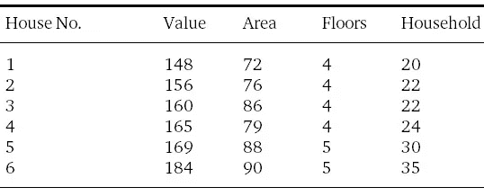
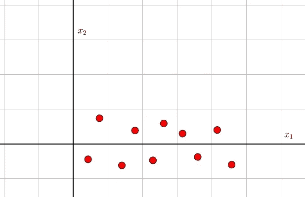
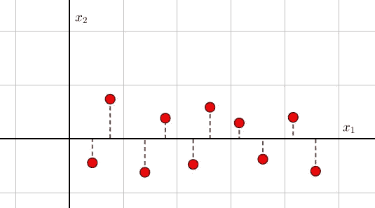
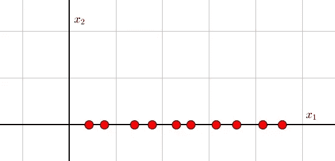
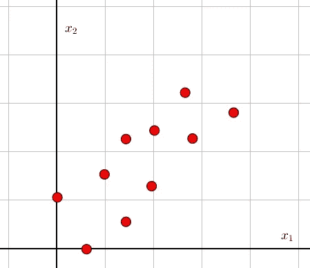
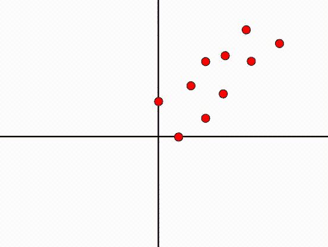

# 假人的降维第 1 部分:直觉

> 原文：<https://towardsdatascience.com/https-medium-com-abdullatif-h-dimensionality-reduction-for-dummies-part-1-a8c9ec7b7e79?source=collection_archive---------2----------------------->

人类是视觉生物。我们需要亲眼目睹才能相信。当你有一个超过三维的数据集时，我们的眼睛就不可能看到发生了什么。但是谁说这些额外的维度是*真的*必要的呢？有没有办法把它减少到一维、二维或三维？原来是有的。

主成分分析(PCA)就是这样一种技术。简单又优雅。可惜，简单并不意味着容易看透，真正明白是怎么回事。如果你以前读过它，你可能会遇到一个完全数学化和抽象的处理，但对它的意义没有直觉。或者它可能被解释为“外行风格”，没有数学依据。或者两者都有一点，中间有一个概念上的空白，没有把直觉和严谨联系起来。我会尽量避免这种情况。

降维的主要目的是:**找到数据的低维表示，尽可能多地保留信息。这是一个相当大胆的说法。让我们看看这是什么意思。**

# 摆脱不必要的东西

假设我们有以下某个地区的房价数据集，单位为千美元:

Dataset with 4 features per item

该数据集有 4 个特征(4 个维度),不可能作为一个整体进行图形可视化。但是，如果您仔细研究这些特性之间以及它们之间的关系，您会发现并非所有的特性都同等重要。

例如，你能通过楼层数来描述每栋房子的特征吗？楼层数**有助于区分**不同的房子吗？似乎不是，因为它们**几乎等于**，也就是说它们有**低方差**，即σ = 0.2、和因此不是很有帮助。家庭呢？变化不大，但其方差肯定大于楼层数(σ = 28)，因此**更**有用。现在，对于最后两个特征，面积(σ = 43)和值(σ = 127)，它们变化更大，因此比我们的其他两个数据更具代表性。

但是我们可以做一些事情来最大限度地充分利用每个特性，而不会牺牲太多的准确性。到目前为止，我们已经分别研究了每个特性。他们彼此之间的关系如何？如果你仔细观察前两个特征，值和面积，你会注意到值大约是面积的两倍。这非常有用，因为我们现在可以从一个特征推断出另一个特征，而且只需要一个而不是两个。这个性质叫做**协方差**。协方差越高，两个特征的相关性越强，这意味着数据中存在冗余，因为我们可以从一个特征推断出另一个特征，所以信息比需要的多。

从前面的讨论可以明显看出:

*   拥有*高方差*的特性*是件好事*，因为它们会提供更多信息，也更重要。
*   具有高度相关的特征是一件坏事，因为它们可以在信息损失很少的情况下从另一个特征中推断出来，因此将它们放在一起是多余的。

这正是 PCA 所做的。它试图找到数据的另一种表示法(另一组要素)，以使该表示法中的要素具有最高的可能方差和最低的可能协方差。但是现在这应该说不通，直到我们亲眼看到…

# 给我看看魔法

在接受 PCA 采访时，我问了她以下问题:“你的完美数据集是什么样的？”她给我看了这个:

这是有意义的——数据本质上可以被简化为一行。观察:与 *x* 2 方向相比，沿*x*1 方向的变化非常大，这意味着我们可以安全地丢弃 *x* 2 特征而不会造成太大损害(通过说“沿 *x* 1 方向的变化”，我指的是第一个特征的变化，因为我们选择用 *x* 1 轴来表示它，对于 *x 【T29 也是如此)而且， *x* 1 似乎根本不依赖于 *x* 2，它只是继续增加，与 *x* 2 的值无关，这暗示着相对*低协方差*。至于为什么这对 PCA 来说是完美的，原因很简单，因为她需要做的就是:*

Projecting the dataset on the x1 axis.

After projection, the data only has one dimension.

了解发生了什么至关重要。因为 *x* 1 比 *x* 2 重要得多(根据前面说的两个标准)，我们决定只保留 *x* 1，通过**将**数据点投影到它的轴上，这相当于只保留了点的*x*1-坐标，这也相当于去掉了“不重要”的特征 *x* 2。现在我们有了 1D 的数据集，而不是 2D！

这实质上是**维度缩减:**寻找数据的最佳低维表示。当然，会有一些误差，因为我们忽略了第二个特征，它由上面的虚线表示。但是这种误差被保持在最小，因为数据几乎位于一条线上，并且这是我们利用给定的信息实际上能做的最好的事情(稍后将详细介绍)。

# 事情变得复杂了

“那么，你不那么完美的数据集呢？长得怎么样？”我问过 PCA。她毫不犹豫地说:“我真的不相信有这种事，你知道。每个人都是完美的，你只需要换个角度。来，看看这个。”

“不像以前那么容易了，你不觉得吗？没有。”她歪着头说。

“这实际上是我之前向您展示的同一个‘完美’数据集，只是旋转了 45 度。我们所要做的就是旋转我们自己的轴以与数据集对齐，并像以前一样继续:投影到*新 x* 1 轴上，并省略*新 x* 2 轴”

停下来思考一下这一意想不到的事件变化是至关重要的。就像工程师通常做的那样，主成分分析将没有“对齐”的数据集的不太完美的问题简化为容易解决的完美的“对齐”问题。

这是怎么发生的？本质上，PCA 试图找到另一组轴，使得沿该轴的方差尽可能大。当我说“沿 *x* 1 轴的方差”时，我指的是特征 *x* 1 的方差。但是旋转了我们的轴之后，轴就失去了意义——它们不再代表 *x* 1 或者 *x* 2。相反，它们代表了两者的线性组合。要了解如何操作，请注意上面的新 *x* 1 和 *x* 2 轴可以通过对旧轴执行[旋转变换](https://en.wikipedia.org/wiki/Rotation_matrix)来获得，获得:

这两个新方向， *z* 1 和 *z* 2，是数据集的**主成分**。第一主成分*， *z* 1 是方差最大的一个，因此也是最重要的一个，携带最多的信息，从某种意义上说，数据*依赖于它。第一主分量方向上的变化现在被解释为新的合成特征 *z* 1 的变化。至于*第二主成分*， *z* 2，它只是方差第二大的一个主成分垂直于第一主成分。**

*顾名思义，主成分分析就是寻找这些主成分，以便我们可以利用前几个方差最大的主成分来表示我们的数据，就像我们将完美的数据集投影到一条直线上时所做的那样。*

*很容易看出这如何能推广到二维以上。我们不是投影到线中，而是投影到平面中，我们完美的 3D 数据集现在大约位于*一个平面上(或者，更好的是，一条线):**

**

# *神奇的线条以及在哪里可以找到它们*

*现在真正的问题来了:如何找到这些主要成分？*

*我将把这个问题留给下一部分，在那里我们将开发那个主公式:*

**

*Singular Value Decomposition*

*在这个过程中，我们将发现如何将我们在这里发展的定性直觉转化为适用于所有维度的优雅的数学结构的深刻见解。*