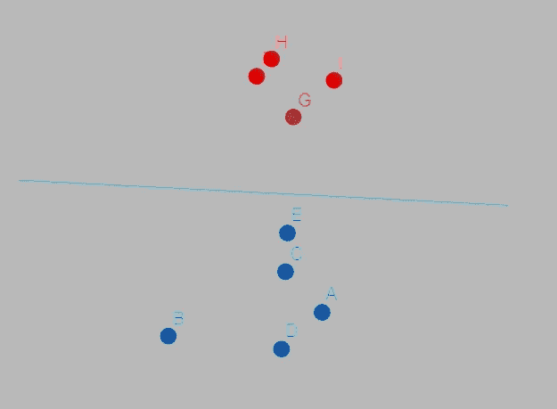
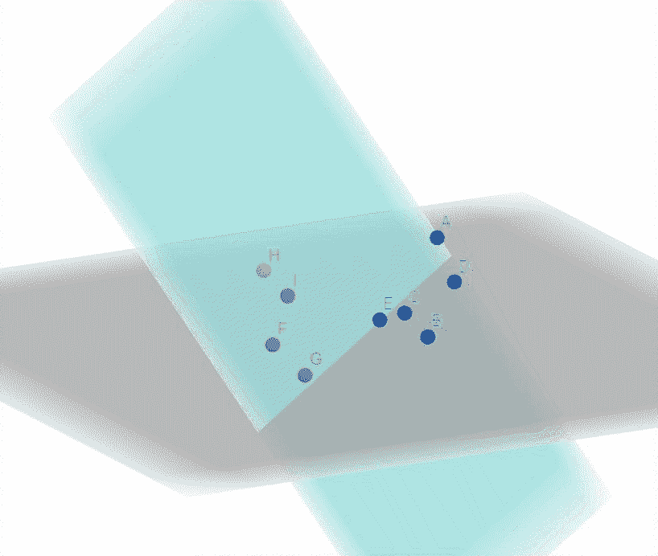
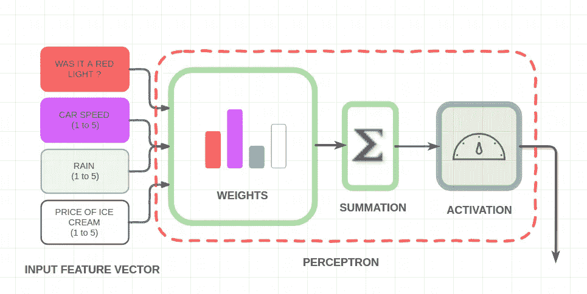
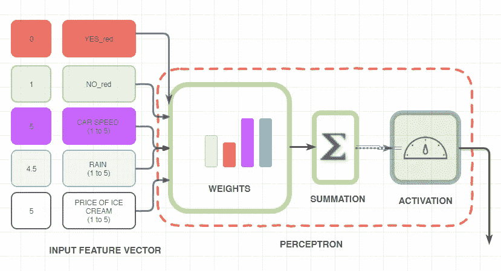
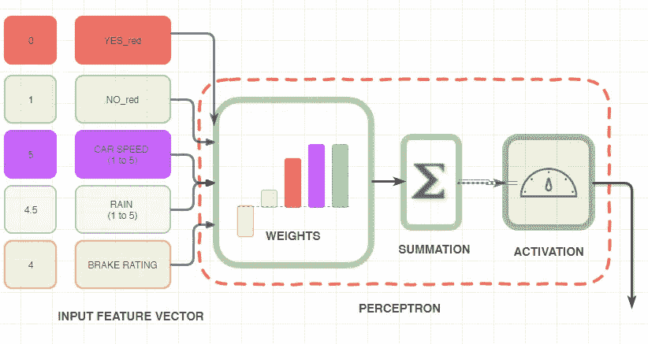
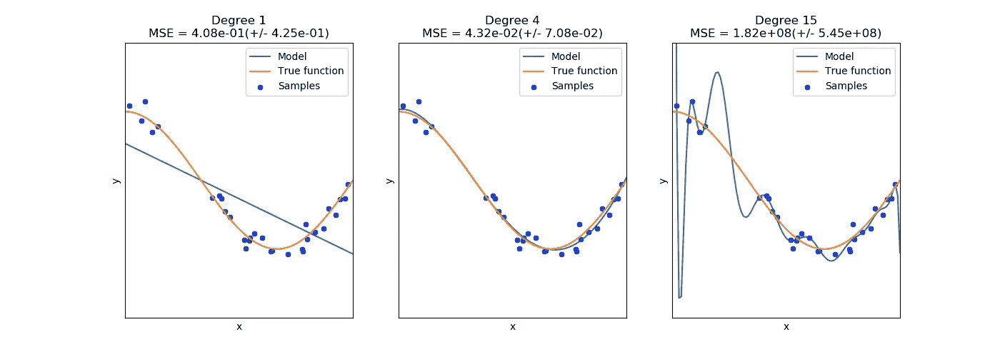

# 机器学习入门:几乎没有数学—第 2 部分:感知器

> 原文：<https://towardsdatascience.com/https-medium-com-atharvaj-a-machine-learning-primer-almost-without-the-math-part-2-perceptron-33145c6df067?source=collection_archive---------10----------------------->

在[上一篇文章](/a-machine-learning-primer-almost-without-the-math-part-1-19ed04e352c0)中，我们让自己熟悉了机器学习中的基本术语。在下面的文章中，我们将学习一些机器学习算法，首先是感知器。我还将介绍更多的概念，当它们开始发挥作用时。

# 感知器

感知器是一种受人类神经元启发的构造。它有一组输入通道、一个细胞体和一个细胞输出。感知器是一个二元线性分类器。它只能产生线性决策边界。

让我们试着一个一个来看术语 **:**

*   **线性分类器:**任何可以对线性可分数据进行分类的分类器，即可以通过线性判定边界进行分离的数据。

Decision boundary in 2 dimensions.

*   **决策边界:**决策边界是一个假想的边界，可以分隔不同类别的数据点。
*   **线性判定边界**:在 2 维中(对于 2 个特征)，它是一条直线，在 3 维中(对于 3 个特征)，它是一个平面。很难想象 3 维以上的超平面。对于给定的数据集，可能有一个以上的决策边界。

Decision boundary in 3 dimensions.

我们将试图理解作为分类器的感知器的结构和工作原理。

考虑这样一种情况，我们想要预测在给定的十字路口是否会发生事故。我们从交通部门获得了关于在给定的**交叉路口**过去事故的数据。

每个例子都有一些特征，包括车速、雨的强度、红灯是否亮着，以及出于某种奇怪的原因，那个地区的冰淇淋价格。

下面是一个简单感知器的架构:

*   **权值:**权值是感知器的型号 [***参数***](/a-machine-learning-primer-almost-without-the-math-part-1-19ed04e352c0) 。它们代表了与每个特性相关的重要性。通常，当模型被初始化用于训练时，这些是随机化的。
*   **求和:**所有特征值加权求和的结果。
*   **激活函数:**一个数学函数，帮助理解从求和(或任何先前的一组运算)中获得的单个值。例如，如果求和后的最终值大于 0.3，则该模型将预测事故。对于下面的示例**，我们将阈值设置为 0.3。**

**如果激活函数值>为 0.3，则事故发生**

# 训练感知器

当输入数据被输入到模型中时，根据权重对其进行加权、求和并通过激活函数，激活函数根据阈值给出输出。

让我们将第一个数据点传入感知器。最初，权重值是随机的(或者可以设置为任何指定值)。为了便于理解，我们将假设所有数字数据都在 1 到 5 的相似范围内:

RANDOM WEIGHTS TO START WITH

在上图中，模型对汽车速度给予了更多的权重，其次是冰淇淋价格，然后是红灯，然后是雨。

由于冰淇淋价格被赋予了更大的权重，并且它在我们的输入中的值很高，因此该模型将主要基于冰淇淋价格进行预测。

让我们假设该模型基于给定的输入给出了 0.5 的输出值。给定我们的阈值 0.3，模型将预测导致事故的输入。

**(输入*权重)之和= 0.5**

**激活阈值= 0.3**

**0.5 > 0.3，因此会发生事故。**

但是从输入标签上，我们知道它不会造成事故。在产生的值中存在 0.2 的误差，并且该信息需要被反向传播到模型中，以便它可以更好地执行。

## 反向传播

在这个过程中，预测中的任何错误都被发送回模型，以便它可以更新其权重，从而在看到的下一个样本中做出更好的预测。有不同的方法可以在权重之间分配误差，其中一种常见的方法称为随机梯度下降。这些方法被称为**优化算法。**

遵循优化算法，模型现在更新与冰淇淋价格相关的权重。

WEIGHT OF ICE CREAM PRICE DECREASES

当看到越来越多的例子时，它最终赋予冰淇淋价格 0 的权重，从而意识到这个特征在决定情况的结果中不起作用。

WEIGHT FOR ICE CREAM PRICE ULTIMATELY REDUCES TO 0

模型没有必要只从输出为“是”的例子中学习。可能会有这样的情况，当冰淇淋价格低时，模型预测为否，而当冰淇淋价格高时，模型预测为是。在这种情况下，模型也将通过增加冰淇淋价格的权重来学习。

在这一切发生的同时，与其他特征相关联的权重也在同步更新。因此，如果误差为 0.2，并非所有权重都会更新 0.2，而是根据权重对结果的影响程度，由所有权重共享 0.2。为了简洁起见，上面的例子只显示了一次更新一个权重。

类似于去掉一个特征，如上所述，模型也能理解哪些特征应该被赋予更大的权重。对于汽车速度高和/或雨水多的情况，随着看到越来越多的例子，模型将慢慢赋予这些权重更多的值。

WEIGHT FOR RAIN INCREASED

对于具有数值的特征来说，所有这些都没问题，但是对于具有“是”或“否”等值的分类特征来说，情况又如何呢？嗯，我们把它们转换成数字形式！

## 虚拟变量/一个热编码

虚拟变量实际上是虚拟变量，用来代替分类变量。单个分类变量被分成与类别数量一样多的虚拟变量。

因为红灯可以有两个值，是和不是，所以有一个虚拟变量，假设是。因此，如果值为 YES，虚拟变量的值将为 1，否则为 0。

DUMMY VARIABLES FOR 2 CATEGORIES

**是/否将变成 YES_dummy = 0 或 1，NO_dummy = 0 或 1。如果 YES_dummy = 0，NO_dummy = 1，则类别为 NO.**

如果有三个值，是，否和也许，那么我们可以用两个虚拟变量来表示它们。如果我们仍然在虚拟世界中保留是和不是，那么我们可以忽略也许。可以对任意数量的值进行类似的操作。

DUMMY VARIABLES FOR MORE THAN 2 CATEGORIES

**YES /NO /MAYBE 将变成 YES_dummy / NO_dummy，每个值为 1 或 0。**

**如果 YES_dummy 的值为 1，那么是。如果 NO_dummy 的值为 1，则 NO.**

**如果 YES_dummy 和 NO_dummy 都为 0，则值必须为 MAYBE。**

因此，当前类别的值为 1，其余都为 0。

在我们的示例中，我们将分类特征转换为两个虚拟变量，YES_red、NO_red，每个变量的值为 0 或 1。

CONVERTING INTO DUMMY VARIABLES

正如您可能已经想到的那样，将分类变量转换为数字变量的过程甚至需要在训练开始之前或构建模型之前完成，以便权重和输入的数量是适当的。

现在，在查看了许多例子之后，这个模型得出了以下权重:

TRAINED MODEL

看重量 we，或者模型，可以说车速高，下大雨，车在红灯的时候，发生事故的几率更大。也许在这种情况下汽车不会那么容易抛锚，谁知道呢？！

没有必要所有的权重都是正的。有些要素的高值会对结果产生负面影响。假设有一个新的功能制动等级，制动等级越高，汽车在潮湿条件下的制动性能越好。

WEIGHTS CAN BE NEGATIVE AS WELL

有些例子可能会误导模型。像是下了高雨高速却没出事的情况。这被认为是数据中的异常值，在训练时应该会遇到。这就是为什么在该算法中更多的训练数据会产生更好的结果，因为模型将会看到更多的数据来进行推断，并且可以防止过度拟合离群值，从而更好地进行概括。

## 过度拟合

过度拟合不好！这是模型学习预测几乎所有定型示例的情况，即使它们是异常值。如果它学会正确预测所有的例子，那有多糟糕？如前所述，它学习预测所有的“训练”例子。我们为它创建一个 ML 模型，用于新的例子，而不是训练数据。训练数据不代表所有可能数据的一般分布。当模型过度拟合时，它可以很好地预测所有的训练样本，但不能正确预测任何其他测试样本；正是为其创建模型的任务。

正如我们在[之前的帖子](/a-machine-learning-primer-almost-without-the-math-part-1-19ed04e352c0)中看到的，并非数据集中的所有点都位于训练好的模型上，可能有一些点靠近线但不在线上。在过拟合的情况下，直线会通过几乎所有的点，从而失去泛化能力。

## 欠拟合

不合身也不好。这是模型无法“适应”数据集的情况。换句话说，该模型未能从提供的数据中获得足够的信息。

这张来自 scikit-learn 网站的图说明了过度拟合和欠拟合会发生什么:

OVERFITTING AND UNDERFITTING (Scikit-Learn)

理解是什么导致了过度适应和欠适应是很重要的，但是我将在以后的其他文章中讨论这个问题。

# **测试模型**

正如在上一篇文章中所讨论的，我们假设测试数据将来自与训练数据相同的分布。根据在美国获得的历史数据，这个模型很难对英国的事故做出预测。

## 训练数据和测试数据

从手头的数据来看，我们将它按一定的比例分割，这样大部分数据可用于训练，大约 70%和 30%。我们不在我们拥有的全部数据上训练，因为我们需要一些数据来测试模型的效率。由于测试数据需要来自同一个分布，最好从我们拥有的数据中进行分割。如果在训练阶段将测试数据暴露给模型，它可能会在那里学习一些示例，并总是正确地预测它们，从而挫败了泛化的预期目标。重要的是要确保模型不能访问测试数据，除非它已经过令人满意的训练。

现在，当我们的模型已经学习了与所有特征相关的权重时，我们可以传入新的样本，我们不知道的标签，并让我们的模型正确地预测它们！

以下是我们在本文中涉及的一些概念的列表:

*   感知器
*   线性分类器
*   判别边界
*   砝码
*   激活功能
*   感知器的训练
*   反向传播
*   虚拟变量/一个热编码
*   过度装配和装配不足
*   培训和测试数据

同样，这里涵盖的概念是淡化的版本。维基百科上关于[感知器](https://en.wikipedia.org/wiki/Perceptron)的文章很好地介绍了相关的数学和其他一些复杂的概念。我将推荐吴恩达在 Coursera 上的[机器学习课程，以及](https://www.coursera.org/learn/machine-learning)[深度学习课程](https://www.coursera.org/specializations/deep-learning)，对这些主题进行深入的数学展望。