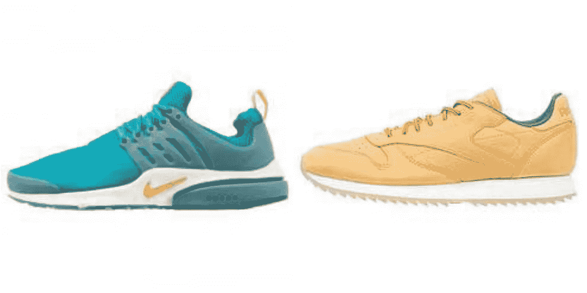
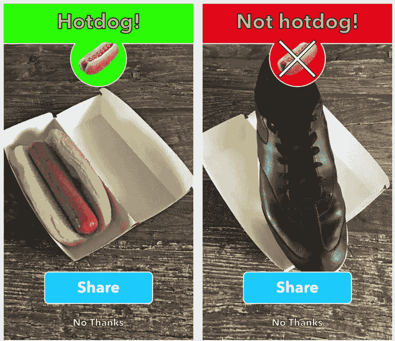
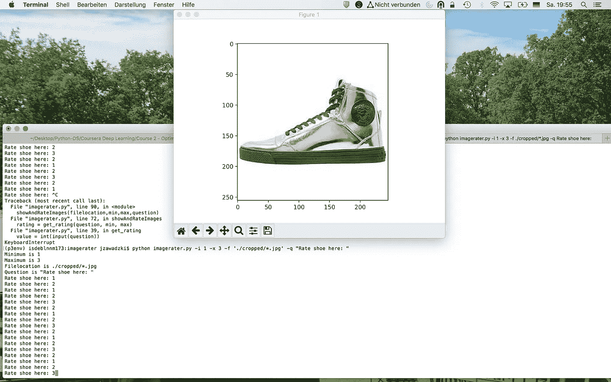
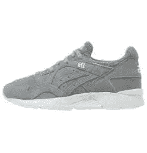
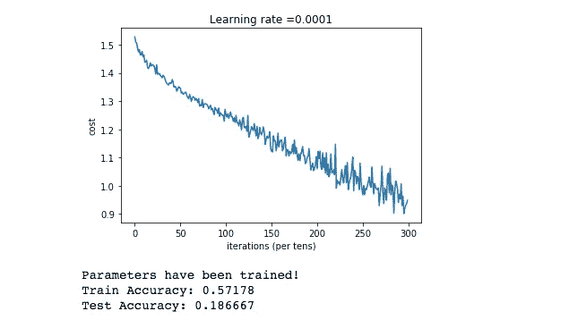
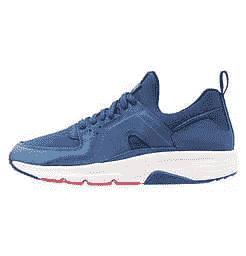

# 甜还是骗？完成吴恩达的第二个课程后，建立一个运动鞋评分者

> 原文：<https://towardsdatascience.com/https-medium-com-janzawadzki-sweet-or-cheat-build-a-sneaker-rater-after-finishing-andrew-ngs-2nd-course-49475fc75429?source=collection_archive---------5----------------------->

## 你尝过 tensorflow，现在你想要更多。创建您自己的图像分类器来评价运动鞋，并将其应用于吴恩达的第二课程 tensorflow 网。



Hotter than the sun or cooler than the north pole? Let’s find out.

You[bing](https://medium.com/machine-learning-world/netflix-or-coursera-how-to-finish-andrew-ngs-1st-deep-learning-course-in-7-days-6fa293ee83d8)吴恩达深度学习专业化的第一期课程，应用你的所学，完成了 deeplearning.ai 的第二期课程，你用 tensorflow 实现了你的第一个神经网络，并见证了它创造的奇迹。现在，您很想看看自己能否创建一个图像分类器。

我们将一起从零开始创造一个男式运动鞋评级机构。这篇文章向你展示了如何将运动鞋图片抓取、评级和摄取到你刚刚完成的 tensorflow 网络中。我们依靠首席执行官和[snkrgks.com](https://snkrgks.com/blog/en/sneakerblog-en/)蒂姆·瓦尔兹的创始人的天真无邪的品味来评价大约 1400 双运动鞋的吸引力。

这里描述的过程可以用来创建任何类型的图像分类器。要不要给车打分？衣服？行星？你需要的只是一个想法，按照这些步骤收集和标记数据，并应用深度学习。

该代码可在 [github repo](https://github.com/jaza10/AppliedTensorflowSneakerRater) 上找到。让我们踢它。

# 收集数据

任何机器学习算法最重要和最有价值的成分是它的数据。我们需要大约 1400 张图像来训练我们的神经网络，就像吴恩达的手指例子一样。你可以随意使用和标注更多。我决定借助简单而高效的 Python [ImageScraper](https://github.com/sananth12/ImageScraper) 库从一个流行的时尚网站上抓取图片。

安装图库并访问包含您的图像的网站。执行以下命令:

```
image-scraper 'https://www.fashionsite.com/mens-sneakers/'
```

该工具将自动从网站下载所有图片，并将其保存在一个单独的文件夹中。请注意，您可能需要增加页码，以便不仅从第一页抓取图像。从第二页抓取图像的命令如下所示:

```
image-scraper 'https://www.fashionsite.com/mens-sneakers/?p=2'
```


Example of a scraped sneaker image

请注意，抓取图片并不一定适合每个网站。因为我们只是将这些数据用于我们的私人项目，所以应该没问题。但是您也可以创建一个 API 调用并以这种方式收集数据。易贝的友好的人们提供了一个记录良好的 API 来收集他们的库存信息。

遍历页面后，您应该已经收集了足够多的图像。恭喜你，你已经完成了图像分类器的基础工作！该喝点咖啡了，然后继续。


# 将图像裁剪为相同大小

现在您已经收集了足够的数据，您必须将图像裁剪为标准大小，以便您的网络可以处理输入大小。幸运的是， [ImageMagick](https://www.imagemagick.org/script/index.php) 为我们提供了所需的所有工具。

首先，试着找出最适合你的图片的尺寸。尝试使用 2 的不同指数作为窗口框架，例如 128x128、256x256 等，并添加 x 和 y 偏移以捕捉图像，同时裁剪掉不必要的像素。执行以下命令:

```
convert -crop 256x256+1+50 pic_to_be_cropped.jpg cropped_pic_name.jpg
```

为了理解{ Width } X { Height }+{ X _ Offset }+{ Y _ Offset }命令，我发现[这篇文章](https://deparkes.co.uk/2015/04/30/batch-crop-images-with-imagemagick/)很有帮助。一旦你确定了最佳图像尺寸，批量裁剪文件夹中的所有图像。

```
mogrify -crop 256x256+0+50 -path ./cropped/ *.jpg
```

该命令将裁剪当前路径中的所有图像。jpg 扩展名，并将图像保存在新创建的名为“cropped”的文件夹中。

在你去除了不必要的信息并标准化了你的图片尺寸后，我们将进入有趣的部分——给你的图片加标签。



Hotdog or not hotdog? Time to label images. image credit: [https://www.theverge.com/tldr/2017/5/14/15639784/hbo-silicon-valley-not-hotdog-app-download](https://www.theverge.com/tldr/2017/5/14/15639784/hbo-silicon-valley-not-hotdog-app-download)

# 标签图像

你收集了大量的图片。现在，您需要一种简单易行的方法来给这些图像评级。

由于找不到符合我们需求的库，我自己创建了一个 Python 模块。该工具允许您设置评级范围，例如从 1 到 5，并读取文件夹中带有裁剪图像的每个文件。我正在把这个库上传到 PyPi，这样你最终可以 pip 安装它。现在，你可以查看下面的代码，或者从 [github](https://github.com/jaza10/AppliedTensorflowSneakerRater/blob/master/imagerater.py) 获取脚本。

将文件保存在与裁剪图像数据集相同的文件夹中。导航到您的文件夹结构，并执行以下命令行:

```
python imagerater.py -i 1 -x 5-f ‘./cropped/*.jpg' -q “Rate shoe here: “
```

该命令执行 imagerater 脚本，在 1 到 5 之间设置等级，读取所有。jpg 图像，并将输入提示定义为“Rate shoe here:”。



Executing the imagerater script displays an image and allows you to rate it.

该库将您的图像展平、标准化并保存在一个 m x n 矩阵中，m 是您的图像数量，n 是您的图像展平后的大小加上指定的评级。

# 给你的图片打分的技巧


Timm is locked in rating sneakers.

Timm 是运动鞋专家，根据预定义的标准应用严格的分级，以确保同质评级。我们建议您也这样做。如果你在评价图像时不坚持一种模式，没有神经网络能够从随机标记的数据中归纳出规律。

Timm 在审查运动鞋方面很有经验，之前已经收到和评估了数百次踢腿。查看他关于粉丝最爱的 [overkill x hummel 马拉松](https://snkrgks.com/blog/en/release-recap-overkill-x-hummel-marathona-en/)发布的文章。在评价运动鞋时，Timm 遵循明确的模式，并专注于鞋的形式、材料、颜色和缓冲。他倾向于不顾鞋子品牌而客观地评判每一双运动鞋。

他更喜欢简单而优雅的低帮鞋，得体的颜色(没有不必要的亮色)，高质量的材料和顶级的缓冲，以获得最佳的舒适度。关于运动鞋的背景信息，比如围绕 Yeezy Boost 的人为炒作，不包括在这篇评论中，因为一个网络通常无法找出围绕一双鞋的公关努力。



Prime example of a 5 star rating

恭喜你，你刚刚完成了最复杂最耗时的任务！现在有趣的来了，让我们应用吴恩达的 tensorflow 网上的数据。

# 应用神经网络

从 Coursera hub 下载 Coursera 课程 2“tensor flow 教程”笔记本和“tf_utils”文件。执行所有方法并将保存的图像数据加载到您的笔记本中。

现在，让我们调整吴恩达的代码，以适应我们的训练数据。采取以下三个步骤:

1.  随机洗牌，把你的训练数据分成 X 和 Y 变量。
2.  One_hot_encode 你的 Y 变量。将 Y dtype 调整为 int，tf_utils 不能处理 float。如果您遇到 one_hot_encoding 的问题，请尝试增加目标类的大小。有时，训练数据中会出现一个非故意的零分。
3.  将 W1 中的第一个输入图层大小更改为与展平数据相匹配。在我们的 246x256 像素图像中，我将第一个维度从 12228 更改为 188928。还要更改 W3 和 b3 中的输出变量，以匹配类的数量。我们使用从 1 到 5 的等级量表，因此我们有 5 个等级。

就这样，现在你准备好了！按 Shift + Enter，让模型运行。



Result of training the tensorflow network.

正如我们所见，神经网络很好地收敛了。看起来我们有一个偏差问题，训练精度似乎没有应有的好。测试准确率也真的很低，比随便猜五个类中的任何一个都差。这种行为是意料之中的，因为我们只训练了一个非常浅的网络，并且没有应用任何优化技术。我只是为了好玩，训练了一个稍微深一点的网络，把准确率提高到了 36%，所以分类器还有很大的改进空间。

在下一次迭代中，我们将应用 deeplearning.ai 第三次课程中的技巧进一步改进你的模型，并可能使用我们将在第四次课程中学习的网络架构(有人说了 ConvNet 吗？).



1–5, how would you rate it?

恭喜你！您成功地从头开始构建了自己的图像分类器，并应用了之前学到的知识。我知道 deeplearning.ai 的人会为你感到骄傲，我肯定。

所有深度学习学分归 Coursera 和 deeplearning.ai 所有。

如果你想阅读更多关于 Coursera 深度学习专业化和其他机器学习冒险的内容，请为这篇文章鼓掌，并在 Medium 上关注我。如果你认为我们应该继续这个项目，请随时在 [LinkedIn](https://www.linkedin.com/in/jan-zawadzki/) 上给我发消息或评论这个帖子。感谢您的关注。