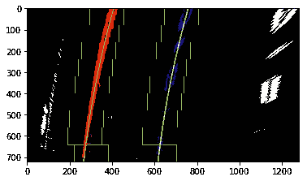
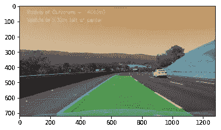

# 自动驾驶汽车的自动车道检测

> 原文：<https://towardsdatascience.com/https-medium-com-priya-dwivedi-automatic-lane-detection-for-self-driving-cars-4f8b3dc0fb65?source=collection_archive---------2----------------------->

> 第 1 章:用数据做酷事！

我们可以使用汽车中的前置摄像头来自动检测车道线吗？

原来我们可以做得很好！这是一个视频，当汽车行驶时，车道线被“画”出来。你也可以看到曲率半径被计算出来以帮助汽车转向。

Lane Lines detected for self driving car

我们为什么要这么做？因为给汽车配备前置摄像头很便宜。比雷达或激光雷达便宜多了。自动驾驶汽车即将问世！

链接到我的 [**GitHub**](https://github.com/priya-dwivedi/CarND/blob/master/CarND-Advanced%20Lane%20Finder-P4/P4-advanced_lane_detection_final.ipynb) 用 Python 写的完整代码。

我们是这样做的。一旦我们从自动驾驶汽车的前置摄像头获得了摄像头图像，我们就会对其进行一些“修改”。我遵循的步骤详述如下:

1.  失真校正

当相机观察真实世界中的 3D 对象并将它们转换为 2D 图像时，会发生图像失真。这种转换并不总是完美的，扭曲会导致物体的外观尺寸、形状或位置发生变化。因此，我们需要纠正这种失真，以使相机能够准确地看到图像。这是通过拍摄相机的几张棋盘图片并使用 *cv2.calibrateCamera()* 函数计算相机校准矩阵来完成的。

请参见下面的失真校正图像示例。请注意，正常镜片的校正非常小，肉眼看不出有多大差别

2.创建二进制图像

现在我们有了未失真的图像，我们可以开始我们的分析。我们需要探索不同的方案，以便我们可以清楚地检测道路上的感兴趣的对象，在这种情况下，车道线，而忽略其余的。我用两种方法做到了这一点:

I)使用 Sobel 算子计算 x 梯度

图像的渐变可用于识别黑白图像中颜色的急剧变化。这是一种非常有用的检测图像边缘的技术。对于道路的图像，我们通常在黑色道路上有黄色或白色的车道线，因此 x 渐变非常有用。以下示例显示了使用 *cv2.sobel()* 计算的图像及其在 x 方向的梯度

ii)探索其他颜色通道

使用不同的色彩空间怎么样？HSV(色调、饱和度和值)颜色空间在隔离黄色和白色线条时非常有用，因为它隔离了颜色(色调)、颜色量(饱和度)和亮度(值)。我们可以使用图像中的 S 颜色通道来“看到”车道线，如下图所示:

现在，我们将 sobel x 梯度和 S 颜色通道图像相结合，以获得最终的二进制图像，其中车道线与背景相比对比度更高。见下图:

3.鸟瞰图像

在阈值操作之后，我们执行透视变换以将图像改变为鸟瞰图。这样做是因为从这个俯视图，我们可以确定车道的曲率，并决定如何驾驶汽车。为了执行透视变换，我确定了在图像上形成梯形的 4 个源点和 4 个目的点，以便变换后车道线彼此平行。目的点是通过反复试验选择的，但是一旦选择好，对所有的图像和视频都有效，因为摄像机安装在一个固定的位置。 *cv2.getPerspective* 和 *cv2.warpPerspective* 可用于执行此操作。看看在这个视图中车道线的曲率是多么清晰可见。是不是很神奇！

4.将曲线拟合到鸟瞰图图像

为了更好地估计车道的位置，我们使用图像下半部分的直方图来识别潜在的左右车道标记。我修改了这个函数来缩小左右车道存在的区域，这样高速公路车道分隔符或任何其他噪声就不会被识别为车道。一旦确定了初始的左侧和右侧车道底部点，我们就使用 numpy polyfit 函数来查找表示车道的最佳二阶多项式，如下图所示。

Left and right lane lines fitted

5.将结果绘制到道路上，以便清楚地识别车道区域

快到了！一旦我们确定了车道线并对其进行多项式拟合，我们可以再次使用 cv2.warpPerspective 将车道线扭曲回原始图像。我们还做了一个加权添加来显示未失真图像上的车道线。这是它的样子。

就这些！为了对视频进行这样的操作，我们使用 Moviepy 库到达每一帧，并在其上运行上述所有步骤。对于某些帧，我们可能无法正确识别车道线。我们可以通过一些简单的检查来检测，如车道线是否由逻辑宽度分隔，鸟瞰图中的车道线是否相互平行等。如果检查失败，则预测的车道线被丢弃，并且使用最后良好的左和右车道值。这非常有效。

虽然这种逻辑适用于大多数情况，但它并不完美。当相机图像质量差时，它可能会失败，如照明不足或车道线不可见，道路上有雪或碎片。此外，如果道路呈波浪形或 S 形，我们可能无法用二阶多项式来拟合它。

PS:我住在多伦多，我希望将职业生涯转向深度学习。如果你喜欢我的帖子，并能把我联系到任何人，我将不胜感激:)。我的电子邮件是 priya.toronto3@gmail.com

参考资料:

[Udacity](https://www.udacity.com/) 无人驾驶汽车 Nano Degree——我感谢 Udacity 给我机会成为他们新的无人驾驶汽车项目的一部分。这是一次非常有趣的旅程。我使用的大部分代码都是在课堂讲课中建议的。

Python [OpenCV](http://docs.opencv.org/3.0-beta/doc/py_tutorials/py_tutorials.html) 库让应用计算机视觉技术变得如此简单