# 理解基于深度学习的图像分类器的终极纳米书

> 原文：<https://towardsdatascience.com/https-medium-com-rishabh-grg-the-ultimate-nanobook-to-understand-deep-learning-based-image-classifier-33f43fea8327?source=collection_archive---------13----------------------->

## 理解卷积神经网络的指南

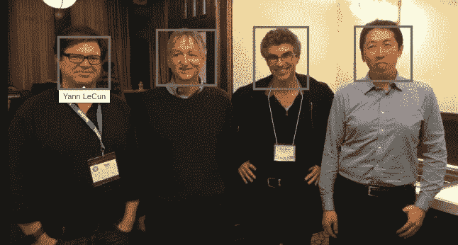

Fig 1: The Four Superheroes of Deep Learning, Source: bit.ly/2Re5HNE

在当今世界，我们广泛使用图像。不是吗？你有没有想过[脸书](https://bit.ly/2K46MkU)是如何自动检测图像中的人脸，然后像上图一样分辨出图像中的人是谁？当我将指针移近图像中的一张脸时，它会自动说出这个人的名字，不是别人，正是 Yann le Cun(CNN 架构的提出者)。你用过 Snapchat 吗？它首先自动检测您的面部，然后相应地应用您选择的过滤器。苹果的 Face ID 也做了类似的事情，当它发现你的脸在设备前面时，它会自动解锁你的手机。

有很多这样的例子，它们都有一个共同点。**他们在摆弄图像，让机器变得聪明，所以它们会自动从中提取有意义的信息**。太神奇了。不是吗？当我第一次了解这些技术时，我非常好奇它们是如何工作的？说实话，一开始好像很神奇。电脑怎么会自动分辨出这是哥哥的照片不是我的？如果你也发现自己和我在同一页上，那么拿一杯咖啡，因为在这本纳米书中，你会学到很多关于这些事情背后的主要思想的每一个细节，但以一种非常有趣的方式。

有许多任务，如图像分类、目标定位、目标检测、目标分割等等。但是在这篇文章中，我们将主要关注图像分类。

这篇文章分为三个部分。在第一个中，我们将尝试通过跟随我们自己的直觉来建立这个技巧，这将是非常有趣的，也是学习这个魔术的独特方法。在第二部分中，我们将使用 python 实现它，以查看它的运行情况。在第三部分，我们将尝试通过问几个有趣的问题来探索和了解更多信息。

# 理解语义差距

我们人类是视觉动物，我们用眼睛看到周围的各种物体，但你有没有想过图像对计算机意味着什么？我们感知图像的方式和计算机感知图像的方式有很大的不同。我们特别称这个间隙为`Semantic Gap`，下图对此进行了很好的描述。


Fig 2: On the left— What we see using our eyes. On the right — What computer sees, Source: bit.ly/2ga5Cpu

在上面的图片中，很明显，对于计算机来说，图像只不过是一串排列成网格状结构的数字，正式名称为`Array.`,然而，我只展示了其中的一小部分。如果您想看到计算机的整个图像，您可以使用下面的代码。

```
import os 
import cv2 
import numpy as npnp.set_printoptions(threshold=np.inf)image = cv2.imread('/cat.jpeg')
print(type(image))
image = cv2.resize(image , (28,28) , cv2.INTER_AREA)
print(image.shape)
#visualizing the seperate channels of image
print(image[: , : , 0]) #prints out Blue channel
print(image[: , : , 1]) #prints out Green channel
print(image[: , : , 2]) #prints out Red channel
#To visualize the whole image with all 3 channels
print(image[: , : , :])
```

现在，你可能会问，我们心爱的电脑是否有办法知道哪个物体出现在画面中。当然有，我们会建造它。我知道，这似乎是一项艰巨的任务，但请忍耐到最后。我们一定会实现的！

# 我们旅程的第一步也是最重要的一步:

正如我以前说过的，我们将简单地问一些问题，这些问题将引导我们建立一个图像分类器。为了简洁起见，我们将称图像分类器为 IC
。现在，我们准备开始我们的旅程。所以让我们问第一个问题:“你能说出下面的图片属于哪一类吗？猫还是狗？

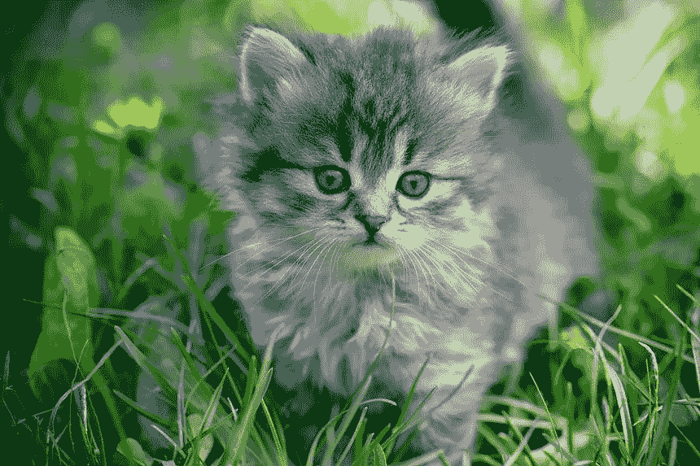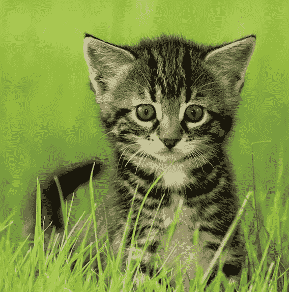

Fig 3: Images of Cats, Source: bit.ly/2V5RBwK and bit.ly/2Q2OaTG

我相信你说得对！他们属于`Cat`的范畴，但是等等，退一步想想你是怎么得出这个结论的？试着想想，你的大脑是怎么做到的？你怎么能如此确定这些照片是猫而不是狗？你知道猫长什么样，你刚才可能做的是**相似性检查**在你无意识地储存在你大脑中的猫脸的粗略图像和这些图像(更具体地说是这些图像的中间部分)之间，如果它返回一个高分。然后你得出结论，这些图像实际上是猫

现在，你可能会说“我们不能把同样的机制整合到我们自己的图像分类器中吗？”这似乎是一个很棒的想法，但它带来了两个主要挑战:

1.  哪个图像会充当我们已经储存在脑海中的图像(粗糙图像)？
2.  我们将如何测量两幅图像之间的相似性？

让我们解决第一个问题。在这里，我们主要集中在分类一个图像是猫还是不是猫。那么我们就不能用一张猫脸的形象作为我们的粗糙形象吗？为什么不呢！我们可以使用下面的图像作为粗略的图像，然后我们可以对上面显示猫脸的图像的中间部分进行相似性检查，或者我们可以使用数组中间的像素值

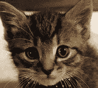

Fig 4: Face of a cat — Our rough image

现在，我们的粗糙图像也将像我们的主图像(必须分类)一样，以数字或像素值的形式存储在计算机中。

对于第二个问题，有没有办法做两幅图像之间的**相似性检查**，换句话说，在**大矩阵**(原始图像)和**小矩阵**(粗糙图像)之间？是啊！我们有东西可以代替我们。在数学上被称为 **Frobenius 内积**。不要害怕。我将解释它是什么和它做什么。

**Frobenius 内积无非是** **两个数组按元素相乘后再加运算**。假设你有下面两个网格或矩阵，我们称它们为 **A** 和 **B** ，如下所示，那么弗罗贝纽斯内积(FIP)将计算如下。


Fig 5: Frobenius Inner product

**Frobenius 内积**，总的来说，是你衡量两个事物(矩阵)相似度的方式之一。它只不过是点积的一般化版本，只有一点不同:点积是为向量定义的，内积是为矩阵定义的。它如何准确地测量相似性超出了本指南的范围，但是如果你想详细了解相同的内容，那么请随意查看这篇[博客文章](https://betterexplained.com/articles/vector-calculus-understanding-the-dot-product/)和[这篇文章](http://mathworld.wolfram.com/InnerProduct.html)以了解内积。

现在我们有了两个图像(粗略的和主要的)和一种方法来衡量两个矩阵或图像之间的相似性。酷！因此，让我们来看看我们的非常简单的管道来将图像分类为猫或非猫，它包括两个步骤:

1.  选择需要分类的图像的中间部分
2.  对所选区域和粗略图像进行相似性检查。如果它返回一个高值，那么主图像是一只猫。

但是这个管道或者我们的图像分类器对下面的图像有效吗？

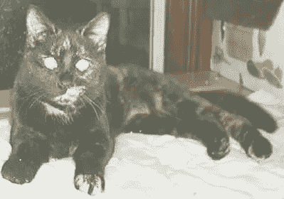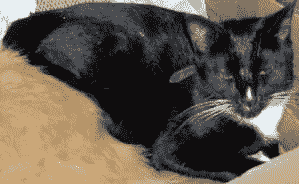

Fig 6: Images of cats, Source:bit.ly/2DkrlZd

不，一个大大的不！它对这些图片不起作用，因为上面的图片中间没有猫的脸。这将导致两幅图像之间的相似性降低，这意味着**不正确的分类**。我们能解决这个问题吗？是的，我们可以。我们不应该只关注图像的中间部分，我们应该做的是对主图像的每个部分与粗糙图像进行相似性检查，这将使我们的图像分类器**具有全局平移不变性**，这意味着人脸或图案位于图像中的哪个位置并不重要，我们的图像分类器肯定会检测到它。**最后，结果将存储在输出矩阵中，我们必须对主图像的每个部分重复这个过程。请注意，选择主图像的特定部分的方向将是从左到右和从上到下。我们在主图像上移动粗略图像的步数或单位数称为**步距**。现在，让我用下面的图形和伪代码更清楚地说明这一点。**

```
category = None
for selected_part in (each part of main image):
    1\. calculate the similarity between selected part and rough part
    2\. if similarity == HIGH:
    3\.     category = cat
if category == cat:
     print("Cat is present in image")
else:
     print("Cat is not present in image")
```


Fig 7: Convolution operation with stride = 1 and no padding | Source : bit.ly/2kDIN1O

看起来很简单也很有前途。这种在主图像上卷积粗糙图像的特定过程被称为**卷积运算(线性运算)**，它非常直观，因为它只是通过计算两个矩阵之间的 Frobenius 内积来检查主图像中的某些特定模式。这个过程的结果将是另一个矩阵，它存储了粗略图像和我们的主图像的每个部分的相似性分数。

你有没有注意到一些非常有趣的事情？我们的输出矩阵或特征图的尺寸将总是小于主图像的原始尺寸。不是吗？如果你不服气，我建议你仔细看看上面的操作。但是，如果您想保留主图像的大小，以便即使在操作之后也能保留主图像的大部分信息，该怎么办呢？有什么办法可以做到呢？是的，有。为了保持输出图像的尺寸，我们简单地用零填充主图像的边界，这个过程被称为**填充。**


Fig 8: Zero padding, Source: bit.ly/2rK7fAM

现在，是时候让我给你介绍一下深度学习社区中已知的这些矩阵的名称了。形式上，粗糙图像被称为**核**、**特征检测器**或**滤波器**，我们正在进行相似性检查的主图像的特定部分被称为**感受野**。输出矩阵被称为**激活或特征图**。

到目前为止一切顺利。是时候感谢我们自己了，我们已经走了这么远，并建立了一个图像分类器，它可以在单个内核的帮助下检测主图像中的特定模式。让我们再走一步，尝试使我们的图像分类器对各种不同类型的图像更加鲁棒。我们的图像分类器适用于以下图像吗？

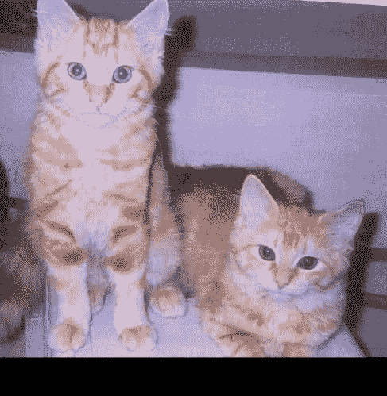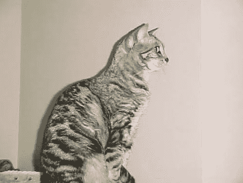

Fig 9: Images of cats, Source:bit.ly/2DkrlZd

同样，答案是否定的，这背后的原因很简单。上面图片中猫的脸和我们选择作为内核的猫的脸是有区别的。即使图像中某个对象的颜色或形状发生很小的变化，也会改变数组的值。那么，这种差异就足以导致我们的分类器出现不正确的分类。我们必须解决这个问题。我们必须通过使我们的分类器更加健壮来解决这个问题。我们不能只使用一种特定的模式对每张图片进行分类。我们的分类器还应该对猫的脸部轻微旋转、变形或出现任何其他图案的图像进行分类。因此，非常需要**多个内核或特征检测器**,因为我们不能只依赖一个内核。我们应该有不同的内核来识别图像中的不同模式。这样，它将提高我们的图像分类器的性能。

因此，现在我们将对之前的卷积运算进行修改，它包含以下三个部分:

1.  输入体:可以是深度为 3 (RGB)的图像，也可以是之前卷积运算的输出。
2.  特征检测器矩阵:这将构成 **K** 个内核来检测各种模式。
3.  特征图:这将是卷积运算的输出，它将简单地存储相似性值。

形式上，这三个组件的组合被称为单个**卷积层**。而如果你在琢磨这次卷积运算会怎么做。下面仔细看看。

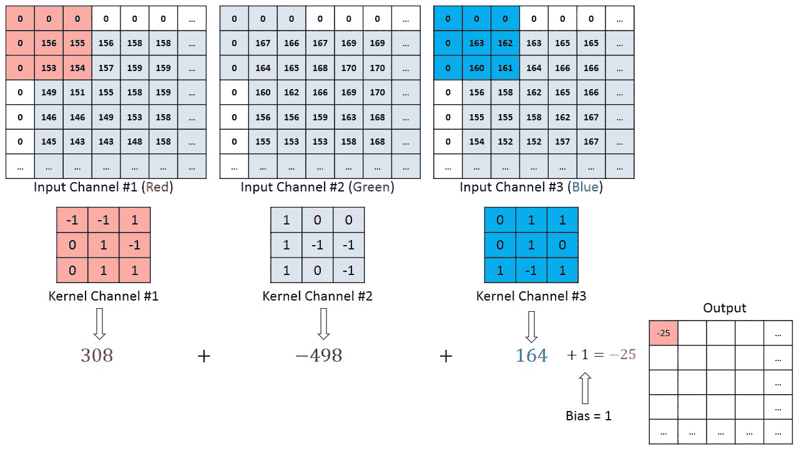

Fig 10: Convolution operation in case of multiple kernels and input depth > 1, Source: bit.ly/2PnUwSr

现在，我们的图像分类器可以检测图像中任何位置的各种特征。看起来我们做得很好。但是仍然需要改进。我们不能减少工作量吗？注意这里的一件事，我们手动定义我们的特征检测器，这个特定的内核应该检测这个特定的特征。这总是可能的吗？作为人类，我们能够识别构建分类器所需的所有模式吗？这可行吗？答案是不，我们不能。但是，我们能让我们的计算机足够智能来学习特征检测器本身吗？是的，我们可以。我们将利用现代计算机的计算能力，通过机器学习，用大量带有各自标签的图像来训练我们的机器。然后，它将自己识别各种特征检测器，以建立鲁棒的图像分类器。如果这对你来说没有多大意义，我会建议你去看看这个[博客](https://hackernoon.com/the-simplest-explanation-of-machine-learning-youll-ever-read-bebc0700047c)。

我们一致认为，我们的机器将足够智能，能够自己学习特征检测器，并将能够在图像的任何位置检测多个特征，但这里有一件更重要和关键的事情需要理解:你的机器将像你一样学习这些特征检测器。我这么说是什么意思？还记得你是如何学习英语或其他概念的吗？首先，你已经学习了字母，然后是单词，从这里开始，你可以学习如何收集有意义的单词，也就是句子。我们作为人类以一种分等级的方式学习。机器也将模仿我们的学习方式，它不会直接学习更高层次的特征，如猫的脸、手或人的腿。但首先，它将学习非常低级的特征，如检测图像中的水平边缘、垂直边缘或颜色的特征。从那里，它将学习更高层次的特征，如脸、手和形状。**因此，这清楚地表明我们的图像分类器将不仅具有单个卷积层，而且具有多个卷积层。**

# 引入非线性

你有没有注意到，随着我们的进步，我们正在推出一个更好的图像分类器版本？在上一节中，我们了解到我们的分类器应该有多个卷积层，以便以分层的方式学习。这意味着我们的分类器的结构如下:

```
CONV LAYER--> CONV LAYER--> CONV LAYER --------> CONV LAYER
```

召回！我们之前已经了解到**卷积是一种线性运算**,简单来说就是，不管你在分类器中引入多少层，它只会学习线性函数。即使您在网络中添加 100 个层，它们都将作为单个卷积层。是的，`100 Layers == 1 Layer`不相信我？好吧。让我借助简单的线性方程来阐述一下。

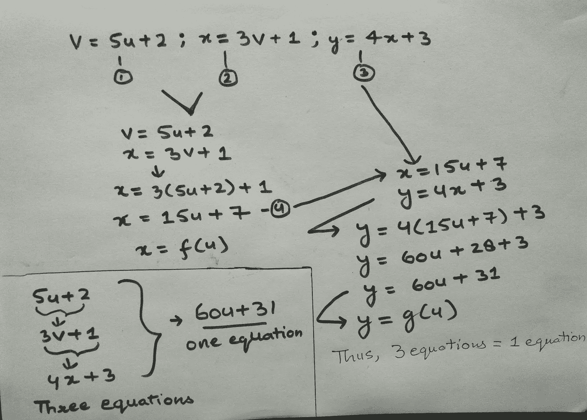

Fig 11: Linear Equations (Captured by me)

从“u”到`y`的转换由 3 个线性方程完成，但如上图所示，这也可以由一个线性方程`60u+31`完成，即`Power(3 linear equations) = Power of 1 linear equation`。

因此，我们必须在卷积层之间引入非线性，原因如下:

1.  学习复杂和非线性函数来分类图像。
2.  通过保护`100 Layers == 100 Layers`使我们的网络更加强大

如今在深度学习社区中常见的**非线性函数或激活函数**是 **ReLU(校正线性单元)。**


Fig 12: ReLU Function, Source: bit.ly/2uPTxNx

可以把 ReLU 函数想象成一个接受任何数字的盒子，如果是正数，它将给出输出 0 或数字。下面的代码将使它更加清晰。

```
def relu(x):
    if x < 0:
        return 0
    else:
        return x
```

因此，引入激活函数将使我们的图像分类器更加鲁棒，并将帮助它学习非线性决策边界，但这不是强制性的，您应该只使用 **ReLU** 作为激活函数。你可以自由使用任何非线性函数。要了解更多关于激活功能的信息，请随意阅读这个[博客](https://bit.ly/2ntXyn8)。

# 池化:使其更加健壮和高效

到目前为止，在本指南中，我们更多地关注图像分类器的鲁棒性，但现在，让我们也关注分类器的效率。我们的分类器的输入是一幅图像。对吗？并且它的大小可以根据手头的问题而变化。图像的形状可以是`28x28`、`64x64`、`128x128`、`256x256`。图像的尺寸越大，我们的图像分类器中的参数数量就会越多。深度学习社区中众所周知的一个事实是**参数数量越多，你的模型就越容易过度拟合，需要更多的时间来训练**。因此，没有任何方法可以解决这个问题吗？是的，有。我们可以使用称为**池化**的操作来减少输入体积的形状。

汇集是一种非常简单的操作，它通过用单个值替换非常小的子数组来对输入形状进行子采样或下采样，并且该单个值通常是该小子数组的汇总统计。下图将使其更加清晰。


Fig 13: Pooling operation | Source: stanford.io/2Td4J2d

在上图中，红色的数组是我们的子数组，蓝色的小矩阵是池化操作的输出。用`2x2`数组减少`20x20`数组将导致进一步卷积运算中参数数量的急剧变化。这个小的子数组被称为**内核**，而**步幅**的概念也适用于此，并在决定您希望内核移动多少步时发挥作用。我们可以使用任何**汇总统计数据**将其替换为一个数字，这可以通过从子数组中取最大值来完成，称为 **Max-Pooling** ，或者我们可以取子数组值的平均值，称为 **Average-Pooling** 。


Fig 14: Various Pooling operations | Source: bit.ly/2K5zlP2

我们将利用池操作来缩减输入体积的大小，但是池操作还有一个更有趣的地方。在池中，我们用单个值替换小的子数组，这意味着我们不太关注特征检测器操作的结果的确切位置。相反，我们缩小一点，并要求该子数组的近似结果。这将使我们的图像分类器对**局部平移不变量**具有鲁棒性。下面的例子肯定会有帮助


Fig 15: Images of different faces with different spacing

【以上是三张不同的人脸图片，略有不同。如果你仔细注意，两对眼睛之间的间距和眼睛与鼻子之间的间距是不一样的，但我们仍然希望我们的图像分类器能够完美地对所有这些人脸进行分类。但是我们对图像分类器还有什么期望呢？我们希望我们的人脸检测器内核不要关注眼睛和鼻子的确切相对位置，而是检查是否有一只眼睛在左边，一只眼睛在右边，鼻子在中间，后面是嘴唇，如果满足以上所有条件，则将其声明为人脸。这正是池化操作帮助我们实现的目标。因此，池主要执行两个功能，现在您已经知道这两个功能了！

# 我们图像分类器的最后一个组件

我们已经完成了最困难的部分。现在，让我们覆盖最简单的一个，使我们的分类器充分工作。它会给我们一个单一的数字，通过它我们可以保证这个图像是一只猫，对吗？但是，你注意到另一件事了吗？到目前为止，我们已经覆盖的所有层的输出都是形状`(width,height,depth)`的，但我们感兴趣的是一个单一的数字，它可以告诉我们一只猫是否出现在图像中。那么，我们如何实现这一点呢？我们如何利用存在于先前层的输出体积中的所有神经元，因为这些神经元将告诉我们特定特征是否存在于图像中？我们如何智能地将那些神经元的信息组合起来，得到一个单一的数字？首先，我们必须执行一个名为`Flattening`的操作，这样我们就可以智能地利用所有这些神经元来获得这个数字。展平是一个非常简单的操作，它将形状为`(width,height,depth)`的输入体积转换为形状为`(K,1)`的一维数组，其中`K=width*height*depth`。


Fig 16: Flattening operation | Source: [https://bit.ly/2AUN6Mq](https://bit.ly/2AUN6Mq)

现在，我们有一个一维数组作为图像分类器的输出，到这一部分，我们的分类器充当了**特征提取器**。它从图像中提取出有意义的信息，这将在确定图像中是否存在猫的过程中发挥至关重要的作用。现在，我们必须利用这些有意义的信息来得到一个单一的数字。这将由称为**全连接层**的层来完成，该层将前一层中存在的所有神经元连接到下一层中的所有神经元。

如果你知道简单的神经网络(没有任何花哨的层)，那么连接多个具有不同数量神经元的全连接层就相当于在基于深度学习的**特征提取器**之上堆叠一个简单的神经网络。不是吗？下图将进一步阐明这个概念，它也将帮助你理解一维数组如何被转换成一个单一的数字。

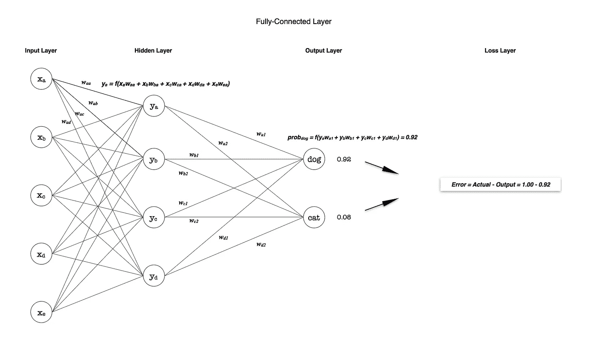

Fig 17: Fully connected layer | Source: [bit.ly/2JaVD0w](https://bit.ly/2JaVD0w)

恭喜你！借助我们的直觉，我们已经完全开发了成熟的基于深度学习的图像分类器。我们已经介绍了这种基于深度学习的图像分类器的每一层，很明显，在所有这些层中，最重要的一层是**卷积层**，因此这种分类器被称为**卷积神经网络**。


Fig 18: Convolutional Neural Network

# 第 2 部分:卷积神经网络的作用

我们已经非常详细地了解了卷积神经网络。让我们转换一下模式。现在，足够的理论和直觉。让我们实现我们到目前为止学到的所有东西，并建立一个端到端的 **LeNet 架构**，这是第一个由 **Yann LeCun** 提出的 CNN 架构。然而，还有许多其他 CNN 架构，你可以在这里阅读[。LeNet 架构中各层的排列如下:](https://bit.ly/2mWCUw1)

```
Input -> Conv -> Activation -> MaxPooling -> Conv -> Activation -> MaxPooling -> Flattening -> FC -> FC
```

我们将使用 CNN 将手写数字分为 10 类中的一类。我们将使用的数据集是`MNIST Database`,看起来像


Fig 19: MNIST Dataset — Hand Written Digits | Source: [bit.ly/2InhIcI](https://bit.ly/2InhIcI)

现在，让我们使用 [Keras](https://keras.io/) 在 python 中实现我们到目前为止学到的所有东西。

**第 1–10 行:**我们已经导入了所需的类，这些类将进一步用于实现 LeNet 架构。

**第 13 行:**将 MNIST 数据集加载到四个变量`((x_train,y_train), (x_test,y_test))`

**第 15–18 行:**这些行将打印出训练和测试数据集的形状。

**第 21 行和第 22 行:**它们将通过将图像的每个像素的范围从 0–255 转换为 0–1 来标准化输入图像。

**第 24–25 行:**执行 [**一次热编码**](https://bit.ly/2SNuiG7) ，这基本上是为了明确地告诉我们的模型，类之间没有顺序关系。

**第 27 和 28 行:**它们将把数据(训练和测试)从(data.shape[0]，28，28)整形为(data.shape[0]，28，28，1)，这将用于表示卷积层的输入图像的通道数。

**第 38–49 行:**这些行将定义 LeNet 架构。为了实现这个架构，我们使用了 keras 的`Sequential API`(第 38 行)。网络的第一个隐藏层是具有 30 个大小为(5，5)的滤波器的卷积层，接着是 **ReLu** 激活层，然后是池大小=(2，2)的 **MaxPooling** 层，堆叠在前一层的顶部。这 3 层的组合根据架构再次重复。在三层的这两个块之后，由**展平层**(第 47 行)进行展平操作，然后将两个**全连接层**附着 500 和 10 个神经元(第 48 和 49 行)。

**第 52 行和第 53 行:**这些行将定义所需的优化器，该优化器将用于训练 CNN(第 52 行)，而第 53 行将编译定义的模型，其中`categorical crossentropy`作为损失函数，`accuracy`作为监控度量。

**第 56 行:**它将负责训练我们的 CNN(真实的东西)以 10 为纪元数。

**第 59–63 行:**这些行将用于评估经过训练的模型，通过计算测试数据集的对数损失值和准确性，帮助我们检查我们的模型在未知数据上的表现。

如果您将执行上述代码，您将获得以下输出。

```
Accuracy of our model is 97.008%
Log loss value : 0.079
```

因为我们的模型的准确度大约等于 98%,并且对数损失值等于 0.079，这是非常好的。

希望这一节能让您体会到 python 中卷积神经网络的实现细节。现在，让我们转到这本纳米书最激动人心和最重要的部分，以更好地理解卷积神经网络。

# 第 3 节:使用 ConvNets 来更好地理解它们

在深度学习社区中，大多数人将卷积神经网络视为**“黑盒”**，而没有太多关注它们如何做它们所做的事情。在本节中，我们将研究卷积神经网络，并主要关注卷积神经网络的可视化方面。通过研究一些最重要和最有趣的论文，我们将对 CNN 有更多的了解，但同样通过问一些有趣的问题。这一部分将包括深度学习社区中大多数人不经常讨论或不知道的所有细节。希望你也能学到新的东西。你兴奋吗？我知道你是！

# 3.1:可视化中间输出

我们非常清楚，从输入层到输出(softmax)层，卷积神经网络中存在许多层。当我们通过网络前馈一个图像时，如果我们能够可视化每一层所做的转换或每一层的输出，这将是一个有趣的练习。这个练习将帮助我们了解每一层到底对输入图像做了什么。这正是论文作者所做的: [**通过深度可视化理解神经网络**](https://arxiv.org/abs/1506.06579) 。如果你想看看这个东西的运行，你可以使用他们开发的工具，可以在这里找到。

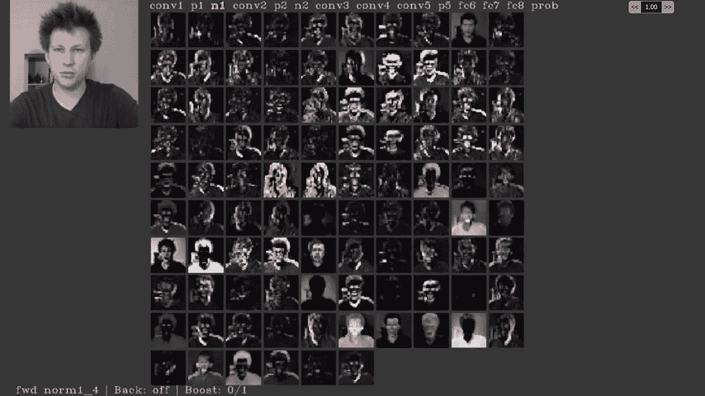

Fig 20: Output of various intermediate layers | Source: [video](https://bit.ly/2PlxOFC).

# 3.2:在给定 CNN 代码的情况下重建图像

在前面的小节中，我们已经尝试了在图像通过网络时可视化中间层的输出，中间层的输出也称为该特定层的图像的`encoding`。但是，除了可视化中间层的输出，是否有可能使用图像的编码来构造原始图像？是的，这是可能的，这在论文中有广泛的论述: [**通过反转**](https://arxiv.org/abs/1412.0035) 来理解深层意象表征。本文作者通过提出以下问题对包含在中间表征中的视觉信息进行了直接分析:给定图像的编码，在多大程度上可以重建图像本身？

他们使用的方法很简单。他们将这个问题设计成一个最优化问题，该问题将计算图像表示的近似逆，使得图像的原始表示(φ(0))和我们试图找出的表示(φ(x))之间的差异或损失应该是最小的。


Optimization problem

这里，x 代表我们试图寻找的图像，φ(0)是中间层的输出或图像的编码，φ(x)是我们试图寻找的图像的编码，loss(φ(x)，φ(0))是两种编码的差，λR(x)是正则化项。他们用来测量两种编码之间差异的损失函数是`Euclidean distance`,数学上看起来如下:


Loss function: Euclidean distance

下面是对应于不同层的编码的单个图像的反转表示的图像。


Fig 21: Result of the inverse of image representations of different layers, Source: [paper](https://arxiv.org/abs/1412.0035)

从上面示出的结果中，非常清楚的是，与从远离输入层的层构建的图像相比，使用更靠近输入层的层的编码的图像重建包含更多的视觉信息。

# 3.3:图像的哪个部分负责分类？

到目前为止，我们已经就图像中对象的存在负责图像分类器的输出这一事实达成一致。例如，图像中猫的脸的存在将负责图像分类器的输出。但是我们怎么能确定呢？如果分类器基于周围环境而不是基于猫的脸的存在将图像分类为**猫**会怎样？主要有两种方法可以确定，第一种是**遮挡实验**，第二种是通过使用**显著图**。

## 3.3.1:遮挡实验

这种方法最早是在马修·泽勒的 [**可视化和理解卷积网络**](http://arxiv.org/abs/1311.2901) 中提出的。在这种方法中，他们用灰色方块遮挡图像的特定部分，然后监控该图像的分类器输出。他们通过从上到下和从左到右滑动灰色框，为图像的每个可能部分完成了上述步骤，与我们在卷积运算中在输入图像上滑动小子阵列的方式相同。

**这个实验有什么值得期待的？**

当我们遮挡图像的**不太重要的**部分时，图像分类器的输出(概率)应该不变，但是当我们用灰色方块替换主要对象时，概率应该显著下降。下面是这个实验结果的图片。


Fig 22: Result of occlusion experiment, Source: [paper](https://arxiv.org/abs/1311.2901)

因此，我们现在可以确定，图像中对象的存在负责图像分类器的输出。

## 3.3.2:显著性图

这种方法首次在 [**深入卷积网络中引入:可视化图像分类模型和显著性图**](https://arxiv.org/abs/1312.6034) 。这是一种非常简单的方法，上面提到的论文的作者试图知道图像的哪组像素对于分类的输出是重要的。他们试图观察一个非常简单的事情，即如果我们一个接一个地改变图像的像素值，那么多少和哪个像素组将最大程度地影响该图像的类得分？这背后的原因非常简单，即与对象相对应的像素集比其他像素集更能影响类得分。

他们已经通过简单地计算图像的输出分数相对于图像的梯度`(Score(Ic))`来做到这一点。

**w* = ∂Sc /∂I:类别分数相对于图像的梯度。**

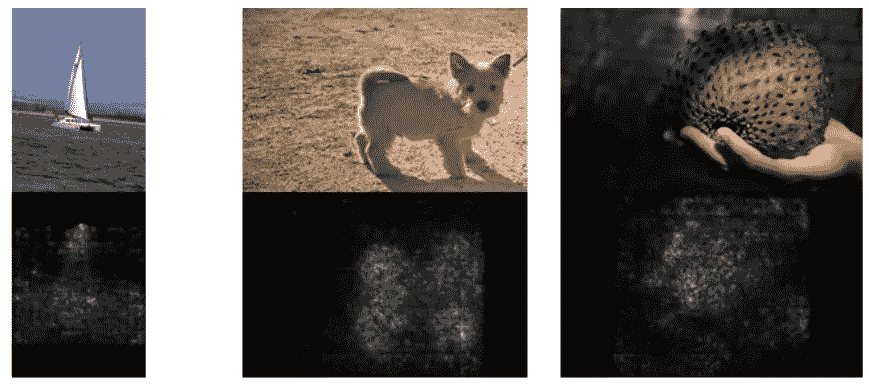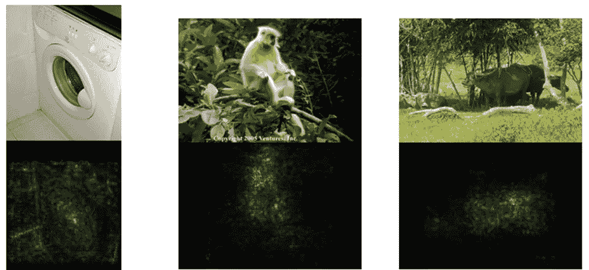

Fig 23: Images with their corresponding saliency maps, Source : [paper](https://arxiv.org/abs/1312.6034)

具有较高梯度值的像素组在上面的图像中被突出显示，这表示这些是图像中最重要的像素，因为这些像素的值的微小移动或改变可以极大地改变类别分数。因此，它清楚地告诉我们，图像中对象的存在是分类器输出的原因。

# 3.4:我们的假设对吗？

毫无疑问，卷积神经网络的骨干是**卷积层**，它由许多**内核**或**特征检测器**组成，这些检测器寻找图像中某些特征的存在，如果该特征存在于图像中，则反过来用大数字进行响应。这是我们已经在这本纳米书中涉及的内容。

我们的整个直觉和解释是基于最重要和唯一的假设，即卷积层中存在的子阵列充当特征检测器，但事实真是这样吗？我们如何确定子阵列充当特征检测器？有什么方法可以确定这一点吗？你打赌，有。这将是这本纳米书的一个非常重要的部分，因为它将检验我们关于 ConvNets 的假设，这是整本纳米书的基础。用于确定这一点的方法主要分为两个阵营，一个是以数据集为中心，另一个是以网络为中心。

# 3.4.1:以网络为中心理解 CNN

与同样需要数据的以数据集为中心的方法不同，以网络为中心的方法只需要经过训练的卷积神经网络。本文首先介绍了一种主要且有效的以网络为中心的方法: [**通过深度可视化理解神经网络**](https://arxiv.org/abs/1506.06579) 。

在这种方法中，该论文的作者做了一件非常简单的事情，即他们试图通过强加一个**优化问题**来可视化激活，该优化问题将试图构建一个输入图像，使得任何层上存在的任何激活的值都应该是最大的。


这里， **x** 是要构建的输入图像， **ai(x)** 是第 I 个激活的值， **Rθ(x)** 是正则化项。

最大化特定激活的值将导致图像(x)的构造，该图像将包含与该激活相关的视觉信息。下面的图片将帮助你将使用这种方法构建的不同层的不同激活的输出可视化。

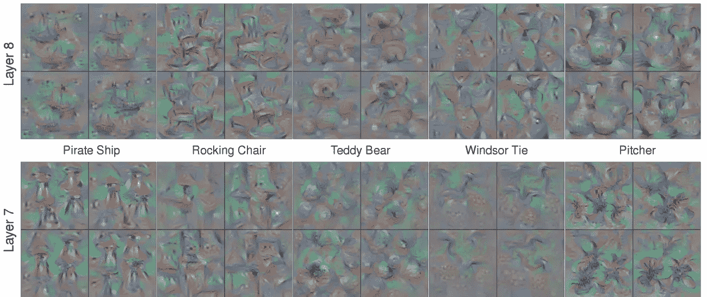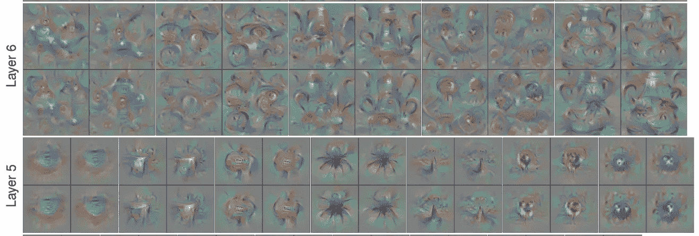

Fig 24: Visualization of different activations of different layers, Source: [paper](https://arxiv.org/abs/1506.06579)

# 3.4.2:理解 CNN 的以数据集为中心的方法

以数据集为中心的方法需要经过训练的卷积神经网络和通过该网络运行的数据(图像)。其中一个主要的以数据集为中心的方法首先是在马修·泽勒的 [**可视化和理解卷积网络**](http://arxiv.org/abs/1311.2901) **中介绍的。**在这篇论文中，他们介绍了一种可视化技术，揭示了在模型中的任何层激发或激活单个特征图的输入刺激(输入图像的一部分)。为了做到这一点，他们利用了**去进化神经网络**，它可以被认为是一个使用相同组件(池化、非线性)但顺序相反的 convnet 模型。但是你会问 deconvnet 是做什么的，它将如何帮助我们？当输入图像通过网络传递时，我们获得了激活图作为中间层的输出，当我们将 deconvnet 附加到每个激活图时，它将这些活动映射回输入像素空间。将特定激活映射回输入像素空间将在输入像素空间上形成该激活正在寻找的图案。

本文中的以下摘录和图表不言自明，有助于您更好地了解 deconvnet 和一般使用的方法。

> 为了检查一个 convnet，需要将一个 deconvnet 连接到它的每一层，如图 1(上图)所示，提供一条返回图像像素的连续路径。首先，将输入图像呈现给 convnet，并计算各层的特征。为了检查给定的 convnet 激活，我们将该层中的所有其他激活设置为零，并将特征映射作为输入传递给附加的 deconvnet 层。然后，我们连续地(I)取消 pool，(ii)校正和(iii)过滤，以重建引起所选激活的下层中的活动。然后重复这一过程，直到到达输入像素空间。

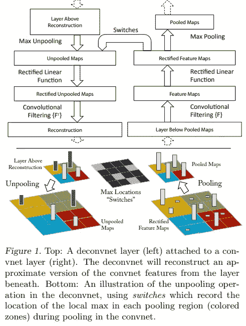

Fig 25: Deconvolutional neural network

现在，让我们看看上述实验的结果，并试图理解不同层的激活在寻找什么。

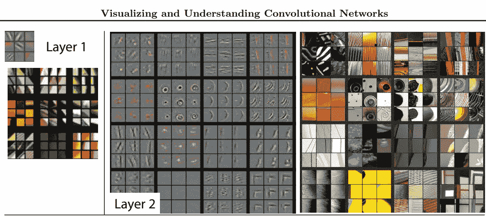

Fig 26: Visualizing the activations of Layer 1 and 2

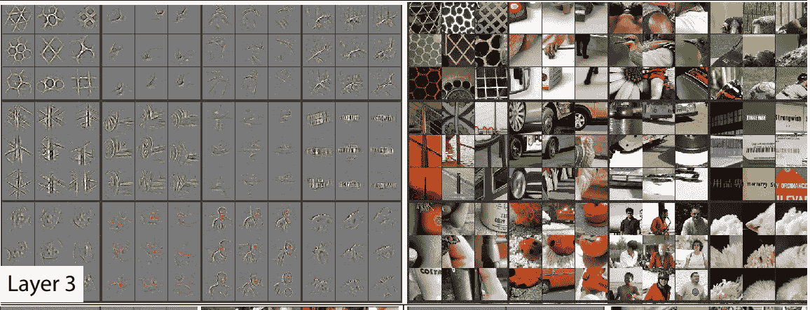

Fig 27: Visualizing the activations of Layer 3

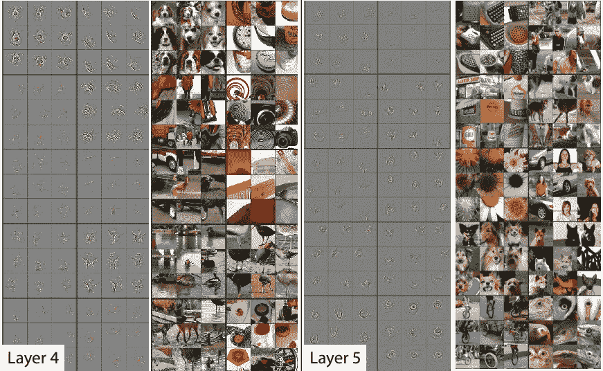

Fig 27: Visualizing the activation of Layer 4 and 5

从上面显示的图像中可以清楚地看到，靠近输入层的层正在寻找较低级别的特征(如角、边、颜色)，而远离输入层的层正在寻找较高级别的特征(如狗脸、键盘)，从而证实了我们的另一个假设，即卷积神经网络以分层的方式学习。

在纳米书籍的最后也是最重要的部分，我们已经研究了卷积神经网络，并通过回顾 CNN 的四篇最重要的论文对它们有了更多的了解，这些论文也考虑了可视化方面。希望你也像喜欢其他部分一样喜欢这个部分。

我希望你喜欢这本纳米书的每一个部分，如果你从书中学到了什么新东西，那么你可以通过与他人分享来表达你的爱。花了这么多时间来写这么全面的博文，希望我的努力能帮助你们中的一些人理解卷积神经网络。

欢迎在 [**LinkedIn**](https://www.linkedin.com/in/rishabhgarg7/) 上与我联系，在 [**Twitter**](https://twitter.com/rishabh_grg) 和 [**Quora**](https://www.quora.com/profile/Rishabh-Garg-109) 上关注我。