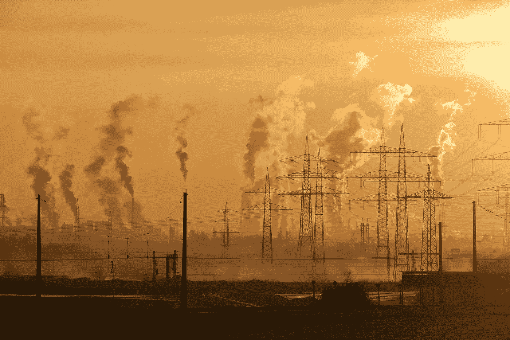
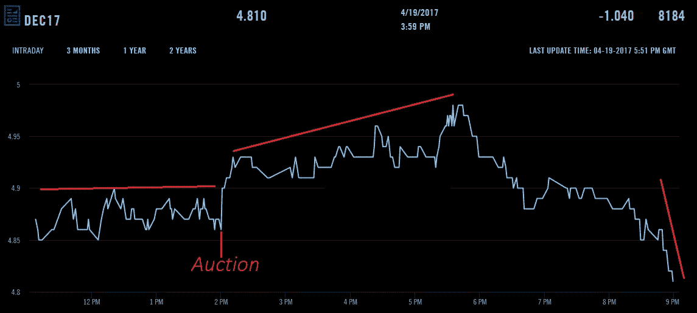
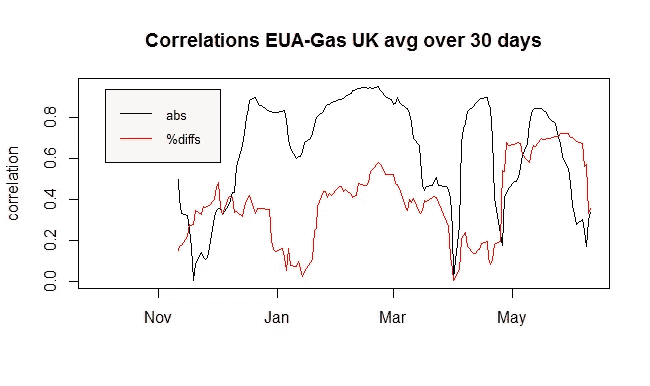
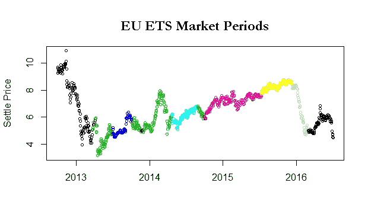
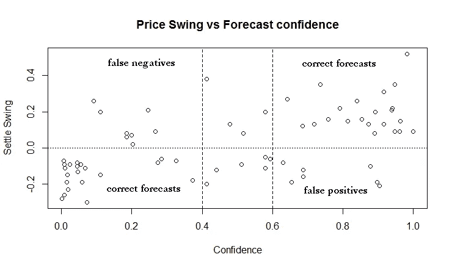
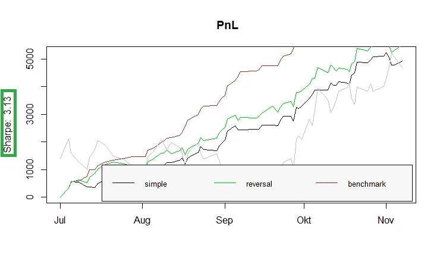

# 用于能源市场算法交易的机器学习框架

> 原文：<https://towardsdatascience.com/https-medium-com-skuttruf-machine-learning-in-finance-algorithmic-trading-on-energy-markets-cb68f7471475?source=collection_archive---------1----------------------->

[image by [Geralt](https://pixabay.com/users/geralt-9301/) on [Pixabay](https://pixabay.com/service/license/)]

人工智能的新突破每天都是头条新闻。远离面向客户的企业的嗡嗡声， ***机器学习在金融*** *中的广泛采用和强大应用却鲜为人知。事实上，很少有领域像金融行业一样拥有如此多的历史、干净和结构化的数据，这使其成为“学习机器”取得巨大成功的早期案例之一，这种成功仍在继续。*

大约三年前，我参与了开发机器学习(ML)模型，用于能源市场的价格预测和算法交易，特别是针对欧洲碳排放证书市场。在这篇文章中，我想分享一些我发现与我所有的 ML 项目相关的学习、方法和见解。我在这里关注的不是技术细节，而是建模选择背后的一般考虑，这在经典的学术教科书或在线新技术教程中很少讨论。—关于算法交易的例子，我提出了一些“交易技巧”，当你作为一个孤独的搜索者或与你的数据科学家团队一起将机器学习应用到合成例子之外的广阔世界的现实生活中时，你可能会发现这些技巧很有用。

**上下文**

在 2005 年《京都议定书》之后，欧洲碳排放证书(EU ETS)市场作为欧盟气候政策的主要支柱已经建立，通过“**上限和交易**”计划来调节欧洲大约一半的人为 CO2 排放。这一机制为各国政府提供了对温室气体排放总量的控制(“cap”)，同时将排放权的有效分配让给市场力量(“贸易”)。基本想法是给污染定价:该计划覆盖的每个工业设施必须监控并向当局报告其温室气体排放的准确数量，然后通过上交配额来抵消各自的数量(以吨为单位)。这些“污染权”被拍卖或免费给予工业参与者，然后可以在场外交易或在中央市场交易，价格由供求关系灵活确定。由于环境政策的减排目标限制了年度许可证的总体供应，一些污染者被迫选择减少污染的措施(“减排”)，例如在他们的烟囱中安装额外的过滤器。这些边际减排成本低于当前许可市场价格的污染者(例如，因为他们特定的过滤要求很便宜)可以在市场上出售他们的超额污染限额以获取利润，卖给面临更高边际减排成本的污染者。在一个完全有效的排放交易市场中，许可证的均衡价格将决定于最终减排单位的边际减排成本，该成本是实现许可证供应上限所设定的总体减排目标所必需的。

[Image by Pixabay via [Pexels](https://www.pexels.com/photo/air-air-pollution-climate-change-dawn-221012/)]

鉴于特定行业实际减排成本的不确定性，该工具允许政府控制排放总量，而排放许可的实际价格根据**需求方市场力量**波动，即

市场对未来政策变化的预期

即将进行的许可拍卖的规模，正在进行的拍卖的价格和覆盖率(见图 1)

市场参与者的投机

银行行为(一年内发放的许可证在同一政策阶段的所有年份都有效)

其他能源商品的价格关系。

为了举例说明后者，假设每单位热量的天然气价格低于布伦特原油的价格。电力生产商和公用事业公司将转向这种碳强度较低的燃料，从而降低对碳配额的需求。相应地，津贴的价格在这些时期也会下降(见图 2)。

Figure 1: Bullish signal from a highly covered auction at 2pm shortly breaking a bearish trend [image by author]

Figure 2: Positive 30day correlation of EUA with UK Gas in 2017 (absolute and normalized) [image by author]

一个全面的模型需要反映所有这些因素。虽然我们可以有把握地假设，在丰富的历史市场数据中观察到的模式会延续到现在，并将延续到未来(这实际上是任何分析建模的必要条件和不可或缺的假设)，但很明显，对于任何试图基于一般信念、基本关系或经济物理学的状态空间概念对市场建模的方法来说，这种设置都太复杂了。

所以这真的是一个释放机器学习力量的用例。如何利用它？

以下是使用监督学习的交易系统的典型工作流程:

1.  **数据**

把数据放好。金融时间序列的好来源是你想交易的交易所的 API， [AlphaVantage](https://www.alphavantage.co/) 或 [Quandl](https://www.quandl.com/) 的 API。数据的规模至少应该和您想要建模并最终预测的规模一样小。你的**预测范围**是多少？更长期的视野将需要额外的输入因素，如市场出版物、政策展望、twitter 披露的情绪分析等。如果您在玩基于来自分笔成交点数据的纯市场信号的短期甚至高频交易游戏，您可能希望包括各种长度的滚动平均值，以便为您的模型提供历史背景和趋势，特别是如果您的学习算法没有像递归神经网络或 LSTMs 那样的显式存储单元。技术分析中使用的所有常用指标(如 RSI、ADX、布林线、MACD)都是基于某种数量(价格、交易量)的移动平均线，即使你不相信简单的交易规则，包含它们也有助于模型反映大多数市场参与者的交易行为。你的计算能力可能是一个限制因素，尤其是在你的 ML 模型将面对做市者或套利者的硬编码、快速和专用算法的情况下。部署专用的云服务器或 ML 平台，如 H2O 和 TensorFlow，可以让你将计算分散到不同的服务器上。清理数据(如何插入间隙？)，绘制图表，玩玩它——你已经发现交易机会、趋势、异常了吗？

**2。监督模型训练**

将您的数据分成互补的集合，用于训练、验证(用于参数调整、特性选择等)和测试。这实际上比听起来更复杂:最理想的是，测试集应该尽可能“类似”于当前的“市场状态”，验证和测试集应该遵循**相同的分布**。否则，您可能会浪费精力在验证集上调整模型参数，却发现它很难推广到测试集。遵循“**市场机制**”的概念，即特定商品组合主导目标工具价格动态的延长期，首先让无监督学习的聚类算法发现数据中定义的相关性，然后评估属于相同聚类的验证和测试集中数据的模型性能，这可能是值得的(见图 3-在本项目中，聚类将预测性能提高了 8%)。

Figure 3 Coherent market periods as identified by a clustering algorithm (colored segments of EUA settle price) [image by author]

在早期，决定并建立**一个单一的数字评估指标**。追逐太多不同的指标只会导致混乱。在算法交易的背景下，一个合适的衡量标准是“损益”(PnL)，因为它用波动的实际大小(“相关性”)来衡量分类精度(价格上涨/下跌)。它符合你可能考虑的交易政策的标准。在训练集和验证集上观察模型性能。如果训练集的误差，即“模型偏差”，很高，您可能需要考虑更多的模型参数(例如，通过在深度学习模型中添加更多的层/神经元)。如果模型泛化能力很差(“模型过度适应训练集”)，即验证和训练集的性能差异(“模型方差”)很高，您可能需要向训练集添加更多数据，减少最相关的特征数量，添加正则化(例如 L2、L1 或下降)或提前停止(在梯度下降优化中)。仔细检查模型出错的案例将有助于识别任何潜在的和可避免的模型偏差，见图 4。

Figure 4 Error analysis — price move versus forecast confidence (>0.5: up, <0.5: down) [image by author]

确立你的**目标绩效**:对于市场预测，75%的分类精度实际上已经很不错了——比随机猜测(50%的精度)好 50%。该基线与其他 ML 应用程序(如在封闭环境中运行的对象或语音识别)非常不同，在封闭环境中可以清楚地识别影响建模目标的因素(图像像素的 RGB 通道、声音样本的波频率)。

**3。交易政策**

定义你的交易政策:定义模型输出的**具体交易含义的一套规则:例如，取决于给定预测的模型置信度的阈值，你在市场上放置什么位置，什么位置大小，在给定的市场状态下你持有位置多长时间，等等。策略通常带有一些需要优化的自由参数(下一步)。在这里讨论的监督学习环境中，这是一个基于回溯测试和网格搜索的相当手工的过程(下面列出了一些缺点)。**

**4。回溯测试&优化**

现在到了数字上——你的交易系统，或者说预测模型和给定交易政策的相互作用，在一组隐瞒的历史市场数据上表现**有多好？这里，步骤 2(模型训练)中使用的测试集可以成为调整策略参数的验证集。遗传算法允许你探索政策空间，从第一代比如说 100 个随机选择的政策参数开始，迭代地消除 80 个表现最差的，并使 20 个幸存者每个产生 4 个后代。或者，您可以在多维参数空间中进行网格搜索:从策略参数的一些看似合理的值开始，通过逐个改变参数值，您可以实现的最佳性能设置是什么。在这里，你的绩效指标是你在交易策略中最终要优化的指标，如 PnL 或一些衍生的量，如投资回报、夏普比率(每波动风险的回报)、风险价值、贝塔系数等，见图 5。**

Figure 5 PnL and Sharpe Ratio for various trading policies [image by author]

防止使参数过度适合验证集的一个好方法是使用“walk-forward-test”(WTF)进行交叉验证，以验证您的方法的健壮性:优化验证段上的策略参数，在验证段之后的数据上及时向前测试它们，向前移动验证段以包括该测试数据，重复。这里的基本假设是，与更久远的过去相比，最近的过去是对未来更好的衡量。

**5。模拟&现场交易**

在您的策略生效之前，**冻结所有系统参数并实时测试**，就像根据您的交易算法的输出实际下单一样。这个重要的步骤叫做纸上交易，是检验你的方法有效性的关键。您可能会注意到，在您的历史数据中，您实际上使用了在给定时间并不真正可用的值，例如在计算移动平均值时。如果你的策略看起来仍然有希望，那么恭喜你——是时候投入使用了！虽然您可能会从手动下单开始，但不要低估将您的策略与交易所的 API 集成在一起所需的管理和技术工作。

这里介绍的典型工作流程有一些严重的**缺点**:

对于衍生合约，如基础期货，历史数据通常报告一天或选定时间间隔内的开盘价和收盘价，以及在该时间间隔内实现的所有交易的合约平均价格。但这不太可能是你可以结清买入或卖出订单的价格，这取决于订单簿的动态，订单簿在不同的买入价/卖出价水平下有不同的交易量。所以你在第二步中的模型预测确实指的是一个理论价格，但可能不是你将要下注的价格。更详细的建模方法需要考虑订单簿的实际**结构和动态**。

制定策略(步骤 3)不是基于机器学习的建模的一部分，而是由直觉、经验或简单的启发指导的手动过程。例如，当模型预测价格上涨时，你会下一个买入订单(“做多”)。但是你买多少份合同呢？你用什么信心阈值？面对不利的市场条件，你会持仓多久？

反馈姗姗来迟:你需要经历第 1-3 步，才能对你的策略表现有初步的了解。预测模型和策略**的参数被独立优化，即使模型和策略实际上密切交互**。在这个框架中探索政策参数的空间是通过低效的数值优化完成的，而不是通过你的预测机器学习模型的强大梯度优化。

强化学习的框架整合了上面的步骤 2 和 3，将交易建模为代理(交易者)与环境(市场、订单)的交互，以通过其行为(下单)优化回报(如回报)。虽然仍处于早期阶段，但最近的研究表明，这是一条值得探索的道路——“需要做进一步的研究”。

**参考文献:**

参见[维基百科，排放交易](https://en.wikipedia.org/wiki/Emissions_trading)中关于“总量管制和排放交易”机制的广泛讨论，以及[维基百科，欧盟排放交易](https://en.wikipedia.org/wiki/European_Union_Emission_Trading_Scheme)中关于欧洲市场框架的更多具体信息。

南 Smith，环境经济学(牛津大学出版社 2011 年)对环境政策的市场方法的历史和影响做了很好的介绍。

[Denny Britz 的博客文章](http://www.wildml.com/2018/02/introduction-to-learning-to-trade-with-reinforcement-learning/)给出了更多关于指令书机制的细节，以及算法交易中强化学习方法的前景。

**免责声明:**上述项目是为[减排资本有限责任公司](http://climatewedge.com/)承担的，该公司是一家专注于碳和其他环境商品的专有投资和贸易公司，同意以当前形式发布本出版物。本文表达的所有内容和观点的责任完全由作者承担。

**作者:**作为一名热情的数据科学家，我在过去四年里一直担任全球初创公司的技术主管，并实施现实生活中的人工智能解决方案。请通过 simon@deepprojects.de 联系我。