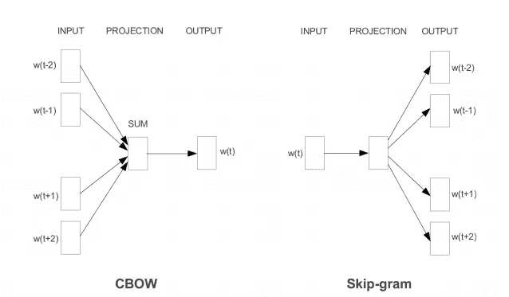
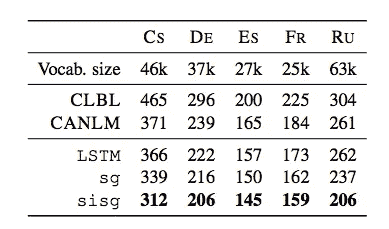
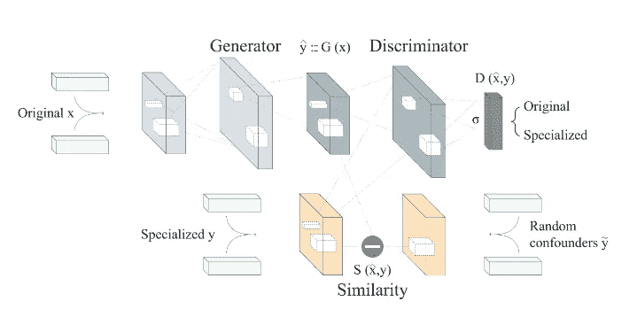
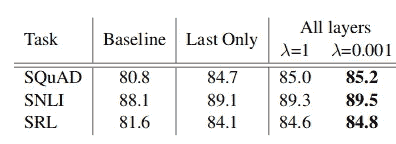
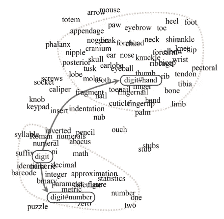
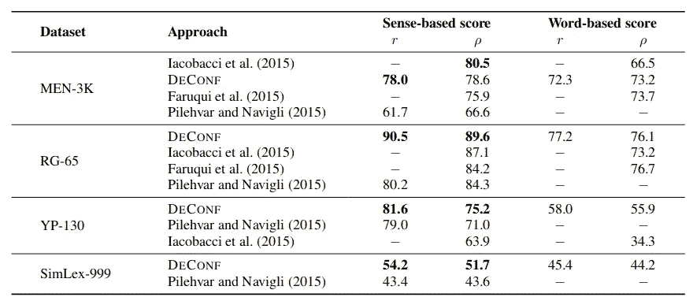

# 超越单词表示的分布模型。

> 原文：<https://towardsdatascience.com/https-medium-com-tanaygahlot-moving-beyond-the-distributional-model-for-word-representation-b0823f1769f8?source=collection_archive---------5----------------------->

在任何基于现代机器学习的 NLP 流水线中，单词矢量化是一个典型的步骤，因为我们不能直接输入单词。在单词矢量化中，我们通常为单词分配一个 n 维向量，以捕捉其含义。因此，这是流水线中最重要的步骤之一，因为不好的表示会导致下游 NLP 任务的失败和意想不到的影响。

单词向量化最常用的一类技术是单词的分布模型。它基于一个假设，即单词的意思可以根据它出现的上下文来推断。大多数深度学习论文使用来自分布假设的词向量，因为它们是任务不变的(它们不是特定于任务的)和语言不变的(它们不是特定于语言的)。不幸的是，分布式方法并不是单词矢量化任务的灵丹妙药。在这篇博文中，我们强调了这种方法存在的问题，并提供了改进单词矢量化过程的潜在解决方案。

分布式模型存在以下问题:

*   **稀有词**:对于语料库中出现频率较低的词，他们没有学习到很好的表征。
*   **混义**:他们把一个词的所有义项混为一谈，比如“bank”这个词可以指“河岸”或“金融机构”。分布模型将这些解释合二为一。
*   **词法缺失**:他们在学习表征时没有考虑单词的词法。例如，单词“evaluate”和“evaluates”具有相似的意思，但是它们被视为两个独立的单词。

幸运的是，有大量的研究致力于解决这些问题。这些方法大致分为三大类，我们将按以下顺序进行探讨:

*   形态学敏感嵌入
*   将语言学或功能约束增加到单词嵌入中
*   处理词义。

# 形态学敏感嵌入

这类技术在学习嵌入时考虑了单词的形态。Fasttext 是这类技术的一个典型例子。它将单词视为字符 n 元语法表示的总和。例如，单词“where”表示为“< wh，whe，her，ere，re >”。每个字符 n 元语法被分配一个向量，该向量随后被用于计算上下文向量和目标向量之间的匹配分数:

当这种方法(sisg)在诸如德语(De)、法语(FR)、西班牙语(es)、俄语(RU)和捷克语(Cs)等形态学丰富的语言的语言建模任务上被评估时，它显示出在不使用预训练的词向量的情况下，以及在不使用子词信息(sg)的情况下预训练词向量的情况下，相对于 LSTM 的改进。

此外，fasttext 可以为从未出现在语料库中的单词提供嵌入，因为它将单词表示为已知字符 n 元语法的总和。在生命科学等领域，像这样的嵌入非常有用，因为语料库中的大多数单词都属于有限词汇量的未知类别(长尾现象)。

向单词嵌入灌输形态学的另一种方法是由 [Morphfitting](https://arxiv.org/pdf/1706.00377.pdf) 提供的。在这项工作中，他们使用[吸引-排斥](https://arxiv.org/abs/1706.00374)方法对嵌入进行后处理，以吸引屈折形态学(单词形式表达有意义的句法信息，例如动词时态，而单词的语义没有任何变化的一组过程)并排斥派生形态学(语义发生变化的新单词的形成)。关于吸引-排斥方法的细节将在下一节讨论。

通过灌输形态学语言约束，Morphfitting 显示了在下表中给出的 10 个标准嵌入上 SimLex 和 SimVerb 的相关系数的增益。

# 将语言学或功能约束增加到单词嵌入中

用于单词空间特殊化的另一类方法是用语言/功能约束对单词嵌入进行后处理。在上一节中我们已经看到了这种方法的一个例子——morph fitting。在这一节中，我们将探讨嵌入特殊化-吸引-排斥的变形拟合中使用的方法。

吸引-排斥是一种后处理技术，它采用预先训练的嵌入，并根据语言约束对其进行特殊化。例如，在 morphfitting 中，语言约束以两组形式表示，如下所示:

表格的上半部分显示吸引集，矩阵的下半部分显示排斥集。使用这些集合，形成小批量，用于优化以下损失函数:

该损失函数中的第一项对应于吸引集，第二项对应于排斥集。第三项保持分布表示。此外，前两个术语还反复灌输反面例子，这是从[段落](https://www.cs.cmu.edu/~jwieting/wieting2016ICLR.pdf)模型中借鉴来的思想。前两项的成本函数由下式给出:

第三项 term 由下式给出:

人们可以使用吸引-排斥来灌输语言限制，这可以用吸引或排斥集来表示，例如“同义词和反义词”或“屈折和派生形态学”。或者，在语言约束不暗示相似或不相似的情况下，不能专门化嵌入，例如，类型“treat”的关系不能使用吸引-排斥来捕获。为了适应这样的功能关系，我们引入了另一种叫做[功能改造](https://arxiv.org/pdf/1708.00112.pdf)的方法。

在功能改造中，关系的语义学习和词空间特殊化同时发生。这是通过用在优化过程中学习的函数替换来自吸引排斥的点积来实现的。

上述公式中的第一项保持分布嵌入，第二和第三项从知识图中吸取正(E+)和负(E-)关系，最后一项对学习的函数执行正则化。

通过预测两个实体 I，j 之间的关系 r，在 snomed-ct 上使用链接预测来测试所学语义在功能改造中的功效。跨四种功能改造的四种关系(“has 发现部位”、“has 病理过程”、“due to”和“cause of”)的结果如下所示:

关于功能改造的更多信息，请参考[克里斯多佛·波茨](https://medium.com/u/5fd85bd5c0c4?source=post_page-----b0823f1769f8--------------------------------)的[博客](https://roamanalytics.com/2018/02/02/retrofitting-distributional-embeddings-to-knowledge-graphs-with-functional-relations/)。如果你正在寻找功能或语言约束来专门化你的嵌入，在[链接的开放数据云](https://lod-cloud.net/)查看互联本体的优秀汇编。

上述方法更新了词汇资源中提供的单词的嵌入。如果你对专门化整个单词空间感兴趣，你可以使用 EMNLP 2018 论文中建议的 Adverserial Propagation([Adversarial Propagation and Zero-Shot Cross-language Transfer of Word Vector Specialization](https://arxiv.org/abs/1809.04163))作者[Ivan vuli](https://medium.com/u/5fdd09d5f3cc?source=post_page-----b0823f1769f8--------------------------------)和[Nikola mrk ii](https://medium.com/u/265d266c8679?source=post_page-----b0823f1769f8--------------------------------))来实现。

# 处理词义

最后，最后一类专门化技术通过考虑上下文或利用词义清单来考虑词义。让我们从前一类的方法开始——ELMO。

在 ELMO，单词是根据上下文进行矢量化的。因此，为了对单词进行矢量化，还需要指定单词出现的上下文。与那些不考虑上下文的矢量化技术相比，这种方法被证明是非常有效的。当比较来自 ELMO 的最近邻居(biLM)和 Glove 时，可以看到相同的例子:

ELMO 背后的基本思想是生成嵌入作为双向语言模型的层的内部状态和字符卷积网络的最终层表示的加权和。

来自 ELMO 的嵌入已经在三个下游任务班、SNLI 和 SRL 进行了测试，发现其提供了超过基线的显著增益:

想了解更多关于 ELMO 的信息，请参考 AllenNLP 的博客文章。

如果您对使用词汇资源从单词的分布表示中提取意义感兴趣，您可以使用 [DECONF](https: //pilehvar.github.io/deconf/) 。在这种方法[中，穆罕默德·塔赫尔·皮莱赫瓦尔](https://medium.com/u/fe29d3794f78?source=post_page-----b0823f1769f8--------------------------------)提出了一种机制，使用以下优化标准从分布式嵌入中压缩感知嵌入:

这里，第一项保持了对有义分布表示的接近，第二项使有义嵌入偏向更接近偏向词。从视觉上来说，这个过程可以通过下面的图片得到最好的描述。

在词汇术语的语义网络(使用词汇资源创建)上使用个性化页面排名算法来计算偏置单词集。

使用 Pearson 和 Spearman 相关性在四个单词相似性基准上评估 DECONF。发现在如下所示大多数任务中获得了最先进的结果。

# 结论

如果你没有足够的训练数据来从零开始学习单词嵌入，我强烈推荐使用上面提到的单词专门化方法来获得一些百分点。对于这个主题更严格的报道，我强烈推荐[Ivan vuli](https://medium.com/u/5fdd09d5f3cc?source=post_page-----b0823f1769f8--------------------------------)在 [ESSLLI 2018](http://esslli2018.folli.info/) 上关于[单词向量专门化](http://people.ds.cam.ac.uk/iv250/esslli2018.html)的课。