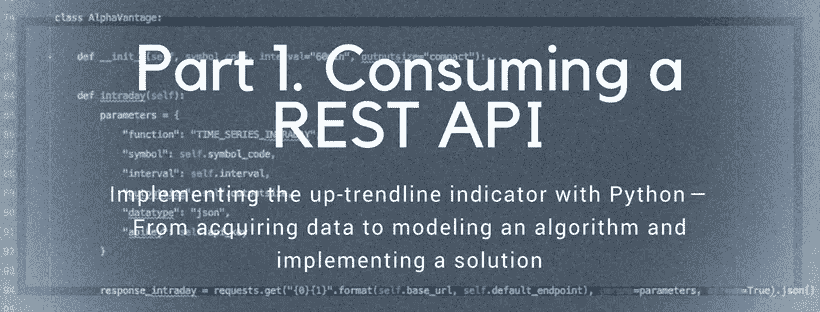

# 用 Python 实现上升趋势线指标——从获取数据到建模算法和实现解决方案——第 1 部分使用 REST API

> 原文：<https://towardsdatascience.com/https-medium-com-vedranmarkulj-implementing-the-up-trendline-indicator-with-python-part-1-10f19939431e?source=collection_archive---------5----------------------->

> *最初发表于*[*【softwarejargon.com】*](https://softwarejargon.com) *在我的博客上找到这篇文章的更新版本*[*【https://softwarejargon.com/blog】*](https://softwarejargon.com/blog/implementing-the-up-trendline-indicator-with-python-from-acquiring-data-to-modeling-an-algorithm-and-implementing-a-solution-part-1-consuming-a-rest-api/)

要求—您应该熟悉以下主题:

*   使用过 python、对象、循环和数据类型。
*   对熊猫和图书馆有一些了解。
*   知道什么是技术分析。

希望更新您的技能或获得上述主题的介绍？我强烈推荐以下资源:

*   [金融市场技术分析:交易方法和应用综合指南](https://www.amazon.co.uk/gp/product/0735200661/ref=as_li_tl?ie=UTF8&camp=1634&creative=6738&creativeASIN=0735200661&linkCode=as2&tag=easyanalysis-21&linkId=ff995c1d3d358e81c465a31172d4c655)
*   熊猫图书馆文档。但是，如果你真的想以结构化的方式学习 Pandas 进行数据分析，我强烈推荐阅读 [Python for Data Analysis:与 Pandas、NumPy 和 IPython 的数据角力](https://www.amazon.co.uk/gp/product/B075X4LT6K/ref=as_li_tl?ie=UTF8&camp=1634&creative=6738&creativeASIN=B075X4LT6K&linkCode=as2&tag=easyanalysis-21&linkId=38e1f54dd980a8ec0511d0bdefc74e14)
*   [请求库文档](http://docs.python-requests.org/en/master/)

这是关于处理股票价格数据和用 Python 实现上升趋势线指标的系列文章的第一篇。完整系列将详细描述技术指标上升趋势线的实现。本文将描述解决方案中使用 REST API 的部分，这将为我们提供后续文章中需要的数据。

# 上升趋势线指示器的简要说明

在技术分析中，最著名和简单的技术指标是上升趋势分析。该指标本质上是一条直线，因此在查看图表时相对容易识别。图案是一条直线，至少要经过三个点。线的斜率必须增加，并且不能被图中更靠前的点打断。

上升趋势线表明；股价将继续高于趋势线，因此将继续上涨。如果在任何时候股价触及趋势线，并因此穿过趋势线；这预示着股票价格将有下跌的趋势。请参见下图。

如果你想学习更多关于指标和技术分析的知识。你可以在这里找到更多信息。

# 这就是我们将在本文中构建的内容

首先，你需要在你的机器上安装 Python。我建议安装[蟒蛇](https://www.anaconda.com/download)；在我看来，在本地使用 python 最简单的方法。但是在本文中，我不会详细介绍开发环境的设置。然而，这个问题将会在一篇关于[安装 Anaconda 和建立开发环境](http://www.easy-analysis.com/python-data-science-environment-setting-up-anaconda-environments-for-working-on-data-science-problems-using-python/)的独家文章中讨论。

本文的其余部分将关注:

*   如何连接到 [Alphavantage](https://www.alphavantage.co/) REST API？
*   处理数据并将其放入熊猫数据框。
*   使用 pandas 数据框架，为实际分析做准备。

# 连接到 Alphavantage

首先你需要有一个 API 密匙。这可以通过访问以下链接获得:[https://www.alphavantage.co/](https://www.alphavantage.co/)选择“立即获取免费 API 密钥”。

这里我假设您已经安装了 Anaconda 并创建了一个安装了 Python 2.7.xx 的环境。

您还必须在使用的环境中安装以下库:

*   json
*   要求
*   熊猫

接下来创建。py 文件。创建以下内容。项目文件夹中的 py 文件:

*   get _ historical _ data.py
*   get_main_df.py

## 文件“get_historical_data.py”

首先，您需要导入我们将在 get_historical_data.py 文件中使用的所有必要的库。

然后，我们感兴趣的是创建一个新的类，它将包含连接到 REST API 和检索必要数据所需的所有必要方法。

我们将这个类命名为`AlphaVantage`。这个类需要一个`__init__`方法，该方法将在类的实例化时被调用。`__init__`方法应该如下所示:

现在我将逐行检查每一行代码。我们已经通过定义 inline 5 创建了一个类。在第 7 行，我们定义了`__init__`方法。该方法将接受三个参数，其中两个将具有默认值，这意味着它们在调用该类时是可选的。在`__init__`方法中，第 8 行到第 13 行之间定义了六个变量。

*   `self.base_url`包含值`"https//www.alphavantage.co"`。每次我们需要构建调用 REST API 的 url 时，都会用到这个值。
*   `self.default_endpoint`包含值`"/query"`。这个值是我们将多次调用的 REST API 的端点之一。因此，我们想把它放在`__init__`方法中，从而避免多次定义它。
*   `self.api_key`在这里，您需要输入从 Alphavantage 检索到的 API 密钥。
*   `self.symbol_code`该变量的值由参数`symbol_code`设置，我们将在实例化该类时解析该参数。
*   `self.interval`由参数`interval`设置，其默认值设置为`"60min"`。这个变量稍后将在调用 REST API 提供的一个端点时用作参数。
*   `self.outputsize`是由参数`outputsize`设置的变量，其默认值也设置为`"compact"`。这个变量也将在以后调用 REST API 端点时用作参数。

到目前为止，我们已经包含了所有必要的库，定义了一个类，并在该类中创建了我们的`__init__`方法。现在我们将在 AlphaVantage 类中创建一个名为`intraday`的额外方法。

`intraday`方法不接受任何参数，除了`self.`如果你想了解`self`在 Python 中做了什么，我建议阅读[这篇](https://www.programiz.com/article/python-self-why)文章。

`intraday`方法的目的是用一些参数调用特定的端点，并以 JSON 的形式返回响应。为了调用 REST API，我们使用请求库，更具体地说，我们将使用`requests.get()`方法。这个方法有许多参数。我们将提供以下内容:

*   我们要调用的 url。我们在第 21 行构建 url，特别是部分`"{0}{1}".format(self.base_url, self.default_endpoint)`。如你所见，我们使用了在`__init__`方法中定义的一些变量。
*   我们还必须提供 REST API 端点需要的参数。为此，我们将构建一个名为`parameters`的字典，包含一些键和值。第 12 到 19 行定义了 dict 及其键和值。dict 中的键和值，每一个都代表一个参数，REST API 端点需要这个参数来响应期望的输出。

让我们来看看在我们的字典`parameters`中定义的一些参数。

*   `"symbol"`该键的值被设置为变量`self.symbol`。我们需要向端点提供这个参数，以便指定我们想要查看哪个公司的股票价格。
*   `"interval"`该键的值被设置为变量`self.interval`，其值为`"60min"`。这意味着我们需要每小时一天的数据，每天有 24 个数据点。
*   `"outputsize"`该键的值被设置为变量`self.outputsize`，其值为`"compact"`。简而言之，这意味着我们将收到我们请求的任何给定`"symbol"`的最新 100 个数据点。

如果您想了解这个特定端点的更多信息，以及 Alphavantage REST API 的一般信息。我建议看一下[文档](https://www.alphavantage.co/documentation/)。

所以现在我们已经定义了方法`intraday`，其中我们调用了 Alphavantage REST API 中的一个特定端点。此外，我们还在 dict 中定义了所有必要的参数，并将 dict 作为参数提供给第 21 行的`requests.get()`方法。最后，我们方法的最后一部分，第 23 行，返回我们从调用的 REST API 收到的响应。

现在我们将在我们的类`AlphaVantage`中实现另一个叫做`daily`的方法。

这个方法和上一个很像。`daily`方法的目的是每天而不是当天返回股票价格数据。为此，这种方法与以前的方法相比有两个不同之处。在第 13 行，键`"function"`的值现在被设置为`"TIME_SERIES_DAILY”`，我们不再有键`"interval"`。其他一切都保持不变，因此这种方法不需要额外的解释。

最终的 get_historical_data.py 文件现在应该如下所示:

## 文件“get_main_df.py”

对于这个文件，你需要导入库`pandas`和`json`，此外你还需要从文件 get_historical_data.py 导入`AlphaVantage`类

我们现在对创建一个名为`get_main_data_frame`的新函数感兴趣。这个函数将包含我们在 get_main_df.py 文件中实现的所有逻辑。

我们想在函数中做的第一步是调用`AlphaVantage`类，以便获得一些我们可以使用的数据。我们将这个实例命名为`historical_data_daily`。

注意，我们还调用了方法`daily()`，它是在类`AlphaVantage`中实现的方法之一。这意味着我们将接收每日数据，而不是当天数据。

下一个代码片段包含大量代码，但是，主要重点是遍历调用 Alphavantage REST API 所收到的响应。

在第 15 和 16 行定义了两个空列表。`list_keys`将包含所有与我们相关的键，而`list_historical_data_daily`将包含我们想要处理的所有数据。在这里，我假设您有一些使用 dicts 和 JSON 数据的基本知识。

第 17 行和第 18 行遍历在键`"Time Series (Daily)"`中找到的所有键。我们找到的每个键都被附加到`list_keys`。在这种情况下，每个键实际上代表一个日期。

第 20 到 40 行做了几件事。首先，我们访问`list_keys`中每个键的数据，并将其赋给变量`data`。然后识别出四个数据点`price_open`、`price_high`、`price_low`和`price_close`。所有四个变量都将包含一个代表给定日期价格的数值。

接下来，用关键字定义字典。这将是我们每天想要保存的数据。dict 包含一个日期和一个符号，以及四个价格值。最后，该字典被附加到`list_historical_data_daily`。

可以在下一个代码片段中看到的代码的其余部分集中在与 pandas 一起工作，以便为进一步的分析准备数据。

我们要做的第一件事是将所有存储在`list_historical_data_daily`中的数据转换成熊猫数据帧。这是在第 15 行完成的。

*   第 20 行创建了字段`'date_str'`。此字段源自“日期”字段。
*   第 21 行将字段`'date'`设置为数据帧的新索引。
*   第 22 行对索引进行排序。默认排序是升序，这意味着最早的日期排在最前面。
*   第 24 行创建了字段`'price_close_lag'`。本栏位显示前一天的收盘价数据。当我们在随后的文章中想要比较今天的价格和前一天的价格时，这将是有用的，以便确定价格的方向。
*   第 25 行创建了字段`'price_close_lag'`。该字段显示明天的收盘价格数据。与前一个字段一样，该字段也将有助于后面的价格比较分析。
*   第 27 行创建了字段`'date_id'`。该域从 1 开始递增一个 int 值。熊猫数据框按升序排序很重要。因此，以前索引是一个日期值，按升序排序。

最后返回名为`df`的数据帧。

最终的 get_main_file.py 文件现在应该如下所示:

希望这篇文章可以提供一些关于如何开始处理股票数据、从哪里获取数据以及如何开始准备数据以应用算法的想法。

下一篇文章的第 2 部分将关注技术指标上升趋势线的实现。我希望你准备好了，因为这将会有点复杂，但相反更令人兴奋。

如果你有兴趣了解我更多。请访问我在 LinkedIn 上的个人简介[https://www.linkedin.com/in/vedranmarkulj/](https://www.linkedin.com/in/vedranmarkulj/)

感谢阅读。如果你对我写的关于机器学习和类似主题的未来帖子感兴趣，请在 [Medium](https://medium.com/@vedranmarkulj) 和 [LinkedIn](https://www.linkedin.com/in/vedranmarkulj/) 上关注我。更多文章即将发表。