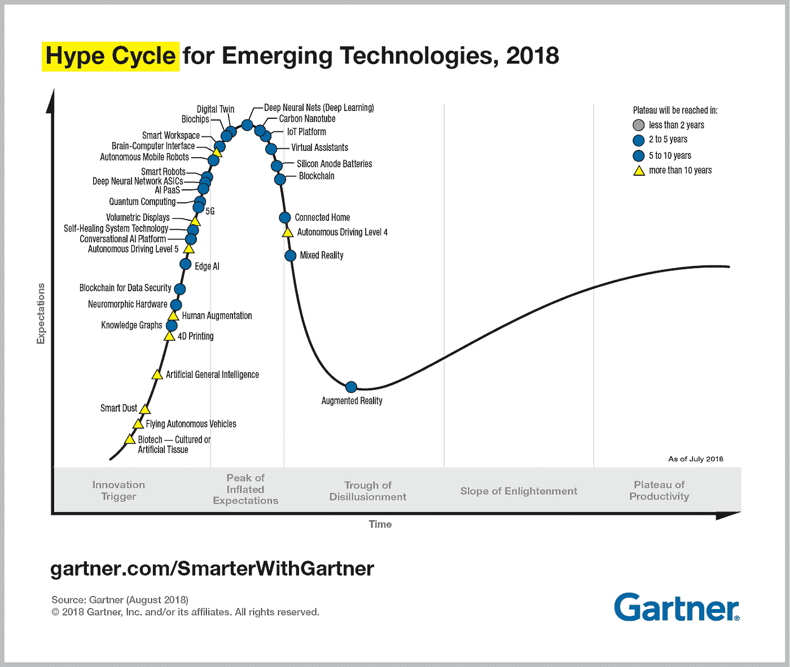

# 从 2018 年纽约人工智能峰会吸取的 5 个关键教训

> 原文：<https://towardsdatascience.com/https-medium-com-vishalmorde-lessons-learned-from-ai-summit-d7c071cb4c06?source=collection_archive---------17----------------------->

## 炒作、现实、道德、颠覆等等…

2018 AI Summit, NYC, [https://theaisummit.com/newyork/](https://theaisummit.com/newyork/)

本周早些时候，我很高兴参加了在纽约市雅各布贾维茨中心举行的 2018 年人工智能峰会([@ Business _ AI](https://twitter.com/Business_AI)[# AISummit](https://twitter.com/hashtag/AISummit?src=hash))。这是一个会见领先的人工智能研究人员、思想领袖和同行的绝佳机会。

# 人工智能峰会:

现在是第三年，人工智能峰会是专注于企业人工智能应用的最负盛名的会议之一。3，000 多名与会者，300 多名发言人和 150 多场会议，峰会为每个人提供了一些东西。所有通常的嫌疑人都出席了，包括谷歌、亚马逊、微软，当然还有机器人索菲亚( [@RealSophiaRobot](https://twitter.com/RealSophiaRobot) )，汉森机器人的人工智能倡议。就连金融机构也以高盛、摩根大通、花旗、第一资本、美洲银行和巴克莱为代表。这些会议很好地结合了案例研究、商业见解和来自各个行业的技术解决方案。以下是我在峰会经历中的 5 个要点。

# #1:我们超越了宣传

几年前，人工智能被认为是世界上所有问题的解决方案。它应该让世界变得更好，这样我们就可以永远幸福地生活下去！今年，我们听到了人工智能悲惨失败的故事，包括令人沮丧的故事[在亚利桑那州坦佩发生的无人驾驶车祸](https://money.cnn.com/2018/03/19/technology/uber-autonomous-car-fatal-crash/index.html)，以及[亚马逊 Alexa 在德国慕尼黑开始她自己的派对](https://www.telegraph.co.uk/news/2017/11/08/alexa-nein-police-break-german-mans-house-music-device-held/)的欢乐。

另一个现实检验是人们意识到，人工智能的好坏取决于它可以从中学习的数据。一个接一个的演讲者指出，“人工智能战略”始于“数据战略”，我们需要以正确的顺序攀登“[人工智能金字塔”](https://hackernoon.com/the-ai-hierarchy-of-needs-18f111fcc007)。这种回归基础的支点表明，我们正处于拐点，并准备超越早期的人工智能宣传。

# #2:“人工智能即服务”是一个令人兴奋的命题

AI 的民主化是会议最突出的主题之一。需要博士学位来构建机器学习算法的日子已经一去不复返了。随着云服务提供商的出现，强大的算法只是一个简单的 API 调用。这些解决方案大大降低了更大的商业社区的准入门槛。

> “人工智能就是将不可描述的自动化”——Cassie Kozyrkov，谷歌

Cassie Kozyrkov([@ quae Sita](https://twitter.com/quaesita))发表了一篇精彩的主题演讲，讲述了谷歌如何通过云计算和发展决策智能学科来实现人工智能的民主化。AWS 和微软 Azure 等其他云服务提供商展示了利用现成人工智能能力的强大解决方案。此外，来自 SingularityNET 的 Ben goertz El([@ bengoertz El](https://twitter.com/bengoertzel))倡导“去中心化的人工智能”，将人工智能和区块链融合在一起，创造一个开放的市场。对于确保未来人工智能发展的民主化，这是一个有趣的提议。

# #3:可解释的人工智能是真实存在的:

深度学习被誉为“黑盒”方法，但模型可解释性是一个活跃的研究领域。为了提高透明度和可解释性，分享了几个建立“玻璃盒子”模型的成功案例。这里有几个可解释人工智能领域的有趣项目:

*   反向时间注意力模型([RETAIN](https://github.com/mp2893/retain)):RETAIN 模型的开发是为了帮助医生理解为什么一个模型可以预测有心力衰竭风险的患者。
*   局部可解释的与模型无关的解释( [LIME](https://github.com/marcotcr/lime) ):一个在决策做出后提供解释的临时模型。
*   逐层相关性传播( [LRP](https://github.com/atulshanbhag/Layerwise-Relevance-Propagation) ):这对于计算机视觉通过在神经网络中运行反向传递来识别重要像素特别有用。

# #4:金融机构颠覆的时机已经成熟

此次峰会有一个单独的“人工智能在金融”环节，来自全球银行和金融科技的演讲人讨论了金融领域的最新趋势。关键的人工智能用例包括欺诈/合规/网络防御的异常检测，机器人顾问的专家系统和聊天机器人/虚拟代理的客户体验。

> “当我们考虑人工智能/人工智能时，它是关于消除摩擦，为客户提供无缝体验”——加文·迈克尔，花旗银行

特别是亚马逊连接和谷歌联络中心，我最近宣布了联络中心人工智能解决方案，承诺更高的效率和更低的运营成本。专家们一致认为，人工后台银行操作可能是人工智能投资在不久的将来的目标。

# #5:负责任的人工智能势在必行

去年 7 月，技术界的两位最大人物就人工智能的未来展开了一场非常公开的争论。埃隆·马斯克认为人工智能将导致人类的灭亡，而马克·扎克伯格认为人工智能实际上将有助于进一步创新。两人在社交媒体上争斗，交换琐碎的言论，但本质上两人都代表了人工智能的对立双方:天启与涅槃。无论如何，商业界已经意识到，一般的或“类似人类”的智能要遥远得多，并将其努力集中在具有巨大就业增长潜力的特定领域有影响力的人工智能应用上。

> “我们看到人工智能正在帮助人们的工作……同时也开辟了新的工作机会”——Beth Smith，IBM Watson

尤其是“负责任的人工智能”这一主题贯穿了每一次演讲。几位发言者谈到了将“信任”整合为工程原则之一，并将道德和价值观嵌入为人工智能交付成果的一部分。

> “我们需要创造负责任的人工智能，这样我们才能给技术带来信任”——大卫·卡莫纳，微软

IBM 已经创建了 [AIFairness360](https://www.ibm.com/blogs/research/2018/09/ai-fairness-360/) ，这是一个开源工具包，用于减轻机器学习模型中不必要的偏见，以及[对抗性鲁棒性工具箱](https://github.com/IBM/adversarial-robustness-toolbox)，用于分析机器学习模型的攻击和防御方法。纽约市最近通过了第一项法案来检查政府机构中的“算法偏见”。在可预见的未来，负责任的人工智能可能会成为技术、社会学和政治讨论的焦点。

总的来说，这是一次了不起的学习经历，有精彩的演讲、演示和小组讨论。我真的很喜欢与其他人工智能专业人士互动，并能够在行业内建立有价值的联系。感谢 AI Summit([@ Business _ AI](https://twitter.com/Business_AI)[# AISummit](https://twitter.com/hashtag/AISummit?src=hash))举办了一场现象级的大会！