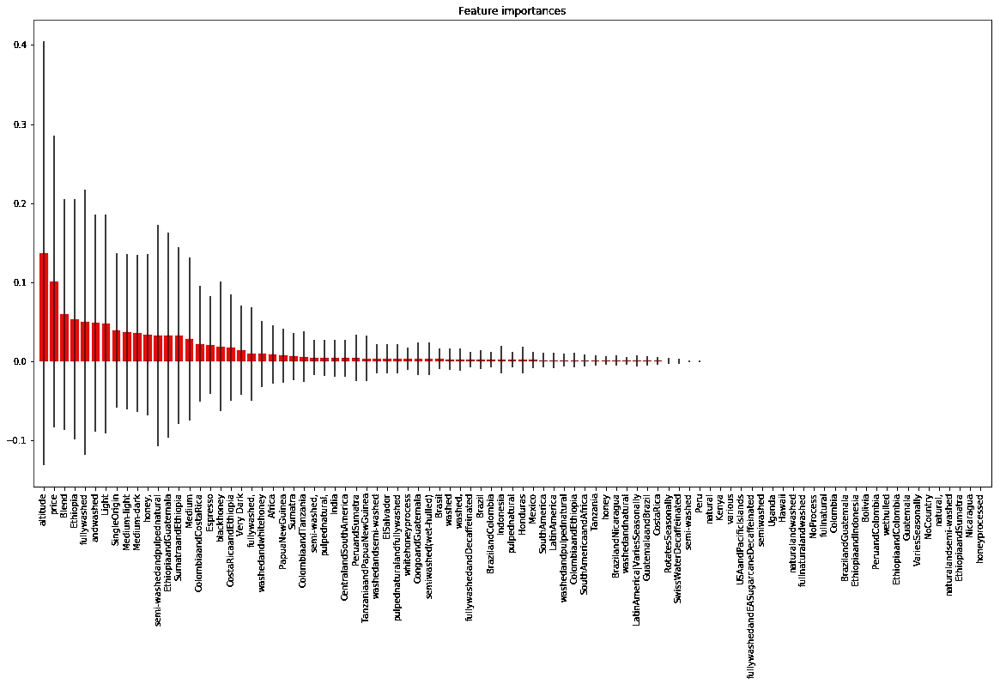

# 咖啡势利和机器学习的故事

> 原文：<https://towardsdatascience.com/https-medium-com-yoni-levine-coffee-snobbery-45ed534136e5?source=collection_archive---------8----------------------->

机器学习能帮助我们找到一杯完美的咖啡吗？

“Snobs come in all shapes and sizes. In the food world you’ll find some of the biggest snobs around, those who only eat the most hand-foraged or urban-farmed, artisanally crafted, truffled morsels. But no snob is more outrageously self-righteous than the coffee snob”

我们都有这样的朋友，那个令人讨厌的朋友，他认为自己比任何人都好。他们鄙视星巴克，大规模生产咖啡，一边喝着他们的早茶，一边大声宣称“葡萄酒的味道、馅饼皮和活泼的草莓酸味在舌头上跳舞”🙄。

嗯，就是我！

我决定将我对咖啡的热爱与我对机器学习的热情结合起来，尝试回答世界上最紧迫的问题之一:是什么造就了一杯完美的五星咖啡？

> 是什么造就了⭐️⭐️⭐️⭐️⭐️☕️那杯完美的五星咖啡？

第一步是获得一些数据。我使用一个名为 Selenium 的 Python 包来收集近 500 种咖啡、它们的评级、评论和许多其他细节的【mistobox.com (我使用的一种奇妙的咖啡订阅服务)。

痴迷于一杯咖啡需要考虑很多因素——原产国、品种、海拔、加工方法、烘焙方式、混合与单一产地，当然还有品尝记录。

> **这些特征中的任何一个能帮助预测哪种咖啡会获得五星评级吗——还是人们的口味太多样化了，以至于无法确定哪种咖啡胜出？**

一旦我清理和组织了所有的数据，我就开始做*探索性数据分析* ( *EDA)。EDA 正在探索和可视化我们的数据，以帮助我们了解我们的数据是什么样的。有多少台烘烤机？一杯咖啡的平均等级是多少，什么应该被认为是一杯特别的咖啡？*

我还使用了*自然语言处理(使用文本作为我们的输入特征，而不仅仅是数字)，*使用用户留下的书面评论来创建额外的特征，从而为我们的数据集增加更多价值。我认为任何分数高于 80 分的咖啡都是“好”咖啡。

> 我认为任何分数高于 80 分的咖啡都是“好”咖啡。

机器学习(为了掩盖整个博士课程的知识价值)是指我们使用数学公式和大量数据来看看我们是否能发现模式并做出预测。它通常集中在这个问题:**给定输入 X，正确的预测 Y 是什么？**在这种情况下，假设一种咖啡有 X 个因素(国家、品种等)，我们能否预测它是否会得分高于 4 星(我们的输出 Y)？

我尝试了几种流行的机器学习模型，最终使用了一种叫做[随机森林](https://www.quora.com/How-do-you-explain-decision-tree-and-random-forests-in-layman%E2%80%99s-terms)的算法对我们的咖啡进行分类。随机森林模型的一个伟大之处在于，我们可以回顾过去，看看我们的模型在做出决策时发现哪些特征是重要的。

Feature importances of our model. Note that it could be important in determining a good or bad coffee.

该模型确定了四个最重要的特征，即海拔、价格、混合和埃塞俄比亚。这与我在 EDA 中观察到的情况非常吻合，生长在高海拔和更贵的咖啡比低海拔和更便宜的咖啡得分更高。埃塞俄比亚是我最喜欢的咖啡种植区，也比其他国家得分高。此外，混合咖啡比标有浓缩咖啡或单一产地的咖啡得分更低。

虽然我们的特性确实有意义，但我们仍然需要看看我们的模型实际上表现如何。我们的准确率是 76 分，这听起来还不错，直到我们考虑到 75%的咖啡被贴上“*不太好*”的标签。我们的模型甚至没有超过基线准确度(对于每一种咖啡，仅仅猜测*是*或*否*所得到的准确度分数)，所以它实际上没有做得很好。

因此，虽然从准确性的角度来看这个项目不是很好，但它仍然是一个有趣的工作，也是一个很好的学习经历。似乎人们对咖啡的偏好差异太大，很难选出一个明确的赢家，*还是我们没有足够的数据？*

对你来说，怎样才是一杯完美的咖啡？你做过类似的项目吗？留言评论！

想看看我的代码或问我一个问题吗？看看我的 [GitHub](https://github.com/yonilevine/profile) 或者和我在 [LinkedIn](https://www.linkedin.com/in/yoni-levine/) 上聊天。