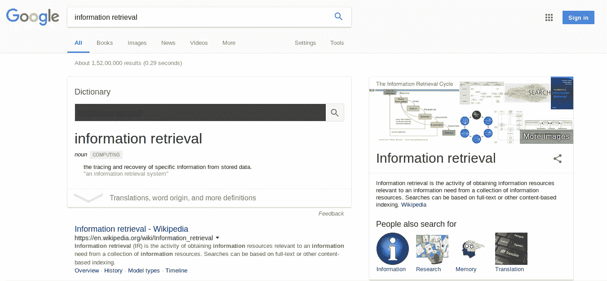
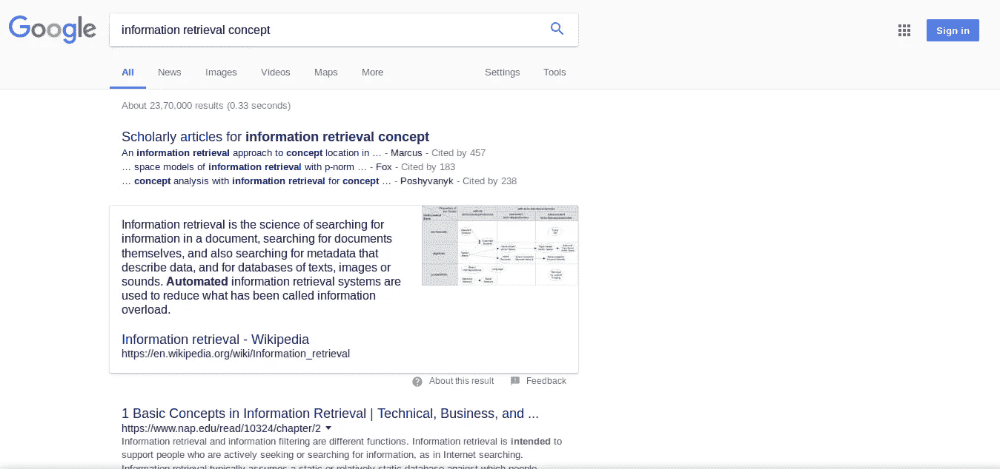
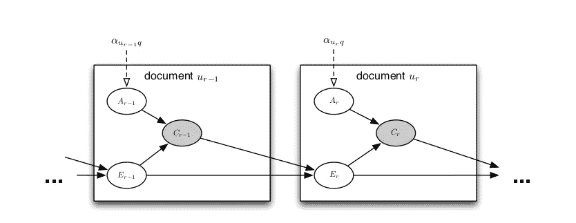
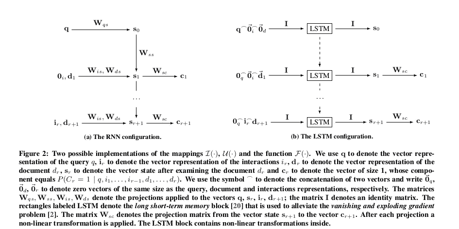

# 搜索引擎和神经网络

> 原文：<https://towardsdatascience.com/https-towardsdatascience-com-search-engines-and-neural-networks-97e0df4f088d?source=collection_archive---------5----------------------->

在我们的生活中，没有一天我们不使用谷歌,“谷歌搜索”这个术语已经悄悄进入我们的生活，现在已经成为一种必需品。我们想到的第一个问题可能是谷歌是如何做到的？谷歌，作为一个已经进入如此多专业领域的公司，但对于一个门外汉来说，谷歌总是“搜索引擎”的同义词。搜索结果中的付费广告在公司收入中扮演着重要的角色。他们的搜索引擎有很多竞争对手，比如日本的**雅虎**，俄罗斯的 **Yandex** 等等，但是没有一家像谷歌一样吸引了全球的关注。那么这个搜索引擎背后是什么呢？它崛起了，它仍然是搜索引擎中最好的原因与它的底层架构有很大关系。它们背后的主要概念是什么？

信息检索就是这样一个概念，它涉及对搜索引擎的研究。

> **信息检索** ( **IR** )是从信息资源集合中获取与信息需求相关的[信息](https://en.wikipedia.org/wiki/Information)资源的活动。搜索可以基于[全文](https://en.wikipedia.org/wiki/Full-text_search)或其他基于内容的索引。

这是搜索术语时最相关结果的第一行。这来自它的维基百科页面，因为谷歌已经将维基百科整合到他们的搜索结果中。聪明的策略？当然，鉴于维基百科拥有所有常用词汇和技术的最可信数据集。

Google’s Result Page for ‘Information Retrieval”

这里可以清楚地看到 dictionary 元素的使用。他们有自己的字典，如果这个单词有共同的意义或者不是很多单词的组合，它会显示为第一个结果。基本上，如果与搜索的单词直接匹配，它会显示字典作为结果。在这种情况下，所有部分案例都将被忽略。例如，如果我在前面的查询中添加了单词 concept，那么字典结果不会显示出来。

Google’s Result Page for “information retrieval concept”

现在有一个不同的方法，显示了维基百科页面的预览。如果我们以这种方式继续下去，谷歌的搜索平台将有大量的东西可以探索。让我们回到这里的概念。信息检索:从网络上检索信息并与用户的查询相匹配的概念。给用户提供最相关的结果是搜索引擎行业的标准。我经常使用谷歌的“我感觉很幸运”来查询显而易见的问题的原因。那么他们用什么模型在我们的搜索结果中对页面进行排名呢？

PageRank:-以谷歌创始人之一拉里·佩奇命名的算法最初被称为 BackRub，当时它仍是斯坦福大学的一个研究项目，因为它用于跟踪反向链接以确定网站的重要性。这不是决定页面排名的唯一算法。有超过 250 个其他指标显然是一个秘密，所以我们每天得到的搜索结果是不掺杂的。

咖啡因升级:-推出于 2009 年，这次升级提高了获得搜索结果的速度和更新的索引架构。随着来自微软的 Bing 的竞争，他们转向了 Bigtable，公司的分布式数据库平台。

蜂鸟升级:-蜂鸟是世界上最小也是最快的鸟之一。为了证明这次升级的名称，谷歌在 2013 年增加了改进的功能，在搜索结果中包括网站的特定相关页面，而不是网站的主页。有一个明确的重点是人类搜索互动，从而使它成为一个更好的搜索引擎。

谷歌还做了许多其他改变，比如为用户提供更好的搜索引擎优化功能、知识图表(2012 年)、专用移动搜索结果(2016 年)等等。除了谷歌在他们的产品上所做的，搜索引擎还有其他的进步。从我收集的资源来看，其中最重要的是神经网络在网络搜索中的应用。神经网络已经存在了很长一段时间，但没有人想到过使用深度神经网络来改进搜索引擎，直到 2016 年发表了一篇题为“[网络搜索的神经点击模型](https://staff.fnwi.uva.nl/m.derijke/wp-content/papercite-data/pdf/borisov-neural-2016.pdf)”的研究论文

用户行为是改进搜索引擎的关键部分。这就是点击模型发挥作用的时候了。下面是研究论文中的一部分，对其进行了总结

> 这些模型也称为点击模型，因为主要观察到的用户与搜索系统的交互涉及点击，这些模型用于点击预测，并且它们可以在我们没有真实用户进行实验或者因为害怕伤害用户体验而不愿意与真实用户进行实验的情况下提供帮助。点击模型还用于改进文档排名(即，从点击模型预测的点击中推断文档相关性)、改进评估度量(例如，基于模型的度量)以及通过检查点击模型的参数来更好地理解用户

**点击模型的两种方法**:

*   PGM(概率图形模型):用户行为被表示为一系列可观察和隐藏的事件，如点击、跳过和文档检查。现在为了更好地理解，把一个事件想象成一个有向图。它有一些有向边形式的依赖关系。现在，在基于 PGM 的点击模型中，我们必须手动设置这些依赖关系的结构。不同的车型(UBM、DBN、CM 等)有不同的标准。下图清楚地证明了有向图的工作原理。

Cascade Click Model Representation(From this [Survey](https://clickmodels.weebly.com/uploads/5/2/2/5/52257029/mc2015-clickmodels.pdf))

*   DR(分布式表示方法):在这里，用户行为被表示为向量状态，这些向量状态以他/她的信息需求和会话期间消耗的信息的形式捕获用户的行为。这让我们能够挖掘比 PGM 的二进制事件更复杂的模式。神经点击模型是基于这一概念的方法。该模型学习与传统点击模型中使用的概念相似的概念，并且它还学习其他不能手动设计的概念。

在这个神经点击模型中，用户行为被建模为用户信息需求的分布式表示的**序列**和用户**在搜索**期间消费的信息。与现有的点击模型相比，所提出的框架的主要优势是用户行为模式可以直接从交互数据中学习，这
允许我们捕获比
现有点击模型中硬编码的用户行为模式更复杂的用户行为模式。Yandex(俄罗斯流行的搜索引擎)的资源被用于评估该模型，并且在点击预测和相关性预测任务中有显著的改进。

Different configurations of NNs explained in the research paper

谷歌在这方面的进展如何？就像可口可乐的配方一样，谷歌搜索中的精确算法是一个秘密。尽管不可否认，他们从 2016 年开始在自己的架构中使用深度神经网络。这里有一篇[连线文章](https://www.wired.com/2016/02/ai-is-changing-the-technology-behind-google-searches/)更详细地讨论了这个话题。每个人都确信的一件事是，神经网络是信息检索中的下一件大事。从 WSDM 2018(网络搜索和数据挖掘)到 ECIR 2018(欧洲信息检索会议)的所有会议都有关于同一主题的[演讲](http://nn4ir.com)。

作为临别赠言，我想说这篇文章可能在你的脑海中引起了更多的疑问。这只是我在不久的将来将要做的一系列文章的介绍，这些文章将对包括神经点击模型在内的每个模型进行更深入的分析(以及代码片段)。