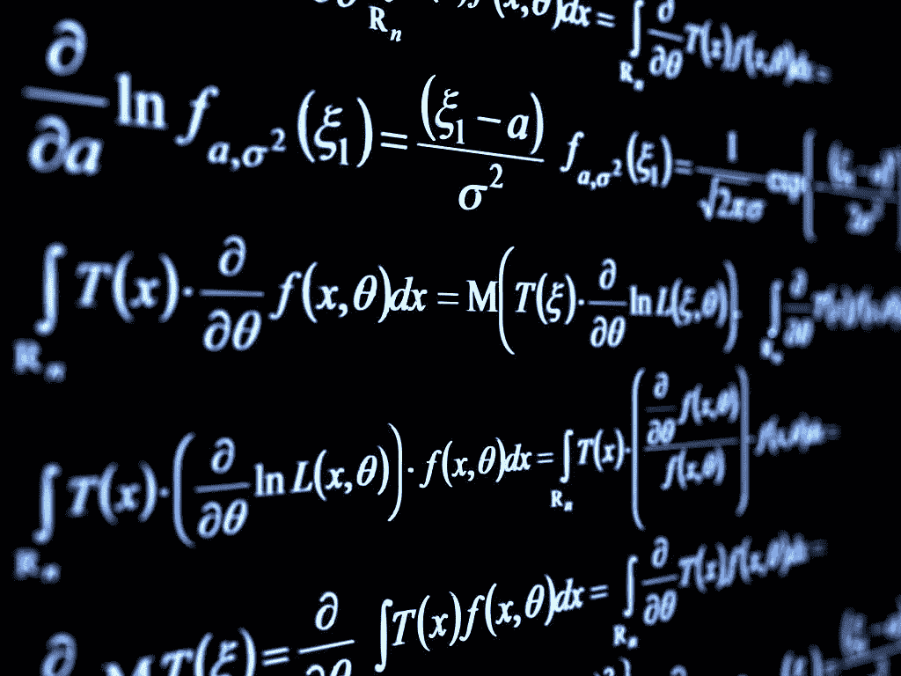

# 人文专业毕业生应该考虑数据科学

> 原文：<https://towardsdatascience.com/humanities-graduates-should-consider-data-science-d9fc78735b0c?source=collection_archive---------2----------------------->

我的职业轨迹有些不寻常。早在 2009 年，我本科毕业，获得了古典语言学位，不久后又获得了同一领域的硕士学位，之后继续攻读博士学位。和大多数人文学科的研究生一样，我的计划是在大学里研究和教授我的专业领域。

但是我没有完成。相反，我进入了工业界，在过去的五年里，我逐渐占据了更多的定量职位，从研究分析师开始，最近开始担任数据科学家的角色。虽然从学术界到数据科学的转变对于 [STEM 博士](https://medium.com/@drewwww/what-ph-ds-do-wrong-and-right-when-applying-for-data-science-jobs-85b001c00b62)来说相当普遍，但对于具有人文背景的毕业生来说，这种情况要难得多。尽管如此，我怀疑我这种转变的动机，以及使之成为可能的技能，事实上是许多人文学科研究生所共有的。这篇文章旨在帮助任何有兴趣走类似道路的人。

# 为什么选择数据科学

在我攻读博士学位的第一年，我开始质疑我的职业选择，在很大程度上，我的担忧可能是所有领域的研究生的典型问题:我担心找学术职位的难度，担心毕业后我是否能住在我想住的地方，担心我的研究是否会被认真对待。

但是除了这些实际问题，我也开始思考人文学科对待研究的方式，以及它的认识论基础的有效性。像学术界的许多人一样，最初吸引我从事研究的是产生知识的前景，但在我学术生涯的几年中，人文学科提供的工具集开始让我觉得不足以完成这一目标。从我当时的观点来看，我的研究过程是基于批判性阅读、反思和写作，在产生独特而有趣的视角方面是有效的，但在创造关于世界的新知识方面却不是。

对于有这种担忧的人来说，有些自然的是，我开始寻找其他可以创造知识的框架，并很快被科学的定量方法所吸引，因为它们提供了一种客观性，这是我的研究中一直缺乏的。不久之后，我被基于证据的研究和可证伪假说的想法所说服，但我也怀疑人文学科的博士学位并不是探索这类方法的最佳场所，所以我将工业视为一个成长和锻炼我的定量研究技能的地方。

# 数据科学只是研究

在接下来的几年里，我学习了定量研究的专用工具:应用统计学、假设检验、编码和分布式计算。我喜欢技术主题，并且在我的各种角色中找到每一个深入研究它们的借口。但是，通常情况下，我发现自己使用的最适用和最重要的技能是我在人文学科研究生时学到的。阐明研究问题，交流假设，解决研究人员的主观性和证据的不确定性问题——这些是我作为一名行业研究人员面临的最困难的挑战。

的确，我需要了解统计学，以及如何编写代码来有效地履行这些职责，但是这些知识是已知的。事实证明，伟大的数据科学家和普通的数据科学家之间的区别在于研究人员处理同样的不确定性的能力，这种不确定性最初曾驱使我从人文学科转向定量研究。换句话说，科学方法论和人文学科有着同样的认识论问题——他们只是用不同的工具来解决这些问题。

# 一些实用的建议

我的经历让我相信，对于一名行业数据科学家来说，研究生人文学科的工作实际上是最有用的背景之一。虽然经常有很多人关注数据科学家是统计或编码方面的专家，但这些工具只是达到目的的一种手段——对于进行伟大的数据科学来说，它们是必要的，但还不够。如果你是一名人文学科的研究生，并且对数据感兴趣，我会对你在这个领域取得成功的能力充满信心，因为你的技术水平不高。具体来说，作为人文学科研究生的经历使你成为以下领域的专家:

1.  深入主题，自学任何东西
2.  陈述研究问题，并用证据支持你的答案
3.  传达你的方法的限制和假设

在我看来，这些宽泛的研究技能比任何特定定量方法的细节知识更有价值(也更稀有)。重要的是，第一点意味着人文学科的研究人员可以根据需要随时学习任何特定的方法论。也就是说，从人文科学成功过渡到数据科学需要一些基础知识。

首要任务是建立概率统计知识。把这些工具想象成文学或社会政治理论的科学等价物:它们是抽象的方法，你应用于一个特定的领域，努力回答一个特定的问题。

我不喜欢大多数新数据科学家在学习统计学时通常采取的漫无目的的方法。经常有一个错误的焦点放在学习非常特殊的模型或技术上，因此浪费了大量的时间来努力理解高度专业化的主题，同时慢慢地吸收更基本的想法。相反，我会把我所有的精力放在理解概念上，这些概念使得统计数据对那些试图证明或否定他们想法的研究者来说是强有力的。仔细阅读 [p 值](https://www.khanacademy.org/math/statistics-probability/significance-tests-one-sample/idea-of-significance-tests/v/simple-hypothesis-testing)和[频率统计](https://en.wikipedia.org/wiki/Frequentist_probability)、[贝叶斯推断](https://en.wikipedia.org/wiki/Bayesian_inference)和[先验](https://stats.stackexchange.com/questions/58564/help-me-understand-bayesian-prior-and-posterior-distributions)，理解这些如何应用到你的研究中。买一本书或者上一堂关于这些主题的基础课，但是不断地将你学到的东西和实际研究联系起来。

其次，获得编写代码(语言的典型选择是 [Python](https://www.codecademy.com/learn/learn-python) 或 [R](https://www.datacamp.com/courses/free-introduction-to-r) ，以及 [SQL](https://www.codecademy.com/learn/learn-sql) )和可视化数据的基本知识。把这些看作是你进行研究所需的实用工具——在人文学科中，这就像学习一门外语或者测定一块陶器的年代一样。至于那些技巧，我认为最好通过在日常工作中使用它们来学习，而不是试图通过书本或课堂来建立一个全面的知识。从基础的在线课程开始，然后通过实践应用来提高。

真的，就是这样。在这两个领域打好基础，你就有 90%的机会成为功能数据科学家，剩下的就是边干边学了。实际上，我认为一个雄心勃勃的人文学科研究生可以在 3-6 个月内建立必要的统计和技术知识，从那里开始，问题只是找到一个可以让你继续学习的职位。我有一些资源可以让你开始另一个中型岗位[这里](https://medium.com/@carsonforter/data-science-resources-for-beginners-4258f3722ddc)。

如果你对这些感兴趣，并且有具体的问题，请给我留言。我期待着看到更多从事数据工作的人文学科同事。