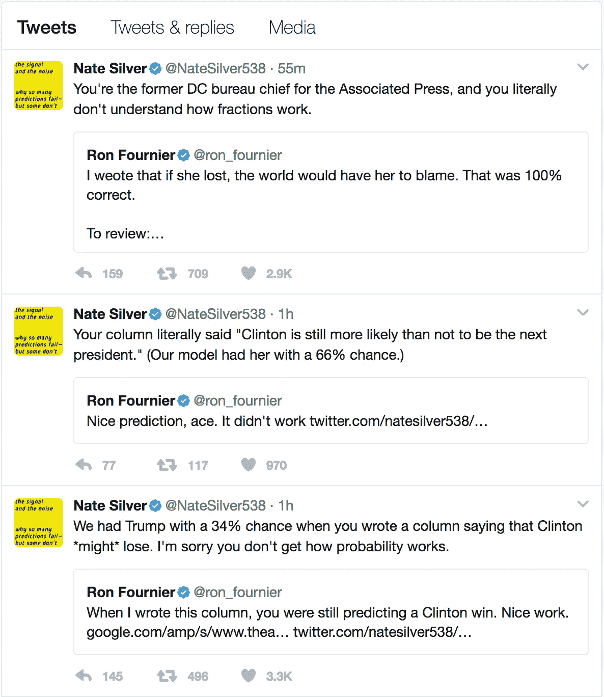

# 大多数人都会犯的错误

> 原文：<https://towardsdatascience.com/humans-are-bad-at-probability-834980e719a3?source=collection_archive---------3----------------------->

在 11 月的第一周，美国总统大选之前，你认为克林顿获胜的可能性有多大？

在一个[标准轮盘](http://www.roulette-games.com/images/american_roulette_wheel.gif)上，球落在红点上的几率是多少？

在俄亥俄州五月的任何一天，下雪的可能性有多大？

> 众所周知，概率思维很难。

如果你和大多数人一样(包括我自己)，你对上面三个问题的回答可能分别接近 100%、50%和 0%。然而，考虑到美国第 45 任总统、轮盘赌上绿点的存在以及俄亥俄州在 5 月份多次降雪的事实，我们发现我们上面的“肯定会发生”、“抛硬币”和“不会发生”的预测不太准确。

> 你在这里并不孤单。

# 人类是如何思考的:

阿曼达·考克斯(Amanda Cox)，[《纽约时报》的编辑](https://www.nytimes.com/by/amanda-cox)(我个人的数据可视化英雄)，在我读研究生的时候，在俄亥俄州做了一次演讲。她提到人们不擅长概率性思维。特别是，她提到人类真的只考虑由 0、50 和 100%组成的[概率度量](https://en.wikipedia.org/wiki/Probability_measure)。

Illustration of Amanda Cox’s description of the “human probability measure.” (Made using TikZ LaTeX package.)

当考克斯说人类是这样思考的时候，她的意思是我们通常把接近 50%的概率解释为 50%的可能性。例如，如果有人听说一名 NBA 球员的罚球命中率为 60%，他/她可能会说该球员投篮命中的可能性与投篮不中的可能性差不多。如上图所示，中间有黄色箭头；任何接近 50%的东西都会被简化为 50%。

任何显著大于 50%的可能性，我们都认为是确定的事情，称之为 100%可能。一个股票新手看到一份报告说谷歌的股票有 90%的可能会上涨，他可能会把大量的钱投入到这只股票中，认为他/她在这笔交易中不会有任何损失。这用顶部向上的绿色箭头表示；我们将所有远高于 50%的概率映射为“确定”或“几乎确定”。

任何远低于 50%的可能性，我们都认为它永远不会发生，所以我们认为特定事件发生的概率是 0%。这在上图中用红色箭头表示；我们经常认为这些事件“几乎不可能，不值得考虑。”

这听起来似乎过于简单，但它惊人地成立。例如，想想下雨的可能性:

*   如果你查看天气应用程序，发现明天下雨的可能性为 80%，你可能会认为肯定会下雨，所以你一定要带上雨伞。
*   如果应用程序告诉你下雨的几率是 40%，你就是在扔硬币决定下雨。我们这些厌恶风险的人会抢伞；你们中的那些人…嗯，像我一样，不会。
*   如果你读到下雨的可能性是 10%,你认为不会下雨，所以你甚至懒得在明天早上的清单上加上“雨伞”。

人类无时无刻不在评估事物。即使作为一名数据科学家，我也会进行四舍五入和估算，最终得到非常不精确的结果……所以这很正常，对吗？

> 嗯，是的。当我们从概率转向实际预测时，问题就出现了。

如果你的天气预报员说有 90%的可能性至少会有一英尺厚的雪，当只有一场小雪降临你的街道时，你可能会感到沮丧。我们将这 90%的预测视为必然，然后当这些预测变成我们认为几乎不可能的方式时，我们会感到委屈。

# 内特·西尔弗对概率的辩护

内特·西尔弗上周在推特上颇有争议地纠正了罗恩·福涅尔关于概率本质的观点。

[Nate Silver vs. Ron Fournier Tweetstorm, April 23, 2017.](https://twitter.com/NateSilver538/status/856330476121989120)

为了让你了解最新情况，Silver 发布了一篇关于詹姆斯·科米对 2016 年美国总统选举的影响的文章。Fournier 对此提出异议，认为 FiveThirtyEight 预测了克林顿的胜利，因此做出了“不正确”的预测。西尔弗反复回应说，福涅尔不是在进行概率性思考。

许多美国人对这次选举措手不及。根据[纽约时报*的结果*总统预测](https://www.nytimes.com/interactive/2016/upshot/presidential-polls-forecast.html)，所有预测都相当确定希拉里将赢得选举。(补充说明:这一页上的可视化效果令人难以置信，我强烈建议看一看。)

[New York Times’ The Upshot 2016 Presidential Predictions, November 8, 2016.](https://www.nytimes.com/interactive/2016/upshot/presidential-polls-forecast.html)

专家不是特别受欢迎——尤其是当他们的预测出错的时候。他们使得克林顿的胜利似乎不可避免。所以我们很容易挑他们的毛病，争辩说他们“错了”我们也有账单要付，有工作要做；我们怎样才能解析这些预测呢？

# 人类应该如何思考:

有两种解释事件发生概率的适当方法，这两种方法都是有效的:

*   从长远来看，这种事件发生的频率有多高？
*   你认为这件事会发生到什么程度？

第一种方法(称为[频率主义方法](https://en.wikipedia.org/wiki/Frequentist_inference))将通过说“如果选举一再发生，我们预计克林顿将赢得每 100 次选举中的 85 次”，或者大约每 6 次中的 5 次，来解读 NYT 的克林顿获胜概率。

第二种方法(称为[贝叶斯方法](https://en.wikipedia.org/wiki/Bayesian_inference))将通过说“纽约时报有 85%的把握克林顿将赢得选举”来解释 NYT 对克林顿获胜的概率这种方法更加主观，引起了贝叶斯反对者的愤怒。然而，这种方法并不依赖于 2016 年选举会像频繁主义者方法要求的那样一遍又一遍发生的想法。

虽然有大量关于解释概率的文献(“贝叶斯”和“频率主义者”这两个术语可能会引发数据科学爱好者和统计学课程幸存者的一些记忆)，但你会注意到，这两种解释都没有说“特朗普不可能获胜”。

这里最重要的一点是，从概率跳到预测时要小心谨慎。据说 85%确定的事情并不意味着它是“确定的事情”

问问克林顿国务卿就知道了。

我要感谢我的朋友兼同事[约瑟夫·尼尔森](https://www.josephofiowa.com)的编辑。你应该在媒介上认出他；他的帖子比我的好。