# 基于 Keras 的超参数优化

> 原文：<https://towardsdatascience.com/hyperparameter-optimization-with-keras-b82e6364ca53?source=collection_archive---------0----------------------->

## 为深度学习模型找到正确的超参数可能是一个繁琐的过程。不一定要。

TL；速度三角形定位法(dead reckoning)

有了正确的流程，就不难为给定的预测任务找到最先进的超参数配置。在三种方法中——手动、机器辅助和算法——本文将重点讨论机器辅助。本文将介绍我是如何做到这一点的，证明这种方法是可行的，并提供对它为什么可行的理解。主要原则是简单。

# 关于性能的几句话

关于性能的第一点涉及到作为测量模型性能的方法的准确性(和其他更健壮的度量)的问题。以 f1 成绩为例。如果你有一个 1%肯定的二进制预测任务，那么一个让所有事情都为 0 的模型将接近完美的 f1 分数和准确性。这可以通过对 f1 分数处理极限情况的方式进行一些改变来处理，例如“全零”、“全一”和“无真阳性”但这是一个很大的话题，超出了本文的范围，所以现在我只想说明，这个问题是让系统超参数优化工作的一个非常重要的部分。我们在这个领域有很多研究，但研究更多地集中在算法上，而不是基本面。事实上，你可以拥有世界上最复杂的算法——通常也非常复杂——根据毫无意义的指标做出决策。这对处理“现实生活”中的问题不会有太大的帮助。

不要犯错误；即使我们得到了正确的性能指标(是的，我在叫喊)，我们也需要考虑在优化模型的过程中会发生什么。我们有一个训练集，然后我们有一个验证集。一旦我们开始查看验证结果，并开始在此基础上进行更改，我们就开始偏向验证集。现在我们得到了训练结果，这是机器偏差的产物，我们得到了验证结果，这是我们偏差的产物。换句话说，我们得到的模型并不具有一个很好的广义模型的性质。相反，它偏离了一般化。所以记住这一点非常重要。

关于更先进的全自动(无监督)超参数优化方法的关键点在于首先解决这两个问题。一旦这两个问题解决了——是的，有办法做到这一点——最终的指标将需要作为一个单一的分数来实现。然后，该分数成为超参数优化过程被优化的度量。否则，世界上没有任何算法会有所帮助，因为它会优化我们所追求的东西。我们又在找什么？将完成预测任务所阐述的任务的模型。不仅仅是一个模型用于一种情况(这在涉及该主题的论文中经常出现)，而是所有类型的模型，用于所有类型的预测任务。这就是像 Keras 这样的解决方案所允许我们做的，任何使用像 Keras 这样的工具来实现过程自动化的尝试都应该接受这个想法。

# 我用了什么工具？

对于本文中的所有内容，我使用 Keras 作为模型，Talos 是我构建的[超参数优化解决方案](http://github.com/autonomio/talos)。好处是它公开了 Keras，而没有引入任何新的语法。它让我可以在几分钟内完成过去需要几天才能完成的事情，而不是痛苦的重复。

你可以自己试试:

`pip install talos`

或者在这里看代码/文件[。](https://github.com/autonomio/talos)

但是我想分享的信息，以及我想表达的观点，与一个工具无关，而是与过程有关。你可以按照你喜欢的任何方式遵循同样的程序。

自动化超参数优化和相关工具的一个更突出的问题是，您通常会远离您习惯的工作方式。与所有复杂问题一样，成功的预测任务无关超参数优化的关键在于拥抱人机合作。每一个实验都是一个学习更多关于实践(深度学习)和技术(在这个例子中是 Keras)的机会。这个机会不应该以牺牲过程自动化为代价而被错过。与此同时，我们应该能够去掉这一过程中明显多余的部分。想象一下在 Jupyter 中执行 shift-enter 几百次，并在每次迭代之间等待一两分钟。总之，在这一点上，我们的目标不应该是以全自动的方式找到正确的模型，而是尽量减少给人带来负担的程序冗余。机器自己运转，而不是机械地操作机器。我不是一个一个地分析各种模型配置的结果，而是想以千为单位或者以十万为单位进行分析。一天有 80000 多秒，在那段时间里可以覆盖很多参数空间，而不用我做任何事情。

# 我们开始扫描吧

为了举例，我将首先提供我在本文所涉及的整个实验中使用的代码。我使用的数据集是 [*威斯康星乳腺癌*](https://www.kaggle.com/uciml/breast-cancer-wisconsin-data) 数据集。

一旦定义了 Keras 模型，就该决定初始参数边界了。然后，字典以这样一种方式被输入到处理过程中，即单个排列被挑选一次，然后被忽略。

根据我们希望包含在扫描中的损失、优化器和激活，我们需要首先从 Keras 导入这些函数/类。接下来，模型和参数准备好了，就该开始实验了。

请注意，我不会分享更多的代码，因为我所做的只是更改了参数字典中与以下部分提供的见解相关的参数。为了完整起见，在文章的最后，我将分享一个包含代码的笔记本的链接。

因为在第一轮实验中有许多排列(总共超过 180，000 个)，所以我随机选取了总数的 1%，这样我们就剩下 1，800 个排列了。

在这种情况下，我正在用一台 2015 年的 MacBook Air 跑步，看起来我正好有时间见一个朋友，喝杯咖啡(或两杯)。

# 超参数扫描可视化

对于这篇文章，使用威斯康星州乳腺癌数据集，我已经建立了实验，假设没有关于最佳参数或数据集的知识。我通过删除一列并转换所有其他列来准备数据集，以便每个特征的平均值为 0，标准偏差为 1。

在最初运行 1800 个排列后，是时候看看结果并决定如何限制(或改变)参数空间了。

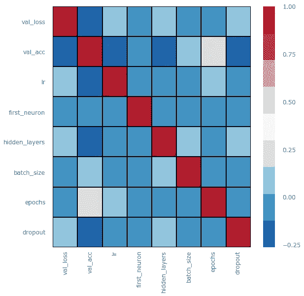

一个简单的等级顺序关联显示 lr(学习率)对我们的性能度量有最强的影响，在这种情况下是 val_acc(验证准确性)。对于这个数据集，val_acc 是可以的，因为有很多正值。对于假阳性之间存在显著差异的数据集，准确性不是一个好的衡量标准。似乎隐藏层、学习率和辍学率都与 val_acc 显著负相关。一个简单的网络将在这项任务中做得更好。对于正相关，时代的数量是唯一突出的。让我们靠近一点看。在下图中，我们在 x 轴上显示了时期(50、100 和 150)，在 y 轴上显示了 val_acc，在列中显示了学习率，在色调中显示了辍学。这种趋势似乎大体上如相关性所暗示的那样；较小的辍学者比较大的辍学者表现更好。

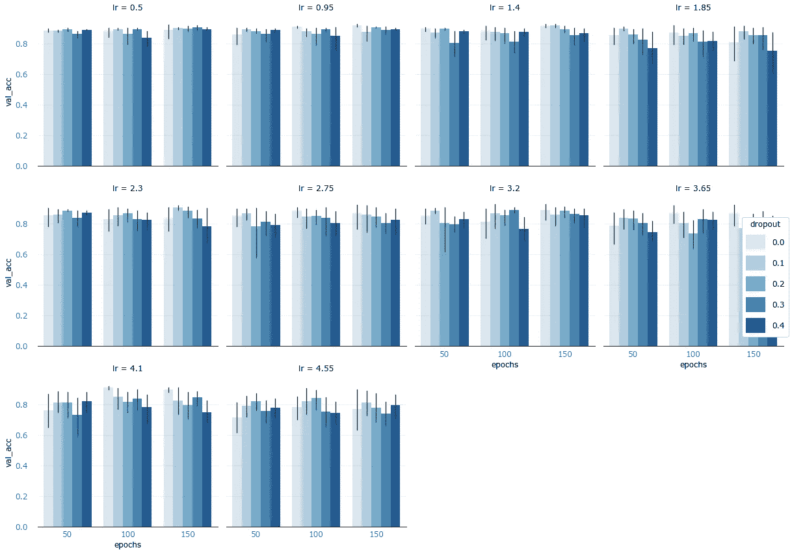

另一种观察漏失的方法是通过核密度估计。这里我们可以看到，在压差为 0 或 0.1 的情况下，val_acc 稍有增加的趋势，而 val_acc 较低的趋势(约为 0.6)。

下一轮扫描的第一个行动项目是完全消除较高的辍学率，并关注 0 到 0.2 之间的值。接下来让我们更仔细地看看学习率。请注意，学习率在优化器之间被标准化为一个范围，其中 1 表示该优化器的 Keras 默认值。

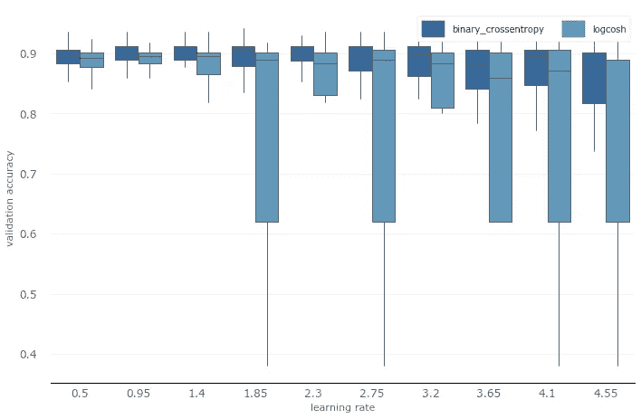

情况相当清楚；较小的学习速率对两种损失函数都很有效，并且这种差异在 logcosh 中尤其明显。但是因为二进制交叉熵在所有学习速率水平上都明显优于其他水平，所以在实验的剩余部分，它将是我们选择的损失。尽管如此，仍然需要进行健全性检查。如果我们看到的不是对训练数据的过度拟合呢？如果 val_loss 到处都是，而我们只是看着画面的一面而忘乎所以，怎么办？简单的回归分析表明事实并非如此。除了一些异常值，所有东西都很好地打包在左下角我们想要的地方。趋势是训练和验证损失都接近于零。

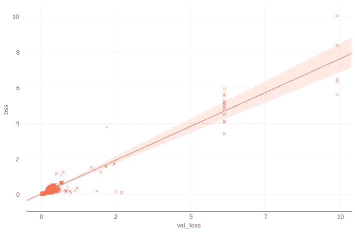

我认为现在我们知道的已经足够了；是时候设置下一轮实验了！作为参考，下一个实验的参数空间如下所示:

除了细化学习速率、放弃和批量大小的界限，我还添加了 kernel_initializer 的 uniform。请记住，在这个阶段，目标是了解预测任务，而不是过于专注于寻找解决方案。这里的关键点是，除了了解具体的预测挑战之外，还要进行实验并了解整个过程。

# 第 2 轮—增加对结果的关注

最初，我们越少关注结果(更多关注过程)，就越有可能获得好的结果。就像下棋一样；如果一开始你太专注于赢得比赛，你就不会专注于开局和中局。竞技棋局赢在残局，基于打好开局和中局。如果一切顺利，超参数优化过程中的第二次迭代就是中间。我们还没有完全专注于赢得比赛，但它有助于着眼于奖励。在我们的例子中，来自第一轮的结果(94.1%的验证准确性)表明，对于给定的数据集和设置的参数边界，存在要进行的预测。

这种情况下，这里的预测任务就是说乳腺癌是良性的还是恶性的。这种类型的预测是一件大事，因为假阳性和假阴性都很重要。预测错误会对这个人的生活产生一些负面影响。如果你感兴趣，有一堆关于这个数据集的论文，以及其他一些相关信息，你都可以在这里找到。

第二轮的结果是 96%的验证准确性。下面的相关性表明，在这一点上唯一突出的是纪元的数量，所以对于第三轮，这是我要改变的一件事。

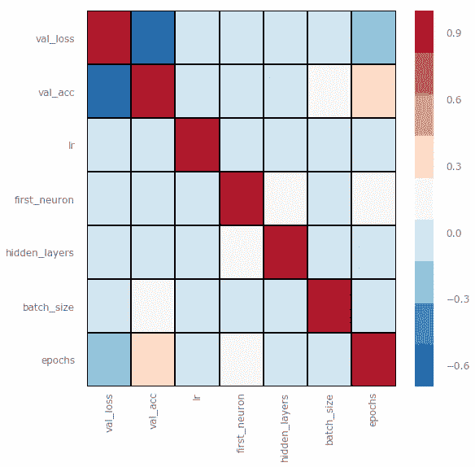

如果你只看相关性，就有在更大的图景中遗漏某些东西的危险。在超参数优化中，重要的是给定参数中的单个值，以及它们与所有其他值的相互联系。既然我们已经消除了 logcosh 损失函数，并且在参数空间中只有一个损失(binary_crossentropy ),我想了解一下不同的优化器在各个时期的上下文中是如何执行的。

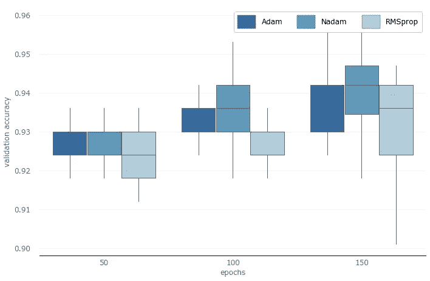

这就像这种相关性所暗示的时代(现在在 x 轴上)。因为 RMSprop 在 100 和 150 中表现不佳，所以让我们在下一轮也放弃它。

在继续之前，让我们非常简要地考虑一个与超参数优化相关的基本问题，作为优化挑战。我们想要达到的目标是什么？答案可以用两个简单的概念来概括:

*   最佳预测
*   结果熵

最佳预测是指我们有一个既精确又通用的模型。结果熵是熵尽可能接近零(最小)的地方。结果熵可以理解为一个结果集内所有结果之间相似性的度量(一轮经历 n 次排列)。理想的情况是，预测最佳值为 1，这是 100%的预测性能和 100%的通用性，得到的熵为 0。这意味着无论我们在超参数空间内做什么，每次都只能得到完美的结果。由于几个原因，这是不可行的，但是有助于记住优化超参数优化过程的目标。回答这个问题的另一种方式是通过三个层次的考虑；

1.  预测任务，目标是找到为该任务提供解决方案的模型
2.  超参数优化任务，目标是找到预测任务的最佳模型(用最少的努力)
3.  超参数优化任务优化任务，其目标是找到最佳方法，以最佳方法找到预测任务的最佳模型

你可能会问，这是否会导致我们无限前进，在优化器之上还需要优化器，答案是肯定的。在我看来，超参数优化问题之所以有趣，是因为它引导我们找到了“构建模型的模型”问题的解决方案但是这将使我们远离本文的范围。

考虑到第二个方面，尤其是第三个方面，我们需要考虑该过程的计算效率。我们浪费的计算资源越少，我们就有越多的计算资源来寻找第一和第二方面的最佳结果。从这个角度考虑下面的图表。

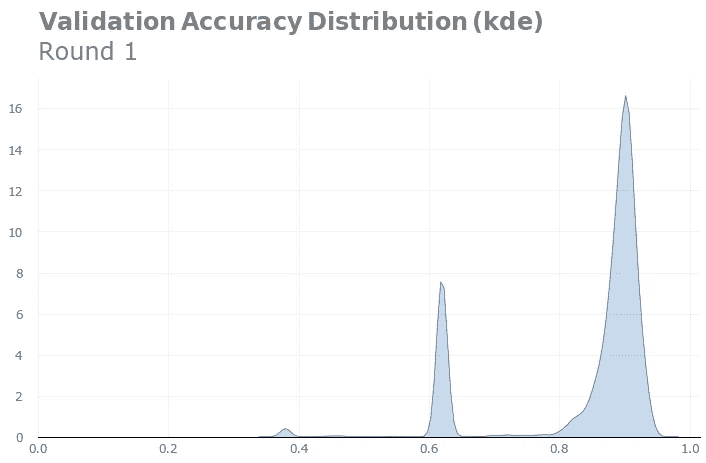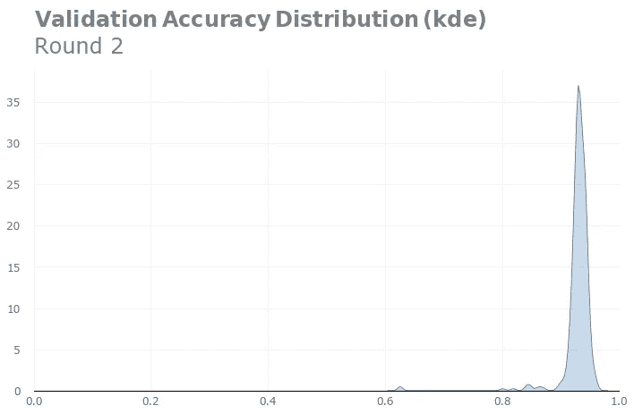

从把资源分配到我们需要的地方的意义上来说，第二轮 KDE 看起来要好得多。它们在 x 轴上更接近于 1，并且很少向 0“溢出”。无论扫描的计算资源是什么，它们都在做重要的工作。这里的理想图像是一条 x 值为 1 的直线。

# 第 3 轮—概括和绩效

让我们开门见山吧。峰值验证准确率现在是 97.1%，看起来我们正朝着正确的方向前进。我犯了一个错误，仅仅增加了 175 个历元作为最大值，并且基于下面的；看来我们必须走得更远。至少在这种配置下。这让我想到…也许在最后一轮，我们应该尝试一些令人惊讶的东西。

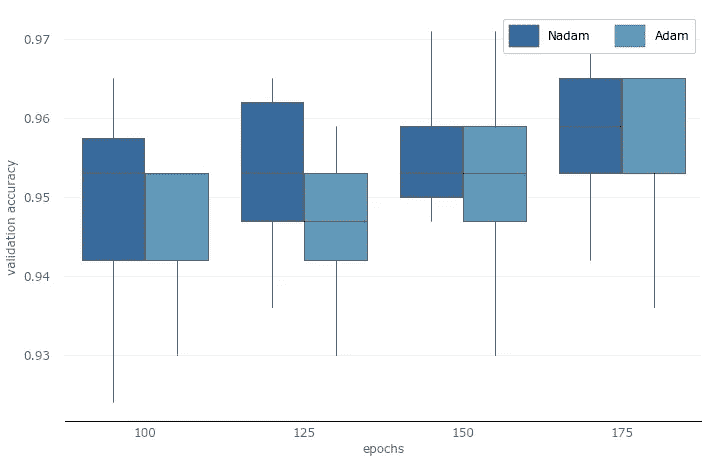

正如在前言中所讨论的，考虑一般化也很重要。每当我们看到结果，我们的洞察力就会开始影响实验。最终结果是，我们开始得到不太通用的模型，这些模型可以很好地处理验证数据集，但可能无法很好地处理“真实”数据集。在这种情况下，我们没有很好的方法来测试这种偏差，但至少我们可以采取措施，以我们所拥有的来评估伪泛化的程度。先看训练和验证准确性。

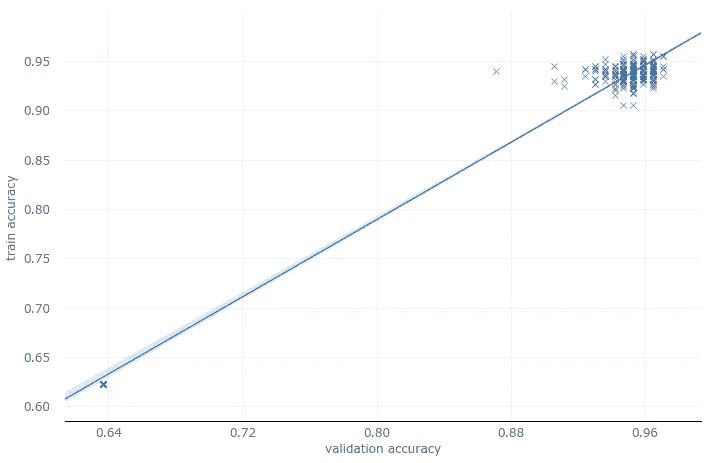

即使这并没有给我们一个肯定的确认，有一个很好的概括的模型，事实上，它离它还差得很远；回归分析结果好不了多少。那我们再来看亏损。

就更好了。事情看起来不错。对于最后一轮，我将增加历元的数量，但我也将尝试另一种方法。到目前为止，我只有非常小的批量，这需要很多时间来处理。在第三轮中，我只包括了批次大小 1 到 4。接下来，我将投入 30 左右，看看会有什么效果。

关于提前停止的几句话。Keras 通过提前停止功能提供了一种非常方便的使用回调的方法。你可能已经注意到了，我没有用那个。一般来说，我会推荐使用它，但它并不像我们到目前为止所做的那样微不足道。以不限制您找到最佳可能结果的能力的方式获得正确的设置并不简单。最重要的方面与度量有关；我希望首先创建一个自定义指标，然后使用它作为我的早期停止模式(而不是使用 val_acc 或 val_loss)。也就是说，早期停止和一般的回调提供了一种非常强大的方式来增加您的超参数优化过程。

# 第 4 轮—最终结果出来了

在深入研究结果之前，让我们再来看一个上一轮结果的图像。这次是五维的。我想看到其余的参数——内核初始化器、批量大小、隐藏层和时期——都在同一张图片上，与验证准确性和损失进行比较。第一准确性。

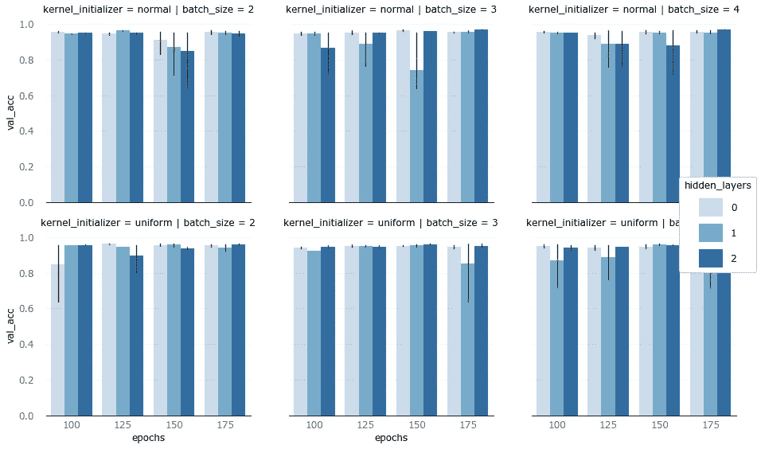

基本上是不分上下，但有些事情确实很突出。第一件事是，如果一个隐藏层值(色调)下降，在大多数情况下，它的一个隐藏层。对于批量大小(列)很难说，对于内核初始化器(行)也是如此。接下来让我们看看 y 轴上的验证损失，看看我们是否能从中了解更多。记住，这里我们寻找的是较小的值；我们试图用每个参数排列来最小化损失函数。

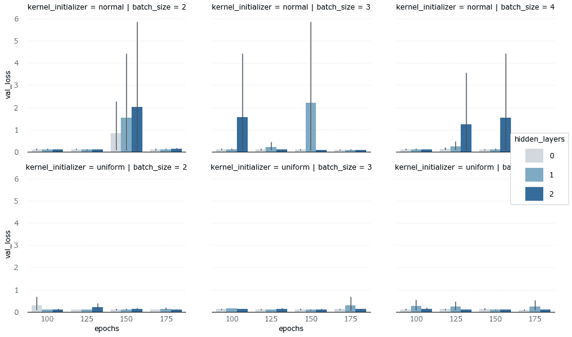

统一内核初始化器在保持所有时期、批量大小和隐藏层变化的损失方面做得很好。但是因为结果有点不一致，所以我会保留两个初始化器直到最后。

# 获胜者是…

获胜的组合是来自最后一刻的想法，尝试更大的批量以节省时间和更少的时期):

小批量的最高结果是验证准确率为 97.7%。使用较大批量的方法，还有一个好处是模型收敛得非常快。在这篇文章的最后，我会提供一个视频，你可以自己看。老实说，一旦我看到更大的批量是如何工作的，我就建立了一个单独的测试。设置它只花了不到一分钟的时间，因为我需要改变的只是批量大小(对于这个较小的时期)，扫描在 60 分钟内完成。关于情节，没有什么可看的，因为几乎所有的结果都接近 100%。还有一件事我想分享，因为它从一个不同于我们已经讨论过的角度，与熵的概念有关。熵可以是评估过度拟合的有效方法(因此是泛化的代理)。在这种情况下，我使用 KL 散度分别针对训练损失和准确度来测量 val_loss 和 val_acc 熵。

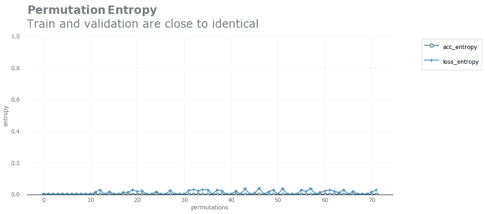

# 过程总结

*   尽可能简单而广泛地开始
*   试着尽可能多地了解实验和你的假设
*   对于第一次迭代，尽量不要太关注最终结果
*   确保您的绩效指标是正确的
*   请记住，性能是不够的，因为它会使您偏离通用性
*   每次迭代应该减少参数空间和模型复杂性
*   不要害怕尝试，这毕竟是一个实验
*   使用你能理解的方法，例如清晰直观的描述性统计

这里是最后一轮的代码完成[笔记本](https://nbviewer.jupyter.org/github/autonomio/talos/blob/master/examples/Hyperparameter%20Optimization%20on%20Keras%20with%20Breast%20Cancer%20Data.ipynb)。还有我答应过的视频…

# 感谢您的宝贵时间！如果你还有几秒钟，请分享。并在寻找最佳参数的过程中享受乐趣！