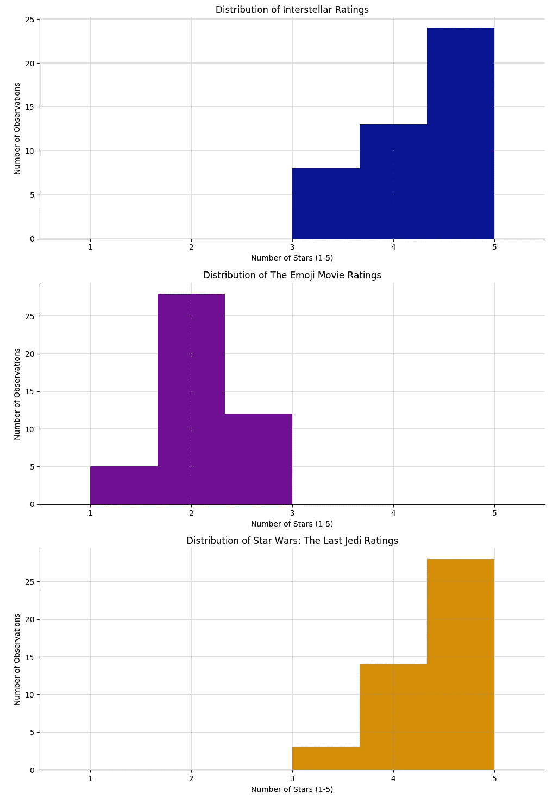
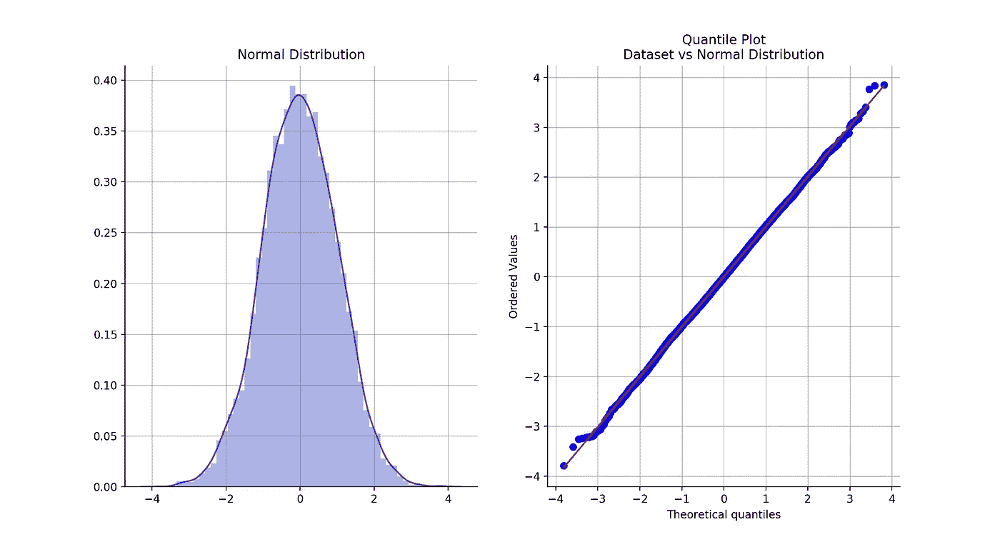
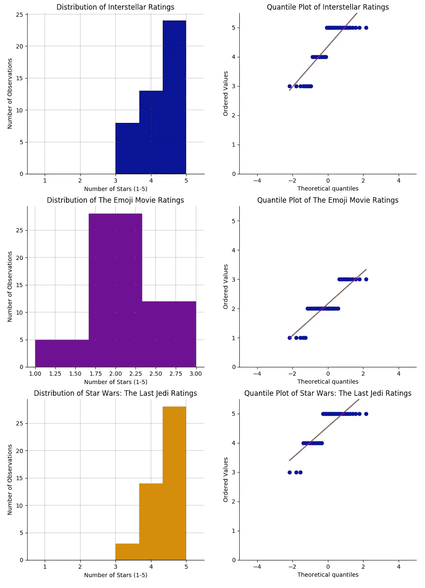
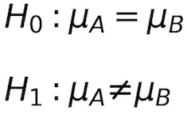
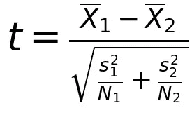

# 现实生活中的假设检验

> 原文：<https://towardsdatascience.com/hypothesis-testing-in-real-life-47f42420b1f7?source=collection_archive---------0----------------------->

用数学解决现实世界的问题

Photo by [JESHOOTS.COM](https://unsplash.com/photos/PpYOQgsZDM4?utm_source=unsplash&utm_medium=referral&utm_content=creditCopyText) on [Unsplash](https://unsplash.com/?utm_source=unsplash&utm_medium=referral&utm_content=creditCopyText)

每天你都在测试想法、食谱、新路线，这样你就可以更快或更少的交通到达目的地…

然而，重要的问题是*这个想法/配方/路线***比你之前的那个好吗？**

*现在是星期五晚上，你想看电影。有三部电影吸引了你的眼球，但你并不确定它们是好是坏。*

*在当今这个时代，你是那种仍然依赖家人和朋友推荐的人。所以，你让他们给这些电影评级，并准备好处理数据。*

**

*The beauty of dummy data 😀*

*即使看起来你的朋友对表情电影有点怀疑，你也需要检查每个评分分布，以便更多地了解你朋友投票的主要趋势。*

***收视率为*星际****

*   *[中位数](https://en.wikipedia.org/wiki/Median)—5 个单位的分布中心；*
*   *[表示约 4.35 单位的](https://en.wikipedia.org/wiki/Mean)；*
*   *[标准偏差](https://en.wikipedia.org/wiki/Standard_deviation)——数值与平均值相距多远——约 0.76 个单位；*

***评分为*的表情符号电影*有***

*   *2 个单位的中位数；*
*   *平均值约为 2.2 个单位；*
*   *标准偏差约为 0.59 个单位；*

*《星球大战:最后的绝地武士》的收视率*

*   *5 个单位的中位数；*
*   *平均值约为 4.5 个单位；*
*   *标准偏差约为 0.62 个单位；*

*这太棒了！但实际上它并没有告诉你比你已经知道的更多的东西:表情符号电影可能没有那么吸引人，星际大战和星球大战之间有明显的竞争…*

*为了弄清你的朋友对哪部电影评价最高，你决定进行一些 [**统计测试**](https://en.wikipedia.org/wiki/Statistical_hypothesis_testing) 并比较三种评价分布。*

## ***假设检验***

*假设检验，或称统计假设检验，是一种用于比较两个数据集或数据集样本的技术。这是一种**统计** **推断方法**所以，在测试的最后，你会**得出一个结论**——你会推断出一些东西——关于你正在比较的东西的特征。*

*就你周五晚上的电影选择而言，你想从三种可能中挑选一部最佳电影。*

*你应该使用哪种测试？*

*为了回答这个问题，首先你需要知道*遵循什么分布*。因为，不同的测试假设数据遵循特定的分布。*

*您已经计算了一些统计数据——评级数据——均值、中值和标准差——但是您的数据是什么样的呢？*

*最著名的分布之一就是所谓的*钟形曲线*、[正态分布](https://en.wikipedia.org/wiki/Normal_distribution) 。在此分布中，数据以平均值为中心，您可以通过钟形曲线的峰值来识别该平均值。在这种情况下，它也对应于中间的值，即中值。*

*根据标准偏差，正态分布的数据点分布在平均值/中值周围。*

**

*Example of a dataset that follows a Normal Distribution with mean 0 and standard deviation of 1*

*在这个正态分布的例子中，很容易看到大多数值都以零为中心，即分布的平均值和中值，并且曲线的两侧以 1 个单位的增量从平均值向外移动。*

***电影收视率服从正态分布吗？***

*令人欣慰的是，统计学家已经考虑过识别你的数据的形状。他们创造了一个简单的方法来找出答案:分位数-分位数图，也叫 Q-Q 图。*

**

*A dataset that follows a Normal Distribution and the Q-Q plot that compares it with the Normal Distribution*

*Q-Q 图有助于可视化两个概率分布的分位数。分位数只是一种简单的方式来说明你正在把分布分成相等的部分。例如 *quart* iles，将分配分成四等份，4 等份。*

***这个 Q-Q 剧情怎么看？***

*在上面的例子中，我们已经知道数据集遵循正态分布。*

*Q-Q 图想要直观地表示的是，如果两个数据集遵循相同的分布，它们将大致沿着红色对角线对齐。对应于数据集的蓝点偏离对角线越多，对应于要比较的分布，两个分布之间的差异就越大。*

*因此，为了弄清楚每个电影评级数据集遵循什么样的分布，您可以使用 Q-Q 图将它们与正态分布进行比较。*

**

*Distribution of each movie rating and corresponding Q-Q plot vs Normal Distribution*

*第一个想到的可能是*这看起来一点都不像我期待的 Q-Q 剧情！嗯，算是吧。**

*数据点沿着对角线分布，但是，它不完全沿着红线的原因是因为评级是离散值，而不是连续值。这就是为什么我们看到，例如，在《星球大战》的评级中，一些蓝点与值 4 水平对齐，在红线的顶部，然后，再往上，一些点与值 5 对齐。*

*因此，您可以证明它遵循正态分布，因为，尽管是以离散的、逐步的方式，数据遵循对角线。*

*既然您已经发现您的评级遵循正态分布，那么是时候进行统计测试了。*

*还没有。*

*在考虑使用什么测试之前，你需要*

1.  *定义你的假设；*
2.  *设置统计测试的显著性水平。*

*那你挑统计测试就好了！*

## *1.定义你的假设*

*假设检验通常由以下部分组成*

*   **零假设* (H0，读作“H 零”):陈述所有事物保持不变。没有现象被观察到，或者在你比较的事物之间没有关系；*
*   **替代假设* (H1，读“H one”):陈述零假设的反面。你所比较的事物之间有一些变化或观察到的关系*

*对于你周五的电影之夜，你真正想知道的是一部电影是否明显比其他的好。在这种情况下，你可以根据你的朋友对每部电影的平均评价来建立你的假设。*

**

*可以解读为*零假设* (H0): *电影 A 的均值等于电影 B 的均值*和*替代假设* (H1): *电影 A 的均值不等于电影 B 的均值**

## *2.设置统计测试的显著性水平*

*统计测试的目标是试图证明存在一个可观察到的现象。*

> *统计测试的目标是试图拒绝零假设，即没有可观察到的变化或行为*

*它可能是证明显示患者健康改善的治疗、具有较大人群特征的样本或被认为不同的两个数据集，即它们不可能来自同一人群。所以，在测试的最后，你要有信心拒绝零假设。*

*这导致定义测试的[显著性水平。](https://en.wikipedia.org/wiki/Statistical_significance)*

*它被描述为一种概率，用希腊字母 *alpha* 表示，它指定了当零假设实际上为真时拒绝零假设的概率，即，您无法观察到问题中的现象或变化。*

> *我认为显著性水平是**为你的测试设定质量标准**，以便能够得出准确的结论。*

*在你周五晚上寻找电影的过程中，没有找到一部好电影看的后果很小:一些潜在的浪费时间，和一点挫败感。但是，您可以看到在临床试验等场景中设置适当的显著性水平的重要性，在这些场景中，您正在测试一种新药或治疗方法。*

*通常使用的显著性水平是 1%和 5%。*

*对于这个电影夜选，我们可以定在 5%，即α= 0.05。*

## *用什么统计检验？*

*知道数据遵循正态分布，并且您想要比较您朋友的评分平均值，一个特殊的统计测试浮现在脑海中。*

*[**学生的 t-Test**](https://en.wikipedia.org/wiki/Student%27s_t-test)*

*这种统计检验通常用于验证两个数据集之间是否存在显著差异。正如我前面提到的，首先您必须保证两个数据集都具有以下特征*

*   *遵循正态分布；*
*   *是相互独立的。*

*让我们假设你的朋友在给每部电影评分时没有偏见，以便给予完全独立的评分。*

*从我们到目前为止所看到的，你很好地使用学生的 t 测试！*

*为了验证其中一部电影是否明显优于另一部，你可以进行一个*独立双样本 t 检验。*这个测试也必须是一个*双尾测试*，因为我们试图捕捉一个普遍的显著差异，或者更低或者更高。想想正态分布图的“尾部”。*

***准备好运行 t 测试了吗？等等，还没有！***

*您所有的朋友对不同的电影进行了评级，但是，正如您之前所验证的，每部电影的评级分布都有不同的标准差。这意味着每个分布都有不同的方差。*

*因为分布的方差是不一样的，你必须使用一个稍微不同的测试，韦尔奇的 t-测试。*

*[**韦尔奇 t 检验**](https://en.wikipedia.org/wiki/Welch%27s_t-test)*

*这也被称为*不等方差 t 检验*。这是对学生 t 检验的一种改进，仍然要求数据呈正态分布。但是，在计算测试时，它会考虑这两个差异。*

**

*分子考虑了两个均值之间的差异，由 X1 和 X2 表示，而分母考虑了方差，由 *s* 和每个数据集的大小 *N* 表示。*

*在周五晚上的电影示例中，两部电影的数据集大小将是相同的，因为你所有的朋友都对这三部电影进行了评级。但是通过 Welch 的 t-test，我们确保在验证评级之间是否存在显著差异时，每个评级分布的方差都被考虑在内。*

*使用 Welch 的 t-Test，对于每一对分布中的每一个，您计算出[测试统计量](https://en.wikipedia.org/wiki/Test_statistic)，它是每个统计软件在您运行测试时生成的。*

*现在，显著性水平又回到了行动上，因为您已经准备好对数据做出结论了。*

*除了测试统计数据，您选择的软件还将为您提供 [p 值](https://en.wikipedia.org/wiki/P-value)。p 值也表示为概率，是在假设零假设为真的情况下，观察到与检验统计值一样极端的值的概率。*

*在这个周五电影之夜的场景中，p 值将是平均评分比我们比较的评分高或低的概率。*

> *你现在有了拼图的所有部分！*

*您运行了测试，获得了测试统计数据和 p 值，现在您可以使用 **p 值和显著性水平来确定数据集**之间是否存在统计显著性差异。*

*用你选择的统计软件处理所有数据，你会得到以下结果*

***星际大战表情符号电影***

*   *检验统计~= 15.07*
*   *p 值= 1.833202972237421e-25*

*表情符号电影 vs 星球大战:最后的绝地*

*   *检验统计~= -18.54*
*   *p 值= 3.4074007278724943e-32*

*看看上面测试统计的绝对值，考虑到它们是如此之大，你可以得出结论，这两部电影之间有显著的差异。*

*将显著性水平与每个 p 值进行比较，您可以安全地拒绝零假设，即这些电影的平均评级之间没有差异。*

*这适用于*星际大战表情符号电影*和*表情符号电影大战星球大战:最后的绝地*，因为在这两种情况下，p 值都远远小于我们在运行测试之前设置的 0.05 的显著性水平。*

*你刚刚得出结论，表情符号电影的平均评分(2.2 单位)与《星际穿越》(4.35 单位)和《星球大战》(4.5 单位)相比，实际上有很大差异。*

*鉴于后面几部电影的平均评分*明显更高*，你可以放心地将表情符号电影从你的候选名单中排除。*

> *现在只剩下两位选手了…*

***星际大战 vs 星球大战:最后的绝地***

*   *检验统计~=-1.35*
*   *p 值= 0.18046156732197555*

*从这些结果中，你不能证明这两部电影之间有统计学上的显著差异。如果你还记得，他们的平均评级非常接近——4.35 比 4.5 单位。*

*尽管说零假设是真的很有诱惑力，而且这两种方法没有区别，但你不能。*

> *你能说的是，你没有足够的经验证据来否定零假设。*

*如果你想遵守统计学的规则，你需要一个技术上的联系😀🤓*

*作为决胜局，你可以询问公正的第三方的意见，或者只看平均评分最高的一方。*

**感谢阅读！**