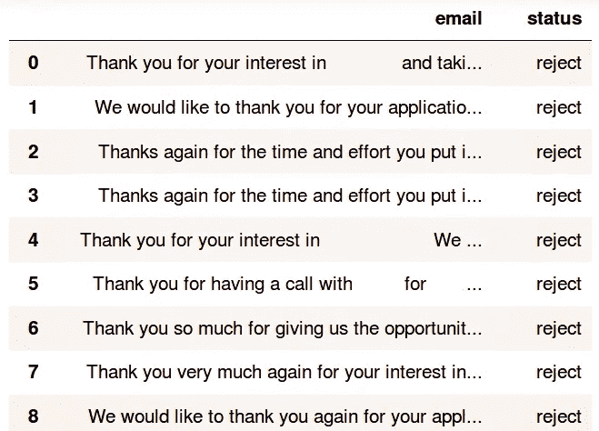

# 我为我的工作申请建立了一个拒绝-不拒绝电子邮件分类器

> 原文：<https://towardsdatascience.com/i-built-a-reject-not-reject-email-classifier-for-my-job-applications-844a3b6cd67e?source=collection_archive---------3----------------------->

可怕的拒绝邮件。到现在，我已经很习惯了。就好像我申请工作会被拒绝一样。在我的职业生涯中，我收到过很多拒绝邮件。起初，每当我收到拒绝邮件时，我都会感到非常失望。但是随着时间的推移，我有点习惯了。事实上，现在，我一边阅读拒绝邮件，一边享受人力资源团队的创造力。大多数人力资源试图让它听起来尽可能的甜蜜。他们中的一些人会说工作的要求和候选人的技能不匹配。有些人会安慰说，他们确信在其他地方会有更好的机会。有些人会直截了当地说你不够好。

那么一个数据科学家在收到大量拒绝邮件的时候会怎么做呢？构建一个分类器，自动将指示拒绝的电子邮件分类到拒绝类别，并将其他电子邮件分类到非拒绝类别。让我详细说明一下这个过程，这样你也可以这样做。

我开始从我自己的收件箱收集数据。我曾想过从收件箱中使用相关关键词(如“谢谢你的申请”、“我们祝你有个美好的未来”)有计划地收集电子邮件，但后来我决定不这么做，因为我不知道这些关键词是否正确。我手动浏览我的收件箱，并从拒绝邮件中提取文本。我还随机收集了等量的没有任何拒绝的邮件。我将这两类电子邮件文本收集在一起，保存在一个 csv 文件中。

Screenshot of reject emails with their labels

这项任务数据收集的一个问题是，我没有收到很多拒绝邮件。许多公司根本不发送任何拒绝电子邮件。他们中的一些人在他们的门户上发送拒绝消息。结果，我们收到的拒绝邮件数量非常有限。事实上，尽管我们被拒绝了很多次，我们还是收到了大约 10 封拒绝邮件。这对于一个健壮的分类器来说是远远不够的。但是让我们试着用我们可以支配的资源来建造一个。

在数据收集之后，我们进入数据预处理阶段。在这一阶段，我们首先将所有大写字符转换成小写字符，因为计算机对每种情况都有不同的处理方式。之后，我们删除标点符号，因为它们对分类器没有贡献。然后，我们删除数字，因为它们对分类器没有贡献。

一旦数据经过预处理，就必须将其转换成可用于机器学习的形式。有多种技术可以将文本转换成数字矩阵。其中包括计数矢量器、Tf-Idf 矢量器和单词包。在我们的例子中，我们使用计数矢量器，因为它几乎可以与 Tf-Idf 矢量器相媲美。

我们还使用 sklearn 的 LabelEncoder 对我们的目标变量，即标签(拒绝或不拒绝)进行编码。这将拒绝和不拒绝分别编码为 0 和 1。

然后，我们使用 sklearn 的 train_test_split 将数据分成训练集和测试集。我们将训练数据标记为 x_train 和 y_train，将测试数据标记为 x_test 和 y_test。

我们使用多项式朴素贝叶斯分类器模型来拟合训练数据。之后，我们编写一个函数，将编码的类别转换回它们的名称，并对测试数据使用预测函数。我们在测试数据上获得了大约 80 %的准确度。

我们还通过给出定制的输入语句来测试我们的分类器，看看它的性能如何。以下是一些预测。

Reject and Not Reject predictions from the Multinomial Bayes model

厉害！当然，它并不完美，但它显然能够识别拒绝邮件的模式。有了更多的数据，我相信它可以变得更加稳健。此外，我想探索一下我是否可以将它与我的 gmail 帐户整合在一起。

另外，如果你想浏览一下代码，我已经把它作为 Ipython 笔记本上传到 Github 上了。

[https://github.com/imaadmkhan1/reject_not_reject](https://github.com/imaadmkhan1/reject_not_reject)