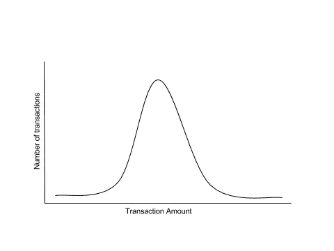
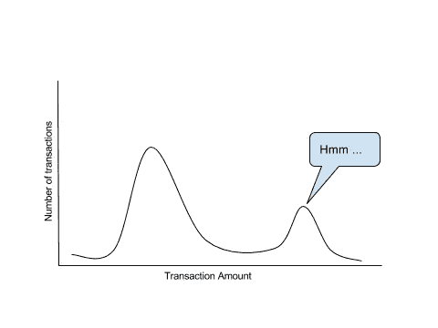

# 我有数据。我需要洞察力。我从哪里开始？

> 原文：<https://towardsdatascience.com/i-have-data-i-need-insights-where-do-i-start-7ddc935ab365?source=collection_archive---------1----------------------->

这个问题经常出现。

这通常是刚接触数据科学的数据科学家、分析师和管理人员会问的问题。

他们的老板面临着压力，要求他们展示花在收集、存储和组织数据的系统上的所有资金的投资回报率(更不用说花在数据科学家身上的钱了)。

有时他们是幸运的——他们可能被要求解决一个非常具体且经过充分研究的问题(例如，[预测哪个客户可能会取消他们的移动合同](https://blog.kissmetrics.com/improve-by-predicting-churn/))。在这种情况下，有许多方法来剥猫的皮，这是数据科学的天堂。

但通常他们只是被要求“挖掘数据，告诉我一些有趣的事情”。

从哪里开始？

这是一个困难的问题，它没有一个单一的、完美的答案。我确信有经验的从业者已经进化出许多方法来做到这一点。这里有一个我发现很有用的*方法。*

它基于两个概念:

1.  每个企业都可以被认为是一个复杂的系统，有许多活动的部分。没有人真正 100%理解它。即使对于有经验的员工来说，他们对业务的理解和实际运作之间也有差距。由于业务不断变化，这种差距总是越来越大。
2.  你所拥有的任何业务数据都描述了这个复杂系统的*行为*的某个方面。

*鉴于此，你可以把“洞察力”想成是增加你对系统* ***实际上*** *如何工作的理解的任何东西。它弥合了你对系统工作方式的看法和它实际工作方式之间的差距。*

或者，借用安迪·格罗夫的高产出管理的类比，复杂系统是黑盒，洞察力就像是黑盒侧面的一扇窗户，可以“照亮”里面发生的事情。

所以对洞察力的探索可以被认为是通过分析数据来理解复杂事物是如何运作的努力。

但这是科学家做的事情！这个世界复杂得令人难以置信，他们有一个屡试不爽的剧本来逐渐增加我们对它的了解——科学方法。

非正式地:

> 利用他们目前对系统如何工作的理解(“理论”)，他们做出某些预测。
> 
> 然后他们检查数据([有时建立精心设计的实验来产生数据](https://www.nasa.gov/feature/goddard/2016/nsf-s-ligo-has-detected-gravitational-waves))，看看它是否与他们的预测相符。
> 
> 如果没有，他们会深入了解发生了什么，并更新他们的理解(“修改理论”)。
> 
> 他们做出新的预测。重复循环。

数据科学家和分析师也可以做同样的事情。

> 在探索数据之前，写下一个简短的列表，列出您期望在数据中看到的内容:关键变量的分布、重要变量对之间的关系等等。这样的列表本质上是基于你当前对业务的理解的预测。
> 
> 现在分析数据。制作情节，做总结，无论需要什么，看看是否符合你的预期。
> 
> 有什么不符合的吗？任何让你觉得“很奇怪”或“没有任何意义”的事情。？
> 
> 放大并尝试理解在您的业务中是什么使这种奇怪的事情出现在这样的数据中。这是关键的一步。
> 
> 您可能刚刚发现了对业务的洞察力，并增加了您的理解*。

这里有一个真实的例子。几年前，我们在查看一家大型 B2C 零售商的交易数据。数据集中的一个字段是“交易金额”。

我们*期待*看到什么？嗯，我们预计大部分金额会在平均值左右，但可能会有一些较小的金额和一些较大的金额。所以磁场的直方图可能看起来像这样:

但是当我们检查数据时，我们看到的是:

我们调查了“嗯”。

原来这些交易不是由典型的购物者——为孩子购物的年轻妈妈们进行的。它们是由每年从国外到美国旅行一次的人制作的，他们走进一家商店，买很多东西，带回到他们的国家，在他们自己的商店里出售。他们是*经销商*，与我们的零售商没有特殊关系。

这家零售商当时在北美以外没有实体业务，也没有从他们的电子商务网站向这些地方发货。但是国外有足够的需求，当地企业家涌现来填补这个空白。

这一小小的“发现”引发了一系列有趣的问题:这些经销商购买的是什么类型的产品，什么样的促销活动最适合他们，甚至这些数据如何用于制定全球扩张计划。

全部来自一个简单的直方图。

精彩的[艾萨克·阿西莫夫](https://en.wikipedia.org/wiki/Isaac_Asimov)完美地抓住了这种精神。

> 在科学界听到的最激动人心的短语，也就是预示着新发现的短语，不是“尤里卡！”但是“这很有趣……”
> 
> **艾萨克·阿西莫夫**

请注意，从数据追溯到业务中的“根本原因”需要时间、精力和耐心。如果你在商界有一个很好的关系网，可以回答你的问题，你的工作效率就会更高。此外，对你来说奇怪的事情对他们来说可能是显而易见的(因为他们对业务的理解可能比你更好)，你可以节省时间。

总的来说，你越了解业务的细微差别，你的预测就越有针对性，最终你会发现更好的洞察力。所以，尽你所能去了解业务的细节。寻找了解业务的同事，向他们学习，如果可能的话，让他们成为你的合作伙伴。

数据科学知识显然是一件好事，但是您的业务知识将对您的工作质量产生更大的影响。

除了数据科学工作之外，我发现这种“预测并检查”的心态在查看*任何*分析时也很有用。

在“翻页”之前，暂停几秒钟，猜猜你会看到什么样的东西。你可能会发现这增加了*对比度*，并且你能够更好地在数字的海洋中发现有趣的事情。

*   或者你可能会发现你的数据收集或计算方式有问题

如果你对这篇文章感兴趣，你可能会喜欢阅读:

 [## 首先创建一个常识基线

### 当你着手解决一个数据科学问题时，很容易一头扎进去，开始构建模型。

towardsdatascience.com](/first-create-a-common-sense-baseline-e66dbf8a8a47)  [## 如何在日常分析工作中使用因果推理(第 1 部分，共 2 部分)

### 在商业领域工作的分析师和数据科学家充斥着大量的观察数据。这些数据是…

towardsdatascience.com](/how-to-use-causal-inference-in-day-to-day-analytical-work-part-1-of-2-b5efbdbf8ab0)  [## 如何在日常分析工作中使用因果推理——第 2 部分，共 2 部分

### 在第 1 部分中，我们研究了如何使用因果推理得出正确的结论——或者至少不会跳到错误的结论…

towardsdatascience.com](/how-to-use-causal-inference-in-day-to-day-analytical-work-part-2-of-2-1824e7024cd2)