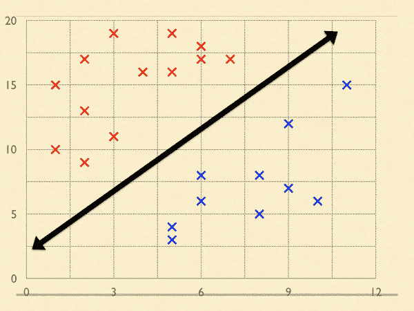
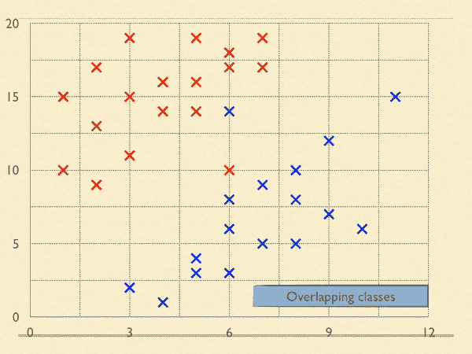
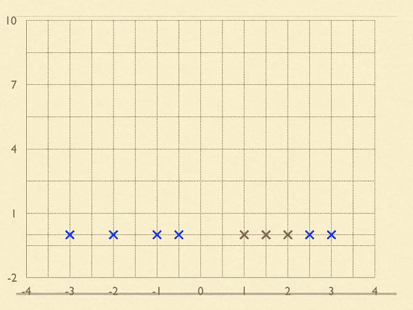
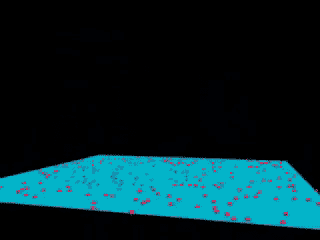

# 我支持向量机，你也应该支持。

> 原文：<https://towardsdatascience.com/i-support-vector-machines-and-so-should-you-7af122b6748?source=collection_archive---------4----------------------->

大约一周前，我在大会上做了一个关于支持向量机的演讲。这是一个介绍性的演讲，旨在揭开支持向量机模型的神秘面纱，支持向量机模型非常强大，但其内部工作原理可能有点难以理解。如果你对这类事情感兴趣的话，一定要看看这个视频，但是我在这里也要讲同样的内容。你将会错过一些我本人的魅力和个人魅力，并因此变得不那么重要。

Man, I move my arms a lot.

好吧，支持向量机有什么用？它们是一种机器学习，允许计算机获取一组数据，并将其分为两组(或通过将任何一组与所有其他组进行比较而分为更多组)。我们可以使用它们来对基本上任何东西进行分类，从获取金融信息来决定某人是否可能拖欠贷款，到图像信息，以便计算机可以决定某物是狗还是猫。它们的一个好处是最大化两组之间的界限(或空间),以允许计算机以前没有看到的新观察被更好地分类。他们还可以利用一种叫做内核技巧的东西，我将很快解释这一点。

基本上，计算机使用大量的数学，youtube 上的聪明人可以向你解释，在已经标记的数据组之间画一条线，然后使用这条线来预测新的观察结果属于哪个类别或组。仔细想想，还是比较可观的。我们可以自然地看到下面的图表，并意识到在哪里最好地画一条线来区分蓝色和红色的 X，但实际上有很多不同的可能性，找到聪明的方法让计算机识别最好的是大企业。

One of these lines is better than the others

从数学上来说，计算机在数据之间画一条线，在两个方向上移动其他线，并旋转这些线，直到它在任何一边都碰到观测值。

The computer tries to increase the green area to its maximum

它的名字来源于这些最终支持模型的向量。这些向量也是计算机需要保留的唯一重要信息，因为所有其他点对模型或预测没有影响。

The aforementioned support vectors!

所有这些看起来很简单，对吗？确实是！虽然从技术上来说，我们只建立了一个最大间隔分类器。如果我们对有一些重叠或极端异常值的事物进行分类，这种方法将会失败。想象一下，你正试图区分猫和狗，而有人把一只吉娃娃扔了进来！或者，上帝保佑，一只西施犬。没有电脑能区分这些，对吗？不对。我们只是告诉我们忽略他们！要是人们这么容易编程就好了…

在下面的 GIF 图中，你可以首先看到一个混合群体，计算机无法用数学方法在他们之间画一条线。通过忽略两个点，它能够找到最佳支持向量，并绘制我们的线。在 GIF 的后半部分，一个极端的异常值(臭名昭著的西施犬)会将我们的线推得太靠近红色类，导致我们的模型对未来的预测分类错误。教导计算机一些观察结果根本不符合我们通常的预期，这在建模中非常重要，并防止过度拟合我们给它的任何训练数据。

Overlapping classes and extreme outliers can be overcome with support vector machines with careful tuning

好的。现在所有这些可视化显示了数据的 2D 表示。如果我们对狗和猫进行分类，就好像我们只看到了关于它们的两条信息。也许 x 轴代表他们的体重，y 轴代表，你知道，天生邪恶什么的。所有这一切都在 3 维及以上的空间中进行。我们在画平面(或 4D 及更远地方的超平面),而不是线，但一切还是一样的。看，这是同样魔术的 3D 照片:

I’d show you 4D, but I was swore to secrecy

到目前为止还不错，是吗？现在我们进入真正的魔术:内核技巧。所以，我相信你可以想象许多不同的数据集或图表，你不能简单地通过它们画一条线/一个平面/任何东西。被蓝色海洋包围的一簇红色是不可能被划一条线穿过的。数学又来拯救我们了。在下面的例子中，我们有 1D 的数据，无论我们在哪里画线，我们都不能把我们的组分开。这个例子中的核心技巧是用第一维的平方增加另一维。如果我们只是在谈论猫和狗的重量，就好像我们决定也告诉计算机它们重量的平方。对我们来说，这毫无意义，但是看。

天哪，我说的对吗？现在从 2D 到 3D 观看同样的东西！

That’s some mathematical magic!

这只是一个超级简单的内核技巧。人们已经为支持向量机想出了一些奇特的方法，这使得他们能够处理一些非常复杂的事情。如果你在增加一个维度后仍然有困难，没有人说你不能增加更多的维度！疯狂。

如果你想了解更多关于内核和一些更有效的内核，请查看 Eric Kim 写的这篇文章。就这些东西而言，它相当容易接近。

如果你对支持向量机其他方面背后的数学感兴趣，我推荐 youtube 上的这两个视频:
乌迪·阿哈尼:[https://www.youtube.com/watch?v=3liCbRZPrZA](https://www.youtube.com/watch?v=3liCbRZPrZA)
特梅尔·比利西姆:[https://www.youtube.com/watch?v=5zRmhOUjjGY](https://www.youtube.com/watch?v=5zRmhOUjjGY)

我希望这有助于揭开支持向量机的神秘面纱，并教会你在开始用它们建模时，在引擎盖下发生了什么的基础知识。干杯。