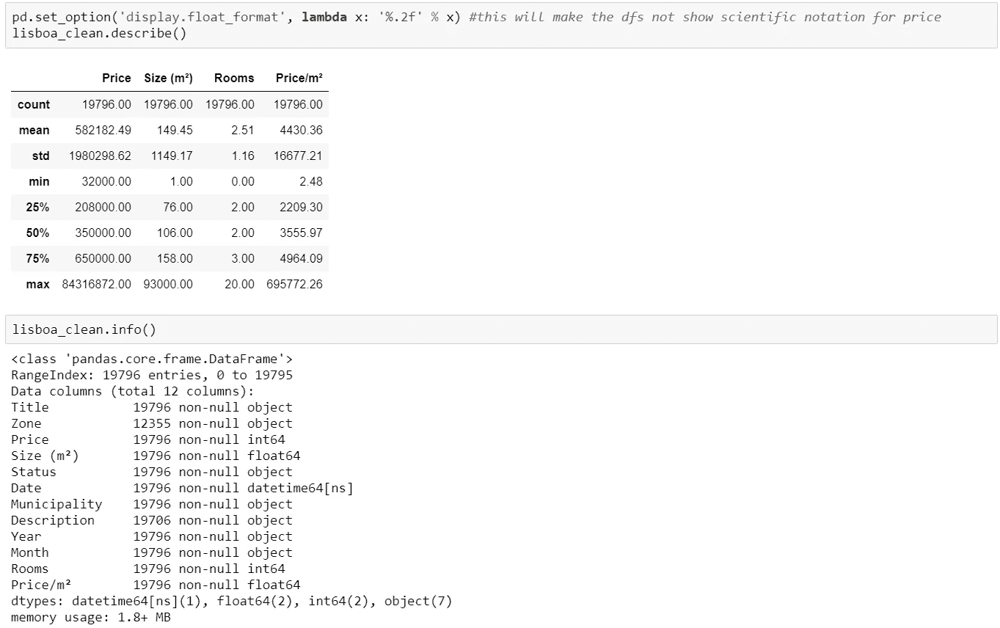
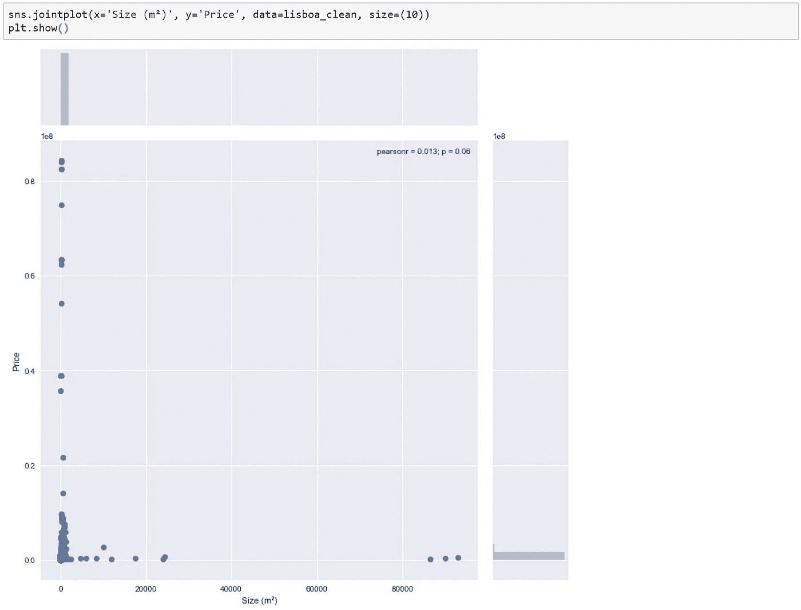
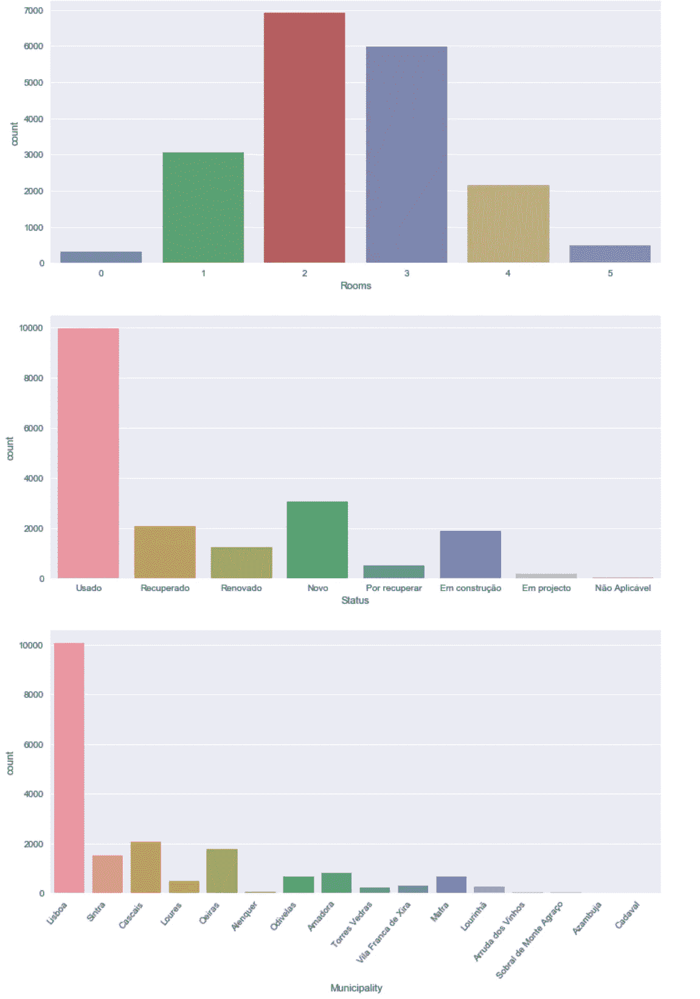
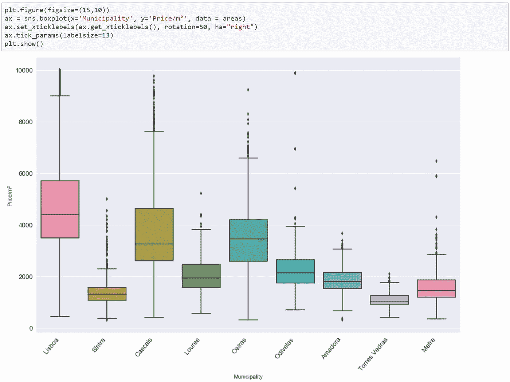

# 我在找房子，所以我用 Python 做了一个 web scraper！—第二部分(EDA)

> 原文：<https://towardsdatascience.com/i-was-looking-for-a-house-so-i-built-a-web-scraper-in-python-part-ii-eda-1effe7274c84?source=collection_archive---------6----------------------->


这篇文章是另一篇文章的后续，在那篇文章中，我构建了一个网络抓取器来寻找里斯本的待售房屋。这一次，我将重点介绍我们之前收集的数据集的转换和清理过程。然后，我将尝试对数据集执行一些探索性数据分析(EDA)。我的目标是给你一些可以做什么的例子，而不是提供一个超级复杂的分析。但是请随意评论和提出建议！我们将在本文中看到的一些内容:

*   获取每栋房子的房间数量
*   得到每平方米的价格
*   去除异常值和“奇怪”的观察值
*   使用 Seaborn 来可视化我们的数据

先来看看之前从刮萨珀网站得到了什么。


数据集中有一个日期，代表广告发布的日期。我已经知道有一些 2018 年之前的广告，我认为这些房子不再出售是安全的。为了有一个快速过滤的方法，我们可以添加年和月两列。

```
lisboa_clean = lisboayears = []
months = []for x in lisboa_clean['Date']:
    months.append(str(x.year) + '-' + str(x.month))
    years.append(str(x.year))

lisboa_clean['Year'] = years
lisboa_clean['Month'] = months
```

搞定了。我还将把“Size (m)”转换成数值，对于不包含数值的记录(如“-”)，我将把它们转换成 NaN(用*强制*)，然后我将删除它们，因为在本练习中它们的值将是 none。

```
lisboa_clean['Size (m²)'] = pd.to_numeric(lisboa_clean['Size (m²)'], errors='coerce')lisboa_clean.dropna(subset=['Size (m²)'], inplace=True)
```

虽然我也获得了“URL”和“Image”列，但是本文不需要它们，所以我们可以简单地删除它们。

```
lisboa.drop(['URL', 'Image'], axis=1, inplace=True)
```

如果你对房地产数据做过任何类型的分析，你可能会注意到我们仍然没有每个房产的房间数量…这些信息在搜索页面中是不可用的(至少是直接不可用的)，所以我们需要有点创造性。

在每个标题中，都有一个类似“T2”的字符串，它告诉我们这个房子有两个房间。T3 是 3 个房间，以此类推。我的目标是得到数字，它可以有一个或两个数字。输入(可怕的)正则表达式。接下来的几行代码看起来并不漂亮，我几乎可以肯定一定有更简单或更有效的方法来完成它，但是经过一些测试后，这似乎可以很好地完成工作！

该代码遍历数据集中的每个标题，并将匹配下面正则表达式的字符串检索到一个新列表(*房间*)，即“任何以‘T’开头且后面有 1 或 2 个数字的字符串”。我们最终拥有这些独特的价值:


似乎有些房子“没有”房间。我们应该可以放弃它们并继续，但是为了以防万一，这段代码告诉我们这样做我们损失了多少房子。


A total of 2010 houses were dismissed. Not a serious issue for us though!

在去掉“无”之后，我们可以继续得到数字。多一个带有用于循环的*单元将会解决这个问题。这个循环将把字母 t 后面的字符转换成整数。*


搞定了。在这之后，加上每平方米的价格应该是小菜一碟。然后我们可以检查*描述*告诉我们对数据集做了什么。

```
lisboa_clean['Price/m²'] = lisboa_clean['Price'] / lisboa_clean['Size (m²)']
```



with all this process, we are down to 19796 properties

## 该打扫了！

这可能是整个过程中最重要的部分。最终，这一阶段的工作质量将决定您的分析或模型的质量。事实上，没有确切的规则，这使得我们很难决定应该保留/丢弃多少数据，这就是一点常识派上用场的地方。一个很好的经验法则是去掉不到 3%的数据。如果您丢弃越来越多的数据，您将会限制您必须处理的信息量。

> 这里的目标是在预处理数据时，始终为您所做的选择提供某种推理。

对于这篇文章，我的*选择*是不太关心那 3%！我们马上可以看到我们的数据中有一些奇怪的值，更准确地说是一栋价值超过 8000 万欧元的房子，或者是一栋 93 平方公里的房子。这些极值(异常值)将对平均值等测量产生巨大影响。“证据”是，虽然中位价在 35 万左右，但均价在 58.2 万左右。

> **中位数对异常值不太敏感**，这使得它在这种情况下是一个很好的工具。

让我们在清理之前使用 Seaborn 来检查我们的数据。不难发现我们有很多清洁工作要做！由于离群值的数量，联合图看起来不太好。请注意，价格和规模之间的皮尔逊相关性非常低，p 值也是如此(这是一个统计显著性指标，基本上，如果低于 0.05，则意味着相关系数显著)。



“not looking good” is an understatement…

经过一些测试后，我为数据集设计了以下过滤器:

*   我还没打算买城堡，所以我会拆除任何超过 600 平方米的房子
*   超过 5 个房间的房屋也是如此
*   180 万欧元以上的价格也有点超出我的预算…

另一方面，我确实觉得很奇怪，可能会有百万富翁在这样一个普通的网站上买房。这似乎不是买卖豪宅的合适平台，所以我们实际上可以说，这些房产并不代表我们在这里试图分析的市场。

简而言之，这就是我对数据科学的描述。想出这些关于你的数据的故事，并检验你的理论(或*假设*)。

回到我们的数据，让我们去掉我上面提到的观察。通过 len 我们可以看到我们丢弃了多少张唱片。


```
lisboa_clean = lisboa_clean[lisboa_clean['Size (m²)'] < 600]lisboa_clean = lisboa_clean[lisboa_clean['Price'] < 1800000]lisboa_clean = lisboa_clean[lisboa_clean['Rooms'] < 6]
```

新创建的价格/大小的分布情况如何？我们这里也有一些清洁工作要做。每平方米的平均价格在 5k 左右(见之前的*描述*方法),所以我会移除这个值高于 10k 的房子。在相反的极端情况下，我也会删除低于每平方米 300 欧元的观察值。


```
lisboa_clean = lisboa_clean[lisboa_clean['Price/m²'] < 10000]lisboa_clean = lisboa_clean[lisboa_clean['Price/m²'] > 300]lisboa_clean.reset_index(inplace=True, drop=True)
```

再次检查*接合处*的时间到了。我们基本上是通过从数据中移除极值来平滑分布。例如，如果我们要建立一个预测房价的模型，这将允许更好的模型。


notice how the pearson correlation coefficient suddenly improved to 0.69, just by cleaning noise from the dataset


the price per square meter is also more balanced

本着多样性的精神，我将分享另一种图表，即 *pairplot* 。这一个真的很酷，但是如果你加入太多的变量会变得不可读。这里没有很多有价值的见解，但看起来确实很花哨！


我们还可以探索剩余的分类变量，如“身份”、“城市”和“房间”。

```
fig, ax =plt.subplots(3,1, figsize=(12,20))
sns.countplot(lisboa_clean['Rooms'], ax=ax[0])
sns.countplot(lisboa_clean['Status'], ax=ax[1])
sns.countplot(lisboa_clean['Municipality'], ax=ax[2])
ax[2].set_xticklabels(ax[2].get_xticklabels(), rotation=50, ha="right")
plt.show()
```



不出所料，里斯本地区的主要城市是里斯本、卡斯凯什和欧伊拉斯。对于不熟悉这个城市的人来说，这可能没什么意义，但这些基本上都是该区的黄金地段。

2 室的房子比 1 室的房子多一倍以上。我想大多数房子都有不止一个房间是有道理的，我以前从来没有想过这个问题！

让我们用这些变量的一些*箱线图*来总结一下。

```
plt.figure(figsize=(15,10))
ax = sns.boxplot(x='Rooms', y='Price', data = lisboa_clean)
ax.tick_params(labelsize=13)
plt.show()
```


同样，很明显的结论，因为我们预计随着房间数量的增加，房产的价值会上升。这些图表中有趣的一面可能是 1 室和 2 室的房子在相同的价格范围内竞争。事实上，我们有无限的方法可以进一步探索这些信息。

最终*盒图*，我保证！让我们来看看在一组特定的城市中每平方米价格的差异

```
areas = lisboa_clean.loc[lisboa_clean['Municipality'].isin(['Lisboa', 'Amadora', 'Cascais', 'Oeiras', 'Sintra', 'Loures', 'Odivelas', 'Mafra', 'Torres Vedras'])]
```



当涉及到探索和表示数据时，有大量的可能性。我希望这篇文章能给你一些有用的提示，让你更好地理解你的数据！尽管我们没有发现任何关于里斯本房地产市场的令人震惊的事实，但我认为我们能够看到一些简单的步骤，如去除极值，可以大大提高我们分析的质量。

*感谢阅读！如果你喜欢这篇文章，我邀请你看看我的其他故事。我主要感兴趣的是数据科学，Python，区块链和数字货币，技术，还有其他一些东西像* [***摄影***](https://fnevesphotography.pixieset.com/) *！如果你想取得联系，你可以在这里联系我*[](https://www.linkedin.com/in/fabioneves/)***或者直接回复下面的文章。***