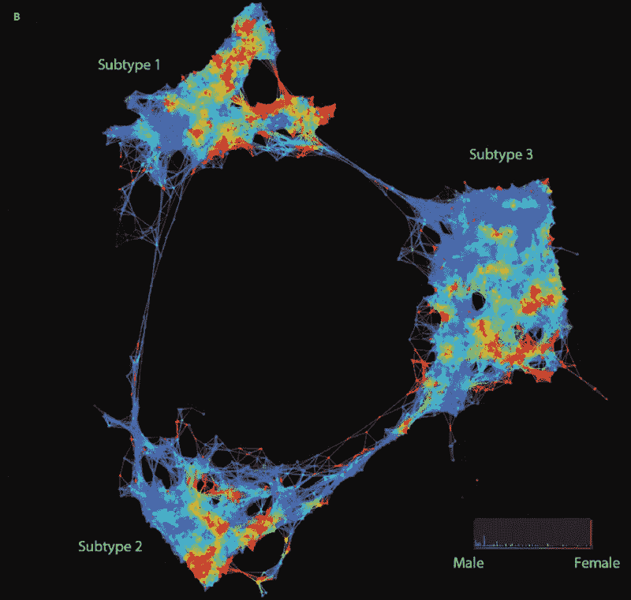

# 通过患者相似性的拓扑数据分析识别二型糖尿病亚组

> 原文：<https://towardsdatascience.com/identification-of-type-2-diabetes-subgroups-through-topological-data-analysis-of-patient-similarity-91838f2ccf74?source=collection_archive---------3----------------------->

这篇原创的[博客](https://www.ayasdi.com/blog/healthcare/identification-of-type-2-diabetes-subgroups-through-topological-data-analysis-of-patient-similarity/)于 2015 年首次出现在 Ayasdi 网站上。

Ayasdi 的合作者昨天取得了另一项重大胜利，如 [Fast Company](https://www.fastcompany.com/3052935/the-latest-breakthrough-in-understanding-diabetes-was-made-by-an-algorithm) 所述，西奈山的 Ichan 医学院在超负盛名的期刊[Science:Translational Medicine](http://stm.sciencemag.org/content/7/311/311ra174)上发表了论文，表彰他们利用拓扑数据分析识别先前未知的糖尿病亚型的工作。

这篇论文包含了突破性的研究，是对精准医疗超越癌症的验证。西奈山伊坎医学院的生物医学信息学主任 Joel Dudley 博士使用 [Ayasdi Core](http://www.ayasdi.com/product/core/) 来确定新的患者亚组，这将最终实现对这种广泛传播、昂贵和毁灭性疾病的更精确的诊断和治疗。

对科学、医学和病人来说都是惊人的。在全球范围内，糖尿病是一种发病率很高的流行疾病，我们中的许多人都有家人受其影响。

医生知道，T2D 诊断患者有多种表现型，对糖尿病相关并发症具有易感性。

西奈山的伊坎医学院有一个大型数据库，将 30，000 多名患者的遗传、临床和医疗记录数据配对。西奈山的数据集不仅庞大，而且复杂，因为它包含许多不同的数据类型。除了基因组测序数据，它还包括每个患者的年龄、性别、身高、体重、种族、过敏、血液测试、诊断和家族史等信息。Joel 和他的团队使用精准医学方法，基于高维电子病历(EMRs)和来自 11，210 个个体的基因型数据(遗传标记和临床数据，如血液水平和症状)，来表征 T2D 患者群体的复杂性。

使用拓扑数据分析，西奈山在患者-患者网络中发现了三个不同的 T2D 亚组。

*   亚型 1 以 T2D 并发症糖尿病肾病和糖尿病视网膜病变为特征；
*   亚型 2 富含癌症恶性肿瘤和心血管疾病；
*   亚型 3 与心血管疾病、神经系统疾病、过敏和 HIV 感染密切相关。

他们的网络登上了杂志的封面，并且可以在 STM 网站上找到。

因此，使用 Ayasdi Core，他们能够发现大型复杂数据集中的隐藏模式，使创新研究机构和制药公司(如 Mount Sinai)能够加快生物标志物发现、疾病类型细分和目标药物发现。

因为 Ayasdi 的方法不需要开发广泛的临床假设，并且可以根据数百种先进的数学算法自动绘制相关的患者亚组，所以 Dudley 博士的初步研究结果表明，二型糖尿病不是一种单一的疾病。

相反，它由几个小组组成，每个小组都有自己独特的复杂因素。

这一新的见解可能会为所有二型糖尿病患者带来更有效的治疗方案和更好的患者结果，并推进精准医疗的实践。

“通过使用 Ayasdi，我们看到目前二型糖尿病的临床定义太不精确，”Dudley 博士说。“我们的数据表明，根据患者人群的亚组，可能存在 3 型、4 型、5 型或更多型糖尿病，每个患者都可以从不同的治疗方法中受益。这些是令人兴奋的发现，有可能改变我们治疗这种主要疾病的方法。”

这是大医院的医生使用我们的软件改善患者护理并在顶级期刊上发表文章的第三个例子。

除了在糖尿病方面的工作，西奈山团队还利用 Ayasdi 研究了其他主要疾病。例如，在精神分裂症研究中，研究人员整合了从数百个病例中收集的 MRI 数据，并将其与分子途径数据配对。他们生成了大脑形状的数据模型，揭示了精神分裂症患者与对照组相比有显著差异的一小块区域。在未来，这一发现可能允许医生通过查明精神分裂症患者大脑中哪些分子路径被破坏来更有效地识别和治疗精神分裂症。

随着我们的合作者继续使用我们的软件改变世界，敬请关注下一季度的更多新闻。

要成为合作者，请发电子邮件给我们，姓名为[collaborations@ayasdi.com](mailto:collaborations@aysadi.com)。