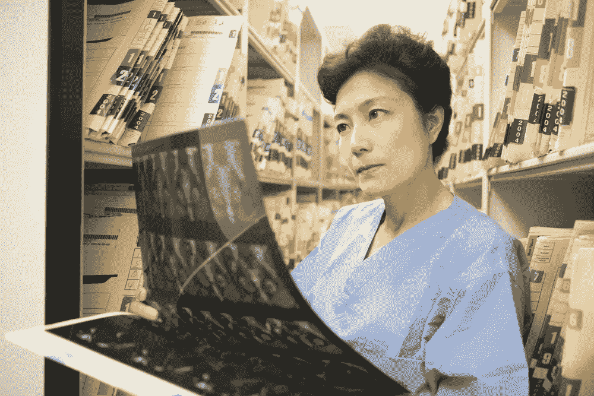

# 如果数据是新的黑金，那么医疗数据就是新的黄金！

> 原文：<https://towardsdatascience.com/if-data-is-the-new-black-gold-then-medical-data-is-the-new-gold-f2459df2d888?source=collection_archive---------1----------------------->

Paper based Medical Records

作为一名热情的计算科学家和未来学家，我监视、跟踪和预测即将到来的、正在快速融合的重大趋势。根据学术界和工业界专家的说法，我们已经进入了大数据时代，并正在向人工智能(AI)时代过渡，人工智能有可能改变所有主要的行业和部门。这尤其与搜索引擎(谷歌)、电子商务(亚马逊、Flipkart)、社交网络(脸书、LinkedIn)等领域相关。

我们在[**brain pan Innovations**](http://www.brainpan.co)，正在大力分析发展中国家的医疗保健领域。我们倾向于顺应潮流，认为我们正处于一个*‘少数据、旧数据、无数据’*的时代，因为作为一个社会，我们仍然停留在一项 5000 年的技术上，那就是纸。

令我们困惑的是，大多数印度医生都在“新金矿”的顶端，但并不完全了解他们所拥有的资产的潜力和价值。根据我们在二线城市(HRA 分类中的 Y 级)的调查，私人诊所每天的患者数量从 10 到 25 不等，医院从 50 到 200 不等，每年产生几千个医疗数据记录。但是，这些数据存在于纸质处方和医疗报告中，而不是电子形式，即 EHR。

在我国，电子医疗数据的价值被惊人地低估和利用不足。从作为药物开发项目的催化剂到定制的私人护理，它们的效用是无穷的。例如，理解 EHR 系统的数千个数据点中保存的医疗数据的结构可以快速找到相关的模式，从而帮助我们揭示定义治疗方案的最有利方式，同时确定哪些药物、测试和其他程序有助于获得最佳结果。以下是一些支持事实，供参考。

> 在 2011 年，赛诺菲安万特成功地证明了 EHR 使许多二型糖尿病和心脏病患者得到了改善。这是一个为期 12 个月的项目，在两个试点跟踪 119 名患者，为期 6 个月。
> 
> 2016 年，辉瑞使用匿名的 EHR 数据开发了 *Xalkori* 作为第一种专门针对 ALK 基因突变的肺癌患者的美国 FDA 药物。

为了能够改变人们的生活，解决未满足的患者需求，医疗保健公司需要访问健康数据，以便实施机器学习算法等人工智能技术来改善他们的医疗诊断。

在人口超过 12.5 亿的印度，非传染性疾病呈上升趋势，心血管疾病(24%)、慢性呼吸道疾病(11%)、癌症(6%)和糖尿病(2%)是导致死亡的主要原因。

问我们所有人一个问题——为什么印度的医生不利用这个巨大的数据库来加速人工智能、机器学习或更准确地说是计算机辅助诊断(CAD)？如果有一种算法可以分析胸部 CT，检测肺部的肺气肿区域，或者在有肺动脉高压迹象时发出警报，岂不是更好？从妇科角度来看，在心脏病、中风的急性病例中的其他可能用途，或量化高危妊娠、纤维瘤将是突破性的。

我们的初创公司[**brain pan Innovations**](http://www.brainpan.co)(隐形模式)正在不断开发和改进**数据驱动预防性 EHR** 平台’**医生日记**，该平台旨在通过弥合生命科学和计算之间的差距来应对所有这些科学挑战。