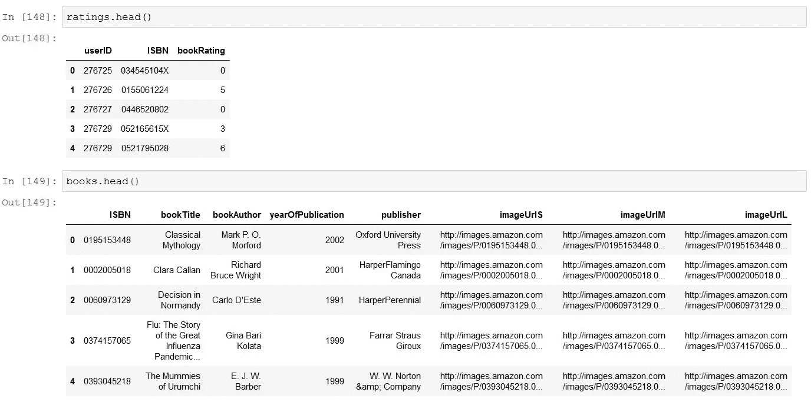
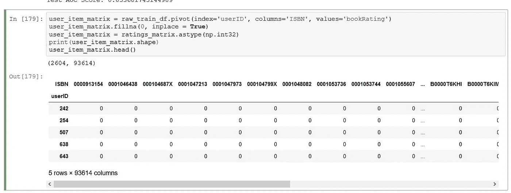

# 如果你不能衡量它，你就不能改善它！！！

> 原文：<https://towardsdatascience.com/if-you-cant-measure-it-you-can-t-improve-it-5c059014faad?source=collection_archive---------9----------------------->

## 如何用 python 中的 LightFM 为一个电商搭建一个可扩展的推荐系统？


photo credit: pixabay

在过去的几年里，网上购物发生了很大的变化。像亚马逊这样的在线商店，在更个人化的层面上对待他们的顾客。他们根据您的网上购物活动(查看商品、将商品添加到购物车并最终购买)了解您对某些商品的兴趣。例如，你在亚马逊上搜索一件商品，然后点击一些搜索结果。下次你访问亚马逊时，你可以看到有一个特定的部分，根据你上次搜索的内容为你推荐类似的产品。故事并未就此结束，随着你与在线商店的互动越来越多，你会收到更多个性化的推荐，包括“购买该商品的顾客也购买了”,它会向你显示经常一起购买的商品列表。此外，一些商店发送促销电子邮件，提供针对更有可能购买这些产品的客户的产品。

推荐系统是机器学习最常用的应用之一。**由于这里的目标是关注如何使用 LightFM 软件包构建推荐系统，并提供清晰的度量标准来衡量模型性能**，所以我将只简要提及不同类型的推荐系统。关于推荐系统的更多细节，我建议观看 Siraj Raval 的这个简短的[视频](https://www.youtube.com/watch?v=9gBC9R-msAk)，并查看 [Chhavi Aluja](https://medium.com/@chhavi.saluja1401/recommendation-systems-made-simple-b5a79cac8862) 的这篇文章。有三种类型的推荐系统:

*   基于内容
*   协作过滤(基于项目、基于用户和基于模型)
*   混合方法(将基于内容的方法添加到协同过滤中)

我最初的目标是建立一个混合模型，因为它可以将基于内容的推荐整合到协同过滤中，并且能够解决纯协同过滤推荐系统的冷启动问题。然而，没有多少公开可用的好数据集既有项目或用户的元数据，又有评级交互。所以我决定首先研究一个协同过滤模型，理解推荐系统的不同方面，在我的下一篇文章中，我将建立一个混合模型。

# 方法:

## **为什么选择 LightFM？？？**

在研究推荐系统时，我遇到了许多相关的伟大项目，但是缺少一件事是缺乏一个明确的指标来评估模型的性能。我相信，如果你不能通过提供清晰的指标来评估你的模型的性能，你可能很难让你的读者相信这个模型(推荐系统)工作得足够好。因此，我选择了 [LightFM](https://github.com/lyst/lightfm) ，因为它提供了清晰的指标，如 AUC 得分和 Precision@K，可以帮助评估训练模型的性能。这对于构建更好的模型和实现更高的准确性非常有用。

根据我们要解决的用例或问题类型，在 Precision@K 和 AUC score 之间做出选择可能会很棘手。在这种情况下，我们将使用 AUC 评分，因为它衡量整体排名的质量，并可以解释为随机选择的正面项目排名高于随机选择的负面项目的概率。

“LightFM 是许多流行的隐式和显式反馈推荐算法的 Python 实现，包括 BPR 和 WARP 排名损失的高效实现。它易于使用，快速(通过多线程模型估计)，并产生高质量的结果。” [LightFm 文档。](http://lyst.github.io/lightfm/docs/home.html)


photo credit:pixabay

# 数据

对于这个项目，我们将使用[图书交叉](http://www2.informatik.uni-freiburg.de/~cziegler/BX/)数据集实现一个基于矩阵分解方法的纯协作过滤模型。我们将利用 Chhavi Aluja 在她关于 towardsdatascience.com 的[帖子](/my-journey-to-building-book-recommendation-system-5ec959c41847)中对这个数据集进行的惊人的数据清理和预处理。让我们来看看数据:

```
import pandas as pd
import numpy as np
import matplotlib.pyplot as plt
from datetime import datetime, timedelta
from sklearn import preprocessing
from lightfm import LightFM
from scipy.sparse import csr_matrix 
from scipy.sparse import coo_matrix 
from sklearn.metrics import roc_auc_score
import time
from lightfm.evaluation import auc_score
import pickle
import re
import seaborn as snsbooks = pd.read_csv('BX-Books.csv', sep=';', error_bad_lines=False, encoding="latin-1")
books.columns = ['ISBN', 'bookTitle', 'bookAuthor', 'yearOfPublication', 'publisher', 'imageUrlS', 'imageUrlM', 'imageUrlL']
users = pd.read_csv('BX-Users.csv', sep=';', error_bad_lines=False, encoding="latin-1")
users.columns = ['userID', 'Location', 'Age']
ratings = pd.read_csv('BX-Book-Ratings.csv', sep=';', error_bad_lines=False, encoding="latin-1")
ratings.columns = ['userID', 'ISBN', 'bookRating']
```


size of each dataframe



```
books.drop(['imageUrlS', 'imageUrlM', 'imageUrlL'],axis=1,inplace=True)
books.loc[books.ISBN == '0789466953','yearOfPublication'] = 2000
books.loc[books.ISBN == '0789466953','bookAuthor'] = "James Buckley"
books.loc[books.ISBN == '0789466953','publisher'] = "DK Publishing Inc"
books.loc[books.ISBN == '0789466953','bookTitle'] = "DK Readers: Creating the X-Men, How Comic Books Come to Life (Level 4: Proficient Readers)"
books.loc[books.ISBN == '078946697X','yearOfPublication'] = 2000
books.loc[books.ISBN == '078946697X','bookAuthor'] = "Michael Teitelbaum"
books.loc[books.ISBN == '078946697X','publisher'] = "DK Publishing Inc"
books.loc[books.ISBN == '078946697X','bookTitle'] = "DK Readers: Creating the X-Men, How It All Began (Level 4: Proficient Readers)"
books.loc[books.ISBN == '2070426769','yearOfPublication'] = 2003
books.loc[books.ISBN == '2070426769','bookAuthor'] = "Jean-Marie Gustave Le Cl�©zio"
books.loc[books.ISBN == '2070426769','publisher'] = "Gallimard"
books.loc[books.ISBN == '2070426769','bookTitle'] = "Peuple du ciel, suivi de 'Les Bergers"
books.yearOfPublication=pd.to_numeric(books.yearOfPublication, errors='coerce')
books.loc[(books.yearOfPublication > 2006) | (books.yearOfPublication == 0),'yearOfPublication'] = np.NAN
books.yearOfPublication.fillna(round(books.yearOfPublication.mean()), inplace=True)
books.loc[(books.ISBN == '193169656X'),'publisher'] = 'other'
books.loc[(books.ISBN == '1931696993'),'publisher'] = 'other'
users.loc[(users.Age > 90) | (users.Age < 5), 'Age'] = np.nan
users.Age = users.Age.fillna(users.Age.mean())
users.Age = users.Age.astype(np.int32)
```

上面的代码块是常规的数据清理，以确保在将数据用于模型输入之前，数据的格式是正确的。此外，我们需要确保 ratings 数据框架中的所有行都代表来自用户和图书数据框架的数据。接下来，评级必须只包括有效的评级分数(1-10)，我们应该去掉评级值为零的所有行。

```
ratings_new = ratings[ratings.ISBN.isin(books.ISBN)]
ratings = ratings[ratings.userID.isin(users.userID)]
ratings_explicit = ratings_new[ratings_new.bookRating != 0]
```

这是评分值的分布:


为了完成我们的数据预处理，我们可以做的最后一件事是为已经对图书进行评级的用户数量以及已经被用户评级的图书数量分配一个阈值。换句话说，我们必须有一个用户和书籍的最低评级计数。我认为，如果只有至少评价了 20 本书的用户和至少被 20 个用户评价过的书就好了。

```
counts1 = ratings_explicit['userID'].value_counts()
ratings_explicit = ratings_explicit[ratings_explicit['userID'].isin(counts1[counts1 >= 20].index)]
counts = ratings_explicit['bookRating'].value_counts()
ratings_explicit = ratings_explicit[ratings_explicit['bookRating'].isin(counts[counts >= 20].index)]**ratings_explicit.shape
(217729, 3)**
```


# 训练我们的模型:

在这一步，我们将训练我们的模型。但这个问题不一样。在协作过滤模型中，我们基于用户-项目交互来寻找表征每个项目(书)的潜在特征，并且我们寻找每个用户与所发现的每个潜在特征的相似性。这个过程是通过矩阵分解完成的。首先，我们需要将数据(ratings_explicit)分成训练集和测试集。这就是事情变得棘手的地方。很明显，纯粹的协同过滤方法不能解决冷启动问题。因此，必须进行训练和测试拆分，以便测试集中的用户或书籍的实例必须具有训练集中的剩余实例:

```
**def informed_train_test(rating_df, train_ratio):**
    split_cut = np.int(np.round(rating_df.shape[0] * train_ratio))
    train_df = rating_df.iloc[0:split_cut]
    test_df = rating_df.iloc[split_cut::]
    test_df = test_df[(test_df['userID'].isin(train_df['userID'])) & (test_df['ISBN'].isin(train_df['ISBN']))]
    id_cols = ['userID', 'ISBN']
    trans_cat_train = dict()
    trans_cat_test = dict()
    for k in id_cols:
        cate_enc = preprocessing.LabelEncoder()
        trans_cat_train[k] = cate_enc.fit_transform(train_df[k].values)
        trans_cat_test[k] = cate_enc.transform(test_df[k].values)# --- Encode ratings:
    cate_enc = preprocessing.LabelEncoder()
    ratings = dict()
    ratings['train'] = cate_enc.fit_transform(train_df.bookRating)
    ratings['test'] = cate_enc.transform(test_df.bookRating)n_users = len(np.unique(trans_cat_train['userID']))
    n_items = len(np.unique(trans_cat_train['ISBN']))train = coo_matrix((ratings['train'], (trans_cat_train['userID'], \
                                                          trans_cat_train['ISBN'])) \
                                      , shape=(n_users, n_items))
    test = coo_matrix((ratings['test'], (trans_cat_test['userID'], \
                                                        trans_cat_test['ISBN'])) \
                                     , shape=(n_users, n_items))
    return train, test, train_df
```

函数 informed_train_test()返回训练集和测试集的 coo 矩阵以及原始训练数据帧，以便稍后对模型进行评估。让我们看看如何拟合我们的模型并评估其性能:

```
train, test, raw_train_df = informed_train_test(ratings_explicit, 0.8)start_time = time.time()
model=LightFM(no_components=110,learning_rate=0.027,loss='warp')
model.fit(train,epochs=12,num_threads=4)
# with open('saved_model','wb') as f:
#     saved_model={'model':model}
#     pickle.dump(saved_model, f)
auc_train = auc_score(model, train).mean()
auc_test = auc_score(model, test).mean()print("--- Run time:  {} mins ---".format((time.time() - start_time)/60))
print("Train AUC Score: {}".format(auc_train))
print("Test AUC Score: {}".format(auc_test))**--- Run time:  4.7663776795069377 mins ---
Train AUC Score: 0.9801499843597412
Test AUC Score: 0.853681743144989**
```

正如所料，训练集的 AUC 分数接近 1，我们在测试集中得到了 0.853 的 AUC 分数，不算太差。使用随机搜索来调整用于训练 LightFm 模型的参数。GridSearh 运行起来太昂贵了，所以我决定使用 scikit-optimize 包中的 forest_minimize()来调优参数。关于调整参数的函数的更多细节在本文的 github 页面中。

我知道我之前提到过，对于向没有与项目进行任何交互的新用户推荐项目来说，纯协作过滤预计表现不佳(冷启动问题)。在 LightFM 文档页面中展示的示例中，他们还表明，在使用 movielens 数据集向新客户推荐电影时，纯粹的协作方法无法获得令人满意的结果，但是，我很好奇自己是否会针对图书交叉数据集进行测试。**令人惊讶的是，结果显示该数据集对冷启动问题反应良好，AUC 得分相对较高**！！！为了在这种情况下训练模型，唯一的区别是我们将数据集随机分为训练集和测试集。这意味着在训练集和测试集中出现常见用户-项目交互的概率是完全随机的:

```
import scipy.sparse as spdef _shuffle(uids, iids, data, random_state):shuffle_indices = np.arange(len(uids))
    random_state.shuffle(shuffle_indices)return (uids[shuffle_indices],
            iids[shuffle_indices],
            data[shuffle_indices])**def random_train_test_split(interactions_df,
                            test_percentage=0.25,
                            random_state=None):**
    """
    Randomly split interactions between training and testing.This function takes an interaction set and splits it into
    two disjoint sets, a training set and a test set. Note that
    no effort is made to make sure that all items and users with
    interactions in the test set also have interactions in the
    training set; this may lead to a partial cold-start problem
    in the test set.Parameters
    ----------interactions: a scipy sparse matrix containing interactions
        The interactions to split.
    test_percentage: float, optional
        The fraction of interactions to place in the test set.
    random_state: np.random.RandomState, optional
        The random state used for the shuffle.Returns
    -------(train, test): (scipy.sparse.COOMatrix,
                    scipy.sparse.COOMatrix)
         A tuple of (train data, test data)
    """
    interactions = csr_matrix(interactions_df.values)
    if random_state is None:
        random_state = np.random.RandomState()interactions = interactions.tocoo()shape = interactions.shape
    uids, iids, data = (interactions.row,
                        interactions.col,
                        interactions.data)uids, iids, data = _shuffle(uids, iids, data, random_state)cutoff = int((1.0 - test_percentage) * len(uids))train_idx = slice(None, cutoff)
    test_idx = slice(cutoff, None)train = coo_matrix((data[train_idx],
                           (uids[train_idx],
                            iids[train_idx])),
                          shape=shape,
                          dtype=interactions.dtype)
    test = coo_matrix((data[test_idx],
                          (uids[test_idx],
                           iids[test_idx])),
                         shape=shape,
                         dtype=interactions.dtype)return train, test
```

现在让我们来看看 AUC 分数在随机训练测试分割中是如何不同的:

```
train, test = random_train_test_split(ratings_matrix)start_time = time.time()
model=LightFM(no_components=115,learning_rate=0.027,loss='warp')
model.fit(train,epochs=12,num_threads=4)
# with open('saved_model','wb') as f:
#     saved_model={'model':model}
#     pickle.dump(saved_model, f)
auc_train = auc_score(model, train).mean()
auc_test = auc_score(model, test).mean()print("--- Run time:  {} mins ---".format((time.time() - start_time)/60))
print("Train AUC Score: {}".format(auc_train))
print("Test AUC Score: {}".format(auc_test))**--- Run time:  8.281255984306336 mins ---
Train AUC Score: 0.9871253967285156
Test AUC Score: 0.6499683856964111**
```

随机分割数据**预计会得到 0.5 左右的 AUC 分数，但**我们可以看到，我们做得比扔硬币向新用户推荐商品或向当前用户推荐新商品好得多，因为我们的 AUC 分数为 0.649。我把对这种行为的进一步分析留给了本文的读者。

# 应用:

让我们假设数据集中的书籍是我们正在销售的商品，数据集中的用户实际上是目标客户。为了使案例更接近电子商务在线商店，我们可以改变评分值的一个方面是将值的范围从(1–10)减少到(7–10)。顾客的交互可以总结为: **A-查看商品，B-点击商品，C-将商品添加到他们的购物车，以及 D-进行交易以购买商品。**因此，在这种情况下，通过将评分值减少到前 4 名(7、8、9、10)，我们可以更接近地模拟上述商品与顾客的互动。


photo credit: unsplash

**在电子商务应用中，推荐系统主要有三种应用场景。**我不打算包含为本文接下来的部分提供结果的函数的实际代码，但它们会在 github repo 的主 jupyter 笔记本中。

*   **最常见的场景是根据特定客户的互动(查看和点击商品)向其进行典型推荐:**



User-Item interaction matrix

```
user_dikt, item_dikt = user_item_dikts(user_item_matrix, books)similar_recommendation(model, user_item_matrix, 254, user_dikt, item_dikt,threshold = 7)**Items that were liked (selected) by the User:**
1- The Devil You Know
2- Harlequin Valentine
3- Shout!: The Beatles in Their Generation
4- Sandman: The Dream Hunters
5- Dream Country (Sandman, Book 3)
6- Assata: An Autobiography (Lawrence Hill &amp; Co.)
7- The Golden Compass (His Dark Materials, Book 1)
8- The Fellowship of the Ring (The Lord of the Rings, Part 1)
9- The Hobbit: or There and Back Again
10- Harry Potter and the Sorcerer's Stone (Book 1)
11- Something Wicked This Way Comes
12- Martian Chronicles
13- Animal Farm
14- 1984
15- The Dark Half
16- Harry Potter and the Goblet of Fire (Book 4)
17- Harry Potter and the Prisoner of Azkaban (Book 3)
18- Harry Potter and the Prisoner of Azkaban (Book 3)
19- Harry Potter and the Chamber of Secrets (Book 2)
20- Harry Potter and the Chamber of Secrets (Book 2)
21- The Bonesetter's Daughter
22- The Wolves in the Walls
23- Stardust
24- Martian Chronicles
25- American Gods: A Novel

 **Recommended Items:**
1- The Lovely Bones: A Novel
2- Harry Potter and the Order of the Phoenix (Book 5)
3- The Catcher in the Rye
4- The Da Vinci Code
5- Harry Potter and the Sorcerer's Stone (Harry Potter (Paperback))
6- Red Dragon
7- Interview with the Vampire
8- Divine Secrets of the Ya-Ya Sisterhood: A Novel
9- Sphere
10- The Pelican Brief
11- Little Altars Everywhere: A Novel
12- To Kill a Mockingbird
13- Coraline
14- The Queen of the Damned (Vampire Chronicles (Paperback))
15- The Hours: A Novel
```

基于相似的用户-项目交互，我们向 ID#为 254 的用户推荐了 15 个项目(书籍)。

*   **第二种最常见的情况是，您计划告知客户有关追加销售**(销售补充已购商品的额外商品)**和交叉销售**(销售客户可能感兴趣的其他独立类别的商品)**的选项。明确的例子有:“经常一起购买”、“查看了该商品的顾客也查看了……”。**对于这个任务，我必须将用户和图书评分的阈值从 20 增加到 200，这样我就可以得到一个更小的评分数据框架。查找相似的项目需要为数据集中的所有项目创建项目嵌入，这可能会占用大量内存(RAM)。我试着运行了几次，但我得到了低内存错误，所以如果您的机器上有足够的 RAM，您可以尝试使用较低的阈值:

```
item_embedings = item_emdedding_distance_matrix(model,user_item_matrix)
also_bought_recommendation(item_embedings,'B0000T6KHI' ,item_dikt)**Item of interest :Three Fates (ISBN:** B0000T6KHI**)**
**Items that are frequently bought together:**
1- Surrender to Love (Avon Historical Romance)
2- Landower Legacy
3- Ranch Wife
4- Sara's Song
```

*   **这种推荐系统的第三个应用可以帮助改善客户体验并增加销售额，当您拥有一家商店，并且您决定通过向更有可能购买该商品的特定用户推荐商品来开展促销活动时:**

```
users_for_item(model, user_item_matrix, '0195153448', 10)**[98391, 5499, 136735, 156214, 96473, 83443, 67775, 28666, 115929, 42323]**
```

我们推荐了 10 个更有可能对 ISBN #为 0195153448 的物品(书)感兴趣的用户(id)。下一步可能是向这些用户发送促销电子邮件，看看他们是否对提到的商品感兴趣。

# 最终想法:

值得注意的是，一般来说，协同过滤方法需要足够的数据(用户-项目交互)才能获得好的结果。非常感谢您的提问和评论。

以下是该项目的 github repo 的链接:

[](https://github.com/nxs5899/Recommender-System-LightFM) [## nxs 5899/推荐系统-LightFM

### 使用 python-nxs 5899/Recommender-System-LightFM 中的 light FM 包的可扩展电子商务推荐系统

github.com](https://github.com/nxs5899/Recommender-System-LightFM) 

参考资料:

[https://github . com/aayushmnit/cookbook/blob/master/rec sys . py](https://github.com/aayushmnit/cookbook/blob/master/recsys.py)

[https://towards data science . com/my-journey-to-building-book-recommendation-system-5ec 959 c 41847](/my-journey-to-building-book-recommendation-system-5ec959c41847)

[https://towards data science . com/challenges-solutions-for-production-recommendation-systems-d 656024 bbd ca](/challenges-solutions-for-production-recommendation-systems-d656024bbdca)