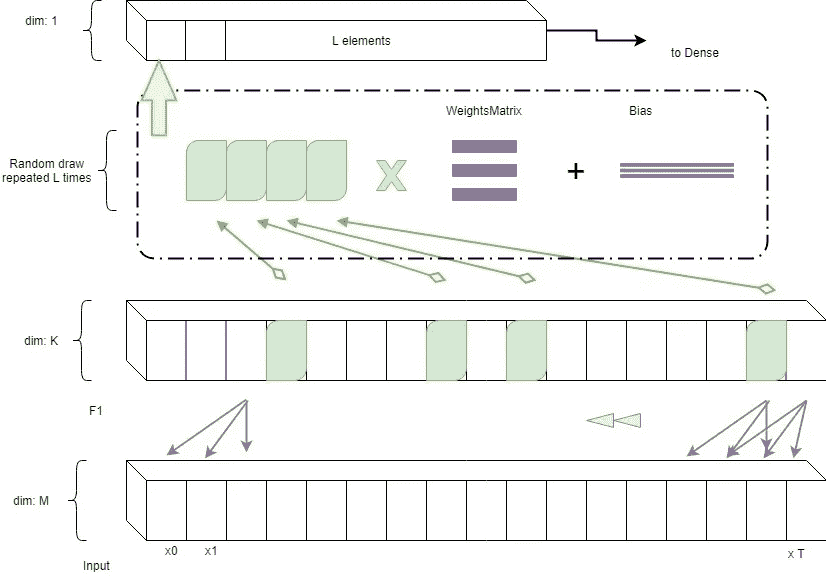
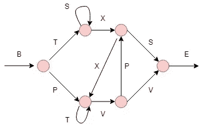
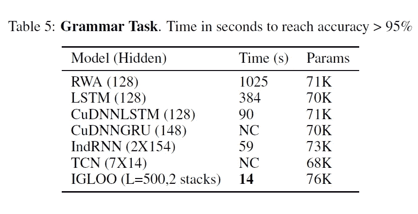

# IGLOO:一种不使用递归神经网络处理序列的不同范例

> 原文：<https://towardsdatascience.com/igloo-a-different-paradigm-for-processing-sequences-ec656da732cf?source=collection_archive---------9----------------------->

Photo by [Celso](https://unsplash.com/photos/4RZx2k4sDj8?utm_source=unsplash&utm_medium=referral&utm_content=creditCopyText) on [Unsplash](https://unsplash.com/search/photos/sequence?utm_source=unsplash&utm_medium=referral&utm_content=creditCopyText)

在 ReDNA labs，我们最近发表了一篇研究论文，虽然其中充满了技术细节、基准和实验，但我们希望对这种新的神经网络结构给出更直观的解释。[原文在此](https://arxiv.org/abs/1807.03402)。

在本文中，我们介绍了一种新的神经网络架构，它是**特别擅长处理长序列**，并且与主要教条相反，**没有利用任何形式的递归神经网络**。虽然这不是第一次对序列进行卷积处理，但我们的结构 **IGLOO** 利用了输入片段之间的一些特殊关系。这种新颖的方法在各种常见的基准测试中产生了良好的结果；值得注意的是，我们表明，在一些常见的任务上，它可以处理多达 25000 个时间步，而历史递归神经网络则难以处理超过 1000 个时间步。该方法可应用于各种研究领域，本文特别将其应用于医学数据和情感分析。

## 使用神经网络处理序列

直到最近，一旦在机器学习任务中有了顺序的概念，神经网络一直是首选结构。众所周知，鉴于递归神经网络(RNN)的递归性质，存在消失梯度的问题。历史上，长短期记忆(LSTM)和门控循环单位(GRU)细胞是最常用的 RNN 结构，但最近出现了新的改进细胞，如独立循环神经网络(IndRNN)、准循环神经网络(QRNN)、循环加权平均(RWA)和其他一些细胞。它们在速度和对历史单元的收敛方面有所改进。

所有这些单元的主要思想是数据被顺序处理。

除此之外，一种称为时间卷积网络(TCN)的新结构可用于分析顺序数据。TCN 使用 1D 卷积和扩张卷积来寻找序列的表示。(Bai 等人，2018) [3]的论文-用于序列建模的一般卷积和递归网络的经验评估，给出了更多细节。

自从最初尝试使用卷积来处理序列，就为新方法的出现开辟了道路。

## 爱斯基摩人圆顶小屋

Basic IGLOO cell

我们知道，应用于序列的 1D 卷积返回特征图，指示序列如何对各种过滤器作出反应。给定核大小 K*，K 个滤波器，并使用因果 1D 卷积(以便在时间 T，只有直到时间 T 的数据是可用的)，每个时间步长找到具有向量的表示。该向量中的每一项代表该时间步中每个过滤器的激活。完整特征图 F1 的大小为(T，K)。

然后，通常的卷积网络将另一个卷积应用于该初始卷积，并返回第二个更深(在某种意义上，它离输入更远)的特征图。该第二卷积可以被视为学习特征图的邻接片之间的关系。通常的 Convnets 继续以这种方式堆叠层。例如，时间卷积网络(TCN)结构使用扩展卷积来减少网络的总深度，同时旨在使较深层具有尽可能大的感受域，即，使较高层具有关于初始输入的尽可能全局的视野。由于更高层连接到所有的输入，然后由训练过程使信息向上流动。

冰屋结构的工作方式不同。在初始卷积之后，不是将第二卷积层应用于 F1，而是我们在第一轴上从可用的 T(p 的典型值为 4)中收集 p 个切片，然后我们将这些切片连接起来以获得大小为(p，K)的矩阵 H。这些 p 切片可以来自附近地区，也可以来自遥远的地区，因此汇集了来自特征地图不同部分的信息。因此，可以说冰屋在初始特征地图 F1 中利用了非本地关系。收集数量为 L 的这些大块以产生大小为(L，p，K)的矩阵。然后，该矩阵逐点乘以相同大小的可训练滤波器。看待这种操作的一种方式是，过滤器学习 F1 的非连续切片之间的关系。然后，我们将最后一个和倒数第二个轴上的逐点乘法产生的每个元素加在一起，以找到大小为 l 的向量 U。我们还将偏差添加到该输出。因此会有 L 偏差。应用诸如 ReLU 的非线性(该步骤不是必需的)。结果，我们获得了一个向量 U，它将代表序列，然后可以输入到一个密集层，用于分类或回归。总之，我们训练(L . k . p+1)个参数(不包括初始卷积 C1)。

一些评论:

U 的每个元素可以被视为特征图 F1 的 p 个不一定连续的随机选择的切片之间的关系的表示。这种关系的本质是由为该补丁训练的唯一过滤器给出的。

给定足够大的 L，U 具有完整的感受野，并且连接到输入向量的每个元素，因此它可以用作该序列的表示向量。这对于收敛不是绝对必要的，因为一些输入点可能对有效的表示没有贡献。CNN 架构并不总是具有这种特性。

传统的 CNN 依靠网络深度来汇集来自输入的遥远部分的信息，而 IGLOO 直接从输入的遥远部分采样补丁，因此它不需要深度。在某些情况下，一层就足够了。然而，由于 CNN 在每一层深度提供了不同的粒度级别，所以使用不同级别的补丁也是很有趣的，这是我们实现的。

虽然卷积网络都是以金字塔的方式利用本地信息，但 IGLOO 试图从整个输入空间收集信息。直观上，convnets 将连续的卷积层应用于输入序列或图像，并且每一层以不同的粒度水平表示信息，因为离输入数据越远的每一层具有越大的感受域。IGLOO 可以直接访问不同区域的输入数据，所以不需要完全依赖这种金字塔结构。本质上，它试图**利用输入空间**的不同部分之间的相似性来找到可用于回归或分类的表示。

## 思想实验

例如，让我们想象下面的思维实验。给定我们具有 100 个时间步长和 10 个特征的序列，即大小为(100，10)的矩阵。一些序列在前 50 个时间步长和后 50 个时间步长中包含大小为 10 的相同向量。其他一些序列没有任何重复的向量。该机器学习任务的目标是在大量的例子上进行训练(在训练集上),然后能够在给定测试集的情况下正确地识别那些具有重复元素的序列(类 1)和那些没有重复元素的序列(类 0)。如果随机选择，我们有 50%的几率是正确的。

RNN 将如何处理这项任务？RNN 有一个内部存储器，用于记录将误差降至最低所需的重要信息。因此，RNN 将一个接一个地处理序列中的每个元素，并跟踪是否存在重复。

冰屋将如何处理这项任务？想象在训练集中，对于第一个样本，在索引 1 和 51 处有相同的向量。然后，在收集随机补丁时，IGLOO 将处理向量(0，1，10，25)，(20，40，60，80)或(1，51，10，3)(它可以设置为处理 1000 个这样的补丁)。在后一种情况下，应用于该小块的可训练滤波器将通过输出一个大的正数而做出强烈的反应，因此网络将了解到如果在第 1 个索引处的向量和在第 51 个索引处的向量是相同的，那么为该序列找到的表示应该是第 1 类。然后在测试时，如果索引 1 和 51 处的向量相同，网络现在知道它应该被分类为类别 1。

虽然这项任务相当简单，但研究文档中介绍了一些稍微复杂一些的任务。

## 使用复制记忆任务延长记忆时间

这项任务最初是在(Hochreiter 和 J. Schmidhuber，1997 年)[1]中介绍的。我们给定一个大小为 T+20 的向量，其中前 10 个元素 G=[G0，G1，..，G9]是 1 到 8 之间的随机整数，接下来的 T-1 个元素是 0，接下来的元素是 9(作为标记)，接下来的 10 个元素又是 0。任务是生成一个序列，该序列除了最后 10 个项目之外在任何地方都是零，该序列应该能够再现 g。任务 A 可以被认为是一个分类问题，并且所使用的损失将是分类交叉熵(跨 8 个类别)。该模型将输出 8 个类别，这些类别将与实际类别进行比较。

实验表明，对于超过 1000 个时间步长，rnn 在这个任务上很难实现收敛，部分原因是梯度消失的问题。因为冰屋把一个序列看作一个整体，所以它没有同样的缺点。

*复制记忆——冰屋模型。达到精度> 0.99 秒的时间。*

t 大小(补丁数量)—时间—参数

T=100 (300) — 12s — 80K

T=1000 (500) — 21s — 145K

T=5000 (2500) — 52s — 370K

T=10000 (7000) — 61s — 1520K

T=20000 (10000) — 84s — 2180K

T=25000 (15000) — 325s — 3270K

对于超过 25000 个时间步的**序列，IGLOO 似乎可以实现收敛。文献中没有 RNN 能够做到这一点。**

虽然 NLP 任务通常使用少于 1000 步的序列，但在某些领域长序列是常见的。例如 EEG 数据和声波。这篇论文包括一个用脑电图数据做的实验。

## 更快地收敛语法任务

Grammar rules

紧随其后(Ostemeyer et al .，2017)[2]，我们使用这个任务来确保 IGLOO 可以高效地表示序列，而不仅仅是集合。为了成功完成这项任务，任何神经网络都需要能够提取序列元素出现顺序的信息。基于人工语法生成器，我们生成训练集，该训练集包括遵循所有预定义语法规则并且被分类为正确的序列，并且我们生成具有错误的序列，该错误应该被识别为无效。作为语法生成器的结果，诸如 BPVVE、BTSSSXSE 和 BPTVPXVVE 的序列将被分类为有效，而诸如 BTSXXSE、TXXTTVVE 和 BTSSSE 的序列将被分类为无效。

在这种情况下，序列只有 50 倍步长，有 7 个特征。实验记录了在使用不同模型的测试集上达到 95%的准确率需要多长时间。

Results on the Grammar task from the original paper

在这个实验中，IGLOO 似乎比测试的其他 RNN 细胞更快，尤其是比 CuDNNGRU 细胞更快，CuDNNGRU 细胞是普通 GRU 的优化版本

## 结论

我们引入了一种新型的神经网络，通过利用非局部相似性来处理序列。从基准测试来看，它在处理非常长的序列时似乎比普通的 RNNs 更好，同时也更快。

虽然基准可以很好地确保一个想法在原则上是有意义的，但在野外尝试冰屋将有助于了解它在某些情况下是否可以作为替代方案。

提供了该结构的 Keras/tensorflow 代码，所以这实际上是将 RNN 细胞换成冰屋细胞的问题，看看是否会发生奇迹。我们鼓励读者报告他们的发现。

此处提供了一个 Keras 实现

我们确实帮助公司将机器学习添加到他们的业务流程中，也许我们也可以帮助你。取得联系！【ai@rednalabs.com 号

**参考文献**

1-S. Hochreiter 和 J. Schmidhuber。长短期记忆。神经计算，9(8):1735–1780，1997。

2-J .奥斯特迈耶和 l .科威尔。基于递归加权平均的序列数据机器学习。arXiv:1703.01253v5，2018。

3-S .白、j .济科-科尔特尔和 v .科尔通。用于序列建模的一般卷积和递归网络的经验评估。在 arXiv:1803.01271v2，2018。

*原载于 2018 年 7 月 19 日*[*www.rednalabs.com*](http://www.rednalabs.com/2018/07/19/igloo-a-different-paradigm-for-processing-sequences/)*。*