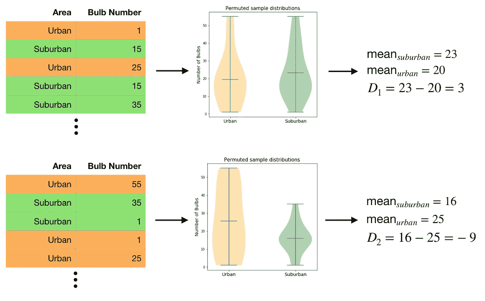

# 用排列测试阐明我们的灯泡数据

> 原文：<https://towardsdatascience.com/illuminating-our-light-bulb-data-with-the-permutation-test-e89dc50695e4?source=collection_archive---------18----------------------->

几乎每天我都会遇到一种新的“环境统计”(是的，现在有了一个新的名称)。卫生纸每天杀死 27000 棵树。三分之二的大堡礁正在消失。虽然我确信这些有趣的事实是相关的，但我经常发现它们不相关，不可思议，也不那么有趣。此外，随着我对统计的了解越来越多，我开始质疑这些数字背后隐藏的过程。所以我决定自己做一个关于伯克利学生和灯泡的环境统计。

Photo by [Luis Tosta](https://unsplash.com/@luis_tosta?utm_source=medium&utm_medium=referral) on [Unsplash](https://unsplash.com?utm_source=medium&utm_medium=referral)

这学期，我有机会在加州大学伯克利分校的能源和资源组领导一门课程的教学——ERG 98:为了更绿色的明天的可持续能源。在这个标题乐观的课堂上，我和我的同事伊丽莎白给 30 名学生讲授能源和环境的基础知识——从千瓦与千瓦时到气候变化的社会不公。然后，我们邀请来自可持续发展公司的演讲嘉宾，如特斯拉和 Volta Charging，以及学术界人士，如[可持续交通行为的研究人员。](https://medium.com/@johnleyden/can-mobile-apps-help-reduce-carbon-emissions-372f3f0a117c)

我们的一个固定的演讲嘉宾，克里斯托弗·琼斯，在加州大学伯克利分校运行凉爽气候网络。他创造了第一个**综合碳足迹计算器**，它询问用户的生活方式并输出他们估计的碳排放量。利用这些数据，Chris 绘制了美国各县的估计排放量。

Average Household Carbon Footprint — Eastern United States. Credit: CoolClimate Network

你看到了什么？

在看到这张图之前，我就在期待类似的图。随着我们接近更发达的地区，每户平均排放量通常会增加。但是一个奇怪的现象引起了我的注意——城市中心的那些绿色斑点。城市真的比周围的郊区更有效率吗？2010 年，Edward Glaeser 和 Matthew Kahn 在为*城市经济学杂志*撰写的题为 [*城市的绿色:二氧化碳排放和城市发展*](https://www.sciencedirect.com/science/article/pii/S0094119009001028#!) *的论文中讨论了这一趋势。* Glaeser 和 Kahn 观察了 48 个大都市的城市和郊区的交通、家庭取暖和电力使用的排放。在这项研究中，他们得出结论:

> “如果城市人口居住在更靠近城市中心的高密度地区，这些地区的冬天更温暖，夏天更凉爽，电力公司使用更少的煤来发电，那么家庭温室气体排放量就会更低。”

从本质上讲，人口密度的增加通常意味着碳强度的降低，尤其是在煤炭不太受欢迎的地区。

看到这种趋势，我决定以 ERG 98 的学生为对象进行自己的统计测试。不幸的是，个人的总排放量很难计算，所以用一个不完美的替代物来代替:灯泡数。下课时，我顺手在考勤表上加了两个额外的问题。以下是我问他们的问题:

1.  你会把你的家分为农村、郊区还是城市？
2.  你家大约有多少个灯泡？

这些是我收到的分发内容:

Histograms of survey answers for number of lightbulbs, split by area type

很明显，城市和郊区的灯泡数量有所不同，大约有 11 个灯泡！这可能支持这样的观点，即大都市地区的能源使用通常在城市中心较低。但是在我做太多宽泛的陈述之前，我必须认识到我的假设。这绝不是对大都市居民的随机抽样。此外，这种手段上的差异可能完全是随机发生的。

让我们把重点放在后一种说法上。如果我的特定城市学生*只是碰巧因为未知原因少了灯泡*怎么办？见鬼，我住在伯克利市，但是我的室友(也住在这个城市)比我多了 3 个灯泡！在比较两种分布时，应该有一种方法来解释这种随机变化。

一种越来越流行的比较两种分布的方法是**排列测试**。置换检验的前提是假设两组数字来自*相同的基础分布*(科学家称此为*零假设* ) *。*在这种假设下，我们通过改变“城市”和“郊区”标签来模拟新的学生调查。然后，经过多次模拟，我们可以确定我们观察的近似可能性——11 个灯泡的平均差异。

这个过程从随机地将标签“郊区”和“市区”重新分配给调查中给出的各种灯泡数量开始。我们有 13 名郊区学生和 14 名城市学生，所以我们打乱了数据表，将前 13 行分配给“郊区”，其余的分配给“城市”这给了我们两个新的分布来比较。

然后，我们计算两个随机生成的分布的平均值之间的新差异。称之为 D1。我们可以将 D1 解释为城市和郊区灯泡数量之间的一个可能差异，假设它们是从*相同的基础分布*中选择的。然后，我们重复这个过程很多次(我做了 10，000 次)，每次都得到一个新的“随机”差异。

Two instances of shuffling the labels and calculating a new difference in means.

现在，假设城市和郊区学生的答案来自相同的分布，我们通过 10，000 来近似所有可能的均值差异来观察 D1。

正如我们从这个直方图中看到的，最有可能的差异在-10 到 10 个灯泡之间。右侧中突出显示的空间表示大于或等于 11 个差异灯泡的区域。因此，我们可以将这个区域中的蓝条视为满足该差异的所有“随机”时间。这相当于整个分布的 3.48%——意味着至少 11 个灯泡的差异有 3.48%的可能性是由于随机性造成的。

因此，我们可以有 96%的把握说，由于某种潜在的原因，我的城市学生比我的郊区学生拥有的灯泡少。正如研究表明的那样，人口密度和每户能源使用量之间似乎存在某种联系。Glaeser 和 Kahn 认为公共交通的便利和房子的大小是可能的原因。显然，城市化进程的加快是气候变化之谜的一部分。

要了解更多关于排列测试的知识，我推荐阅读托马斯·斯莫尔的概念性文章[这里](https://thomasleeper.com/Rcourse/Tutorials/permutationtests.html)和[切斯特·伊茨](https://medium.com/u/7eabcdc676b?source=post_page-----e89dc50695e4--------------------------------)的编程文章[这里](https://medium.com/@chesterhz/a-quick-example-of-permutations-to-test-mean-difference-8b9202f44ffd)。你也可以在我的 github 上查看我的博客代码。

我希望你喜欢这个小小的社会和环境问题的统计之旅。如果您对此分析有任何问题或意见，请发表评论，我将确保做出回应。你也可以在[johnleyden.com](https://www.johnleyden.com/)找到我的联系方式。