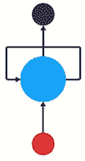
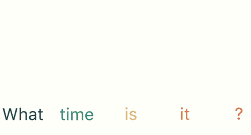
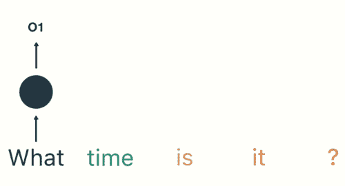
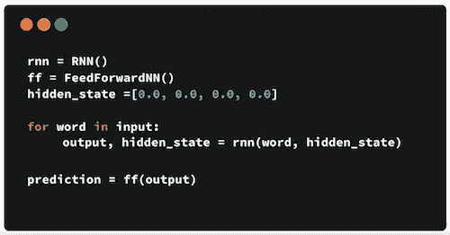
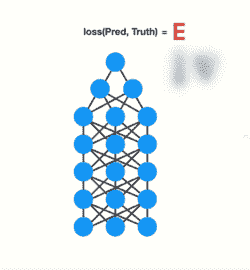

# 递归神经网络图解指南

> 原文：<https://towardsdatascience.com/illustrated-guide-to-recurrent-neural-networks-79e5eb8049c9?source=collection_archive---------0----------------------->

## 理解直觉

嗨，欢迎来到循环神经网络图解指南。我是迈克尔，也被称为学习矢量。我是人工智能语音助手领域的机器学习工程师。如果你刚刚开始学习 ML，并且想获得递归神经网络背后的一些直觉，这篇文章是为你准备的。

如果你愿意，你也可以观看这篇文章的视频版本。

如果你想进入机器学习，递归神经网络是一种强大的技术，理解这一点很重要。如果你使用智能手机或经常上网，奇怪的是你已经使用了利用 RNN 的应用程序。递归神经网络用于语音识别、语言翻译、股票预测；它甚至被用于图像识别来描述图片中的内容。

所以我知道有很多关于循环神经网络的指南，但我想分享一些插图和解释，关于我是如何理解它的。我将避免所有的数学，而是专注于 RNNs 背后的直觉。在这篇文章结束时，你应该对 RNN 有了很好的理解，并希望有一个灯泡的时刻。

# **序列数据**

好的，RNN 的神经网络擅长对序列数据建模。为了理解这意味着什么，让我们做一个思维实验。假设你拍了一张球随时间运动的静态快照。

假设你想预测球的运动方向。那么，只有你在屏幕上看到的信息，你会怎么做呢？好吧，你可以猜一猜，但是你能想到的任何答案都是，一个随机的猜测。如果不知道球去了哪里，你就没有足够的数据来预测它要去哪里。

如果你连续记录球的位置的许多快照，你将有足够的信息来做出更好的预测。

所以这是一个序列，一个事物跟随另一个事物的特殊顺序。有了这些信息，你现在可以看到球正在向右移动。

序列数据有多种形式。音频是一个自然的序列。你可以把一个音频声谱图分割成块，然后输入 RNN 的大脑。

Audio spectrogram chopped into chunks

文本是序列的另一种形式。您可以将文本分成一系列字符或一系列单词。

# **顺序记忆**

好的，RNN 擅长处理序列数据进行预测。但是怎么做呢？？

他们通过一个我称之为顺序记忆的概念做到了这一点。为了更好地理解顺序记忆的含义…

我想邀请你说出你脑中的字母表。

那很简单，对吧。如果你被教导这个特定的顺序，它应该很快就会出现在你面前。

现在试着倒着说字母表。

我打赌这要困难得多。除非你以前练习过这个特定的顺序，否则你可能会有一段艰难的时间。

这里有一个有趣的，从字母 f 开始。

起初，你会纠结于前几个字母，但当你的大脑掌握了这个模式后，剩下的就会自然而然了。

所以这很难做到是有逻辑原因的。你按顺序学习字母表。顺序记忆是一种让你的大脑更容易识别顺序模式的机制。

# **递归神经网络**

好的，RNN 有顺序记忆的抽象概念，但是 RNN 是怎么复制这个概念的呢？让我们来看看传统的神经网络，也称为前馈神经网络。它有输入层、隐藏层和输出层。

Feed Forward Neural Network

我们如何让一个前馈神经网络能够利用以前的信息来影响以后的信息？如果我们在神经网络中添加一个可以向前传递先验信息的回路会怎么样？

Recurrent Neural Network

这就是递归神经网络的本质。RNN 有一个循环机制，充当高速公路，允许信息从一个步骤流向下一个步骤。

Passing Hidden State to next time step

这个信息是隐藏状态，它是先前输入的表示。让我们通过一个 RNN 用例来更好地理解它是如何工作的。

假设我们想要建立一个聊天机器人。它们现在很受欢迎。假设聊天机器人可以从用户输入的文本中对意图进行分类。

Classifying intents from users inputs

来解决这个问题。首先，我们将使用 RNN 对文本序列进行编码。然后，我们将把 RNN 的输出输入一个前馈神经网络，这个网络将对意图进行分类。

好的，那么一个用户输入… ***现在是几点？*** 。首先，我们把句子分解成单个的单词。RNN 的作品是按顺序排列的，所以我们一次输入一个单词。

Breaking up a sentence into word sequences

第一步是将“什么”输入 RNN。RNN 对“什么”进行编码并产生输出。

对于下一步，我们输入单词“时间”和上一步的隐藏状态。RNN 现在有了关于“什么”和“时间”的信息

我们重复这个过程，直到最后一步。你可以看到，在最后一步，RNN 已经对前面步骤中所有单词的信息进行了编码。

因为最终输出是从序列的其余部分创建的，所以我们应该能够获得最终输出，并将其传递给前馈层以对意图进行分类。

对于那些喜欢看代码的人来说，这里有一些 python 展示了控制流。

Pseudo code for RNN control flow

首先，初始化网络层和初始隐藏状态。隐藏状态的形状和维度将取决于你的递归神经网络的形状和维度。然后循环输入，将单词和隐藏状态传递给 RNN。RNN 返回输出和修改后的隐藏状态。你继续循环，直到你没有词了。最后，将输出传递给前馈层，它会返回一个预测。就是这样！递归神经网络正向传递的控制流是 for 循环。

# **消失渐变**

你可能已经注意到隐藏状态中奇怪的颜色分布。这说明了 RNN 所谓的短期记忆的问题。

Final hidden state of the RNN

短期记忆是由臭名昭著的消失梯度问题引起的，这在其他神经网络架构中也很普遍。随着 RNN 处理更多的步骤，它很难保留以前步骤的信息。如你所见，来自单词“什么”和“时间”的信息在最后的时间步几乎不存在。短期记忆和消失梯度是由于反向传播的性质；一种用于训练和优化神经网络的算法。为了理解这是为什么，让我们看看反向传播对深度前馈神经网络的影响。

训练神经网络有三个主要步骤。首先，它向前传递并进行预测。其次，它使用损失函数将预测与地面实况进行比较。损失函数输出一个误差值，该误差值是对网络性能有多差的估计。最后，它使用该误差值进行反向传播，计算网络中每个节点的梯度。

梯度是用于调整网络内部权重的值，允许网络学习。梯度越大，调整越大，反之亦然。这就是问题所在。当进行反向传播时，一个层中的每个节点计算它的梯度相对于它之前的层中的梯度的效果。因此，如果对之前图层的调整很小，那么对当前图层的调整会更小。

这导致梯度向下反向传播时呈指数级收缩。早期的层无法进行任何学习，因为内部权重由于极小的梯度而几乎没有被调整。这就是消失梯度问题。

Gradients shrink as it back-propagates down

让我们看看这是如何应用于递归神经网络的。您可以将递归神经网络中的每个时间步视为一层。为了训练一个递归神经网络，可以使用一种称为时间反向传播的反向传播应用程序。随着梯度值在每个时间步长中传播，梯度值将按指数规律收缩。

Gradients shrink as it back-propagates through time

再次，梯度用于调整神经网络的权重，从而允许它学习。小梯度意味着小调整。这导致早期层不学习。

由于渐变消失，RNN 不会学习跨时间步长的长程相关性。这意味着当试图预测用户的意图时，有可能不考虑单词“什么”和“时间”。然后，网络必须用“是吗？”做出最好的猜测。这相当模糊，即使对人类来说也很困难。所以不能学习更早的时间步骤会导致网络有短期记忆。

# **LSTM 和 GRU 的**

好了，RNN 氏症患者患有短期记忆障碍，我们该如何克服呢？为了减轻短期记忆，创建了两个专门的递归神经网络。一种叫做长短期记忆，简称 LSTM 氏症。另一种是门控循环单元或 GRU 氏症。LSTM 和 GRU 的功能本质上和 RNN 的一样，但是他们能够使用被称为“门”的机制来学习长期的依赖性这些门是不同的张量运算，可以学习向隐藏状态添加或删除什么信息。因为这种能力，短期记忆对他们来说不是问题。如果你想了解更多关于 LSTM 和 GRU 的情况，你可以看看我关于他们的帖子。

 [## LSTM 和 GRU 的图解指南:一步一步的解释

### 嗨，欢迎来到 LSTM 和 GRU 的图解指南。我是迈克尔，我是人工智能领域的机器学习工程师…

towardsdatascience.com](/illustrated-guide-to-lstms-and-gru-s-a-step-by-step-explanation-44e9eb85bf21) 

# 那还不算太糟

综上所述，RNN 氏综合症对于处理序列数据进行预测是很好的，但是会受到短期记忆的影响。香草 RNN 氏症的短期记忆问题并不意味着完全跳过它们，使用更进化的版本，如 LSTM 或 GRU 氏症。RNN 的优势在于训练速度更快，使用的计算资源更少。这是因为需要计算的张量运算较少。当你期望对具有长期相关性的较长序列建模时，你应该使用 LSTM 或 GRU 的方法。

如果你有兴趣深入了解，这里有一些解释 RNN 氏症及其变体的链接。

 [## 任何人都可以学习用 Python 编写 LSTM-RNN 代码(第 1 部分:RNN)——我是特拉斯克

### 机器学习技术博客。

iamtrask.github.io](https://iamtrask.github.io/2015/11/15/anyone-can-code-lstm/)  [## 了解 LSTM 网络——colah 的博客

### 这些循环使得循环神经网络看起来有点神秘。然而，如果你想得更多一点，事实证明…

colah.github.io](https://colah.github.io/posts/2015-08-Understanding-LSTMs/) 

我写这篇文章很开心，所以请在评论中告诉我这是否有帮助，或者你想在下一篇文章中看到什么。感谢阅读！

查看[michaelphi.com](https://www.michaelphi.com/)了解更多类似的内容。

✍🏽想要更多内容？在 https://www.michaelphi.com 查看我的博客

📺喜欢看基于项目的视频？看看我的 [**Youtube**](https://www.youtube.com/channel/UCYpBgT4riB-VpsBBBQkblqQ?view_as=subscriber) ！

🥇注册我的 [**电子邮件简讯**](http://eepurl.com/gwy3hj) **，了解最新文章和视频！**