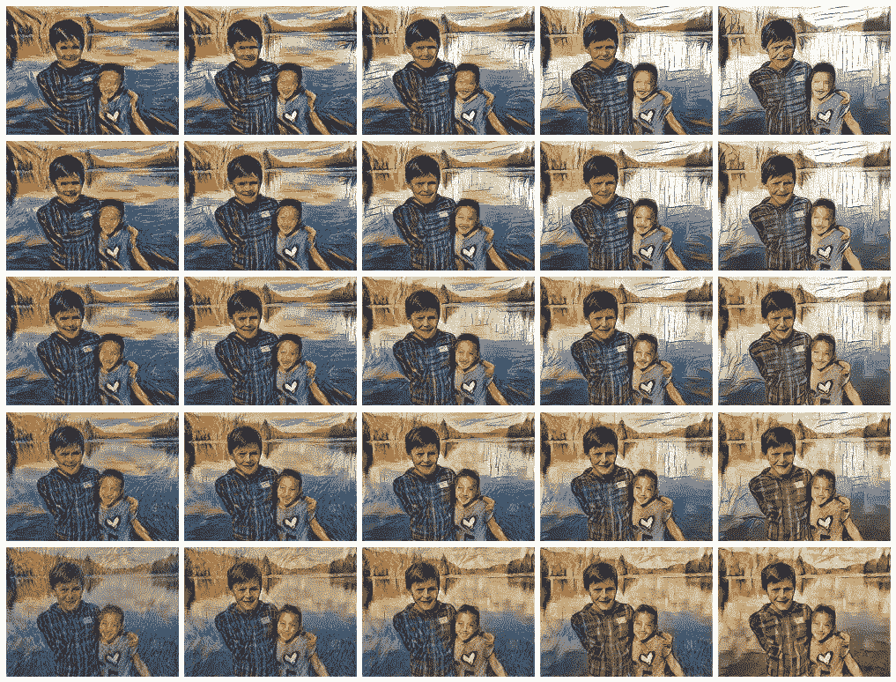

# IMA 杂志时代

> 原文：<https://towardsdatascience.com/ima-mag-age-7bc81399b0a6?source=collection_archive---------6----------------------->

## 吴恩达卷积神经网络课程回顾

通过这篇文章，我将尝试诚实地回顾我在 Coursera 上学习的最新课程:吴恩达的“卷积神经网络”。

我第一次跟随来自吴恩达的“[机器学习](https://www.coursera.org/learn/machine-learning)课程是在 2014 年。我真的很喜欢他的授课速度，以及他积累知识让你跟上进度的方式。因此，当他关于深度学习的新纳米学位在今年 8 月发布时，我是第一批加入的人之一，我很快完成了三门课程。几周前，五门课程中的第四门课程发布了。我立即上了“卷积神经网络”课程，继续我的旅程。

正如预期的那样，该课程结构合理，进度恰当。内容分为四周。第一周建立卷积神经网络(CNN)的基础，并解释这些卷积是如何计算的，机制。它解释了它在计算机视觉中的基础，然后将详细说明与填充、步幅和池层(最大池、平均池)的卷积。

第二周着眼于几个“经典”的 CNN，并解释如何通过在已有概念的基础上添加新的概念来构建架构。然后，它继续解释 ResNets(这个概念可以应用于其他网络，而不仅仅是 CNN)，然后建立盗梦空间网络(是的，[盗梦空间](https://www.youtube.com/watch?v=66TuSJo4dZM)就像电影中一样)

第三周介绍了两个新的实用概念，目标定位和目标检测。计算出一个物体在照片中的位置，其次，我们可以在照片中检测到多少个物体，以及它们各自的位置。它很好地展示了如何使用锚定框来预测和评估边界框。

最后，在第四周你会学到一些关于 CNN 最酷最有趣的事情:人脸识别和神经类型转移。这里介绍了一些重要的概念，如一次性学习(这也适用于 CNN 以外的其他网络)和连体网络。

总而言之，这是一门很好的课程。一路上有些小故障。一些视频没有尽可能地完美，即一些“漏洞”需要删除，幻灯片上有一些错误需要纠正，但非常轻微。我最大的不满是关于编程作业。首先，它们不是独立的。他们从一开始就提到了在纳米学位第二个课程的第三周对 Tensorflow 的介绍:“改进深度神经网络”。当你每天不使用 Tensorflow(通常我对 Keras 没问题)并且课程之间有 2-3 个月的间隔时，这就有点尴尬了…

第二，与纳米学位的其他课程相比，作业的指导性稍差，也就是说，你将需要花更多的时间来解决编程中的小问题，而这些问题不像以前的课程那样需要大量的手工处理。这与其说是一个问题，不如说是一个声明，然而，当它与有问题的 Coursera 作业提交引擎结合起来时，就成了一个问题(嗯，老实说，我不知道这是 Coursera 的错还是课程的错，但结果是一样的)。有时，它会拒绝正确地给你的作业评分，甚至不会给你错误的东西评分，或者会引入人为的界限，而不告诉你这些界限已经存在……我希望这些问题能尽快得到解决，因为它不会阻止像我这样的早期采用者，但很可能会阻止未来出现更多的人。

最后，网站上使用的 jupyter 内核很麻烦。服务器可用性有时似乎很粗略。即使保存了您的工作，也经常会丢失(您应该定期保存/导出到您的本地机器以缓解这些问题)。简而言之，距离 Kaggle 内核的处理还有很长的路要走。我的一个同事在参加另一个 Coursera 课程后也报告了同样的问题，所以这不是 CNN 课程独有的。此外，由于 Coursera 的访问现在是基于订阅的，如果您在课程结束后不续订，您将无法访问您的内核。因此，如果你不想丢失你的作品(因为它和课程视频一样具有参考价值)，你必须将它们存储在你的本地机器或首选云存储中。

尽管如此，这是一门很好的课程，教会了我很多我以前不知道的东西，所以总共 4/5！但是要做好准备，尤其是在编程作业中。我特别喜欢一次性学习，我打算将它应用于我工作中的一个深层神经网络问题(与 CNN 无关)和神经类型转移。在最后一个编程练习中，您完成了一个神经类型转换算法代码。在我的好朋友 Marc-Olivier 的推动下，我更进一步，实现了一个多风格的传输算法。这些是我最小的孩子，他们从[爱德华·蒙克](https://en.wikipedia.org/wiki/Edvard_Munch)、[巴勃罗·毕加索](https://en.wikipedia.org/wiki/Pablo_Picasso)、[文森特·梵高](https://en.wikipedia.org/wiki/Vincent_van_Gogh)和[乔治·布拉克](https://en.wikipedia.org/wiki/Georges_Braque)都有不同程度的风格转变。

My youngest kids with style transferred left to right, top to bottom: Edvard Munch, Pablo Picasso, Vincent Van Gogh and Georges Braques.

*本网站上的帖子是我个人的，不一定代表爱立信的立场、策略或观点。*