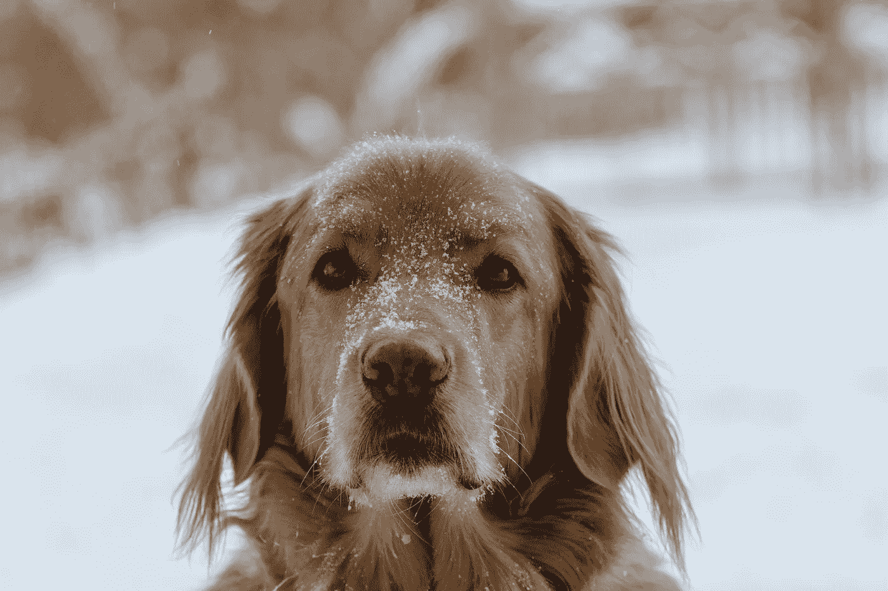

# 图片分类 Keras 教程:Kaggle 犬种挑战赛

> 原文：<https://towardsdatascience.com/image-classification-python-keras-tutorial-kaggle-challenge-45a6332a58b8?source=collection_archive---------1----------------------->



Golden Retriever image taken from unsplash.com

识别狗的品种是一个有趣的计算机视觉问题，因为细微的差异在视觉上将狗的品种彼此分开。本文旨在为那些刚刚开始使用卷积神经网络进行图像分类并希望了解如何试验网络架构、超参数、数据扩充以及如何处理加载自定义数据以进行测试和训练的人提供一个教程。

所有代码都用 Python 和 Keras 编写，托管在 Github 上:[https://Github . com/CShorten/KaggleDogBreedChallenge/blob/master/dog breed _ binary classification . ipynb](https://github.com/CShorten/KaggleDogBreedChallenge/blob/master/DogBreed_BinaryClassification.ipynb)

我们使用的数据集来自 Kaggle.com 的狗品种鉴定挑战赛。Kaggle 竞赛是提升你的机器学习技能的一个很好的方式，本教程将帮助你熟悉网站上图像数据的格式。

Kaggle 上列出的这项挑战有 1286 个不同的团队参加。最大的挑战是在 120 个不同的种类中识别狗的品种。

120 个类是一个非常大的多输出分类问题，伴随着各种各样的挑战，例如如何对类标签进行编码。例如，对标签进行一次热编码将需要每个类别非常稀疏的向量，例如:[0，0，…，0，1，0，0，…，0]。

本教程随机选择了两个类，金毛寻回犬和设得兰牧羊犬，并侧重于二元分类的任务。

编程和数据科学新手可能会遇到的另一个挑战是 Kaggle 的数据格式。Kaggle 提供了一个由“id”而不是“Golden-Retriever-1”标记的图像的训练目录，以及一个带有 id →狗品种映射的 CSV 文件。我发现了 python 字符串函数。split('delimiter ')是我解析这些 CSV 文件的最好朋友，我将在教程中向您展示这是如何工作的。

本教程的第一部分将向您展示如何解析这些数据并将其格式化以输入到 Keras 模型中。然后我们将关注问题的一个部分，金毛寻回犬与设得兰牧羊犬，(任意选择)。

本教程的第二部分将向您展示如何将自定义数据加载到 Keras 中，并构建一个卷积神经网络来对它们进行分类。

本教程的第三部分将讨论偏差-方差权衡，并研究不同的架构、漏失层和数据扩充，以在测试集上获得更好的分数。

# 第 1 部分:格式化定制图像数据以输入到 Keras 模型

```
from PIL import Image # used for loading images
import numpy as np
import os # used for navigating to image path
import imageio # used for writing imagesnaimg_dict = {} # id: breed
f = open("labels.csv", "r")
fileContents = f.read()
fileContents = fileContents.split('\n')
for i in range(len(fileContents)-1):
  fileContents[i] = fileContents[i].split(',')
  naming_dict[fileContents[i][0]] = fileContents[i][1]
```

现在我们有了一个 python 字典 naming_dict，它包含了从 id 到 breed 的映射。现在，我们需要为每个品种建立一个计数字典，以便为图像分配标签，如“Golden_Retriever-1”、“Golden_Retriever-2”、“Golden_Retriever-67”。

```
breeds = naming_dict.values()
breed_set = set(breeds)
counting_dict = {}
for i in breed_set:
  counting_dict[i] = 0
```

I .我们循环浏览当前命名为“id.jpg”的图像

二。剥去。来自他们的 jpg

三。将它们与命名词典中的品种相匹配。

四。然后我们会根据我们已经统计的数量给它们命名

动词 （verb 的缩写）最后，用这个新实例增加计数。

```
for img in os.listdir('./raw_data'):
  imgName = img.split('.')[0] # converts '0913209.jpg' --> '0913209'
  label = naming_dict[str(imgName)]
  counting_dict[label] += 1
  path = os.path.join('./raw_data', img)
  saveName = './labeled_train/' + label + '-' + str(counting_dict[label]) + '.jpg'
  image_data = np.array(Image.open(path))
  imageio.imwrite(saveName, image_data)
```

现在，训练目录中的所有图像都被格式化为‘Breed-#’。jpg。非常有用的加载到 CNN 和分配一个热点矢量类标签使用图像命名。

# 将数据加载到 Keras 模型

关于训练-测试分割的说明:在本教程中，我决定使用训练集和测试集来代替交叉验证。这是因为我在我的 CPU 上运行这些 CNN，因此它们需要大约 10-15 分钟来训练，因此 5 重交叉验证将需要大约一个小时。我希望这项研究的重点是如何用不同的方法来改变你的模型结构，以达到更好的结果，因此快速迭代是很重要的。此外，我进行了大约 2/3–1/3 的训练/测试分割，这比通常的测试实例多一点，但是，这不是一个非常大的数据集。

```
def label_img(name):
  word_label = name.split('-')[0]
  if word_label == 'golden_retriever' : return np.array([1, 0])
  elif word_label == 'shetland_sheepdog' : return np.array([0, 1])
```

这被称为一键矢量编码，它比用“0”或“1”编码每个标签产生更好的结果。就神经网络结构而言，这意味着输出层中有 2 个神经元，而不是 1 个，您将在下面 CNN 代码的最后一行中看到这一点:

**更新(4/22/19):** 这仅在多标签分类的情况下成立，而不是二进制分类。在二进制分类中，输出被视为 0 或 1，并且只有一个输出神经元，keras 将在编译期间纠正这一错误。

```
model.add(Dense(2, activation = 'softmax'))
```

# 调整图像大小

当我们格式化要输入到 Keras 模型的图像时，我们必须指定输入尺寸。许多学术数据集，如 CIFAR-10 或 MNIST，都有相同的大小(分别为 32x32x3 和 28x28x1)。然而，在 ImageNet 数据集和这个狗品种挑战数据集中，我们有许多不同大小的图像。首先，我们将编写一些代码来循环遍历这些图像，并收集一些关于狗图像的最大、平均和最小高度和宽度的描述性统计数据。

```
def get_size_statistics(DIR):
  heights = []
  widths = []
  for img in os.listdir(DIR): 
    path = os.path.join(DIR, img)
    data = np.array(Image.open(path)) #PIL Image library
    heights.append(data.shape[0])
    widths.append(data.shape[1])
  avg_height = sum(heights) / len(heights)
  avg_width = sum(widths) / len(widths) print("Average Height: " + str(avg_height))
  print("Max Height: " + str(max(heights)))
  print("Min Height: " + str(min(heights)))
  print('\n')
  print("Average Width: " + str(avg_width))
  print("Max Width: " + str(max(widths)))
  print("Min Width: " + str(min(widths)))
```

结果:平均身高= 388.34，最大身高=914，最小身高= 150

平均宽度= 459.12，最大宽度= 800，最小宽度= 200

# 加载图像

```
IMG_SIZE = 300def load_training_data():
  train_data = []
  for img in os.listdir(DIR)
    label = label_img(img)
    path = os.path.join(DIR, img)
    img = Image.open(path)
    img = img.convert('L')
    img = img.resize((IMG_SIZE, IMG_SIZE), Image.ANTIALIAS)
    train_data.append([np.array(img), label]) # Basic Data Augmentation - Horizontal Flipping
    flip_img = Image.open(path)
    flip_img = flip_img.convert('L')
    flip_img = flip_img.resize((IMG_SIZE, IMG_SIZE), Image.ANTIALIAS)
    flip_img = np.array(flip_img)
    flip_img = np.fliplr(flip_img)
    train_data.append([flip_img, label]) shuffle(train_data)
  return train_data
```

测试图像加载以确保其正常工作

```
train_data = load_training_data()
plt.imshow(train_data[43][0], cmap = 'gist_gray')
```


# 第 2 部分:简单的 CNN

```
model = Sequential()
model.add(Conv2D(32, kernel_size = (3, 3), activation='relu', input_shape=(IMG_SIZE, IMG_SIZE, 1)))
model.add(MaxPooling2D(pool_size=(2,2)))
model.add(BatchNormalization())model.add(Conv2D(64, kernel_size=(3,3), activation='relu'))
model.add(MaxPooling2D(pool_size=(2,2)))
model.add(BatchNormalization())model.add(Conv2D(64, kernel_size=(3,3), activation='relu'))
model.add(MaxPooling2D(pool_size=(2,2)))
model.add(BatchNormalization())model.add(Conv2D(96, kernel_size=(3,3), activation='relu'))
model.add(MaxPooling2D(pool_size=(2,2)))
model.add(BatchNormalization())model.add(Conv2D(32, kernel_size=(3,3), activation='relu'))
model.add(MaxPooling2D(pool_size=(2,2)))
model.add(BatchNormalization())
model.add(Dropout(0.2))model.add(Flatten())
model.add(Dense(128, activation='relu'))
#model.add(Dropout(0.3))
model.add(Dense(2, activation = 'softmax'))
```

此模型的培训日志:


评估模型时使用:

```
loss, acc = model.evaluate(testImages, testLabels, verbose = 0)
print(acc * 100)
```

初始模型= 72.09%的准确度

# 第 3 部分:改进模型

我认为有 5 种策略可以最有效地提高测试准确度:

# I .增加更多辍学层

正如我们从训练报告中看到的，该模型在训练集上达到了 100%的准确率。从训练中的 100%到测试中的 72%表明了过度拟合的明显问题。过拟合可以通过增加漏失层或简化网络架构来解决(la 偏差-方差权衡)。然而，这与其说是一门科学，不如说是一门艺术，如果没有反复试验，很难准确计算出如何减少过拟合。

# 二。卷积网络参数

我们可以尝试删除或添加卷积层，改变滤波器大小，甚至改变激活函数。

# 三。改变网络末端的多层前馈神经网络

卷积网络的工作原理是对图像进行卷积，创建一个新的表示，然后将该表示压缩成一个向量，该向量被输入到一个经典的多层前馈神经网络中。我们可以尝试添加更多的隐藏层，或者改变每个隐藏层中神经元的数量。

# 四。数据扩充

在本教程中，我们只是用水平翻转来增强图像。但是您可以尝试其他方法，如随机裁剪、翻译、色阶转换等等。如果你雄心勃勃，你也可以尝试神经类型转移或生成对抗网络来增强数据。

# 动词 （verb 的缩写）狗对象检测裁剪

当我浏览这个数据集时，很明显，这些图像中有许多噪声，可能会混淆卷积神经网络。因此，改善这个网络的一个很好的策略是训练一个对象识别模型来检测狗的图片，并裁剪掉图像的其余部分，这样你就只对狗本身进行分类，而不是对狗和背景中的其他一切进行分类。

如果您对改进图像识别模型的更多细节感兴趣，请查看这篇文章:

[](/hacking-your-image-recognition-model-909ad4176247) [## 入侵你的图像识别模型

### 建立模型后提高图像识别准确性的后续步骤。

towardsdatascience.com](/hacking-your-image-recognition-model-909ad4176247) 

# 结论

希望本文能帮助您加载数据，熟悉 Kaggle 图像数据的格式，并了解更多关于图像分类和卷积神经网络的知识。这是我第一次尝试做一个完整的编程教程，请在评论中留下你的任何建议或问题。另外，如果这篇文章对你有帮助，请留下你的掌声，谢谢你的阅读！

# [CShorten](https://medium.com/@connorshorten300)

Connor Shorten 是佛罗里达大西洋大学计算机科学专业的学生。对深度学习和软件工程感兴趣。