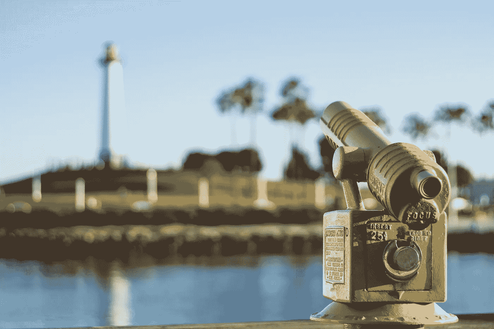

# 使用自动编码器的图像相似性

> 原文：<https://towardsdatascience.com/image-similarity-with-auto-encoders-937f6f3feaba?source=collection_archive---------16----------------------->

计算机视觉项目中一个非常具有挑战性的任务是确定图像之间的相似性。像每个像素的平均差异这样的东西实际上只是测量图像之间颜色使用的差异，而不是图像的任何真正的语义特征。

自动编码器通过编码器和解码器网络工作。编码器获取输入图像，并通过一个或多个隐藏层对其进行映射，直到最终达到具有比原始图像低得多的维度的隐藏层表示，例如 2 或 5 个神经元。然后，解码器将低维层中神经元的输出映射回原始图像。原始图像和从编码器→解码器重建的图像之间的差异被称为重建损失，并用于训练网络。

# 这如何用于图像相似性？

我们可以获取两幅图像，将它们通过自动编码器，并检查低维表示中的激活，以确定图像之间的相似性。

当表现为 2 或 3 维时，可视化这些激活很容易完成，但是对于更高维，我们需要使用聚类技术进行可视化，例如 t-SNE。T-SNE 聚类创建一个较低维度的映射，然后在较高维度中保持空间距离。我们可以利用这一点得出自动编码特征空间的可视化，从而得出图像之间的视觉差异。

我们可以通过在编码器中添加卷积层和在解码器中添加去卷积层来增强图像自动编码器的功能。解卷积层可以被认为类似于 [DCGAN](/dcgans-deep-convolutional-generative-adversarial-networks-c7f392c2c8f8?source=user_profile---------6------------------) (深度卷积生成对抗网络)中的生成器网络。

# 视觉相似性的应用

视觉相似性度量有许多有趣的应用，例如图像推荐和搜索。然而，一个非常有趣的应用是数据聚类和标记未标记数据。许多深度学习项目有大量未标记的数据，很难找出如何标记这些数据。基于自动编码器的聚类是解决这个问题的好方法。感谢阅读！

# [CShorten](https://medium.com/@connorshorten300)

Connor Shorten 是佛罗里达大西洋大学计算机科学专业的学生。对深度学习和软件工程感兴趣。

