# 社交媒体对票房的影响:最佳影片提名的 twitter 活动分析| 2018 年奥斯卡与 Python

> 原文：<https://towardsdatascience.com/impact-of-social-media-on-box-office-analysis-of-twitter-activities-on-best-picture-nominees-7961c5c8ba40?source=collection_archive---------12----------------------->

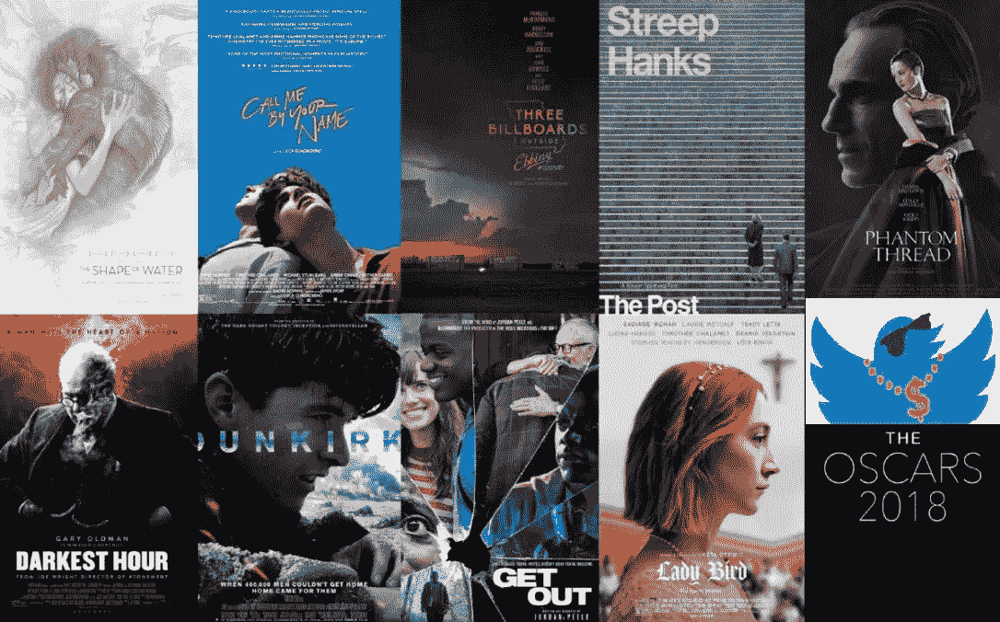

photo credit: 889noticias.mx

## 你认为观众在 twitter 等社交媒体渠道上的帖子和评论能左右公众舆论，增加或减少电影的票房吗？

这是我们要做的，为我们的问题找到可能的答案:我们将收集关于 2018 年奥斯卡最佳影片提名的推文；我们在每部电影上映前 4 周开始收集推文，在电影结束后 1 周停止收集。 ***接下来我们分析推特活动(主角演员推特账号、推文数量、推文情绪、电影评分和评论)并探索推特活动和票房销售之间可能的关系。***

从技术角度来看，我们将使用数据科学和数据可视化技术和工具来解决这个问题。我们广泛使用 python 来实现这个项目。为了收集推文，我们有两个选择:1-使用 twitter API(像 [tweepy](https://tweepy.readthedocs.io/en/v3.5.0/) )。2-使用 web 抓取技术来手动解析推文。在这种情况下，我决定使用网络抓取来收集推文，因为 tweepy API 非常慢，而且有一些限制。对于抓取任务，我决定使用 python 中的 [beautiful Soup](https://pypi.org/project/beautifulsoup4/) 编写一个 web scraper，但随后我做了一个随机搜索，以检查是否有人已经这样做了。[我发现了 Twitter 搜索的一个很好的 python 实现，它让我的生活变得更加轻松。然后我修改了它的代码，这样推文就可以保存到 sql 数据库中。](https://github.com/tomkdickinson/Twitter-Search-API-Python)

下一步是评估推文的情绪。简单解释一下，谷歌对情感分析的定义是:“通过计算识别和分类一段文本中表达的观点的过程，特别是为了确定作者对特定主题、产品等的态度。，是积极的，消极的，还是中性的。”对于这个任务，我们将使用 python 中的[Vader perspection](https://github.com/cjhutto/vaderSentiment)包。Vader perspective 是一个专门针对社交媒体上表达的情绪的工具。对于每条推文，该工具将给出一个介于[-1，+1]之间的数值分数。完全负面情绪为-1，完全正面情绪为+1，0 代表中性情绪。

在收集推文并计算情绪后，我们使用 python 中的 pandas 和 matplotlib 来可视化每周情绪变化和推文数量与票房之间的关系。以下是工作流程的整体架构:

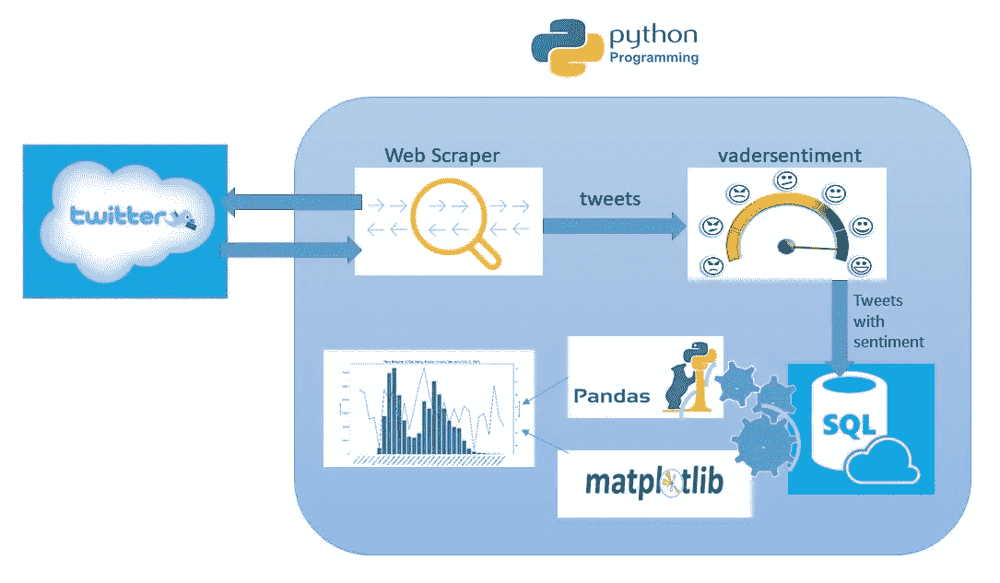

Overall Workflow

值得一提的是，门票销售数据是从 [boxofficemojo](https://www.boxofficemojo.com/) 收集的。评分是从 metacritic.com 的[挑选出来的。现在我们来看看每部电影的总销量和推文总数:](https://www.metacritic.com/)

```
%matplotlib inline
import pandas as pd
import matplotlib.pyplot as plt# this csv contains the records for total sales and total tweets
total_sales = pd.read_csv('totally.csv')fig, ax1 = plt.subplots()#plotting the bar plot to show the distribution of sales
ax1.bar(total_sales.index, total_sales['total_sales'], width = 0.6)
ax1.set_title('Total Sales', fontsize = 14)
ax1.tick_params('y', colors='b')
ax1.set_xticks(ticks=total_sales.index-0.8)
ax1.set_xticklabels((total_sales['movie']), rotation = 45)
plt.show()
```

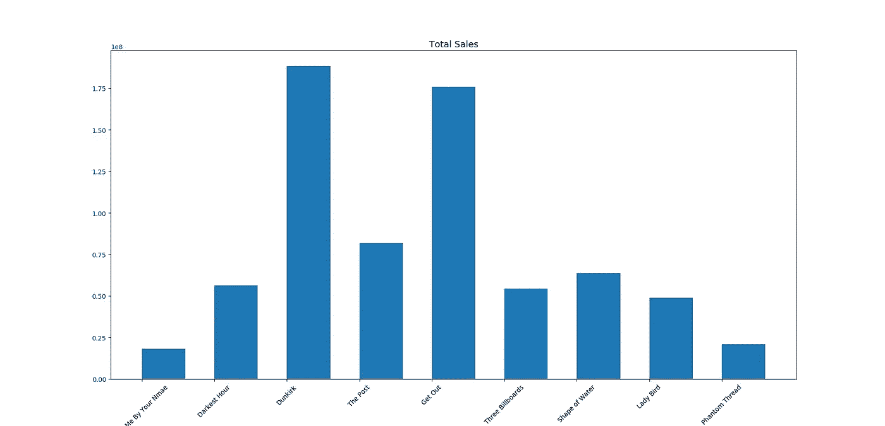

total sales


total number of tweets for each movie

我们可以立即看到两部电影在总销售图中脱颖而出(《敦刻尔克》和《滚出去》)。这是该类别中唯一票房超过 1 亿美元的电影。我让你们评论一下为什么这两部电影有更高的票房，稍后，我们会看到这两部电影的周销售图也不同于这一类别的其他电影。

谈到推文的总数，我们可以看到几乎所有人在大约 5 个月的时间里平均有 3000 到 4000 条推文。

# 分析(为本文开头的问题找到可能的答案)

*   让我们从这个问题开始分析:twitter 上主要角色演员的追随者和门票销售之间的关系是什么？

嗯，我觉得答案是没有很强的关系。这些票房巨大的电影中的一些主要角色演员甚至没有 twitter 账户，或者即使他们有，也没有那么多粉丝。

*   接下来，每周的推文数量与门票销售相比如何？

我们首先从 sqlite 数据库中读取数据，其中包含推文的日期、推文本身和情感评分，并将其保存到熊猫数据帧中。然后，我们将数据重新采样到每周粒度。接下来，我们使用 matplotlib 展示推文数量相对于销售额的变化。

```
import pandas as pd
import sqlite3
import matplotlib.pyplot as pltconn3 = sqlite3.connect('twitterDunkirk.db')
c3 = conn.cursor()
dunkirk = pd.read_sql('select * from sentiment', conn3)dunkirk.tail()
```


```
# this file contains all the weekly sales info
weekly_track = pd.read_csv('weeklysales.csv')# we convert the date from string to date format
dunkirk['date'] = pd.to_datetime(dunkirk['date'])
dunkirk.sort_values('date', inplace = True)
dunkirk.set_index('date', inplace=True)# resample the data to weekly granularity
weekly_tweets = dunkirk.resample('w').size()
weekly_sentiment = dunkirk.sentiment.resample('w').mean()# print(weekly_sentiment)
weekly_sales = weekly_track['dunkirk']adjusted = []
for item in weekly_sales:
    adjusted.append(int(item))
    if len(adjusted) == len(weekly_tweets):
        break# print(len(weekly_sales), len(weekly_sentiment), len(weekly_tweets))# this is the new weekly dataframe
weekly = pd.DataFrame({'dates': weekly_tweets.index,'tweet_count': weekly_tweets.values,
                      'sentiment': weekly_sentiment.values, 'sales': adjusted})# print(weekly.head())
fig, ax1 = plt.subplots()
ax1.bar(weekly.index, weekly['sales'])
ax1.set_title("Dunkirk (Release Date: July 21, 2017)", fontsize = 16)
ax1.set_xlabel('Weeks')
ax1.set_ylabel('Weekly Sales', color='b')
ax1.tick_params('y', colors='b')
ax1.set_xticks(ticks=weekly.index-0.6)
ax1.set_xticklabels(labels=( "4 Weeks Out", "3 Weeks Out", "2 Weeks Out", "1 Week Out", " Release Week",
              "1 Week After", "2 Weeks After","3 Weeks After","4 Weeks After","5 Weeks After","6 Weeks After","7 Weeks After",
              "8 Weeks After","9 Weeks After","10 Weeks After","11 Weeks After","12 Weeks After","13 Weeks After","14 Weeks After",
               "15 Weeks After","16 Weeks After","17 Weeks After","18 Weeks After","19 Weeks After","20 Weeks After","21 Weeks After",
                "22 Weeks After","23 Weeks After","24 Weeks After","25 Weeks After","26 Weeks After","27 Weeks After",
                "28 Weeks After", "29 Weeks After"), rotation=45, size="medium" )
ax2 = ax1.twinx()
ax2.plot(weekly.index, weekly['tweet_count'],'k-')
ax2.set_ylabel('Weekly Tweets', color='k')
plt.show()
```

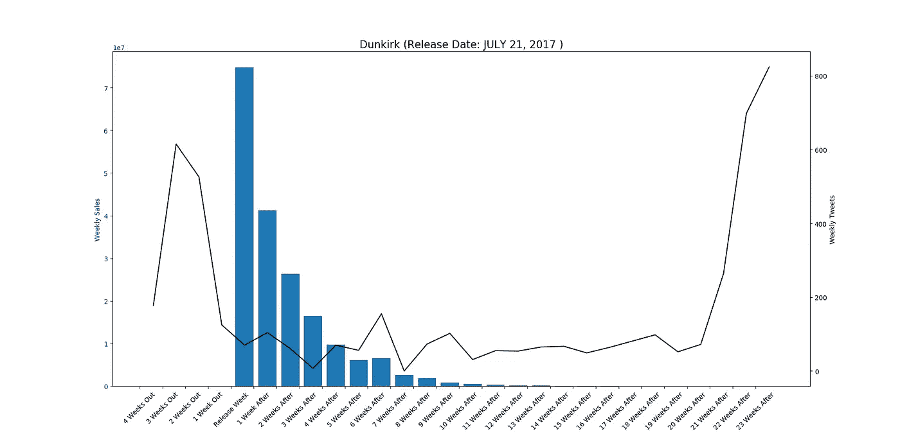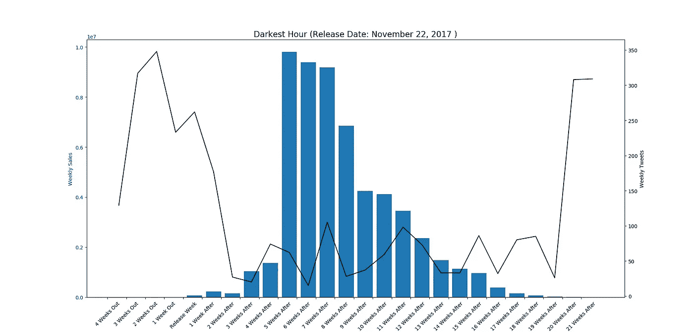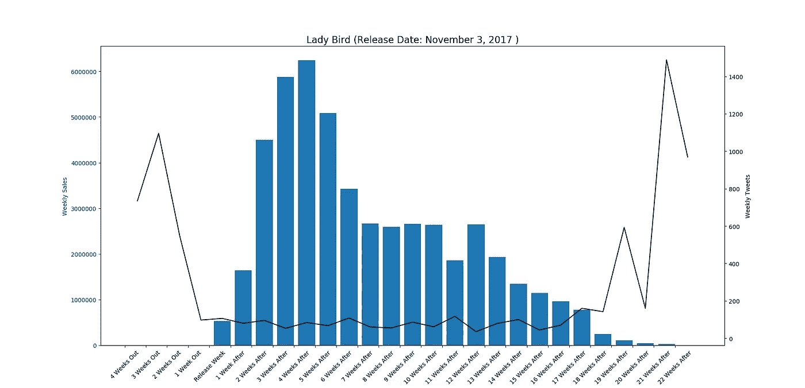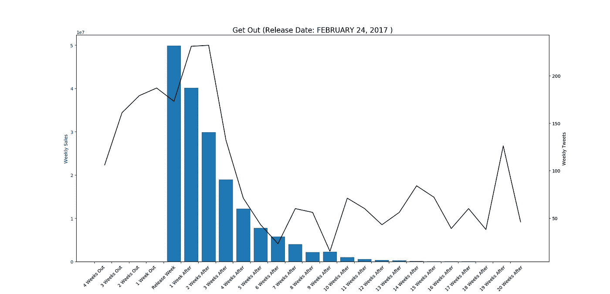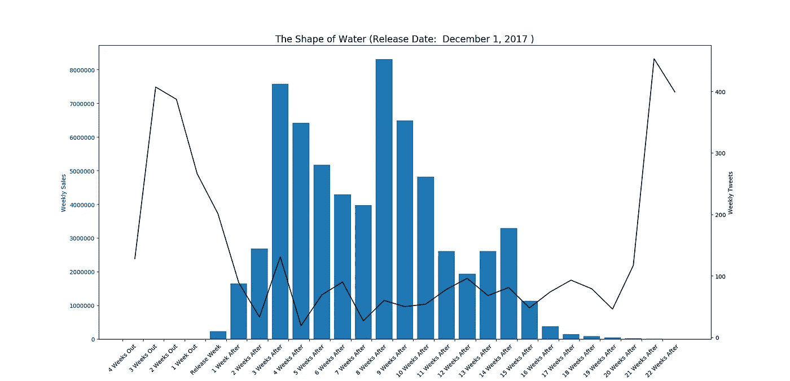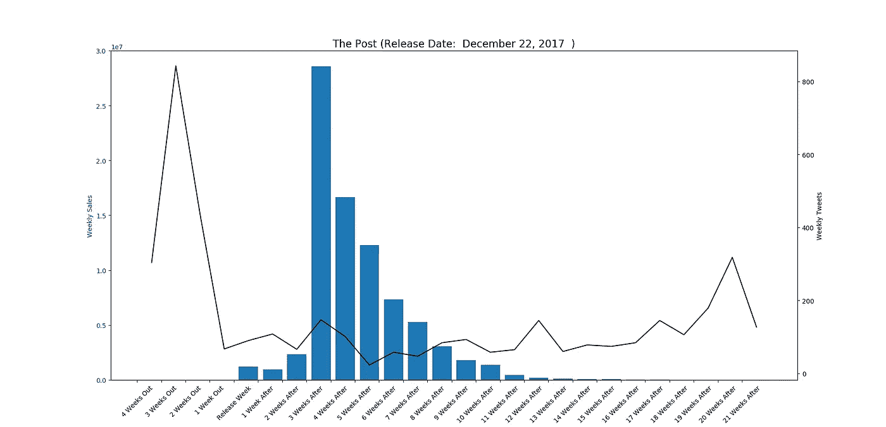

**我们可以看到，门票销售不受推文数量的影响。然而，我们可以在图表中看到一些模式。我把这个留给读者进一步讨论。**

*   接下来，我们来评估推文的情绪之间的关系，看看它对门票销售是否有影响。我们遵循与之前相同的过程，只是在绘制图表时将“tweet_count”更改为“perspective”。

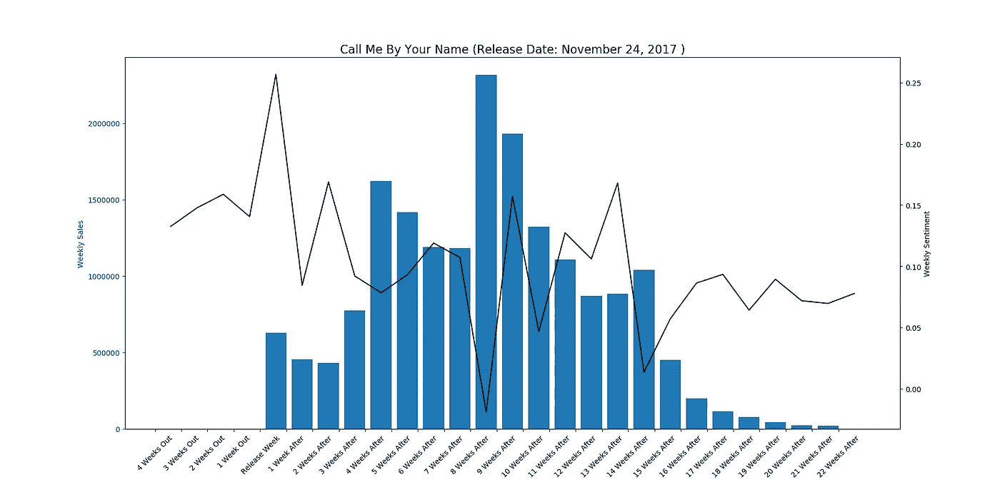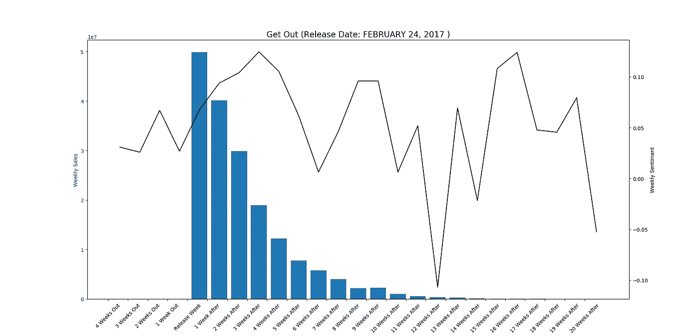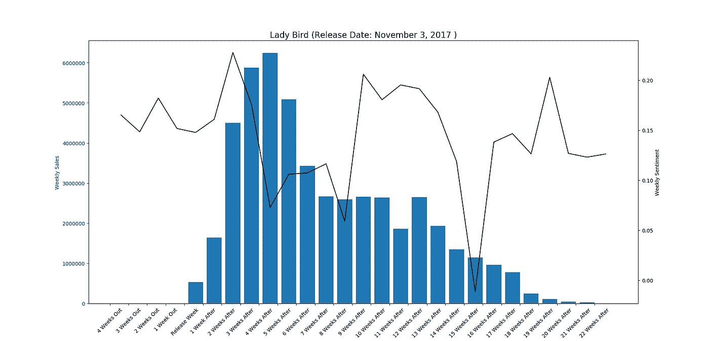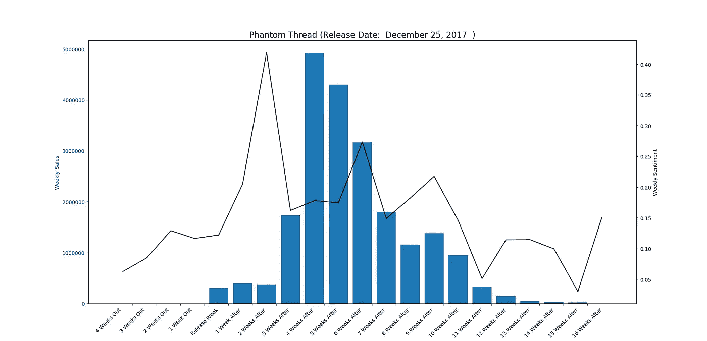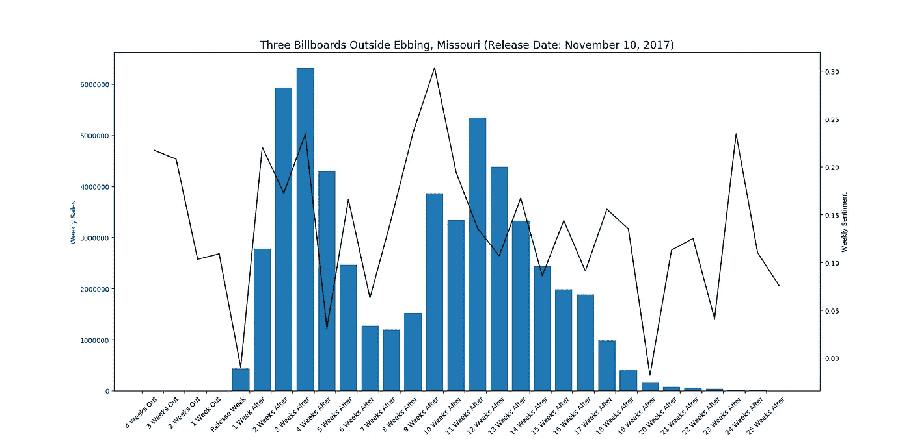

**同样，我们可以看到门票销售总体上不受推文情绪的影响。然而，我们可以在所有的图中看到一些模式，除了一个。我把这个留给读者去发现哪个情绪图是不同的，为什么？**

*   现在我们来看看回归图，它显示了每部电影的总体平均情绪与 metacritic.com 提供的评级之间的相关性。等级从 0 到 10。

```
# in this section, we try to find any possibel correlation between the sentiment and rating scoresimport numpy as npweekly_data = pd.read_csv('weeklt_data.csv')
ratings = pd.read_csv('ratings.csv')m_names = ["ladyb", "thepost", "threebill", "shapeofwater", "phantom", "getout", "dunkirk", "darkest", "callme"]threebill = weekly_data[weekly_data['movie']== 'threebill']
ladyb = weekly_data[weekly_data['movie']== 'ladyb']
thepost = weekly_data[weekly_data['movie']== 'thepost']
shapeofwater = weekly_data[weekly_data['movie']== 'shapeofwater']
phantom = weekly_data[weekly_data['movie']== 'phantom']
getout = weekly_data[weekly_data['movie']== 'getout']
dunkirk = weekly_data[weekly_data['movie']== 'dunkirk']
darkest = weekly_data[weekly_data['movie']== 'darkest']
callme = weekly_data[weekly_data['movie']== 'callme']list_x = [callme['sentiment'].mean(), darkest['sentiment'].mean(), dunkirk['sentiment'].mean(), thepost['sentiment'].mean()
        , getout['sentiment'].mean(), threebill['sentiment'].mean(), shapeofwater['sentiment'].mean(), 
         ladyb['sentiment'].mean(), phantom['sentiment'].mean()]
list_y = ratings['rating']fit = np.polyfit(list_x,list_y,1)
fit_fn = np.poly1d(fit)
# fit_fn is now a function which takes in x and returns an estimate for yplt.plot(list_x,list_y, 'yo', list_x, fit_fn(list_x), '--k')plt.show()
```

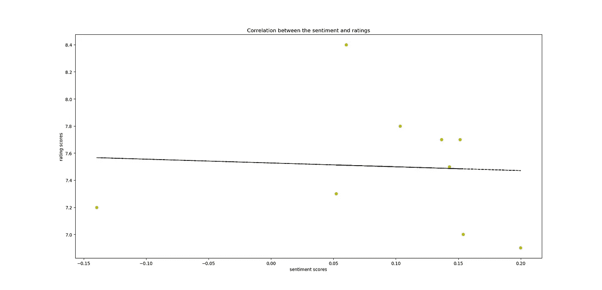

我想我只能说，根据我对上图的解释，大多数情感得分分布在 0.05 和 0.2 之间，它们与回归线不太一致。这里的离群值是最黑暗的时刻；它有负面情绪，原因是这部电影的大多数推文中有“最黑暗”这个词，这使得情绪倾向于负面。

*   最后，让我们看看所有电影的推文、情感和销售的累积图，以便更好地理解每个类别中的可能模式。

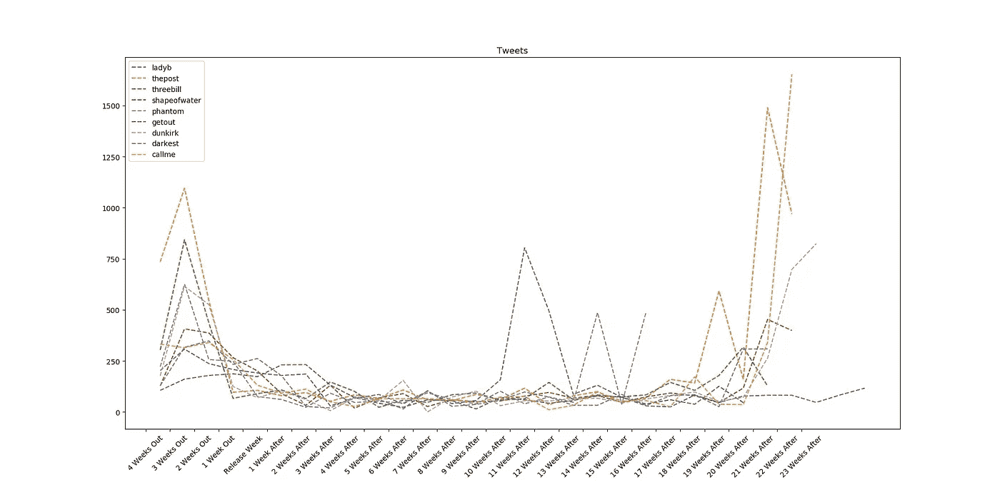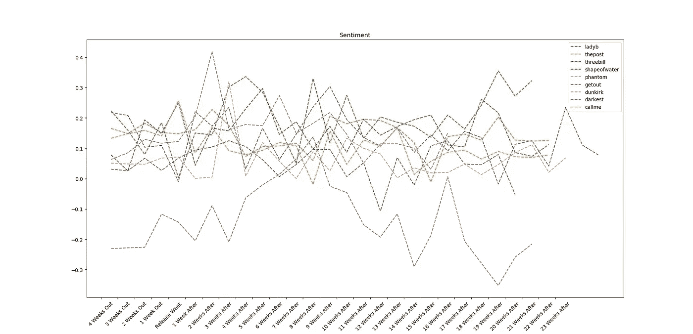

**我不打算在这里添加更多的解释，希望这篇文章的读者能提出问题和评论。**

**非常感谢您的反馈。**

**我的** [**github 页面**](https://github.com/nxs5899/Role-of-Social-Media-on-Box-Office-Data-Science-project) **上有这个项目的源代码、python 笔记本和数据集。**