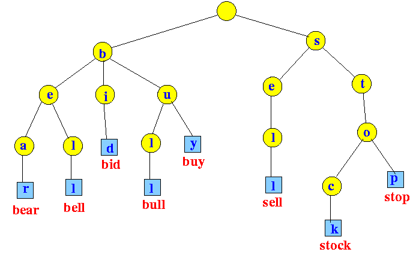

# 用 Python 实现 Trie(不到 100 行代码)

> 原文：<https://towardsdatascience.com/implementing-a-trie-data-structure-in-python-in-less-than-100-lines-of-code-a877ea23c1a1?source=collection_archive---------0----------------------->

# 介绍

让我问你一件事。一些我们经常遇到并且(几乎)总是忽略的有趣的事情。

你肯定还记得你的手机键盘上的那个漂亮的功能，你开始输入一个单词，它就开始向你显示建议。这真他妈的方便！事实上，由于这个原因，我几乎可以一直写英语单词而没有拼写错误。

你觉得，电脑到底怎么样(对！你的智能手机也是一台电脑)想出了这些建议？

事实证明，在许多情况下，使用某种特定的数据结构在您键入时向您显示单词建议。这种特殊的数据结构被称为 **Trie** 。

那么，什么是特里呢？在我开始定义它之前，让我给你看一张图。

(image courtsey — [http://www.mathcs.emory.edu](http://www.mathcs.emory.edu))

从上图可以看出，它是一个树状结构，每个节点代表给定字符串的一个字符。与二叉树不同，一个节点可能有两个以上的子节点。

我们来分析一个例子。我们假设我们从零开始，这意味着我们只有一个空的根节点，其他什么都没有。我们从“买”字开始。从图中可以清楚地看到，我们的 Trie 实现没有在根节点中存储一个字符。所以我们添加第一个字符，即“b”作为它的子节点。我们这样做是因为它在任何一个孩子身上都没有这种性格。否则，我们将跳过添加子节点。因为我们已经有了。然后是“u”字。*在添加这个字符时，有一点我们必须注意，那就是我们需要搜索“u”是否出现在“b”的任何子节点中(我们最后添加的节点)以及***T5【而不是** *的根*

而“y”也是如此。因此，一旦添加整个单词“buy”的操作完成，我们的 Trie 看起来就像这样

而现在是“牛”的时候了。我们重复同样的步骤，在我们的 Trie 中添加“bull”。只是这一次，我们不再添加“b”和“u”。因为它们已经存在。所以一旦手术完成，它看起来像这样-

我相信，这让您对什么是 Trie 以及在其中添加字符的操作是如何工作的有了一个清晰的概念。详细情况，你可以去维基百科。

在解决 [Hackerrank](https://www.hackerrank.com/challenges/ctci-contacts/problem) 中的一个挑战时，我偶然发现了这种稍微有点非传统且讨论较少的数据结构。在摆弄了几个小时的代码后，我成功地编写了代码并解决了这个难题。这是我的代码的样子-

# 代码

Trie implementation in Python 3

# 它是如何工作的？

现在，我将简要介绍一下算法的主要步骤

1.  要考虑的第一件事是我们如何添加新单词。`add`函数正是这样做的。它的工作方式非常简单。它将根节点(没有分配任何字符值的节点)和整个单词作为输入。
2.  然后，它遍历这个单词，从第一个字符开始，一次一个字符。
3.  它检查当前的“节点”(在指向根节点的过程的开始)是否有一个具有该字符的子节点。
4.  如果找到了，它只是增加该节点的计数器，以表明它得到了该字符的重复出现。
5.  如果没有找到，那么它只是添加一个新节点作为当前节点的子节点。
6.  在这两种情况下(4 & 5)，在从单词的下一个字符开始之前，它将子节点指定为“当前节点”(这意味着在下一次迭代中，它将从这里开始)。

这就是在特里树中添加一个单词的全部内容。它还做了一件事，就是在整个过程结束后标记一个单词的结束。这意味着特里树的每个叶节点将把`word_finished`设为真。

搜索前缀有几个简单的步骤-

1.  它从根节点和要搜索的前缀开始。
2.  它一次从前缀中取出一个字符，并搜索“当前节点”的子节点(在指向根节点的开头)以找到包含该字符的节点。
3.  如果找到了，它将该子节点重新分配为“当前节点”(这意味着在下一个迭代步骤中，它将从这里开始)
4.  如果没有找到，则返回 False，表示前缀不存在。
5.  在这个算法中有一个小的变化来处理试图找到一个比单词本身更大的前缀的情况。这意味着，我们有`hammer`作为一个 Trie，我们正在搜索`hammers`

这就是用 Python 构建和遍历通用 Trie 数据结构的全部内容。

这里给出的代码是可重用的(和良好的注释:)，并在公共领域。如果你需要，请随意使用它！

那都是乡亲们！我希望你喜欢这篇文章，如果是的话，请尽可能多的点击拍手。如果您有任何反馈或建议，请通过评论或直接通过我的 [Linkedin](https://www.linkedin.com/in/shubhadeep-roychowdhury/) 告诉我。这些将鼓励我在未来写更多的文章。回头见！