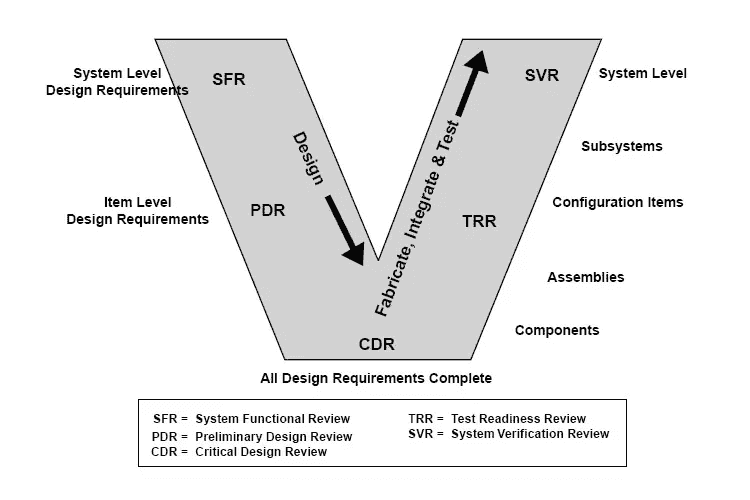
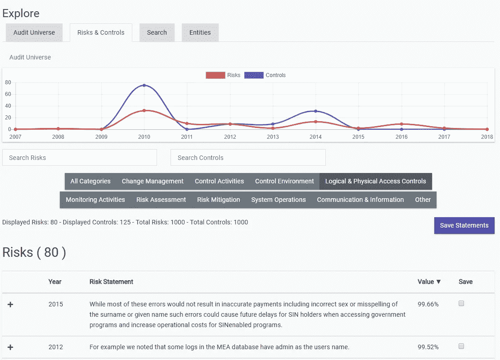

# 在人工智能部署中实现防御性设计

> 原文：<https://towardsdatascience.com/implementing-defensive-design-in-ai-deployments-fc8fdff11c27?source=collection_archive---------22----------------------->

## 来自医疗器械设计领域的一系列见解和战斗创伤

Picture from [Pixabay](https://www.pexels.com/photo/clashing-football-players-264300/) on [Pexels.com](http://Pexels.com)

随着我们的人工智能产品之一[即将推出，客户一直在问一个重复的问题。这个问题偶尔也会出现在我们的咨询项目中，只是程度较轻，但仍然需要一个答案。这个问题的简单版本是这样的:](https://auditmap.ai)

> 我怎么知道人工智能做得好不好？

现在很容易向客户抛出混淆矩阵和神经活动图，但他们有一个更深层次的问题——和一个非常有效的关注。他们不是在问系统的性能，而是在问系统是否与他们自己的问题一致。如果这个模型现在负责他们的一个或多个业务流程，如果他们看不到它如何执行任务的标准，他们如何管理它？

这涉及到管理基础、商业逻辑和机器学习领域的持续发展的结合。定制人工智能解决方案的目标是加速关键流程，以减轻其余员工的工作量，或实时做出决策。因此，如果一个系统不能在可信任的容差范围内可靠地执行流程，那么这个系统可能根本就无法实现。

以下是我们在过去几个月中遇到的一些真实案例:

*   如果系统需要审查、组织和突出法律报告中的关键句子，该怎么办？每一个遗漏或贴错标签的关键句子都有相关的成本吗？
*   如果它在进行医学诊断呢？如果病人被要求接受几个月的痛苦治疗，有人能证明或质疑结果吗？
*   如果恶意代理成功穿透服务器的防火墙会怎样？对于攻击是如何进行的，而不是简单地对其进行分类，有什么教训可以吸取吗？

询问模型可靠性的主要原因是质量保证。主管可能会接受员工在做出某些决定时缺乏理由，但会想要一份记录或历史证明，证明员工的判断是可靠的、有弹性的和可重复的。(这也是为什么我建议我所有的工程师和数据科学家同事在寻找新工作或项目时建立一个投资组合和一份简历。)

# 什么是防御性设计？

防御性设计是一种设计方法，它假设一个系统会失败，因此，应该在不损害系统的其余部分、患者或任何其他相关事物的情况下失败。它的目的是在东西“什么时候”会坏，而不是“如果”坏了，来减轻损害。防御性设计的前提是包含多个缓解层，这样部署的系统就不会陷入非常非常小的困境。

新的机器学习专家和数据科学家没有 devops 和安全工程师那样的血统和战斗伤痕，这可能会很快成为一个问题——特别是当越来越多的机器学习解决方案被播种到一个组织的业务逻辑中时。

## 救援医疗器械设计

让我们来看一个有大量需求工程活动的行业，它可以激发最佳实践:医疗器械设计。至少可以说，可能出错的地方很多，最糟糕的情况也可能是多姿多彩的。事实上，很多事情都可能出错，我们[只为一种新的神经病学设备所需的安全系统](https://patents.google.com/patent/US20140018881A1)申请了专利。

就从头设计新医疗器械而言，有一种推荐的方法可以确保一定程度的验证和可追溯性，称为 [V 型](https://en.wikipedia.org/wiki/V-Model_(software_development))。这仅仅是画可怕的[瀑布模型](https://en.wikipedia.org/wiki/Waterfall_model)的一种奇特方式吗？也许吧！但有一些有用的主题和想法，我们可以应用于大多数人工智能部署。

The V-Model of software development. I also call it “The Waterfall Model’s bastard child”. Although it’s not as cyclical and responsive as Continuous Deployment, it does ensure that there is traceability back to the original design. From [Wikimedia](https://commons.wikimedia.org/wiki/File:Systems_Engineering_and_Verification.jpg).

## v 型外卖

以下主题可以从 V-Model 中提取出来:

1.  做事情是有刻意的原因的。无论是客户需求、技术限制，还是性能期望，每一个行动都有一个可以追溯到项目起源的原因。
2.  每一个设计都有验证和实现。不管是子子模块还是整个系统，都有一种方法可以对照预期性能来验证系统的真实性能。
3.  验证和确认是有区别的。“我造的东西对吗？”和“我做对了吗？”不是同一个问题和客户打交道时，后者通常是最重要的。

# 实施防御性设计

有 3 个主要阶段，设计者希望确保他们遵循一个可靠的防御设计框架:在客户讨论/需求阶段，在编码期间，以及在部署期间和之后。

## 需求阶段的防御性设计

需求，需求，以及更多的需求——这就是我们如何在设计阶段确保良好、干净的乐趣。“但是编程很好玩！”是的，凯伦，是的，但是浪费时间和金钱不是。

**向客户展示一个工具，而不是一个有知觉的存在。**提醒客户，机器学习很枯燥，旨在非常好地完成一个明确定义的流程的一个或多个步骤。

**验证数据。客户是否拥有他们认为自己拥有的数据？原始数据本身干净吗？API 会偶尔改变格式吗？**

**然后再验证一遍。**您能够重复访问工作数据集吗？它是否与您执行的第一次审计相符？

**从小处着手，积累动力。**限定最初承诺的范围。如果你能先解决一个简单的问题，你现在就能处理越来越多的业务流程。这也迫使客户端确保它们呈现给系统的数据是干净的。

(我们已经在各种项目中看到了很多成功，在项目开始时给整个项目泼了一盆冷水，这让每个人都清醒过来，并让一个清晰的业务案例浮出水面。在功能方面，除了厨房水槽，你的客户现场支持者很容易承诺所有东西。)

Agnes Skinner making her requirements known. From [Tenor](https://tenor.com/view/simpsons-agnes-skinner-grocery-bag-gif-10881254).

如果你想阅读更多关于需求工程的内容，我推荐[的同名书籍](https://www.amazon.com/Requirements-Engineering-Jeremy-Dick/dp/3319610724/)，作者是伊丽莎白·赫尔和杰里米·迪克。

## 创世纪阶段的防御设计

现在，您开始在正确的用户界面或交互级别上编码并与客户一起工作，确保有明确定义的需求，可以测量、评估、测试和解释。

以用户为中心的设计。我们总是说让用户问正确的问题，而不是给用户一个准备好的答案。设计用户界面，让用户始终负责关键决策，系统应该作为助手部署——人在回路中有最后的发言权。

A screenshot of our [AuditMap.ai](https://auditmap.ai) tool. The Value

**输入端的预处理/数据验证。**这方面的一个例子是一个简单的分类器:在对所有语句进行排序之前，您可以预先放置一个“英语/非英语”过滤器，以确保您获得干净的数据，或者放置一个“看起来好/看起来不好”的过滤器，以确保过滤机制保护系统的其余部分。

**多型号设计。**它可以是一个紧密的整体，也可以只是不同的 API 调用，但是允许对每个模型的性能进行审查，就可以一直追溯到业务逻辑。

## 部署阶段的防御设计

恭喜你。你的人工智能部署好了，你的客户/老板高兴了，你去读了一会儿[黑客新闻](https://news.ycombinator.com/)，现在你已经精力充沛地开始下一个项目了。然而，根据我们的经验，这是您需要投入最多精力的地方，**至少在现场部署的前 6 个月**。

**跟踪修正。**系统部署后会犯哪些错误？如果你没有考虑纠正措施跟踪机制，那么你就不知道对数据集的长期修复是什么。(好处:这允许你的数据集有一个很好的增长，帮助它随着时间的推移而增长。丹的一篇文章中有一个更长的解释[。](/artificial-intelligence-get-your-users-to-label-your-data-b5fa7c0c9e00))

**正在进行的客户对话。**现在有了在设计工具时无法预见的用例。为确保您的客户拥有最佳体验，在移交后继续对话，以确保工具仍能按预期运行。(他们是不是因为一个诡异的内存泄露，在 50 次请求后就要重置服务器？如果是这样的话，不管你的准确率有多高，他们可能都不会给你打电话进行后续的约定。)

**用户缓解。您的系统对错误的用户输入、文件类型和损坏的文件有弹性吗？多个用户一次上传多个文件怎么办？**

**中间文档。确保模块开发人员和集成商都理解设计决策背后的基本原理。你可以写自己的文档，或者让像 [Swagger](https://swagger.io/) 这样的工具从(正确的)注释代码中管理文档。**

**负载均衡**。您的系统对负载波动有弹性吗？在你的客户发布后(会议谈话和电视采访对此尤其不利。)我们喜欢很多[数字海洋选项](https://www.digitalocean.com/products/load-balancer/)。

永远不要忘记，用户会发明从未有人梦想过的用例。

We’re always impressed by unforeseen client use cases. From [Imgur](https://i.imgur.com/X17puIB.gif).

> 你的系统中最薄弱的部分很可能是人类。它们也是成功部署的最重要部分。

# 什么是防御设计，什么不是

防御型设计很无聊。这是系统化的，而且通常情况下，人们会问为什么有些结构和可交付物的构建超出了他们的基本需求。在几次险些出事之后，你的团队应该开始意识到做最坏打算的重要性。

然而，防御性设计不是一种保证或保险政策。仅仅因为你遵循了每一个可能的步骤，并不意味着你的系统是面向未来的，可以经受住技术飓风。

只要准备好“当”你的系统崩溃时，不要只考虑理论上的“如果”。通过这种方式，你可以确保人工智能做得很好，当它做不好时，将损害降到最低。

如果您在开始新的客户项目时，对本文或我们的设计方法有其他问题，请随时通过 [**LinkedIn**](https://www.linkedin.com/in/mnlemay/) 联系我们。

## 你可能喜欢的其他文章

*   [离群点感知聚类:超越 K 均值](/outlier-aware-clustering-beyond-k-means-76f7bf8b4899)
*   [深度学习图像分类器的罗夏测试](/rorschach-tests-for-deep-learning-image-classifiers-68c019fcc9a9)
*   [为客户提供人工智能原型作为营销策略](/ai-prototypes-for-clients-as-a-marketing-strategy-70de404d27b5)

我的首席技术官丹尼尔·夏皮罗(Daniel Shapiro)的其他文章您可能会喜欢:

*   [人工智能和不良数据](/artificial-intelligence-and-bad-data-fbf2564c541a)
*   [人工智能:超参数](/artificial-intelligence-hyperparameters-48fa29daa516)
*   [人工智能:让你的用户给你的数据贴上标签](https://medium.com/towards-data-science/artificial-intelligence-get-your-users-to-label-your-data-b5fa7c0c9e00)