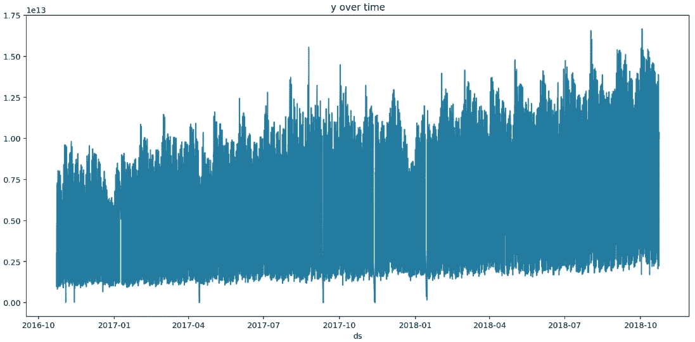
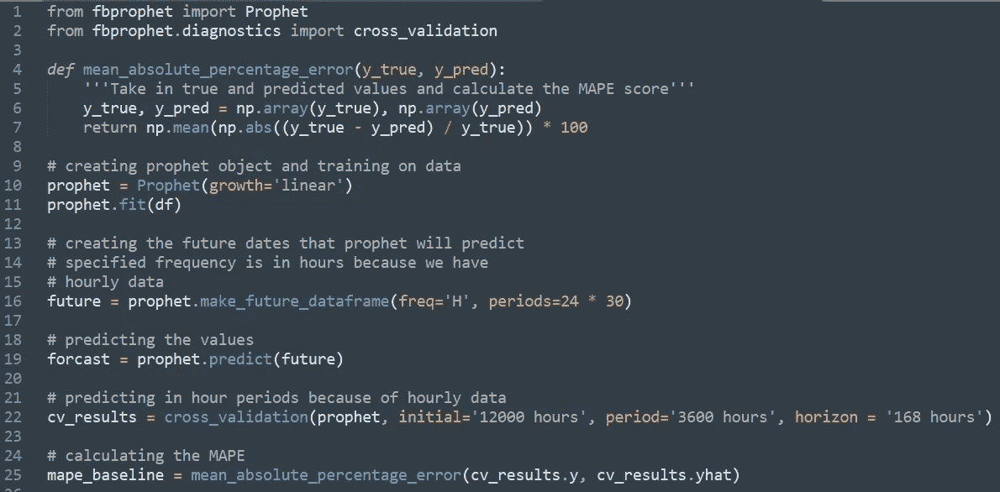
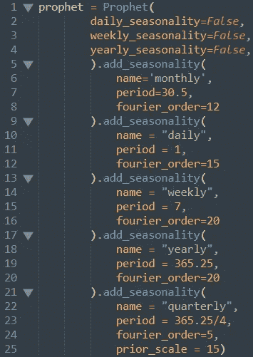
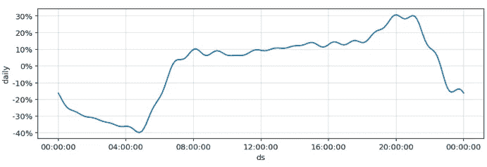
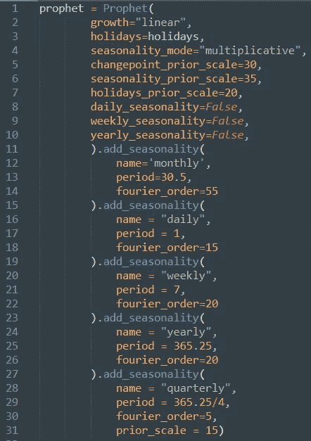
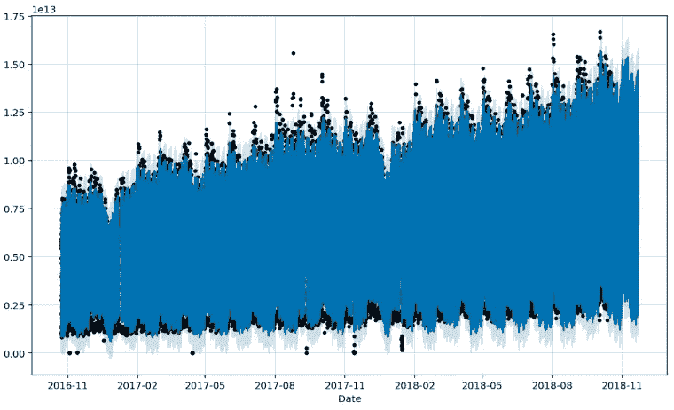

# 高效实施脸书先知

> 原文：<https://towardsdatascience.com/implementing-facebook-prophet-efficiently-c241305405a3?source=collection_archive---------1----------------------->

如果你曾经做过时间序列预测，我敢肯定你很清楚随之而来的压力和痛苦。一会儿你认为你已经破解了股市，一会儿你躺在浴缸里哭着诅咒你不准确的模型(我真的不建议你尝试和预测股市，你很可能不会收获你认为你会获得的收益)。我想说的是，时间序列预测是困难的，总是需要非常专业的数据科学家来实现。

Facebook Prophet’s logo

然而，我们的蓝色霸主，即脸书发布了一个惊人的模型称为脸书先知。Prophet 使几乎任何人都有可能预测时间序列值，即使你在这个领域没有什么经验。在大多数情况下，它开箱即可正常工作，您的数据分析师将能够通过输出讲述相当准确的故事。但是，当您想要开始在生产中使用该模型时，您必须开始更深入地理解正在发生的事情，并且知道哪些参数需要调整以及为什么。

为了向您展示如何调整参数以及为什么应该调整参数，我们将使用一个简单的 y 和 ds 数据框架(Prophet 使用的格式)进行实验。数据超过 2 年，每小时一次，这已经需要一些额外的调整。

Our time series we want to predict

Zooming in on our time series

在我们开始之前，假设你对脸书先知有一个相对较好的了解。如果你不知道，我强烈建议你点击下面的链接进入先知快速入门。如果你不这样做，一些代码将没有意义，因为我不会解释如何导入或适合先知的数据，只对如何优化它。

[先知快速入门](https://facebook.github.io/prophet/docs/quick_start.html)

在我们开始有趣的部分之前，博客的目标是我只想展示哪些超参数值得关注，并给出一些我学到的技巧。无论我说什么都不是法律，我邀请你分享对我工作的意见和建议。

## 我们如何衡量模型的性能？

许多隐藏的秘密中有一个在第一次使用 Prophet 时并不那么明显，那就是它内置了交叉验证功能。此函数将获取您的数据，并在您指定的时间段内训练模型。然后，它将预测您指定的时间段。Prophet 将在更长的时间内训练你的数据，然后再次预测，这将重复进行，直到到达终点。

作为一个例子，让我们以上面显示的数据为例，用现成的 Prophet 模型来拟合它。在示例中，我编写了自己的平均绝对百分比误差(MAPE)函数，并将其应用于测试结果，以获得用一个数字表示的模型性能。

从上面的代码中可以看出，我们从 Prophet 导入了交叉验证函数，并将其应用于我们的数据。这将返回所有预测点的预测值和真实值的数据帧，然后可以用它来计算误差。

所以在运行上面的代码后，我们得到了 15.32%的 MAPE。这表明在所有预测的点上，我们与真实值平均相差 15.32%。

在博客的其余部分，我将讨论每个超参数，以及在决定它们的值时应该注意什么。

# 优化模型

## 不要盲目地做任何事情

优化模型的第一个技巧是不要疯狂地改变值，创建巨大的 for 循环，或者将模型放入 gridsearch 来优化 hyper 参数。当观察时间序列模型时尤其如此，因为超参数对预测有很大影响，但是这些参数的值不必是完美的。相反，让他们进入正确的区域会带来最大的回报。您可以通过查看数据并了解当您更改每个参数时模型将如何处理这些数据来实现这一点。

## 增长

这个参数是最容易理解和实现的，因为你只需要绘制你的数据就知道它应该是什么。如果您绘制您的数据，并且您看到一个趋势继续增长，而*(或者如果您的领域专家告诉您不需要担心饱和)没有真正的饱和洞察力，您将把这个参数设置为“ ***线性*** ”。*

*如果您绘制它并看到一条显示饱和前景的曲线*(或者如果您正在处理您知道必须饱和的值，例如 CPU 使用率)，那么您将把它设置为“*”。***

***当您选择逻辑增长时，此参数的难点就来了，因为您必须提供预测的上限(数据将达到的最大值)和下限(数据将达到的最小值)以及历史数据。这些上限和下限值可以随着时间的推移而改变，也可以是您永久输入的设定值。***

***在这种情况下，与领域专家交流对您帮助最大。他们对下一年的预期和一段时间内的不可能值有很好的了解。与他们交谈后，你可以提供更准确的上限和下限。然而，如果你附近没有领域专家，我发现你的第一个值的 65%对于底价很有效。然后你可以设定一个相对较高的限额，但要在常识范围内。因此，如果你预测一个网站的访问量，而目前它的访问量是 100，00 0，那么不要把你的访问量限制在 200，00 0，00 0，因为你很可能在你预测的时间内达不到这个上限。更好的办法是让它变得更合理，比如 50 万英镑，让上限随着时间慢慢增长。***

## ***假日***

***假期是一段时间，在这段时间里，每一天都有同样的效果。例如，如果您想要对一个人们在节日期间迁移的城市中的订户数量进行建模，您可以使用 **holidays** 参数在您的模型中输入节日期间的日期。***

***当你对非日常数据建模时，棘手的部分就来了。我犯的一个错误是，当我试图对每小时的数据建模时，把我的假期作为每天的数据。这导致我的模型性能更差，因为它很难将假期数据调整为正确的形式。确保假期数据与目标数据具有相同的形式是很重要的。您还应该能够提供您预测的假期日期。这意味着假期只能是你事先知道的时间/日期/日子。***

***另一个处理节假日的参数是***holidays _ prior _ scale***。此参数决定了假期对预测的影响程度。例如，当你在处理人口预测时，你知道假期会有很大的影响，尝试大的值。通常值在 20 到 40 之间就可以了，否则默认值 10 通常就很好了。作为最后手段，你可以降低它来看看效果，但我从来没有发现，以增加我的 MAPE。***

## **变革点**

**变点是数据中趋势发生突然变化的点。一个例子是，如果你有一个活动，突然你的网站有了 50 000 多个固定访问者。变化点将是发生这种巨大变化的时间段。**

**变点有四个超参数:*变点*、*n _ 变点*、*变点 _ 范围*和*变点 _ 先验 _ 标度*。**

**当您提供变点日期而不是让 Prophet 确定日期时，将使用 ***变点*** 参数。一旦您提供了自己的变点，Prophet 将不会估计更多的变点。因此，重要的是你知道你在做什么。从我的经验来看，我发现让 Prophet 自己发现它们和我改变改变点的数量(用 ***n_changepoints*** )会得到最好的结果。就应该选择多少个变点而言，我建议如果你有每小时的数据，那么一个月至少一个变点会产生好的结果。然而，它会根据每个用例而变化，但这可能是一个好的开始。**

*****change point _ range***通常对性能没有太大影响。我通过保持默认值得到了最好的结果，但是如果有人发现从 0，8 改变它时有不同的情况，我会很乐意在评论中听到。另一个参数，***change point _ prior _ scale，*** 用于指示允许的可变点的灵活程度。换句话说，变点能在多大程度上符合数据。如果你把它做得很高，它会更灵活，但是你可能会适得其反。我发现 10 到 30 之间的值对我有用，这取决于数据的波动性。**

## **季节性**

**这些参数是 Prophet 的亮点，因为您只需更改几个值就可以做出重大改进并获得深刻见解。**

**第一个大参数是 ***季节性 _ 模式*** 。此参数指示季节性因素应如何与预测相结合。这里的默认值是 ***加法*** ，另一个选项是 ***乘法*** 。起初我对这个参数很纠结，但是在使用了一段时间后，它开始对我有意义了。当你的季节性趋势在整个期间应该是“恒定”的时候，你将使用*添加剂*。例如，当您希望您的年度趋势增长影响与 2010 年和 2018 年相同时。这适用于趋势变化似乎保持不变的数据，例如居住在小城镇的人数。这是因为我们不期望增长突然以百万计，因为没有基础设施。**

**另一方面，当我们想要预测居住在一个发展中城市的人口数量时，年度趋势数字在最后几年可能更重要，因为基础设施已经存在。那时人口增长率可能会比早些年快得多。在这种情况下，您将使用*乘*来增加季节性随时间变化的重要性。**

**和各地的情况一样，还有一个 ***季节性 _ 先验 _ 规模*** 参数。这个参数将再次允许你的季节性更加灵活。我发现 10 到 25 之间的值在这里工作得很好，这取决于你在组件图中注意到的季节性程度。**

**我发现最适合我的一个技巧(我愿意讨论这个问题)是将***yearly _ 季节性*、*****weekly _ 季节性*、**和***daily _ 季节性*、**都设置为 *false* ，然后添加我自己的季节性，如下面的代码片段所示。**

****

**Adding your own seasonalities**

**通过这样做，你可以获得更多的权力和对季节性的控制。您可以指定每个季节的确切时间，这意味着您可以创建“新的”季节。例如，通过将周期设为 93.3125，您可以将季度季节性添加到模型中。您还可以为每个季节性添加先前的比例，而不是共享一个比例。现在，我希望我能告诉你应该添加什么季节，应该是什么时间段，但是每个用例完全不同，应该联系领域专家以获得建议和见解。**

**为了清楚起见，如果周期被设置为 35，那么你告诉模型在某一点发生的事情很可能在 35 天内再次发生。**

**使用这种技术可以调整的另一个参数是组成每个季节性的傅立叶分量的数量(***Fourier _ order***)。对于那些懂一点数学的人来说，任何信号都可以用正弦波和余弦波之和来表示。这是 Prophet 生成季节性信号的固有方式。这样，您可以更改开始表示曲线的精确度，或者曲线中可以出现多少条曲线。下面显示的是一些数据的每日季节性，分别使用傅立叶级数 5 和 20。**

****

**Fourier_order = 5**

****

**Fourier_order = 20**

**正如你所看到的，曲线轮廓在两个趋势中保持不变，但是在有 20 个分量的趋势中有更多的起伏。这些颠簸可能是拾取噪声，也可能是更精确的值。这应该归结为你自己的解释和领域专家的意见。我发现较高的值确实会给出更好的结果，我强烈建议调查使用较高值的效果。您可以尝试范围从 10 到 25 的值。**

## *****MCMC 样本*****

**这是一个棘手的问题。此参数确定模型是使用最大后验概率(MAP)估计，还是使用指定数量的*马尔可夫链蒙特卡罗* (MCMC)样本进行训练和预测的完全贝叶斯推断。**

**因此，如果您使 MCMC 为零，它将进行 MAP 估计，否则您需要指定 MCMC 使用的样本数。我将诚实地说，我从来没有发现贝叶斯推理更好地工作，我总是使用地图估计。贝叶斯推理也需要非常长的时间来运行，因为你需要使用至少 1000 个样本来获得令人满意的结果。这是我总是留给基线值的一个参数。**

**作为保持 ***mcmc_samples*** 0 的结果，我还没有机会探究***interval _ width***，因为它是在使用 MAP 估计时自动生成的。**

## **不确定样本**

**这是另一个对结果没有太大影响的参数，应该针对每个用例进行探究。**

# **从一开始就改进我们的原始模型**

**那么，如果我们更多地考虑我们的参数并专注于上述参数，MAPE 会增加多少呢？下面显示的是最终模型。**

****

**Final Prophet model**

**如果我们看看我的最终模型，我们看到我选择了线性。这是因为我和与我一起工作的领域专家谈过，她提到我们在这里预测的没有限制。你也可以看到它增长很快，但也不是指数增长。出于这个原因，我不必担心我的预测会拾取一些导致值呈指数增长的东西。**

**我的季节性变成了倍增性，因为我发现模型很难预测时间序列后半部分的更高值。这表明这一趋势在后期可能更为重要。**

**您还可以看到，我添加了月度和季度趋势，因为我在对我的数据进行 ed a 时注意到了这些趋势(在构建模型之前始终进行 EDA 非常重要)。**

**通过所有这些改变，我设法把我的 MAPE 降到了 6.35%，基准模型的 MAPE 为 15.32%。**

****

**Predicted (blue) vs real values (black dots)**

**这只是表明 Prophet 开箱即用的效果令人惊讶，如果您对您的模型稍加注意，您可以大幅提高性能！**

**感谢您的阅读，我期待着关于您如何实施和优化 Prophet 的讨论。**