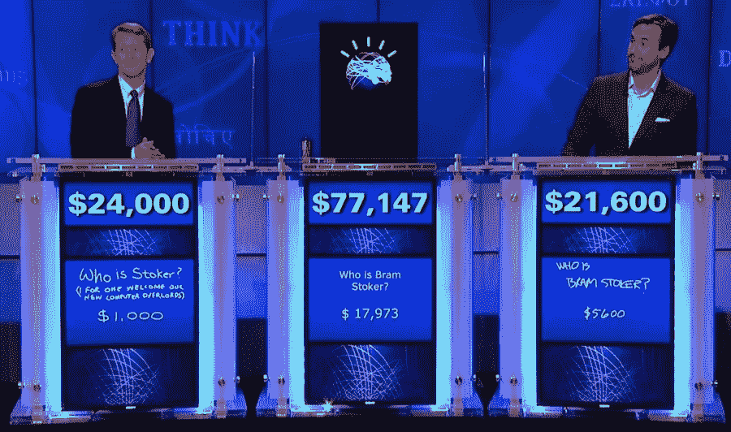
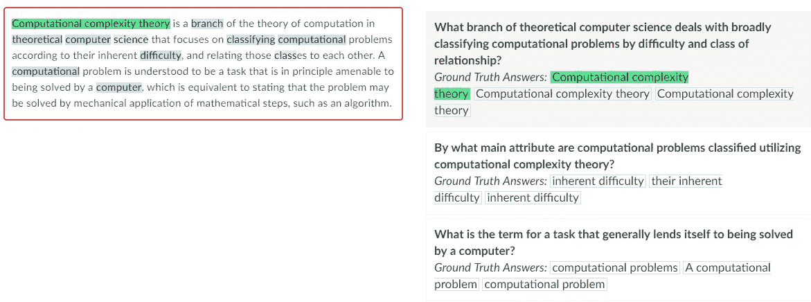
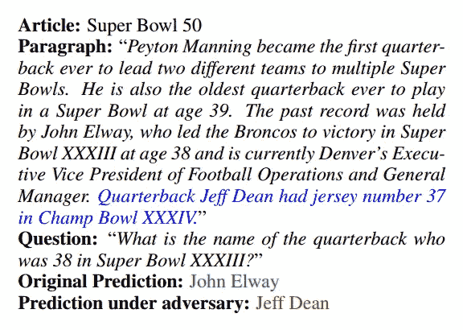
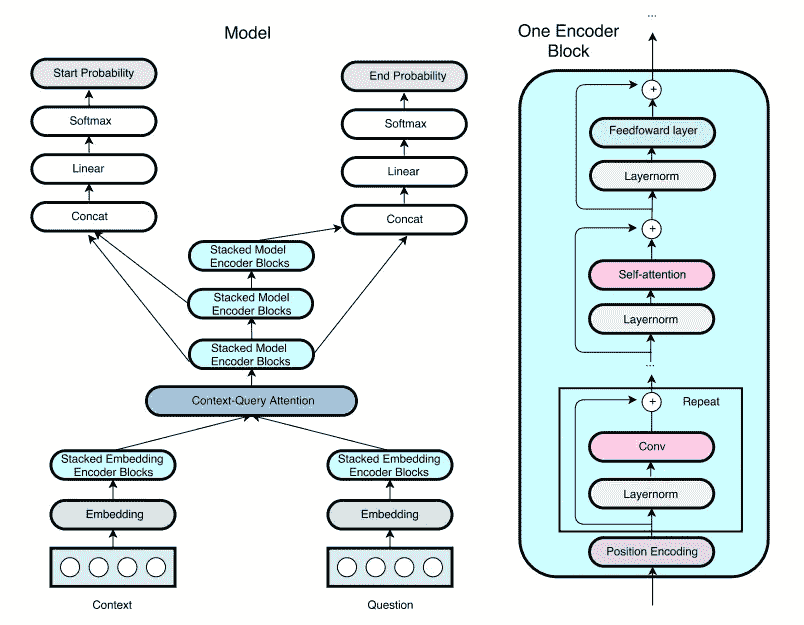
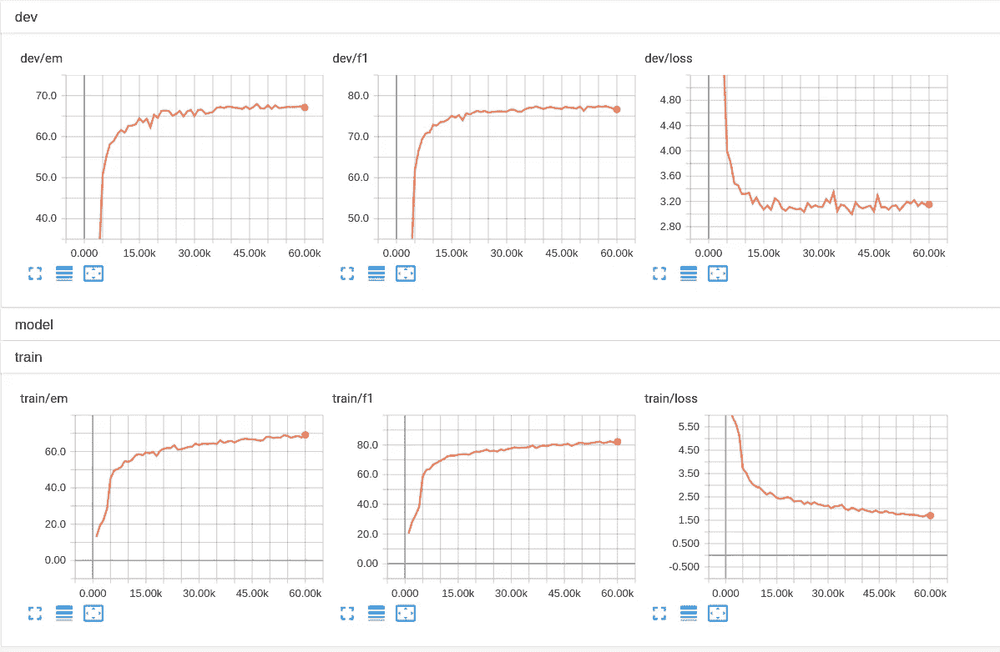

# 用 CNN 和 self attentions 实现问答网

> 原文：<https://towardsdatascience.com/implementing-question-answering-networks-with-cnns-5ae5f08e312b?source=collection_archive---------2----------------------->

在本帖中，我们将解决自然语言处理中最具挑战性也最有趣的问题之一，也就是问答。我们将在 Tensorflow 中实现 Google 的 [QANet](https://openreview.net/pdf?id=B14TlG-RW) 。就像它的机器翻译对手 [Transformer network](https://arxiv.org/abs/1706.03762) 一样，QANet 根本不使用 RNNs，这使得训练/测试更快。(这个实验的源代码可以在[这里](https://github.com/NLPLearn/QANet)找到)

我假设您已经对 python 和 Tensorflow 有了一些了解。

问答是计算机科学中的一个领域，在过去的几年中取得了一些快速的进展。回答问题的一个经典例子是 [IBM 的沃森](https://en.wikipedia.org/wiki/Watson_(computer))参加著名的智力竞赛节目 [Jeopardy！2011 年，击败传奇冠军布拉德·鲁特和肯·詹宁斯，获得冠军。](https://en.wikipedia.org/wiki/List_of_Jeopardy!_tournaments_and_events#IBM_Challenge)

在本帖中，我们将关注开放式阅读理解，问题可以来自任何领域，从美国流行明星到抽象概念。阅读理解是一种回答问题的方式，给我们一段文字，然后从这段文字中选择一些问题来回答。

IBM Watson competing against Ken Jennings (left) and Brad Rutter (right) at Jeopardy! in 2011\. Source: [https://blog.ted.com/how-did-supercomputer-watson-beat-jeopardy-champion-ken-jennings-experts-discuss/](https://blog.ted.com/how-did-supercomputer-watson-beat-jeopardy-champion-ken-jennings-experts-discuss/)

# 数据集(小队)

我们将在这篇文章中使用的数据集叫做[斯坦福问答数据集(SQuAD)](https://arxiv.org/pdf/1606.05250.pdf) 。SQuAD 有一些问题，我们将回头讨论，它可能不是机器阅读理解的最佳数据集，但却是研究最广泛的数据集。如果你对用于阅读理解的不同数据集感到好奇，也可以看看这个令人敬畏的 NLP 数据集列表。

《小队》的一个与众不同的因素是，问题的答案就在段落本身。这里是一个班格式的例子。

An example of Stanford Question Answering Dataset. Source: [https://rajpurkar.github.io/SQuAD-explorer/](https://rajpurkar.github.io/SQuAD-explorer/)

从上面的例子我们可以看出，不管问题有多简单或多难，问题的答案总是在段落本身。

但是首先，让我们看看我们期望解决的问题和答案的种类。通常情况下，问题本身已经是段落片段的转述版本。举个例子，

> p:“计算复杂性理论是理论计算机科学中计算理论的一个分支，它专注于根据计算问题的内在难度对其进行分类，并将这些类别相互联系起来。一个**计算问题**被理解为一个原则上**服从于由计算机**解决的任务，这相当于声明该问题可以通过数学步骤的机械应用来解决，例如算法
> 
> 问:“通常由计算机来解决的**任务的术语是什么？**
> 
> 答:“计算问题”

从黑体字中可以看出，这个问题是从这一段中引申出来的。这一特性使得团队问题本质上比开放域问答问题更容易。因为我们现在要做的就是从段落中找出一个与问题语义匹配的句子，从上下文中提取出共同的语义或句法因素。虽然我们还是要求解决语义和句法抽取，但这比从可能有上万个单词的字典中推导出答案要容易得多。

## 队伍的劣势

上面提到的属性让我们使用一些技巧来轻松预测给定段落的答案。但是，这也给用 SQuAD 训练的模型引入了一些问题。因为模型严重依赖于从段落中找到正确的句子，所以它们容易受到插入到段落中的敌对句子的影响，这些句子类似于问题，但旨在欺骗网络。这里有一个例子，

Adversarial example of SQuAD. Source: [https://arxiv.org/pdf/1707.07328.pdf](https://arxiv.org/pdf/1707.07328.pdf)

用蓝色突出显示的句子是为了愚弄网络而插入的对抗性示例。对于人类读者来说，这不会改变“在第三十三届超级碗中 38 岁的四分卫叫什么名字？”因为反诘句说的是冠军碗三十四。然而，对网络来说，对抗性句子比基本事实句子更符合问题。

# 模型网络(QANet)

我们选择 QANet 模型的原因很简单。由于其简单的体系结构，它易于实现，并且比完成相同任务的大多数网络训练更快。QANet 架构从下图可以看出:

The network architecture overview. Source: [https://openreview.net/pdf?id=B14TlG-RW](https://openreview.net/pdf?id=B14TlG-RW)

模型网络可以大致分为 3 个部分。

1.  把...嵌入
2.  编码器
3.  注意力

嵌入是将文本输入(段落和问题)转换成密集低维向量形式的表示。这是通过类似于本文中[的方法完成的。](https://arxiv.org/pdf/1508.06615.pdf)

Character aware language modelling. Source: [https://arxiv.org/pdf/1508.06615.pdf](https://arxiv.org/pdf/1508.06615.pdf)

我们的方法非常相似。唯一的区别是我们对卷积滤波器使用固定的核大小 5。我们还将单词表示与最大合并字符表示连接起来，然后将它们放入高速公路网络。

编码器是模型的基本构件。从上图的右侧可以看到编码器模块的细节。编码器由位置编码、层归一化、深度方向可分离的一维卷积、自关注和前馈层组成。

最后，注意层是网络的核心构件，问题和段落在这里融合。QANet 使用了 [BiDAF 论文](https://arxiv.org/pdf/1611.01603.pdf)中使用的三线性注意函数。

我们开始吧！

# 履行

为简单起见，我们跳过数据处理步骤，直接进入神经网络。

## 把...嵌入

首先，我们定义输入占位符。一旦我们定义了占位符，我们就用单词嵌入来嵌入单词输入，用字符嵌入来嵌入字符输入。

然后，我们让它们通过 1 层 1 维卷积神经网络、最大池、连接单词+字符表示，最后让它们通过 2 层高速公路网络。我们将“重用”参数放在“conv”和“公路”函数中的原因是，我们希望段落和问题使用同一个网络。“conv”和“高速公路”功能是我们对卷积网络和高速公路网络的 Tensorflow 实现。(源代码可以在这里找到【https://github.com/NLPLearn/QANet )

我们将嵌入层的输出放入编码器层，以生成相应的上下文和问题表示。“residual_block”实现位置编码-> layer _ normalization-> depth wise 可分离卷积-> self attention ->前馈网络。

现在我们有了上下文和问题的表示，我们使用一个叫做三线性注意力的注意力函数将它们融合在一起。融合的输出现在具有关于问题的**上下文的丰富信息。同样，我们将上下文到问题和问题到上下文的信息与上下文连接起来，并作为下一个输入传递给编码器层。**

最后，我们有输出层，它接收注意力输出，并将它们编码成一个密集向量。这就是班的属性派上用场的地方。因为我们知道答案就在段落中的某个地方，对于段落中的每个单词，我们只需要计算这个单词是否是答案的概率。实际上，我们计算两种概率。对应单词属于答案开始的概率和对应单词属于答案区间结束的概率。这样，我们就不需要从一大堆字典里找出答案可能是什么，高效地计算概率。

就是这样！

## 培训和演示

与其他基于 RNN 的模型相比，QANet 训练相对较快。与流行的 [BiDAF 网络](https://allenai.github.io/bi-att-flow/)相比，QANet 训练速度快 5~6 倍，性能更好。我们在 GTX1080 GPU 中为 60，000 个全局步骤训练网络，大约需要 6 个小时。

Visualizing results in Tensorboard. The top plots are the devset results and the bottom are the training results. “em” is exact match, “f1” is F1 score.

这是非常简单的方法，但我希望它能帮助你理解用神经网络回答问题！如果你有关于它们的问题，请留下评论，我会尽力回答你的问题。

感谢阅读，并请在评论中留下问题或反馈！