# 用元学习和无可能性推理改进你的科学模型

> 原文：<https://towardsdatascience.com/improve-your-scientific-models-with-meta-learning-and-likelihood-free-inference-2f904d0bd7fa?source=collection_archive---------17----------------------->

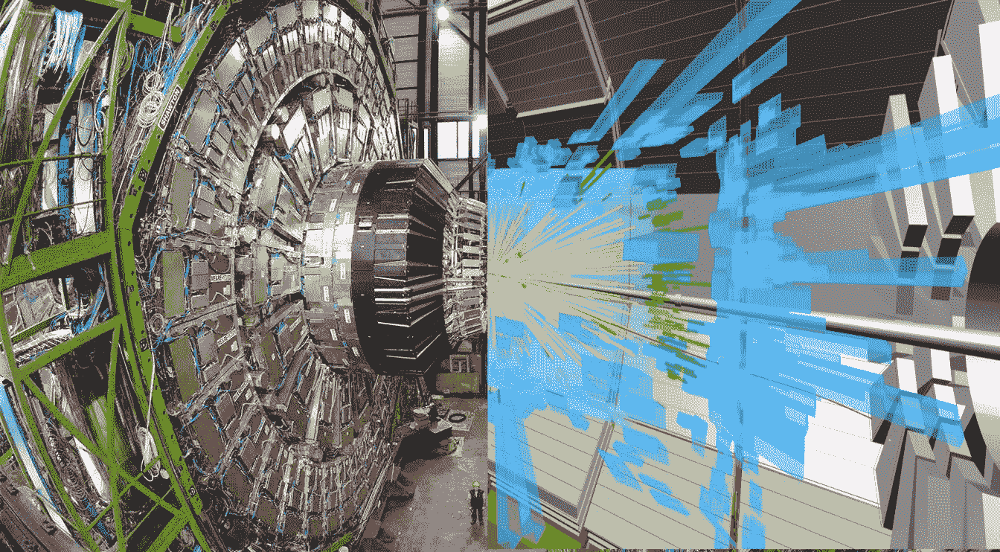

CMS Particle Detector in the LHC accelerator at CERN. Comparison between reality and simulation (with Geant4)

## 无似然推理的介绍和论文[无似然推理的递归机器](https://arxiv.org/abs/1811.12932)的提炼，发表于 [NeurIPS 2018 元学习研讨会](http://metalearning.ml)。

*亚瑟·佩萨与* [*安托万·魏汉高*](https://medium.com/u/5808df5ce3e6?source=post_page-----2f904d0bd7fa--------------------------------) 共同撰写的文章

# 动机

提出新的科学理论通常有两种方式:

*   从基本原理出发，推导出相应的定律，并提出实验预测以验证理论
*   从实验出发，推断出解释你的数据的最简单的规律。

统计学和机器学习在科学中的作用通常与第二种推断有关，也叫*归纳*。

例如，想象一下，你想在一个环境中模拟两个种群(比如狐狸和兔子)的进化。一个简单的模型是 [Lotka-Volterra 微分方程](https://en.wikipedia.org/wiki/Lotka–Volterra_equations):你考虑一个事件发生的概率，比如“一只狐狸吃了一只兔子”、“一只兔子出生了”、“一只狐狸出生了”等等。在很短的时间间隔内发生，根据这些概率推导出一组微分方程，通过求解这些方程来预测两个动物种群的进化。通过将您的预测与真实群体的进化进行比较，您可以推断出该环境中的最佳模型参数(概率)。

现代理论需要**模拟**才能与观测联系起来。它可以是一个简单的微分方程解算器，如洛特卡-沃尔泰拉模型，也可以是一个复杂的蒙特卡罗模拟器，如他们在粒子物理学中使用的那样。

通过将模拟的结果(即模型的预测)与真实数据进行比较，就有可能知道模型的正确性并相应地进行调整。如果这种在模型和实验数据之间来回转换的过程通常是手动完成的，那么任何机器学习从业者都会问的问题是:我们可以自动完成吗？我们能否建造一台机器，将可调整的模拟器和真实数据作为输入，并返回最符合真实数据的模拟器版本？

这是我们最近工作的目标[1]，我们训练了一个神经网络来提出模拟器调整的最佳序列，以便逼近实验数据，利用了无似然推理和元学习领域的最新进展。

# 无似然推断

让我们用更正式的方式重新表述我们的问题。我们可以通过一个随机函数来建模一个模拟器(也叫生成模型)，这个随机函数取一些参数 **θ** ，返回从某个分布中抽取的样本 **x** (所谓的*模型*)。

这种形式主义适用于任何包含随机性的科学理论，因为这在现代科学中非常常见(粒子碰撞受本质上随机的量子物理定律支配，生物过程或化学反应经常发生在嘈杂的环境中，等等)。).

实验数据存在于与模拟器输出相同的空间中的一组点中。推理的目标是找到参数 **θ** ，使得模拟器生成尽可能接近真实数据的点。

使用这种模拟器的科学领域包括:

*   群体遗传学。**型号:** [聚结理论](https://en.wikipedia.org/wiki/Coalescent_theory)。**观察:**一个当前种群的 DNA。**参数:**共同祖先的 DNA。
*   高能粒子物理学。**模型**:粒子物理的[标准模型](https://en.wikipedia.org/wiki/Standard_Model)。**观察:**碰撞时探测器的输出。**参数:**标准模型的耦合常数(像粒子的质量或者不同力的强度)。
*   计算神经科学。**模型:**霍奇金-赫胥黎模型。**观察:**一个神经元激活后电压的演变。**参数**:神经元的生物物理参数。

那么，在给定一些真实观测值的情况下，我们如何预测模拟器的参数呢？让我们考虑一个简单的高斯模拟器的例子，它采用一个向量 **θ=** (μ **，** σ)作为参数，并返回来自高斯分布𝓝(μ **，** σ)的样本。

推断这种模拟器参数的经典方法被称为*最大似然估计*。在由 **θ** 参数化的概率分布 P 下，真实数据点 X 的可能性(模拟器)定义为 P(X| **θ** )。这意味着，如果大多数数据点位于高密度区域，则可能性很高。因此，模型的最佳参数通常是最大化真实数据可能性的参数。如果您不熟悉基于可能性的推理，您可以阅读[这一对主题的精彩介绍](/probability-concepts-explained-maximum-likelihood-estimation-c7b4342fdbb1)。

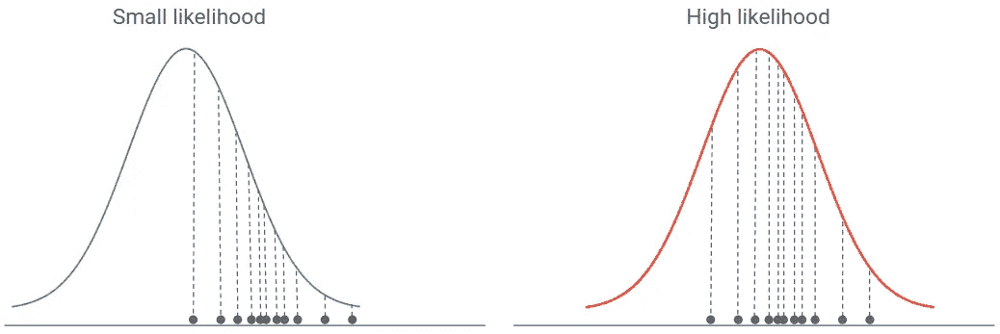

如果您可以明确访问模拟器的基本概率分布以及该分布的梯度，例如，您可以在参数空间中执行梯度下降，以最大化可能性并推断模型的最佳参数。

然而，许多现实生活模拟器有一个**难以处理的可能性**，这意味着显式概率分布太难计算(无论是分析还是数值)。因此，我们必须找到新的方法来推断最佳参数，而不使用似然函数或其梯度。

总之，我们有一个黑盒随机模拟器，它可以获取参数并从未知的概率分布中生成样本，以及我们能够与生成的数据进行比较的真实数据。我们的目标是找到引导模拟器生成尽可能接近真实数据的参数。该设置称为**无可能性推理**。

# 我们如何进行无可能性推断？

让我们试着逐步想出一个解决问题的方法。我们可以做的第一件事是从一个随机参数开始，并模拟相应的数据:

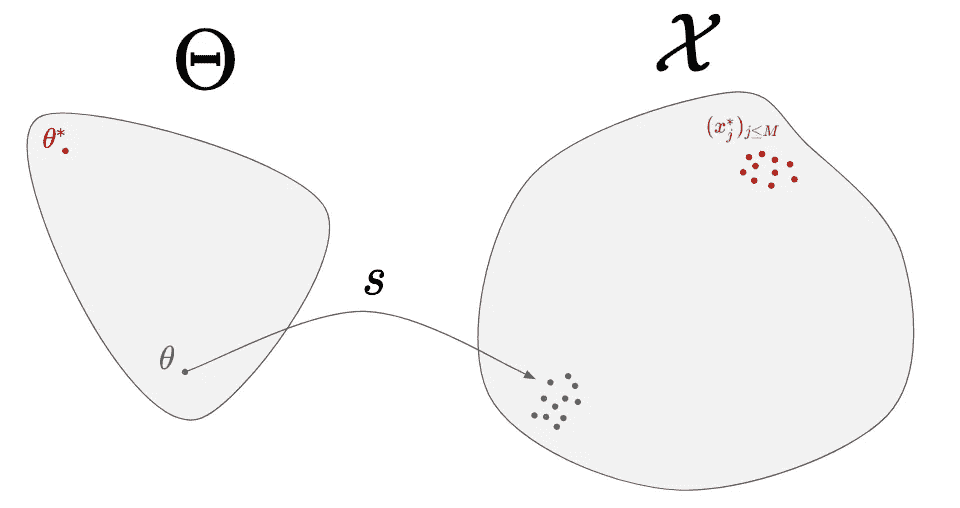

Representation of the two spaces of interest. The true parameter (that we wish to infer) is the red point on the left. The real data correspond to the red cloud of points on the right. We start by choosing a random parameter θ (in gray on the left) and simulating the corresponding data points (in gray on the right)

通过这样做，我们可以看到我们生成的数据离真实数据有多远，但是我们无法知道在参数空间中该往哪里走。相反，让我们模拟几个参数:

为此，我们考虑参数空间中的一种分布，称为**建议分布**，并注明 q(θ|ψ)。如果我们选择 q 为高斯分布，我们将得到ψ=(μ **，** σ)。第一步是随机初始化ψ。在上图中，为了简单起见，我们考虑了ψ=μ。然后，我们可以执行以下步骤，直到收敛:

*   从方案分布中抽取几个参数:图中ψ周围有 4 个参数。
*   从它们生成数据:右边的 4 个点云。
*   选择一个好的前进方向。

第三步是艰难的。直观地说，您希望将ψ移向橙色和绿色参数，因为相应的预测(点的橙色和绿色云)与实际数据最接近。一组称为*自然进化策略*【3】的方法允许您将每个θ的表现(就其预测和实际数据之间的相似性而言)与参数空间中的一个方向联系起来。最近的一篇论文[4]例如利用生成敌对网络(GAN)给出的相似性度量来寻找最佳方向。尽管这些算法在一般情况下表现良好，但人们可能想知道，对于给定的模拟器，是否不可能找到更好的算法来利用该模拟器的特定特性。这就是元学习发挥作用的地方！

# 优化的元学习

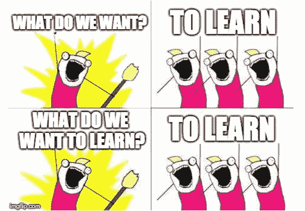

元学习背后的理念是学习如何学习，在我们的案例中是**学习优化过程**。本文介绍的[通过梯度下降学习通过梯度下降学习](https://arxiv.org/abs/1606.04474)【2】的主要思想是在每次迭代中使用递归神经网络(RNN)来寻找最佳下降方向。下面是由随机初始化的 RNN 产生的点序列的例子:

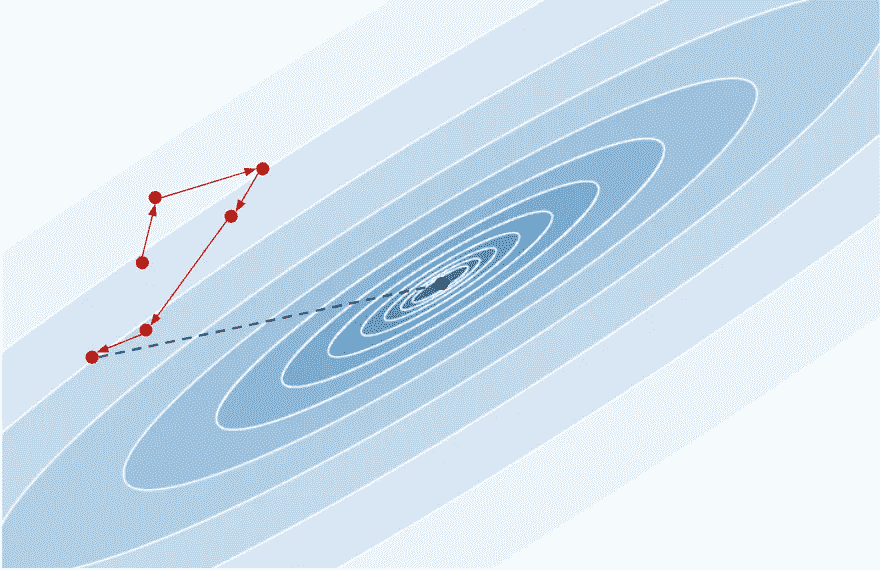

每个下降方向都是随机的，产生的最后一点离最小值很远。在训练过程中，它应该学会利用每个点上的梯度信息，以便向最小值移动，给出如下结果:

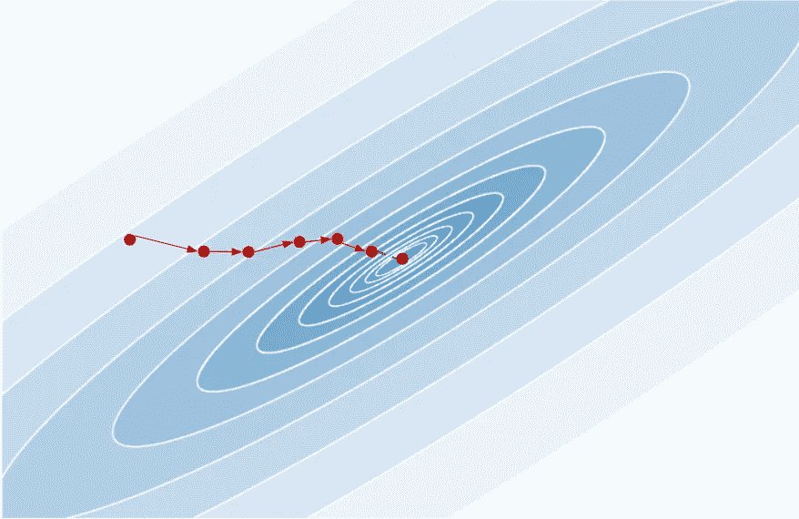

那么如何训练它呢？生成许多你知道其最小值的函数，并要求 RNN 函数最小化序列最后一点与实际最小值之间的距离。

# 学习学习科学模型

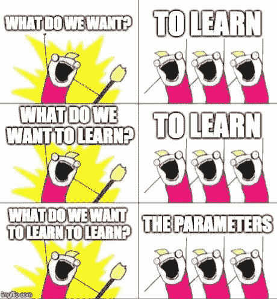

在无似然推理的情况下，给定实际观测值和每一步生成的点云，RNN 应返回一系列建议参数ψ。

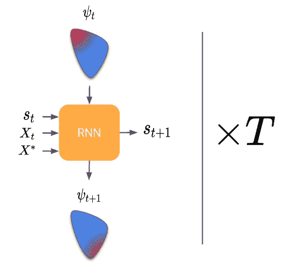

现在，和学习通过梯度下降学习一样，我们如何训练 RNN？这里，技巧是生成许多随机参数θ，并假设每个参数都是“真实参数”。然后，我们可以模拟生成的每个θ，并获得一组“真实观察”。然后，可以通过向 RNN 传递这些真实的观察结果，查看其最终的方案分布，并将其与真实参数(我们知道是因为我们生成了它)进行比较，从而对其进行训练。

让我们通过一个例子来澄清这一切。在下图中，提案分布以颜色表示(红色=高密度)。开始时，RNN 是随机初始化的，我们用第一个生成的真实参数θ(红色)对其进行评估。

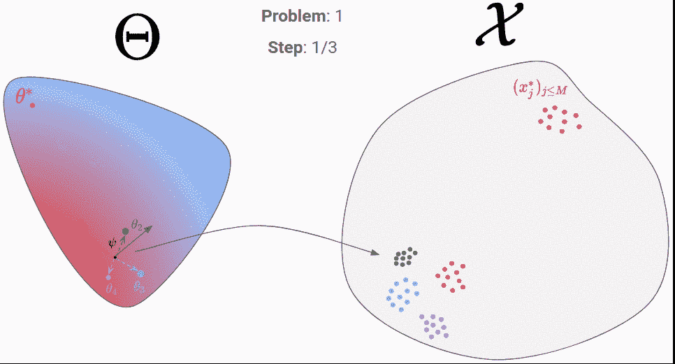

然后我们可以把损失转嫁到 RNN 身上。对 200 个不同的“真实参数”重复这个过程后，应该是这样的:

我们可以看到，它已经学会了利用观测空间的信息向好的参数移动。

# 结果

我们在不同的玩具模拟器上评估了我们的模型，有些我们知道可能性，有些不知道。

## 非似然问题:泊松模拟器

Example of Poisson distributions for various parameters. Source: Wikipedia

第一个模拟器采用参数λ，并从泊松分布 P(λ)中抽取样本。这个例子的目的是看我们是否获得与最大似然估计相当的性能。结果如下:

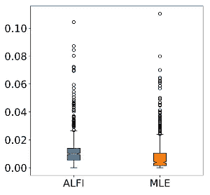

Comparison of ALFI (Automatic Likelihood-Free Inference, the name of our model), to a maximum likelihood estimator (MLE). Those box-plots represent the distribution of the mean-squared errors between the true parameters and the expected value of the final proposal distributions.

我们可以看到，性能是可比的，即使我们没有给我们的模型访问的可能性。

## 无可能性问题:粒子物理模拟器

为了评估我们的模型在一个真正的无可能性的设置，我们考虑了一个简化的粒子物理模型，模拟了一个电子和一个正电子碰撞变成一个μ子和一个反μ子。

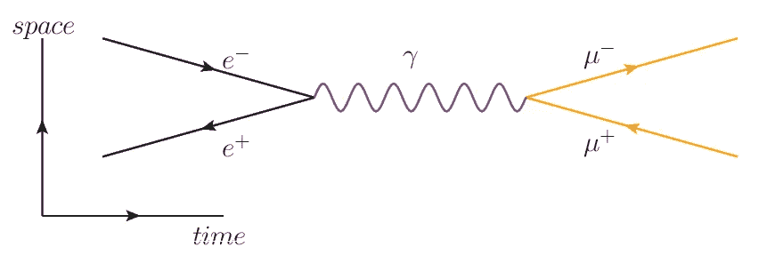

Feynman diagram of the simulated process

模拟器的参数是入射粒子的能量和费米常数，输出是两个μ子之间的角度。

为了评估我们的方法，我们比较了真实的观察值和由最后一个发现的参数生成的观察值。结果如下:

Results of our method on a simple particle physics model. Comparison of the real observations (angles of the produced particles) with the ones generated by our predicted parameter.

# 讨论

我们看到了什么是无可能性推理，以及元学习如何通过学习模拟器调整的最佳序列来解决这个问题，以使模型符合现实。

与大多数元学习模型一样，它的一个局限是难以训练。我们很难将我们的方法扩展到更复杂的模拟器，因为元训练需要大量的模拟器调用，这在现实世界中可能非常慢。然而，随着元学习领域的进步，我们希望出现新的方法来缓解这个问题，并使其更具可扩展性。

# 参考

[1] A. Pesah，A. Wehenkel 和 G. Louppe，[无似然推理的递归机器](https://arxiv.org/abs/1811.12932) (2018)，NeurIPS 2018 元学习研讨会

[2] M. Andrychowicz，M. Denil，S. Gomez，M. W. Hoffman，d .普法乌，T. Schaul，B. Shillingford，N. de Freitas，[通过梯度下降学习梯度下降](https://arxiv.org/abs/1606.04474) (2016)，NIPS 2016

[3] D. Wierstra，T. Schaul，T. Glasmachers，Y. Sun，J. Peter，J. Schmidhuber，[自然进化策略](http://jmlr.org/papers/v15/wierstra14a.html) (2014)，机器学习研究杂志(JMLR)。

[4] G. Louppe，J. Hermans，K. Cranmer，[不可微模拟器的对抗性变分优化](https://arxiv.org/abs/1707.07113) (2017)，arXiv 电子版 1707.07113

# 图像来源

*   封面图片改编自 [LHC 法兰西](https://www.lhc-france.fr/spip.php?article870)
*   [狐狸吃兔子](https://www.wallpaperflare.com/fox-eating-rabbit-vector-art-animals-minimalism-representation-wallpaper-qodee)
*   所有其他的数字都是原创的