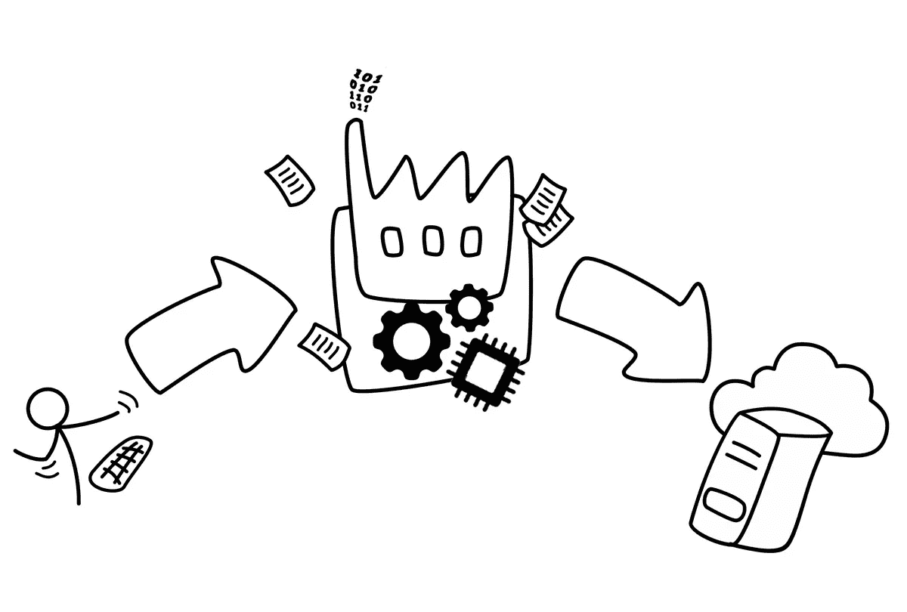
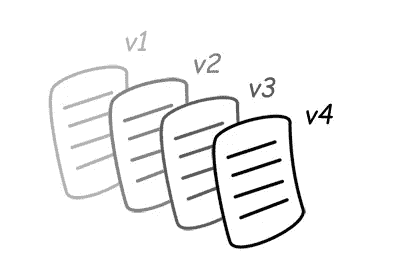

# 在我们信任的代码中

> 原文：<https://towardsdatascience.com/in-code-we-trust-7620207f4dfe?source=collection_archive---------16----------------------->

## 在机器学习项目中试验软件开发管道——第二部分——管理您的代码。

正如我在我的[第一篇文章](/fantastic-models-and-how-to-train-them-experimenting-with-software-development-pipelines-in-7051b9d930f7)中提到的，为了改变我们编写代码的方式，从某种*自制的*过程到更专业和一致的过程，为软件开发者提供适当的基础设施和工具是一件好事。

考虑一个安装和维护此类工具的集中环境会有所帮助。这就是我之前命名的“C.I .环境”——c . I .代表“持续集成”，这个术语强调以自动化的方式生产最终的集成应用程序**[**[**1**](#313d)**]**。这样的环境也可以被视为一种有组织的*软件工厂*——这里的术语从传统制造业获得灵感——一台完美的润滑机器，有助于提高个人生产率，减少每个人出错的机会。简而言之，帮助开发人员用最少的努力产生好的代码。

到目前为止还不错，但是…这在实践中意味着什么呢？

好的，正如你所知道的，我在这里的目标是回顾一下为我们的代码生产管道选择工具时的一些选择和选项。我将主要关注开源工具:尽管围绕**[**[**2**](#313d)**】**有非常好的商业和专有解决方案，但我更喜欢向每个人免费提供选项(我来自意大利北部的一个小镇，那里的人以吝啬闻名**[**[**3**](#313d)**；-) ).**

**回到我们的环境，以及我们需要在其中放置什么样的东西:在非常基本的层面上，事情实际上可以变得更复杂，我们需要工具来:(a)管理**源代码**，提供代码模板，处理源代码版本等，(b)管理**构建过程**，将源代码转换为**二进制**(可执行)**工件**，处理依赖关系，版本管理和存储生成的组件等。最后但同样重要的是，(c)为这些组件的最终**配置**和**部署**提供仪器。**

**正如我们所看到的，当涉及到某种模型训练的 ML 项目时，实际上在(b)和(c)之间有一个进一步的步骤，这包括产生训练好的模型。即某种新的人工制品，它以某种紧凑的形式存储模型参数，以供以后使用。**

**但是让我们按顺序处理事情:第一点——源代码控制和版本控制——是非常重要的一点。在修改后保存代码版本是一个基本的习惯。它提供了一种在变更发生时监控这些变更的方法，它协调不同人的贡献并跟踪对代码所做变更的所有权，它提供了已完成工作的备份，并允许在某些变更引入错误或故障的情况下恢复工作版本。不错，不是吗？一般来说，某种形式的版本控制不仅应该应用于应用程序代码，还应该应用于二进制代码、ML 模型、文档、配置和脚本。**

**总之，*版本* *一切*。**

****

**当谈到对源代码的控制和版本控制时，首先想到的是 Git**[**[**4**](#313d)**]**。当然，还有其他选择，但是可以肯定地说，现在 Git 可以被认为是绝对的赢家。**

**众所周知，Git 是一个分布式版本控制系统:与 CVS 或 SVN 等其他工具不同，我们原则上不需要一个集中的存储库。不过，在实践中，出于协调和归档的目的，最好有一个中心位置，供开发人员推送他们的代码更改。一种选择是利用一些基于 Git 的在线公共存储库，如 GitHub 或 Bitbucket，但私营公司通常会在将源代码放在自己公司堡垒的安全墙之外时感到紧张。**

**您可能更喜欢在自己的本地服务器上托管源代码管理中央存储库。只是将 Git 项目的裸存储库放在一些共享文件夹中——通过 shell 命令访问——是一种选择，但是如果您想要一些不错的 UI 工具，可以尝试 Git lab**[**[**5**](#313d)**]**；我过去用过它，它工作得很好。**

**这里的好消息是，对于基于机器学习的软件项目的具体情况，我没有找到任何改变版本控制工具或工作流的具体原因。代码就是代码，不管你的代码是用 Angular 实现漂亮的用户界面，还是用 Java REST 服务包装 JDBC 数据库查询，还是用 Tensorflow 定义深度神经网络架构的 Python 代码，Git 都能很好地工作。**

**那么，下一步呢，管理构建过程，将您的源代码转换成二进制(可执行)产品？对于这一点，唯一依赖你的 IDE 的项目配置和构建机制**[**[**6**](#313d)**]**通常不是一个好主意，最好使用一些特定的构建和依赖管理工具。与 ide 不同，构建工具通常是基于 shell 的，这意味着它们可以通过基于文本的脚本和配置文件来管理。然后你的整个构建过程可以被组织、存档、版本化等等… *版本化一切*，记得吗？**

**构建和依赖管理工具将您的源代码编译成二进制代码，跟踪包的依赖关系，并自动统一地管理它们。企业规模的软件项目通常有大量的依赖项，手工管理它们通常会导致真正的噩梦。**

**构建工具的问题是，当选择一个工具时，您必须确保它适合您的技术堆栈。因为我的正常工作主要是基于 Java 的项目，所以我最常用的工具是 Maven**[**[**7**](#313d)**]**。**

****

**当我开始使用 Tensorflow 和 Keras 代码时，我必须找到一种方法来使我的 Python 代码适应现有的构建工作流(或者反之亦然)。Python 有自己的构建和依赖管理工具，基于 distutils 和 setuptools，挑战是将这些与我们的 Maven 工作流集成。**

**Maven 是一个相当灵活的工具，允许通过基于插件的系统扩展其功能。我在网上搜索了一些与 Python 相关的插件:实际上有一些可用的插件，既有 Python 专用的插件，也有使用通用的 **exec-maven-plugin** 来启动 Python 子进程，调用 setup . py**[**[**8**](#313d)**]**——但最终，我决定采用一种不同的方法。**

**我面临的问题是一个更普遍的问题的实例，被称为*多语言编程*。也就是说，使用不同的编程语言来建模应用程序的不同部分，每种语言提供性能、可用的库或 API、表达能力等。最适合每个特定的功能或软件层。**

**所谓的微服务架构的最近趋势**[**[**9**](#313d)**]**使得这种编程非常流行:你可以在 Python 中有一个服务层来服务 ML 模型(想想 TensorflowServing)，一个 Java 服务的业务逻辑层和一个提供用户界面功能的 typescript/Angular 应用层。根据应用程序的需要，您可以考虑添加任意多的语言。请记住，在任何完整的现实世界应用程序中，提供机器学习能力的功能可能只是许多交互部分中的一部分。**

**在这样一个混乱的环境中，我没有试图让一个像 Maven 这样的工具适合所有的技术，而是回归到为不同的项目使用不同的工具:Maven 用于 java 项目，setuptools 用于 python，Angular cli 用于 Angular 项目等等。然后，为了给操作提供统一的结构，一组 bash 脚本将通过为每种给定的技术开发适当的工具来实现每个开发阶段。一款**打造**。sh 脚本，一个 **test.sh** 脚本，一个用于主要开发生命周期阶段的 **deploy.sh** 脚本，以及像 **setver.sh** 这样的用于更改当前构建版本的支持脚本(例如，在 Maven 的情况下，这个脚本编辑 pom.xml 文件)，等等。**

**用于生成和初始化项目代码的项目模板(如 Maven 原型或 Python cookiecutter 模板)将在主项目文件夹下包含一个./scripts 子文件夹，其中包含给定技术的脚本的正确版本，这样开发人员就不必担心调用了什么，只要。/scripts 文件夹包含在系统路径中。我不知道这种组织方式是否代表了当前多语言编程开发的最佳实践，但在我的案例中，它工作得相当好。**

**关于我在本文开头列出的清单——要放入 CI 环境的东西的清单——我们仍然需要讨论管理生成的二进制文件、配置和部署它们的工具。**

**在这里，我们也有这样的问题，不同的语言使用不同的工具会导致我们的应用程序组件产生异构的、不兼容的二进制格式。(我们可能有。java 组件的 jar 文件，Python 的 wheels 等等)。我只是预计，为了解决这个问题的一部分，我已经在一个叫做 docker 的漂亮的小工具中找到了宝贵的帮助，但是由于我已经写得比我计划的多，我将把它留到另一天。**

**像往常一样，我希望你觉得这篇文章有趣！**

# **参考文献和注释**

**[1] *我们在这里可以使用的其他类似术语是连续部署，或连续交付(c . d .)；或者是 DevOps 环境，在这种环境中，重点依次放在应用程序组件的部署及其向最终用户的持续供应上。我对这些术语的使用并不是非常精确或正式，我只是想表达一个一般概念，即某种计算环境是在公司层面上建立的，它提供了管理我们的软件生命周期所需的所有工具。***

**【2】*以* [吉拉软件](https://www.atlassian.com/software/jira)为例**

**https://www . quora . com/Why-do-Italians-say-the-Genovese-are-stiggy；-)**

**4】[https://git-scm.com/](https://git-scm.com/)**

**[https://about.gitlab.com/](https://about.gitlab.com/)**

**[6] *当然，也有例外。例如，尽管我已经有几年没有使用微软技术了，但我知道一般来说，构建过程与。网游世界*。**

**[https://maven.apache.org/](https://maven.apache.org/)**

**[8] S *ee 例如*[*shining panda*](http://shiningpanda.com/python-java-unified-build-process-14.html)*的解决方案，它使用通用的 maven exec 插件来包装对 Python 的 setuptools* 的调用。**

**[9] *为了更好地解释微服务架构，你可以看看马丁·福勒的* [*文章*](https://martinfowler.com/articles/microservices.html)*——引自那里:***

> **微服务架构这个术语是在过去几年中出现的，用来描述一种将软件应用程序设计成可独立部署的服务套件的特殊方式。虽然这种架构风格没有精确的定义，但围绕业务能力、自动化部署、端点智能以及语言和数据的分散控制，组织有一些共同的特征。”**

***或者查查山姆纽曼的书* [*建筑微服务*](https://www.amazon.it/Building-Microservices-Sam-Newman/dp/1491950358) *。***