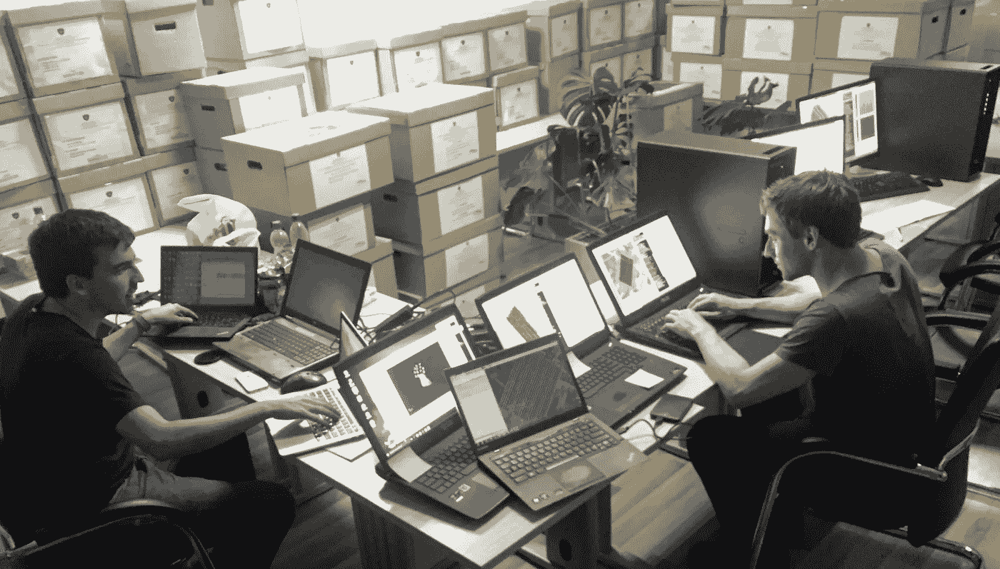
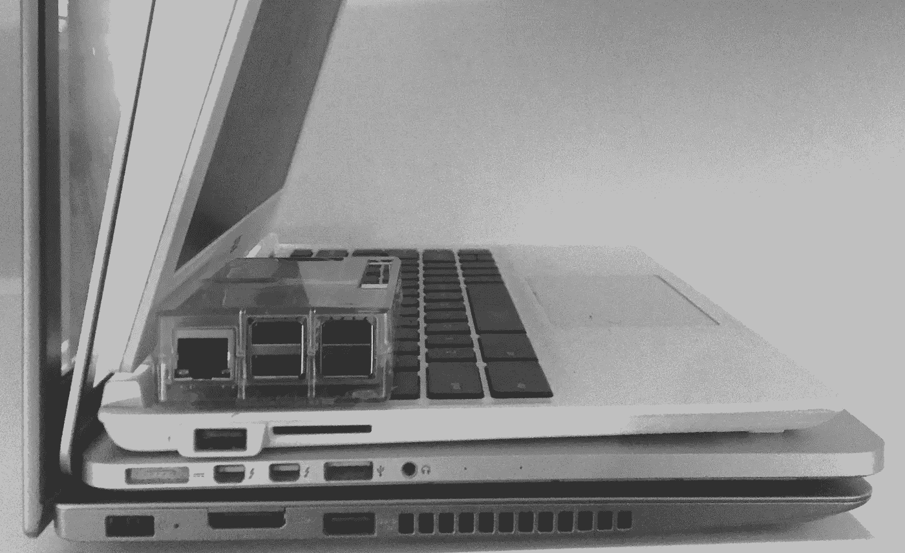

# 为廉价的数据科学辩护

> 原文：<https://towardsdatascience.com/in-defense-of-cheap-data-science-f630f248d400?source=collection_archive---------3----------------------->

回到 2014 年，在我加入世界银行后不久，我带着“ [Iamthecode](http://www.iamthecode.org/) ”去了塞内加尔。其中一个目标是举办数据科学研讨会和培训。尽管我很兴奋能参加最新最棒的遥感、数据管理、卫星图像的培训，但我没能意识到一个非常基本的关键。甚至想起来都很尴尬:我那花哨到爆的 MacBook Pro 笔记本电脑——价值[他们三年](https://www.google.com/search?q=gdp+senegal)的全部平均收入——。一半的人没有笔记本电脑(在他们的工作单位/大学只有台式机)，而那些有笔记本电脑的人有几年前的旧电脑。

几个月后，我们的团队设法采购了三台游戏笔记本电脑(与 IT 部门的对话并不容易)。在我们合作的国家，它们同样超出了大多数人的承受能力，但游戏笔记本电脑具有最佳的性能/成本/重量。例如，我们用它们在科索沃或阿根廷农村进行无人机地图处理(由于连接速度的原因，云处理不适合)，但我们也用它来训练神经网络和其他数据科学的东西。

Processing drone [cadastral maps in Kosovo](http://www.worldbank.org/en/news/feature/2016/01/07/drones-offer-innovative-solution-for-local-mapping), pulling all available things with CPUs and GPUs.

数据科学对发展和发展中国家有着巨大的好处。开始时，分析通常是最基本的，而且是基于数量和质量都大大降低的可用数据。最重要的是，解决这一数字鸿沟挑战的紧迫性与数字红利的丧失相结合。事实上，“数字红利”是 2016 年发布的[世界银行报告](http://www.worldbank.org/en/publication/wdr2016)的标题(我记得和作者讨论过这个话题)。如果数据科学在发展中发挥作用，我们创新实验室的目标之一就是用发展数据在典型的发展基础设施中证明这一点。

许多数据科学工具都是免费的，可以在普通的笔记本电脑上使用。Linux、python、git、qgis、perl、bash……几乎在任何计算机上都可以做很多事情。然而，我看到越来越多的昂贵工具激增(不仅是许可成本，还包括最低性能或假设快速连接)。像 Hadoop、张量流、AWS 红移、ArcGIS 等工具……

> *廉价数据科学*是优雅地退化到一台普通计算机和糟糕的连接的设计原则。如果花的时间比较多，或者需要捆绑上网需求，也是可以的。重要的是，你不要忽略那些没有 MacBook Pro 或互联网连接来构建强大的 AWS EC2 实例的人。

今年 1 月我离开银行的时候，原因之一就是尽可能地从“另一边”了解发展。我扔掉了我的 MacBook，我买了最便宜的笔记本电脑，我可以带着它旅行，并且可以完成大部分工作。一台不算太贵的 300 美元 Thinkpad。仍然大约是 MacBook 的 10 倍。此外，我还买了一个 40 美元的覆盆子酱，看看我能从中榨出多少。

300$, 3000$, 100$ and 40$ computer. How much Data Science could you do with each?

从那以后，我用这台“廉价笔记本电脑”完成了我所有的个人和职业用途，包括编码咨询、去不丹培训和建立一个物流系统，或者在 T2 卫星公司处理巨大的卫星图像。有可能用非常少的资源、硬件和连接来交付惊人的专业级数据科学产品。这也迫使我求助于有用的技巧，提醒我当互联网又慢又贵的时候，事情是如何回来的。使用 USB 脱机安装，设置 intranet 和 torrent 服务。Git 到内部网机器上，而不是 github 上…

我认为，做*廉价数据科学*也越来越难了。一些轶事证据。回到不丹，我想与团队一起利用的大部分数据科学在线课程都使用花哨的多媒体视频和套接字来进行远程浏览器内代码执行。在我们的环境中，这是不可能的，因为带宽有限，而且在办公时间也很拥挤。我不得不求助于又老又长的 pdf 手册(通常是 LaTex)。了不起的人[fast . ai](http://fast.ai)特别乐于助人，关心帮助我解决这个问题。尽管如此，在我看来，许多最新的数据科学进展使用的框架无法在运行缓慢的计算机上运行。事实上，许多通用工具，如 nvm、npm、docker，都没有容易打包的命令来进行离线分发。如果有 4 个人安装相同的软件，那么您需要从远程资源为每台笔记本电脑下载每个小的子依赖项。

我担心数据科学的进步正在创造一个不必要的更高的准入门槛。通常的计算机设置变成了最小设置。我们可能遗漏了一部分潜在的数据科学家，他们的生活可能会发生最大的变化，他们的工作会改变最需要的人的生活。

讽刺的是，我用今天刚买的 MacBook 给你写信。虽然道德上让我很痛苦，但我也必须承认，这种设置可能让我损失了大约 30%的效率。其他人，尤其是那些和我有同样电脑的人，可能不同意这一点。如果我花更多的时间调整和维护它，我可能会有同样的效率。也许这就是我的观点。我想专注于交付价值，而不是维护系统，如果我能避免的话。我不知道。在数字红利框架中，我不能错过这 30%的效率。

我不知道这是否意味着我游说“廉价数据科学”的实验失败了。这无疑迫使我展现了我在塞内加尔或我们购买游戏笔记本电脑时才瞥见的意识。我真的希望阅读这篇文章至少能帮助你考虑你运行的软件，你构建的软件，是否会优雅地降级。