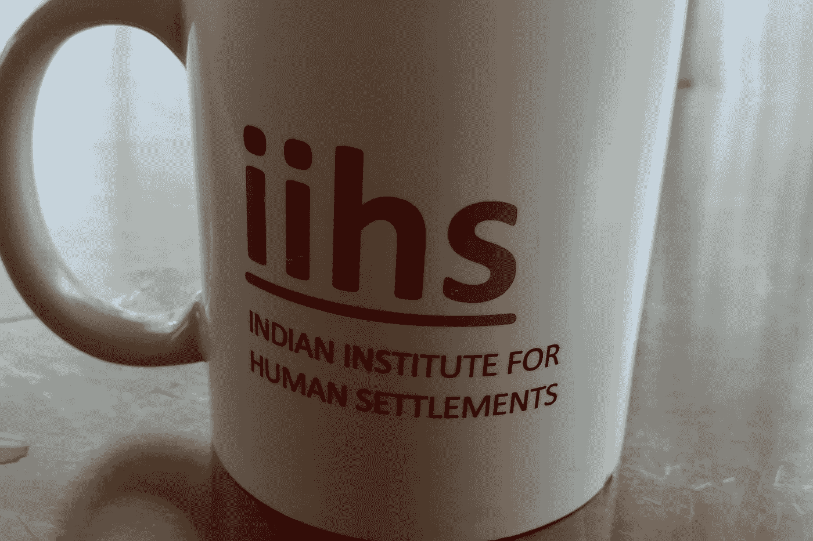
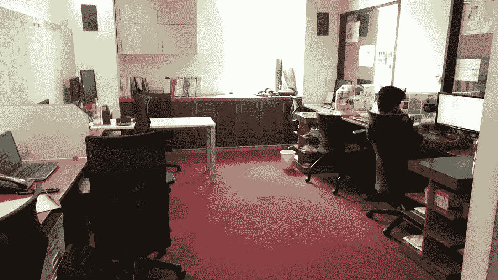
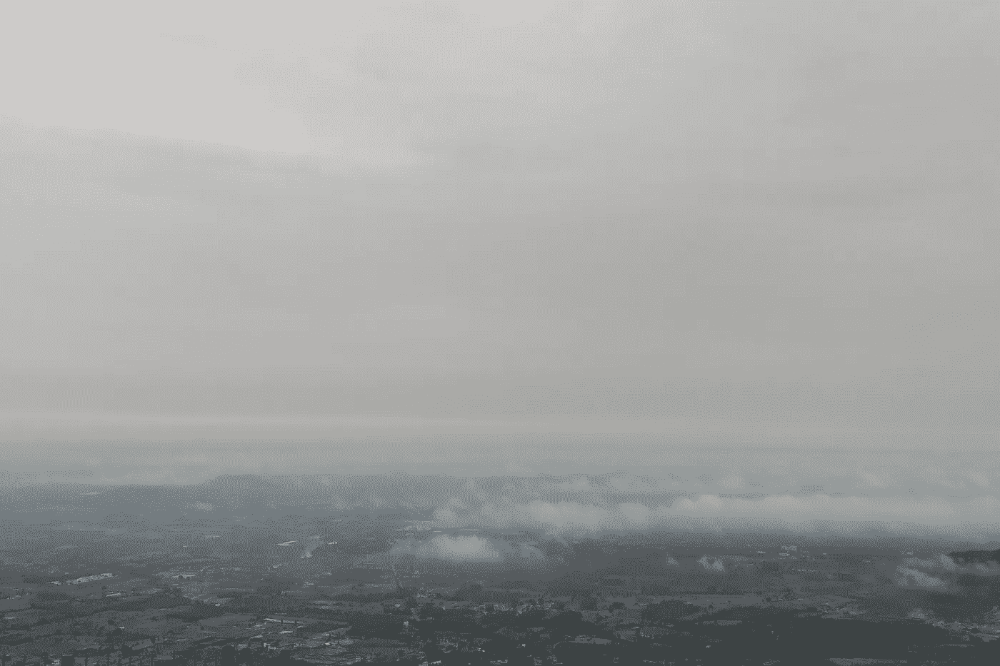

# 印度人类住区研究所-实习旅程至今。

> 原文：<https://towardsdatascience.com/indian-institute-for-human-settlements-internship-journey-so-far-7ffbb9d521d0?source=collection_archive---------2----------------------->

到我在 **NIT Surat** 的**计算机工程**第五学期结束时，所有的同学要么在寻找实习机会，要么已经在校园里找到了。我是那群寻找好实习机会的人中的一员，尤其是研究实习。我之前在初创公司实习过几次，也有过自己的初创公司，所以这次我想去做一个研究实习，这将非常适合我未来的努力。我犯的第一个错误是把我的 CGPAs 记在心里，我没有申请任何外国大学实习项目，以为我会在筛选过程中被直接从名单中剔除，但情况并非总是如此。

在 11 月至 12 月期间，我开始记下一份来自世界各地在数据科学和机器学习领域工作的教授的名单，并在 12 月底之前开始给名单上的教授发电子邮件。这是我的第二个错误，因为那时全球各地都是圣诞假期和冬季假期。在那段时间里，我发出了大约 50-60 封电子邮件，为每一位教授策划一个特定的内容。我开始收到自动生成的回复，提到“度假”、“旅行”、“不在办公室”等等。学长们总是说**要获得一个研究实习机会，你所需要的就是耐心**，这也是我一直坚持的。到了三月，我知道现在是时候了。

今年 3 月，我申请了几个研究所的实习项目和几个在我感兴趣的领域工作的初创公司。三月对我来说基本上是最难熬的一个月，因为我要在 3 月 30 日写 GRE，还得去实习研究。同时协调两者是困难的。我每天的时间表是早上和晚上阅读 GRE 考试，下午与教授和初创公司进行面试。在我的 GRE 考试之后，在下周的一个周一下午，我和一个朋友坐在一起寻找项目结果，在那里我得到了我的第一份研究实习，师从来自 IIIT 德里计算生物学中心的 Ganesh Bagler 教授 (1 次面试)，项目是使用机器学习进行食物配对分析(分子水平)。周三，我又收到了来自班加罗尔**your story**(1 次面试)和班加罗尔 (2 次面试)印度人类住区研究所(IIHS)的两份工作邀请。在 Yourstory，项目是创建一个机器学习工具，它根据给定的面试数据，使用自然语言处理自动生成文章和故事。在 IIHS，该项目旨在使 Landsat 8 和 Sentinel 2 波段图像的土地覆盖分类自动化。现在的问题是选择去哪里

我听从了自己的心声，决定接受 IIHS 的邀请。

> 印度人类住区研究所(IIHS)是一个国家教育机构，致力于公平、可持续和有效地改造印度住区。

他们就是这么说自己的。这里最棒的事情是，我必须在多位教授和导师的指导下工作，他们都拥有国外知名大学的学位。我在他们的招待所住了一周。2017 年 5 月 10 日，我开始了在班加罗尔 IIHS 的实习。第一天我很早就到了，坐在接待处，这时一位来自人民职能部门的女士走过来，向我打招呼“欢迎来到 IIHS”，并带我一起去，我做了所有的手续和材料。那天，作为城市校园之旅的一部分，我见到了在 IIHS 工作的每一个人。有趣的是，我穿着正装去那里，那里的人穿着便装和 kurtas。我第一天学到的一件事是，在职业世界里，没有人使用“先生”、“女士”、“T2”和“T3”。我应该直呼我的教授和导师的名字。我非常惊讶地看到这里的人们经过多年的研究后为各国政府撰写住房政策，有些人设计排水系统，有些人研究世界各地的各种城市居住计划。我在地理空间实验室有一些很棒的同伴，他们叫**洛克什、查鲁和尼勒克什**，他们带我学习地理信息系统的基础知识。我过去常常问他们一些非常愚蠢的问题，他们总是积极地帮助我。他们是实验室里的地理空间忍者，让工作环境变得愉快。

The IIHS City Campus building

# 第一周—城市信息实验室

我被分配的第一个项目是由普林斯顿大学的城市统计学家 Shriya Anand 负责的。在她的房价分析项目中，数据生成是一个大问题，我在那里帮助他们。我必须创建一个工具，从所有流行的住房平台获取价格、纬度、经度、位置、平方英尺面积、新/转售等数据。当时我知道如何用 Python 抓取数据，并认为这是一个简单的第一个任务，直到我遇到了魔术砖的无限滚动平台。每当你滚动到最后，它生成新的数据，页面高度增加。像 beautifulsoup 这样的普通库在这里没有用，必须使用 selenium 的浏览器自动化。我必须解决无限滚动的问题，让数据保持原样。最后，我将一些 javascript 代码注入到我的 python 脚本的 selenium 模块中，该模块为我完成了这项工作，此处[提供](https://github.com/jkachhadia/infinite-scraper)。到那个周末，我已经准备好了 PyQt 应用程序，它为你完成了所有的浏览器自动化和抓取工作。

Caffeine Love

# 第 2 周—地理空间实验室

我对地理空间情报这个热门词汇感到兴奋，更兴奋的是对它进行研究。主题是“机器学习如何应用于地理空间数据，以及我们如何自动生成分析？”。这个项目是我这次实习的主要项目，我必须在荷兰特温特大学研究员 **Teja Malladi 和加州大学伯克利分校研究员兼城市规划师**Krishna chandran Balakrishnan**的指导下工作。最初，我和他们开了几次会，以了解项目的整体情况。简而言之，我可以告诉你的是，从卫星图像中，他们想直接找到建筑物的高度，居住在这些定居点的人的阶级，一个地区种植的作物类型，预测城市的城市发展以及你能想到的所有疯狂的事情。根据我们的谈话，我必须做研究和建立智能系统，可以从卫星图像进行这种分类。所以，在我的第二周，我浏览了很多关于 OpenCV(计算机视觉)的资料，它是如何工作的，我能从中得到什么。**

Geospatial Lab, IIHS

# 第 3 周—地理空间实验室

现在，我已经准备好利用我现有的所有技能，包括数据科学、机器学习、计算机视觉和地理信息系统。我从实验室的同伴那里得到了一些 Landsat 8 波段的图像。Landsat 8 有 **11 幅波段图像**组合成一幅**单幅卫星图像**。我们都听说过 jpg、png、gif、tiff 等图像格式，这些波段图像是 Geotiff 格式的。Geotiff 图像的特殊之处在于，这里的每个像素都有一些 RGB 值以及附加到该像素的经度和纬度。这是我无法想象的事情…嘣！你把这个图像加载到一个软件中，它就直接适合所有地理空间分析的世界地图。OpenCV 可以接受所有格式的图像，但是 Geotiff 狗屎！通过四处搜索，我发现 OpenCV 在这里不能为我做任何事情。我遇到了另一个令人惊奇的东西，叫做**GDAL——地理空间数据抽象库**,它用于读取地理标签和它拥有的所有地理空间数据。OpenCV 可以单独从 geotiffs 中读取 RGB 值(实际上是 BGR，因为 OpenCV 实际上遵循它)。然后，我开始从波段中提取 RGB 数据，探索机器学习算法，如**神经网络、SVM 和决策树**等，并将它们应用于数据以检查结果(准确性)。我有一个算法的训练数据池，但以训练集格式获取数据是一项艰巨的工作。

SF042

除了工作，迄今为止，IIHS 的文化融合了学术界和工业界。我花了 5000 美元在班加罗尔呆了 4 天，找到了一个不错的单人合租 PG 住。当你有大学朋友在城里时，周末总是很有趣。夜生活很棒，因为每隔一条街你都能找到很棒的酒吧。我去了一趟南迪山，那是一块坚固的花岗岩，也是班加罗尔附近(60 公里外)风景最好的小山站。到目前为止，我唯一不喜欢的是这里的交通:)

A view from Nandi Hills

总之，当你将计算机科学的知识运用到地理信息学、城市规划和人类住区发展等其他跨学科领域时，总会感觉很神奇。为了实现我暑期实习的最终结果，还有很多东西需要探索，更多的特征需要从地球资源卫星数据中提取。希望一切顺利！