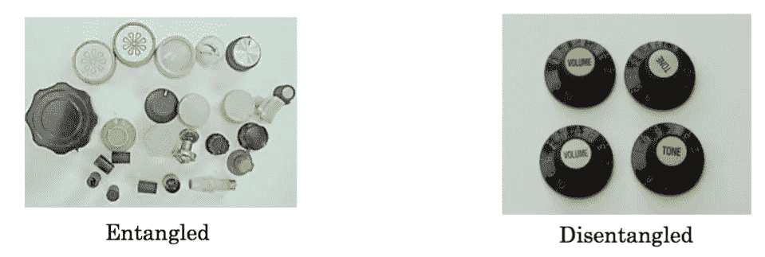
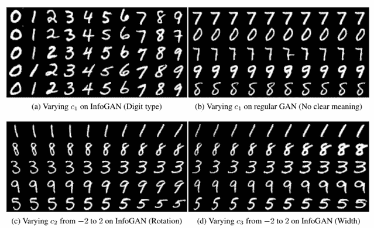
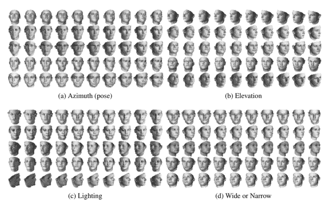
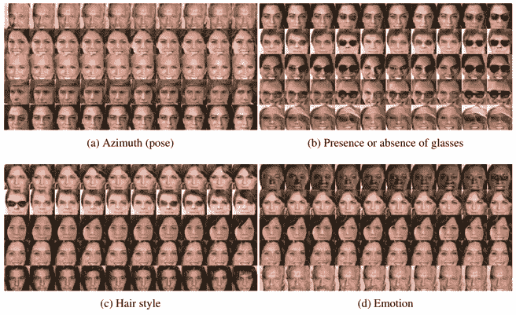

# 信息根——生成性对抗网络第三部分

> 原文：<https://towardsdatascience.com/infogan-generative-adversarial-networks-part-iii-380c0c6712cd?source=collection_archive---------1----------------------->

*结账我的* [*YouTube 上甘斯的视频*](https://www.youtube.com/watch?v=3z8VSpBL6Vg&list=PLSgGvve8UweFoMyAEFlFiE--JtWect5-T) *。本文原载于*

*在[第一部分](https://medium.com/@zjost85/overview-of-gans-generative-adversarial-networks-part-i-ac78ec775e31)中，提交了原始 GAN 文件。[第二部分](/generative-adversarial-networks-part-ii-6212f7755c1f)对 DCGAN 进行了概述，它极大地提高了 GANs 的性能和稳定性。在这最后一部分，将探讨 [InfoGAN](https://arxiv.org/abs/1606.03657) 的贡献，它应用信息论中的概念将一些噪声项转换成对结果有系统、可预测影响的潜在代码。*

# *动机*

*正如在第二部分的例子中所看到的，当对发生器的噪声矢量进行算术运算时，可以做一些有趣且令人印象深刻的事情。在下面来自 DCGAN 论文的例子中，戴眼镜的男人的输入噪声向量被操纵以给出导致戴太阳镜的女人一旦被馈送到生成器中的向量。这表明在噪声向量中有*结构*对发电机输出具有有意义且一致的影响。*

**

*然而，没有系统的方法找到这些结构。这个过程是非常手动的:1)生成一堆图像，2)找到具有你想要的特征的图像，3)将它们的噪声向量平均在一起，并希望它捕捉到感兴趣的结构。*

*改变发电机输出的唯一“旋钮”是噪声输入。因为它是噪音，所以没有关于如何修改它以获得想要的效果的直觉。问题是:“如果你想要一个戴眼镜的男人的图像——你如何改变噪声？”这是一个问题，因为你的表象是*纠缠*。InfoGAN 试图解决这个问题，并提供了一个*清晰的表示*。*

*这个想法是提供一个*潜在代码*，它对输出有意义和一致的影响。例如，假设您正在处理 MNIST 手写数字数据集。你知道有 10 个数字，所以如果你能通过把部分输入赋给一个 10 态离散变量来使用这个结构就好了。希望是，如果你保持代码不变，随机改变噪声，你会得到*相同数字*的变体。*

**

*Entangled vs Disentangled*

# *InfoGAN*

*InfoGAN 解决这个问题的方法是将生成器输入分成两部分:传统的噪声向量和新的“潜在代码”向量。然后，通过最大化代码和发电机输出之间的[互信息](https://en.wikipedia.org/wiki/Mutual_information)，使代码变得有意义。*

## *理论*

*该框架仅通过将正则化项(红框)添加到原始 GAN 的目标函数来实现。*

**

*λ是正则化常数，通常设置为 1。*我(c；G(z，c))* 项是潜在码 *c* 和发电机输出 *G(z，c)* 之间的互信息。*

*显式计算互信息是不实际的，因此使用标准的变分论点来近似下限。这包括引入一个“辅助”分布 *Q(c|x)* ，该分布由一个参数化的神经网络建模，并且旨在逼近真实的 *P(c|x)* 。 *P(c|x)* 表示在给定生成的输入 *x* 的情况下，码 *c* 的可能性。然后，他们使用一种重新参数化的技巧，使您可以只从用户指定的先验(即均匀分布)中采样，而不是未知的后验。*

****

*上面的正则项转化为以下过程:从你选择的先验中为潜在代码 *c* 采样一个值；从您选择的先验中采样噪声值*z*；生成 *x = G(c，z)*；计算 *Q(c|x=G(c，z))* 。*

*然后，目标函数的最终形式由互信息的下限近似给出:*

**

## *体系结构*

*如上所述，现在有了生成器的第二个输入:潜在代码。理论部分介绍的辅助分布由另一个神经网络模拟，它实际上只是一个完全连接的层，附加在鉴别器的最后一个表示层上。Q 网络本质上是试图预测代码是什么(见下面的细微差别)。这只在输入假输入时使用，因为这是唯一知道代码的时候。*

**

*InfoGAN architecture. New components outlined in red.*

*这里有一个很难理解的细微差别。为了计算正则项，您不需要估计代码本身，而是需要估计对于给定的生成输入，看到该代码的*可能性*。因此， *Q* 的输出不是代码值本身，而是您选择用来对代码建模的分布的统计数据。一旦知道了概率分布的充分统计量，就可以计算可能性了。*

*例如，如果您使用连续值代码(即在-1 和+1 之间)，您可以将 *Q(c|x)* 建模为正态/高斯分布。在这种情况下， *Q* 将为这部分代码输出两个值:平均值和标准差。一旦你知道了平均值和标准差，你就可以计算出可能性 *Q(c|x)，*，这就是你需要的正则项。*

# *结果*

*在 MNIST 手写数字数据集上的训练报告了初步结果。作者指定了一个 10 态离散码(希望它能映射到手写的数字值)，以及两个介于-1 到+1 之间的连续码。为了进行比较，他们训练了一个具有相同结构的常规 GAN，但没有使用最大化互信息的正则化项。*

*下图显示了一个过程，其中特定的噪声矢量保持不变(每行)，但潜在代码发生了变化(每列)。在部分 *a* 中，您可以看到离散代码不断改变数字。部分 *b* 显示常规 GAN 基本上没有显著或一致的变化。*

*零件 *c* 和 *d* 显示了 InfoGAN 的连续代码变化。这显然会影响手指的倾斜度和宽度。有趣的是，它们实际上从-2 变化到+2，即使训练只使用从-1 到+1 的值，这表明这些代码有意义地推断。*

**

*Comparing InfoGAN to regular GAN when changing code values. From InfoGAN paper.*

*这是一些面部图像的结果。请参见[论文](https://arxiv.org/pdf/1606.03657.pdf)了解更多结果和解释。*

**

*Results on 3D face model dataset*

**

*Results on CelebA dataset*

# *结论*

*值得强调的是，从来没有预先指定倾斜或手指粗细将有助于分离为代码。InfoGAN 训练程序自己发现了这些属性，即在无人监督的情况下。这项研究做的唯一事情就是确定潜在代码的结构。*

*我们已经看到，通过简单地添加一个项，最大化部分生成器输入与其输出之间的互信息，学习过程将数据中有意义的属性解开，并将它们分配给这个强加的潜在代码结构。*

# *你做吧*

*我发现[原始回购](https://github.com/openai/InfoGAN)很难运行，因为它的依赖关系非常陈旧。我已经[更新了代码](https://github.com/zjost/InfoGAN)，这样你就可以用现代 Tensorflow APIs(版本 1.3.0)运行了。*

# *继续挖*

*在这个由 3 部分组成的系列中，我们已经介绍了一些主要的贡献，并看到了 GANs 所做的惊人的事情。尽管如此，这仅仅触及了表面。有多个 github repos，其中包含大量且不断增长的研究论文。这里有[一个](https://github.com/zhangqianhui/AdversarialNetsPapers)，这里有[另一个](https://github.com/nightrome/really-awesome-gan)。这是一个令人兴奋的研究领域，其成熟度和有效性都在不断提高。如果你在这里发现了你想评论的某篇论文，请在评论中留言。*