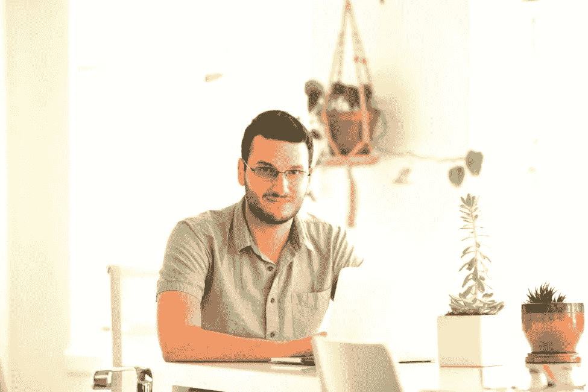

# 磷的内幕:见见 Roman Shraga，数据科学家！

> 原文：<https://towardsdatascience.com/inside-phosphorus-meet-roman-shraga-data-scientist-73b594de295d?source=collection_archive---------9----------------------->

## 嘿，罗曼，给我们介绍一下你自己吧！

我两岁的时候，我们全家从乌兹别克斯坦移民到布鲁克林，我在纽约这里长大。我在布朗大学主修计算机科学，我大学毕业后的第一份工作是在微软，在那里我所在的团队专注于构建机器学习模型，以增强在微软搜索引擎 Bing 上的体验。之后，我在一家名为 PlaceIQ 的公司工作了两年，在那里我建立了分析管道来处理和分析万亿字节的数据。现在，我正与遗传学家、分子生物学家和工程师合作，利用我的数据科学技能释放基因组学的全部力量。

## 你在磷公司的头衔是什么？你为公司做什么？

我的头衔是数据科学家，我的职责包括使用机器学习和统计学从数据中获取价值。作为一家基因组公司，我们有许多数据来源:来自我们实验室的原始基因信息、我们的研究合作伙伴与我们共享的临床数据，以及来自我们应用程序的各种使用和物流数据。我的工作就是利用这些数据回答问题，改进我们的产品。

## 你最喜欢你工作的什么？

我喜欢我们所做的工作对人们的生活产生切实的影响。无论我们开发一种新的分析方法，改进我们的流程，还是拓展研究的范围，我们的工作都会有所作为。这种环境促进学习，鼓励协作，让每个人都想超额完成任务。每天和一群分享这些价值观的人一起工作真的是一种特权。

## 在磷公司工作，你学到了什么？

我学到了这么多，很难保持这个答案简短！我已经了解了人类生物学的复杂性和美丽，了解了医疗保健生态系统，了解了运行临床实验室需要什么，了解了生物信息学和基因组学数据，了解了现代软件改善复杂过程功能的能力。

## 到目前为止，你最喜欢的项目是什么？

我最喜欢的项目是使用下一代测序数据构建检测拷贝数变异的工具。拷贝数变异是基因结构变异的一种重要类型，已知在某些情况下会导致疾病。准确检测这些是临床遗传学的一项重要能力，但由于各种原因，这样做具有挑战性。我一直致力于开发标准化技术和算法来揭示这些变体。

## 你有个人的口头禅吗？

就数据建模而言，我认为复杂性是必须赢得的。也就是说，我认为您应该选择尽可能简单的模型，并证明您引入的任何额外的复杂性在性能方面都有可衡量的好处。在我的领域中，人们经常会对使用一个闪亮的新工具感到兴奋，即使它对一个更简单、更容易理解、更容易维护的解决方案没有任何好处。

## 告诉我们一些大多数人不知道的你的事。

我是烹饪和家居装修节目的狂热观众。顶级厨师和房屋猎人是我的最爱。

## 明年空闲时间你最期待的一件事是什么？

十二月初，我要养一只小狗了！

## 你有什么爱好吗？

我喜欢发现新的有趣的地方。我喜欢住在纽约的一个原因是，总有一家新餐馆可以尝试，一个有趣的活动可以参加，或者一个未被发现的街区可以逛逛。我尽可能经常尝试新事物。

## 哪种口味的冰淇淋最适合你？

薄荷巧克力片。